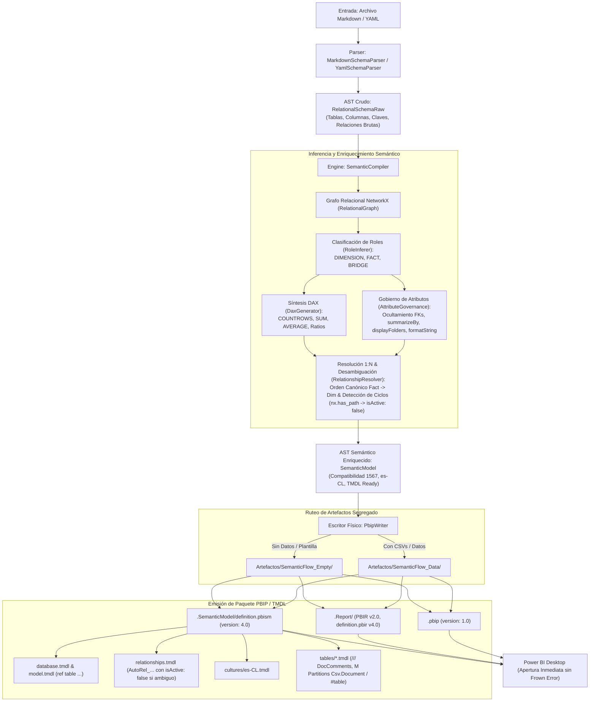

<!-- ============================================================================== -->
<!-- THINKINGSEED: ADN DEL PROYECTO (CONTEXTO PASIVO PARA MODELOS DE LENGUAJE)     -->
<!-- ============================================================================== -->
> [!NOTE]
> ### 🧬 DEFINICIÓN Y ROL DE ESTE DOCUMENTO
> 1. **¿Qué es este archivo?:** Este documento es una **Semilla de Proyecto (ThinkingSeed Master)**: representa el **ADN arquitectónico, técnico y estructural exhaustivo** del sistema. **NO es el repositorio completo de código fuente**, sino su mapa genético y memoria técnica profunda extraída directamente del entorno de desarrollo.
> 2. **Estado de Avance (Work in Progress):** Este documento refleja el **estado actual del desarrollo**. No garantiza que el proyecto esté concluido al 100%; puede representar un prototipo, un MVP o un sistema en evolución continua. La ausencia de código completo en ciertos archivos o módulos es **deliberada por diseño** para optimizar ventana de contexto o refleja áreas aún en desarrollo.
> 3. **Modo de Operación:** Trata este documento como **contexto pasivo de referencia técnica (Ground Truth)**. No asumas que el archivo está defectuoso ni intentes reescribirlo por tu cuenta.
<!-- ============================================================================== -->

# THINKING SEED MASTER: SemanticFlow

## 0. IDENTIDAD Y METADATOS
```yaml
seed_schema_version: "2.0"
project_name: "SemanticFlow"
repository_name: "SemanticFlow"
project_type: "data-platform"
repository_mode: "single-project"
generated_at: "2026-09-14T02:08:45-03:00"
generated_by: "Antigravity / Gemini 3.6 Flash (Low)"
repository_root: "d:/0001 HyperScale Thinking/PROYECTOS CLOUD/Data & AI Strategy/SemanticFlow"
git_branch: "none / unversioned"
git_commit: "none"
working_tree_state: "unknown (local directory outside git repo)"
analysis_mode: "static"
coverage_level: "high"
known_analysis_limits:
  - "El directorio local actual no posee un repositorio Git inicializado (.git no detectado) [CONFIRMADO]."
  - "Los directorios canónicos del Directorio Thinking (03_Research_AI, config, data, infrastructure, logs, schemas, scripts, Tools) existen como stubs arquitectónicos reservados para fases futuras [CONFIRMADO]."
  - "La validación visual de Power BI Desktop (.pbip) depende de la ejecución en entorno Windows con Power BI Desktop Store App instalada [CONFIRMADO]."
```

### 0.1 Instrucciones para el modelo receptor
1. **ADN vs Repositorio:** Reconoce este documento como la memoria técnica y el ADN del proyecto, no como el repositorio completo ni como una prueba de ejecución.
2. **Contexto Pasivo:** No generes código no solicitado ni reclames por archivos ausentes; espera instrucciones específicas del usuario o utilízalo como contexto pasivo para responder preguntas sobre el funcionamiento del sistema.
3. **Estado de Avance:** Considera que las secciones incompletas o componentes marcados como `[FALTANTE]` representan el avance real del proyecto y oportunidades de asistencia, no errores del documento.
4. **Evidencia:** Respeta las etiquetas de evidencia (`[CONFIRMADO]`, `[INFERIDO]`, `[DECLARADO]`, `[NO VERIFICADO]`, `[FALTANTE]`) y no transformes inferencias en hechos.
5. **Rutas:** Antes de proponer cambios, identifica módulos y archivos afectados citando sus rutas exactas relativas al repositorio.
6. **Contratos:** Conserva arquitectura, convenciones, contratos y restricciones declaradas.
7. **Preguntas Dirigidas:** No inventes componentes ausentes. Formula preguntas solo cuando la incertidumbre impida una respuesta segura.
8. **Seguridad:** No reveles ni solicites secretos. Usa placeholders (`<REDACTED>`).
9. **Impacto:** Evalúa impactos laterales en pruebas, configuración, datos, seguridad, observabilidad y despliegue.
10. **Asistencia:** Distingue entre solución inmediata, deuda técnica y recomendación futura.

---

## 1. RESUMEN EJECUTIVO
- **1.1 Proyecto en una frase:** Compilador estático local y motor de inferencia semántica en Python que transforma esquemas relacionales brutos (Markdown/Mermaid y YAML) en paquetes nativos de Power BI Desktop (`.pbip`) estructurados en sintaxis declarativa modular TMDL (Tabular Model Definition Language) `[CONFIRMADO]`.
- **1.2 Problema que resuelve:** Elimina el cuello de botella manual de modelar datasets en herramientas GUI (Power BI Desktop, Tabular Editor), automatizando la inferencia de roles analíticos (Dimensiones vs Hechos), la resolución y desambiguación de relaciones (detección de ciclos no dirigidos y desactivación automática con `isActive: false` para evitar `PFE_XL_USERELATIONSHIP_AMBIGUOUS_PATH` en VertiPaq), la aplicación estricta de políticas de gobernanza de datos (ocultamiento de Surrogate Keys, supresión de agregaciones espurias en dimensiones), la síntesis de medidas analíticas DAX base (`COUNTROWS`, `SUM`, `AVERAGE`) y la emisión de scripts Power Query (M) ejecutables de inmediato `[CONFIRMADO]`.
- **1.3 Usuarios o sistemas consumidores:** 
  - Arquitectos de Datos y Consultores BI que definen esquemas en markdown/contratos de datos y requieren proyectos `.pbip` reproducibles de forma instantánea `[DECLARADO]`.
  - Ingenieros de Datos y Pipelines CI/CD orientados a la automatización de modelos semánticos en Microsoft Fabric y Power BI `[DECLARADO]`.
  - Agentes de IA autónomos que operan sobre la capa semántica de datos requiriendo compilaciones deterministas y libres de errores sintácticos de Microsoft Analysis Services `[CONFIRMADO]`.
- **1.4 Alcance y límites del sistema:**
  - **Alcance:** Parsing de Markdown (tablas de especificación técnica y bloques Mermaid `erDiagram`) y YAML; construcción de grafo acíclico dirigido (DAG) con NetworkX; inferencia heurística y por convención de roles dimensionales; resolución y normalización de relaciones analíticas con prevención de caminos ambiguos; gobierno automático de atributos; generación de DAX (50+ medidas en constelaciones complejas); emisión completa de carpetas `.Report` (formato PBIR v2.0) y `.SemanticModel` (TMDL nativo v4.0); integración con particiones M conectadas a archivos CSV o tablas sintéticas en memoria `#table`; estructura de artefactos segregada en simulaciones pobladas (`SemanticFlow_Data`) y sin datos (`SemanticFlow_Empty`) `[CONFIRMADO]`.
  - **Límites:** No realiza consultas de datos hacia bases de datos activas (el procesamiento de datos real se delega a Power BI Desktop / VertiPaq); no incluye soporte para relaciones muchos a muchos (M:N) bidireccionales complejas sin tabla puente explícita; no genera medidas DAX avanzadas de inteligencia de tiempo (Time Intelligence) o RLS dinámico (Row-Level Security) `[CONFIRMADO]`.

---

## 2. ARQUITECTURA Y TOPOLOGÍA

### 2.1 Estilo arquitectónico
Arquitectura modular por capas (Compiler Pipeline Architecture) orientada a dominios analíticos `[CONFIRMADO]`. Sigue el principio de separación estricta entre:
1. **Capa AST Cruda (`src/core/ast/schema.py`):** Modelos Pydantic v2 que representan el esquema relacional original sin suposiciones de BI.
2. **Capa Ingestión / Parsers (`src/core/parsers/`):** Adaptadores de entrada para Markdown y YAML.
3. **Capa Inferencia y Grafo (`src/core/engine/`):** Topología relacional con NetworkX, resolución de roles, desambiguación de caminos activos (`nx.has_path`), gobierno de columnas y síntesis DAX.
4. **Capa AST Semántica (`src/core/ast/semantic.py`):** Modelo semántico enriquecido y tipado para Power BI (compatibilidad 1567, culturas, medidas, particiones).
5. **Capa Emisores (`src/core/emitter/`):** Serializadores a disco de archivos TMDL, PBIR y PBIP.
6. **Estructura de Gobernanza Global (`02_Foundation/Engine/EngineReadme.md`):** Adopta la especificación "Directorio Thinking Architecture" para gobernanza de proyectos multi-cloud y ecosistemas de IA `[CONFIRMADO]`.

### 2.2 Árbol estructural del repositorio (excluyendo ruido)
```
SemanticFlow/
├── .coverage                               # [CONFIRMADO] Archivo binario de telemetría de cobertura pytest
├── .gitignore                              # [CONFIRMADO] Reglas de exclusión de git (.venv, __pycache__, datos)
├── pyproject.toml                          # [CONFIRMADO] Manifiesto de dependencias, scripts CLI y configuración pytest
├── 001_Seed/                               # [CONFIRMADO] Semillas de contexto técnico para IA (ThinkingSeed)
│   └── seed-semanticflow-master.md         # [CONFIRMADO] ADN arquitectónico exhaustivo del proyecto
├── 02_Foundation/                          # [CONFIRMADO] Framework base de automatización y gobernanza
│   └── Engine/
│       └── EngineReadme.md                 # [CONFIRMADO] Manifiesto de gobernanza de directorios Thinking
├── 03_Research_AI/                         # [CONFIRMADO] Directorio de investigación, EDA y prompts para LLMs
│   ├── Notebooks/                          # [FALTANTE] Stubs para experimentación interactiva
│   ├── experiments/                        # [FALTANTE] Stubs para PoCs y benchmarks algorítmicos
│   └── llm_prompts/                        # [FALTANTE] Stubs para system prompts y árboles de contexto
├── Artefactos/                             # [CONFIRMADO] Directorio organizado de salida de compilaciones
│   ├── Planes/                             # [CONFIRMADO] Gobernanza de capacidad de cómputo y costos
│   │   ├── Historico_Obsoletos/            # [CONFIRMADO] Directorio vacío para trazabilidad histórica
│   │   └── Vigentes/                       # [CONFIRMADO] Directorio vacío para planes activos
│   ├── SemanticFlow_Data/                  # [CONFIRMADO] Artefactos compilados con datos sintéticos CSV integrados
│   │   ├── Falabella_Retail_PBIP/          # [CONFIRMADO] PBIP Retail Omnicanal (11 tablas + CSVs 6 meses)
│   │   └── Massive_Stress_v2_PBIP/         # [CONFIRMADO] PBIP Metro Santiago Lakehouse V2 (20 tablas + CSVs 6 meses)
│   └── SemanticFlow_Empty/                 # [CONFIRMADO] Artefactos compilados en modo plantilla/definición pura
│       ├── Massive_Stress_PBIP/            # [CONFIRMADO] Suite de 12 proyectos PBIP sin datos (Tiers 1-3)
│       └── Metro_Santiago_PBIP/            # [CONFIRMADO] PBIP Metro Santiago V1 (Sin datos CSV)
├── config/                                 # [CONFIRMADO] Parámetros de entorno desacoplados (vacío)
├── data/                                   # [CONFIRMADO] Almacenamiento local Medallion (Bronze/Silver/Gold) (vacío)
├── docs/                                   # [CONFIRMADO] Documentación de arquitectura y post-mortems
│   ├── architecture/
│   │   └── esquema_relacional.md           # [CONFIRMADO] Especificación relacional y ERD Mermaid de Metro Santiago (Constelación)
│   └── engineers_notes/
│       └── agentic_failure_modes_and_pbip_tmdl_conflict.md # [CONFIRMADO] Post-Mortem de ingeniería, modos de fallo e introspección VertiPaq
├── infrastructure/                         # [CONFIRMADO] IaC para despliegues multi-cloud (vacío)
├── logs/                                   # [CONFIRMADO] Trazas de ejecución y dumps locales (vacío)
├── schemas/                                # [CONFIRMADO] Definiciones estrictas de esquemas externos (vacío)
├── scripts/                                # [CONFIRMADO] Scripts operativos bash/powershell (vacío)
├── src/                                    # [CONFIRMADO] Código fuente principal del paquete semanticflow
│   ├── __init__.py                         # [CONFIRMADO] Inicializador de paquete
│   ├── cli.py                              # [CONFIRMADO] Entry point Typer/Rich (comandos compile e inspect)
│   └── core/                               # [CONFIRMADO] Núcleo del compilador semántico
│       ├── __init__.py
│       ├── ast/                            # [CONFIRMADO] Definición de Abstract Syntax Trees
│       │   ├── __init__.py
│       │   ├── schema.py                   # [CONFIRMADO] AST de esquemas relacionales brutos
│       │   ├── semantic.py                 # [CONFIRMADO] AST de modelos semánticos Power BI
│       │   └── types.py                    # [CONFIRMADO] Mapeo de tipos SQL a Power BI TMDL
│       ├── emitter/                        # [CONFIRMADO] Emisión de artefactos físicos a disco
│       │   ├── __init__.py
│       │   ├── model_emitter.py            # [CONFIRMADO] Emisor de database.tmdl, model.tmdl y cultures
│       │   ├── pbip_writer.py              # [CONFIRMADO] Orquestador de empaquetado PBIP y PBIR
│       │   ├── relationship_emitter.py     # [CONFIRMADO] Emisor de relationships.tmdl (maneja isActive: false)
│       │   ├── table_emitter.py            # [CONFIRMADO] Emisor de tables/*.tmdl y particiones M
│       │   └── tmdl_formatter.py           # [CONFIRMADO] Formateador léxico, escapes y cadenas TMDL
│       ├── engine/                         # [CONFIRMADO] Lógica de compilación e inferencia semántica
│       │   ├── __init__.py
│       │   ├── compiler.py                 # [CONFIRMADO] Orquestador del flujo de compilación
│       │   ├── dax_generator.py            # [CONFIRMADO] Síntesis de medidas analíticas DAX
│       │   ├── governance.py               # [CONFIRMADO] Reglas de gobierno de atributos y visibilidad
│       │   ├── graph.py                    # [CONFIRMADO] Grafo relacional y topología NetworkX
│       │   ├── relationship_resolver.py    # [CONFIRMADO] Resolución 1:N y prevención de caminos ambiguos
│       │   └── role_inferer.py             # [CONFIRMADO] Inferencia heurística y prefijos (Dim/Fact/Bridge)
│       └── parsers/                        # [CONFIRMADO] Adaptadores de lectura
│           ├── __init__.py
│           ├── base.py                     # [CONFIRMADO] Clase abstracta BaseSchemaParser
│           ├── markdown_parser.py          # [CONFIRMADO] Parser regex de tablas Markdown y ERD Mermaid
│           └── yaml_parser.py              # [CONFIRMADO] Parser declarativo YAML/JSON
├── tests/                                  # [CONFIRMADO] Suite de pruebas automatizadas con pytest
│   ├── test_cli.py                         # [CONFIRMADO] Tests unitarios de los comandos CLI
│   ├── test_inference_engine.py            # [CONFIRMADO] Tests del motor semántico, gobernanza y desambiguación
│   ├── test_markdown_parser.py             # [CONFIRMADO] Tests del parser de Markdown y Mermaid
│   ├── test_tmdl_emitter.py                # [CONFIRMADO] Tests de generación de archivos físicos TMDL
│   ├── test_yaml_parser.py                 # [CONFIRMADO] Tests del parser YAML
│   ├── Massive Data Stress/                # [CONFIRMADO] Benchmark v1 Falabella Retail (11 tablas)
│   │   ├── __init__.py
│   │   ├── test_data_generation_integrity.py
│   │   ├── test_massive_data_stress_runner.py
│   │   ├── data/                           # [CONFIRMADO] 11 Datasets CSV sintéticos de Retail
│   │   ├── data_engine/                    # [CONFIRMADO] Generador sintético de Retail
│   │   └── schemas/                        # [CONFIRMADO] Esquema de Falabella Retail
│   ├── Massive Data Stress v2/             # [CONFIRMADO] Benchmark v2 Metro Santiago Constelación Industrial (20 tablas)
│   │   ├── data/                           # [CONFIRMADO] Datasets CSV sintéticos masivos de Metro (6 meses, ~650k filas)
│   │   ├── data_engine/                    # [CONFIRMADO] Generador estocástico para el esquema constelación de Metro
│   │   │   ├── __init__.py
│   │   │   └── generator.py                # [CONFIRMADO] Generador de 20 CSVs con integridad referencial perfecta
│   │   └── test_massive_data_stress_v2_runner.py # [CONFIRMADO] Runner E2E que genera CSVs, compila PBIP y valida en SemanticFlow_Data
│   └── Massive Stress Test/                # [CONFIRMADO] Benchmark masivo multi-industria (12 esquemas sin datos)
│       ├── __init__.py
│       ├── test_stress_suite_runner.py
│       ├── test_stress_tier1_pyme.py
│       ├── test_stress_tier2_mediana.py
│       ├── test_stress_tier3_gigante.py
│       └── schemas/
└── Tools/                                  # [CONFIRMADO] Utilidades y scripts locales auxiliares (vacío)
```

### 2.3 Responsabilidad por directorio y archivo clave
- `src/cli.py`: Interfaz de usuario por consola construida con Typer y Rich. Expone `compile` (de esquema a PBIP) e `inspect` (reporte visual de tablas, roles inferidos, columnas ocultas y medidas) `[CONFIRMADO]`.
- `src/core/ast/types.py`: Normaliza más de 20 tipos de datos relacionales a los tipos primitivos admitidos por TMDL (`int64`, `double`, `decimal`, `string`, `dateTime`, `boolean`) `[CONFIRMADO]`.
- `src/core/ast/schema.py`: Modela el esquema relacional en bruto (`RelationalSchemaRaw`, `TableRaw`, `ColumnRaw`, `RelationshipRaw`, `KeyType`) `[CONFIRMADO]`.
- `src/core/ast/semantic.py`: Modela el metamodelo semántico analítico (`SemanticModel`, `SemanticTable`, `SemanticColumn`, `SemanticMeasure`, `SemanticRelationship`, `TableRole`, `CrossFilteringBehavior`) `[CONFIRMADO]`.
- `src/core/parsers/markdown_parser.py`: Ingiere especificaciones funcionales en Markdown. Extrae relaciones desde bloques ````mermaid erDiagram```` y metadatos de tablas desde secciones `### X.Y. TableName` y tablas Markdown con viñetas de FK explícitas `[CONFIRMADO]`.
- `src/core/parsers/yaml_parser.py`: Ingiere esquemas declarativos en formato YAML/JSON estructurado `[CONFIRMADO]`.
- `src/core/engine/graph.py`: Modela las dependencias relacionales como un grafo dirigido (`networkx.DiGraph`). Calcula grados de entrada y salida para inferencia topológica y detección de ciclos `[CONFIRMADO]`.
- `src/core/engine/role_inferer.py`: Clasifica tablas en `DIMENSION`, `FACT` o `BRIDGE` evaluando prefijos (`Dim_`, `Fact_`, `Bridge_`) y heurística topológica `[CONFIRMADO]`.
- `src/core/engine/governance.py`: Aplica mejores prácticas de BI corporativo: oculta claves foráneas y surrogate keys (`is_hidden = True`, carpeta `_Claves Técnicas`), suprime agregaciones numéricas en dimensiones y códigos (`summarize_by = none`), asigna sumas a métricas de hechos e infiere máscaras de formato `[CONFIRMADO]`.
- `src/core/engine/dax_generator.py`: Sintetiza automáticamente medidas analíticas en tablas de hechos: conteo base (`# Registros X = COUNTROWS('Fact_X')`), métricas financieras, ratios de calidad/eficiencia y métricas de sensores `[CONFIRMADO]`.
- `src/core/engine/relationship_resolver.py`: Valida la existencia de columnas y tablas, repara discrepancias de nombrado de PK/FK, invierte la dirección a Many-to-One (`Fact -> Dim`) y **utiliza un grafo no dirigido (`nx.Graph`) con `nx.has_path` para detectar ciclos no dirigidos y desactivar automáticamente relaciones secundarias (`is_active = False`) evitando el error VertiPaq `PFE_XL_USERELATIONSHIP_AMBIGUOUS_PATH`** `[CONFIRMADO]`.
- `src/core/emitter/tmdl_formatter.py`: Provee funciones puras de escape léxico para TMDL: escapa identificadores entre comillas simples (`escape_tmdl_identifier`), y escapa literales de texto entre comillas dobles `[CONFIRMADO]`.
- `src/core/emitter/model_emitter.py`: Genera `database.tmdl` (con `compatibilityLevel: 1567`), `model.tmdl` (con cultura y sentencias obligatorias `ref table <Name>`) y `cultures/<culture>.tmdl` `[CONFIRMADO]`.
- `src/core/emitter/table_emitter.py`: Genera archivos `tables/<Table>.tmdl`. Traduce descripciones a doc-comments `///`, emite columnas, medidas y particiones M sintéticas (`#table({"Col"}, {})`) o conectadas a archivos CSV locales (`Csv.Document`) `[CONFIRMADO]`.
- `src/core/emitter/relationship_emitter.py`: Emite `relationships.tmdl` estructurando bloques `relationship AutoRel_...` con `fromColumn`, `toColumn`, dirección de filtrado y el modificador `isActive: false` para relaciones no activas `[CONFIRMADO]`.
- `src/core/emitter/pbip_writer.py`: Orquesta la creación del paquete PBIP en disco: `<Name>.pbip` (v1.0), carpeta `<Name>.Report` (con `definition.pbir` v4.0, `report.json`, `version.json`, `pages.json` y `page.json`), y carpeta `<Name>.SemanticModel` (con `definition.pbism` v4.0 y subdirectorio `definition/` TMDL completo) `[CONFIRMADO]`.
- `tests/Massive Data Stress v2/data_engine/generator.py`: Generador masivo estocástico del esquema constelación industrial de Metro Santiago (20 tablas, 6 meses de datos sintéticos, consistencia referencial estricta) `[CONFIRMADO]`.
- `tests/Massive Data Stress v2/test_massive_data_stress_v2_runner.py`: Runner de integración E2E que genera datos, procesa el AST de `docs/architecture/esquema_relacional.md`, compila el modelo semántico y emite `Artefactos/SemanticFlow_Data/Massive_Stress_v2_PBIP/Metro_Santiago_Lakehouse_V2.pbip` `[CONFIRMADO]`.

### 2.4 Límites modulares y acoplamiento
El diseño de SemanticFlow implementa un acoplamiento unidireccional y débil `[CONFIRMADO]`:
- Los paquetes `parsers` y `emitter` dependen exclusivamente de los contratos definidos en `ast`. No se comunican entre sí.
- El paquete `engine` transforma `ast.schema` en `ast.semantic`.
- La capa de presentación (`cli.py`) orquesta el flujo completo sin inyectar dependencias cruzadas.
- La persistencia física se abstrae en `PbipWriter`, facilitando futuras extensiones hacia endpoints REST de Microsoft Fabric o Tabular Object Model (TOM) sin alterar el AST ni los parsers `[INFERIDO]`.

---

## 3. FLUJOS DE EJECUCIÓN Y ENTRY POINTS

### 3.1 Puntos de entrada principales
1. **CLI Oficial (`src/cli.py`):**
   - `semanticflow compile --input <path> [--output <dir>] [--name <str>] [--culture <str>]` `[CONFIRMADO]`.
   - `semanticflow inspect --input <path>` `[CONFIRMADO]`.
2. **Script Registrado en Entorno (`pyproject.toml`):**
   - Ejecutable global de consola: `semanticflow` mapeado a `src.cli:app` `[CONFIRMADO]`.
3. **API Programática en Python:**
   - Consumible importando `from src.core.parsers.markdown_parser import MarkdownSchemaParser`, `from src.core.engine.compiler import SemanticCompiler`, `from src.core.emitter.pbip_writer import PbipWriter` `[CONFIRMADO]`.
4. **Ejecutores de Pruebas y Benchmarks (`pytest`):**
   - `tests/Massive Stress Test/test_stress_suite_runner.py`: Compilación batch y benchmark de 12 industrias (salida a `SemanticFlow_Empty`) `[CONFIRMADO]`.
   - `tests/Massive Data Stress/test_massive_data_stress_runner.py`: Benchmark Falabella Retail v1 (salida a `SemanticFlow_Data`) `[CONFIRMADO]`.
   - `tests/Massive Data Stress v2/test_massive_data_stress_v2_runner.py`: Benchmark Metro Santiago Constelación v2 (salida a `SemanticFlow_Data`) `[CONFIRMADO]`.

### 3.2 Diagrama de flujo principal E2E (Mermaid)


### 3.3 Ciclo de vida de la ejecución y estados
1. **Estado Inicial (Ingesta):** Lectura del archivo de entrada, validación de sintaxis Markdown/YAML y generación de colecciones `TableRaw` y `RelationshipRaw`.
2. **Estado de Análisis Topológico:** Inicialización del grafo dirigido NetworkX, cálculo de grados de entrada y salida, detección de ciclos de dependencia.
3. **Estado de Enriquecimiento y Gobernanza:** Determinación de roles por tabla, análisis columna por columna para asignar ocultamiento, carpetas (`_Claves Técnicas`, `Finanzas`, `Telemetría & Sensores`), tipo de agregación analítica y generación de medidas DAX asociadas a métricas cuantitativas.
4. **Estado de Resolución y Desambiguación de Relaciones:** Validación cruzada de campos foráneos, ajuste de dirección a Star Schema Many-to-One, construcción del árbol no dirigido de relaciones activas (`active_graph`) y marcado de relaciones redundantes/cíclicas como `is_active = False`.
5. **Estado de Emisión Física:** Generación de árbol de carpetas con limpieza de residuos previos (`.pbi`), serialización de descriptores JSON y formateo tabular TMDL con tabulaciones canónicas (`\t`), doc-comments `///` y modificadores `isActive: false`.

---

## 4. MODELO DE DATOS, CONTRATOS Y PERSISTENCIA

### 4.1 Esquemas y entidades principales
- **`ColumnRaw` (`src/core/ast/schema.py`):** `name: str`, `raw_type: str`, `key_type: KeyType` (`NONE`, `PRIMARY`, `FOREIGN`, `PRIMARY_AND_FOREIGN`), `description: Optional[str]`, `foreign_target_table: Optional[str]`, `foreign_target_column: Optional[str]`.
- **`TableRaw` (`src/core/ast/schema.py`):** `name: str`, `description: Optional[str]`, `columns: list[ColumnRaw]`.
- **`RelationshipRaw` (`src/core/ast/schema.py`):** `from_table: str`, `from_column: str`, `to_table: str`, `to_column: str`, `description: Optional[str]`.
- **`SemanticColumn` (`src/core/ast/semantic.py`):** `name: str`, `data_type: PbiDataType`, `is_hidden: bool`, `summarize_by: SummarizeBy`, `format_string: Optional[str]`, `description: Optional[str]`, `display_folder: Optional[str]`, `source_column: Optional[str]`.
- **`SemanticMeasure` (`src/core/ast/semantic.py`):** `name: str`, `expression: str`, `format_string: Optional[str]`, `display_folder: Optional[str]`, `description: Optional[str]`, `is_hidden: bool`.
- **`SemanticTable` (`src/core/ast/semantic.py`):** `name: str`, `role: TableRole`, `description: Optional[str]`, `columns: list[SemanticColumn]`, `measures: list[SemanticMeasure]`, `m_partition_expression: Optional[str]`.
- **`SemanticRelationship` (`src/core/ast/semantic.py`):** `name: str`, `from_table: str`, `from_column: str`, `to_table: str`, `to_column: str`, `cross_filtering_behavior: CrossFilteringBehavior`, `is_active: bool`, `security_filtering_behavior: str`.
- **`SemanticModel` (`src/core/ast/semantic.py`):** `name: str`, `compatibility_level: int = 1567`, `culture: str = "es-CL"`, `tables: list[SemanticTable]`, `relationships: list[SemanticRelationship]`.

### 4.2 Almacenamiento, motores de base de datos y migraciones
- **Persistencia en Disco:** No utiliza una base de datos relacional interna para estado propio. Los artefactos resultantes son archivos de texto plano bajo el estándar de proyectos de Power BI (`.pbip`) y especificación de carpetas TMDL `[CONFIRMADO]`.
- **Motor Analítico de Destino:** Microsoft Analysis Services Tabular Engine (VertiPaq) embebido en Power BI Desktop o Microsoft Fabric Direct Lake `[DECLARADO]`.
- **Compatibilidad Tabular:** Declarada en `compatibilityLevel: 1567` (SQL Server 2019 / Power BI moderno) `[CONFIRMADO]`.

### 4.3 Interfaces externas, payloads y contratos de API
- **Contrato PBIP (`definition.pbism`):** Requiere obligatoriamente `"version": "4.0"` y `"settings": {}` para activar el deserializador TMDL nativo `[CONFIRMADO]`.
- **Contrato PBIR (`definition.pbir`):** Define `"version": "4.0"` y referencia relativa hacia `../<Name>.SemanticModel` `[CONFIRMADO]`.
- **Contrato TMDL para Tablas (`tables/*.tmdl`):**
  - Prohibido el uso de la propiedad `description: "..."`. Las descripciones deben ser emitidas como comentarios doc `///` `[CONFIRMADO]`.
  - Particiones Power Query M abstractas deben emitirse con sintaxis canónica: `#table({"Col1", ...}, {})` seguido de `Table.TransformColumnTypes(Source, {{"Col1", Tipo}, ...})` `[CONFIRMADO]`.
  - En modelos vinculados a datos, se emiten particiones `Csv.Document(File.Contents("..."), ...)` con rutas normalizadas en barras inclinadas (`/`) `[CONFIRMADO]`.

---

## 5. CONFIGURACIÓN Y AMBIENTE

### 5.1 Tabla de variables de entorno
SemanticFlow opera en modo local autocontenido y determinista. No requiere variables de entorno en runtime para la compilación base `[CONFIRMADO]`.

| Variable | Tipo | Default | Efecto en el Sistema | Sensible |
|---|---|---|---|---|
| `PYTHONPATH` | `string` | `.` | Permite la resolución de módulos de `src` y `tests` | No |
| `PBI_DESKTOP_PATH` | `string` | *(Opcional)* | Ruta hacia el binario `PBIDesktop.exe` para pruebas de introspección GUI | No |

### 5.2 Perfiles de ejecución (dev, test, prod)
- **Desarrollo (`dev`):** Uso de CLI interactivo con Rich habilitado para inspección rápida de esquemas (`semanticflow inspect`) `[CONFIRMADO]`.
- **Pruebas (`test`):** Ejecución con `pytest` y `pytest-cov`, ejecutando suites de estrés masivo sintético (12 industrias + Metro Santiago v2) y simulador estocástico con Faker `[CONFIRMADO]`.
- **Producción (`prod`):** Invocación de `semanticflow compile` mediante CLI o API programática dentro de pipelines automatizados para emisión de bundles PBIP listos para consumo `[INFERIDO]`.

### 5.3 Prerrequisitos de sistema e infraestructura
- **Runtime:** Python `>= 3.10` (testeado y verificado en Python `3.12.x` en Windows 10 x64) `[CONFIRMADO]`.
- **Dependencias Principales (`pyproject.toml`):** `pydantic>=2.5.0`, `networkx>=3.0`, `sqlglot>=20.0.0`, `pyyaml>=6.0`, `typer>=0.9.0`, `rich>=13.0.0` `[CONFIRMADO]`.
- **Dependencias de Desarrollo:** `pytest>=7.4.0`, `pytest-cov>=4.1.0`, `faker>=24.0` `[CONFIRMADO]`.
- **Cliente Visualizador:** Power BI Desktop Store App `2.157.1354.0` o superior (para renderizar los archivos `.pbip`) `[CONFIRMADO]`.

---

## 6. PRUEBAS, CI/CD Y OPERACIÓN

### 6.1 Estrategia de pruebas (unitarias, integración, e2e)
El proyecto cuenta con una cobertura de pruebas exhaustiva dividida en 4 niveles `[CONFIRMADO]`:
1. **Pruebas Unitarias (`tests/`):**
   - `test_cli.py`: Validación de salida de comandos Typer y argumentos CLI.
   - `test_yaml_parser.py`: Validación de parsing de estructuras declarativas YAML.
   - `test_markdown_parser.py`: Ingestión de tablas markdown complejas y bloques Mermaid ERD.
   - `test_inference_engine.py`: Detección topológica de roles, ocultamiento de claves, síntesis de medidas DAX y desambiguación de relaciones (`is_active = False`).
   - `test_tmdl_emitter.py`: Emisión física completa del modelo Metro de Santiago (20 tablas) validando estructura PBIP/TMDL.
2. **Massive Data Stress v1 (`tests/Massive Data Stress/`):**
   - Simula 6 meses de datos reales de Falabella Retail Omnicanal (11 tablas).
   - Genera CSVs sintéticos con Faker chileno y estacionalidad.
   - Emite paquete en `Artefactos/SemanticFlow_Data/Falabella_Retail_PBIP/`.
3. **Massive Data Stress v2 (`tests/Massive Data Stress v2/`):**
   - Simula 6 meses de telemetría y transacciones masivas de Metro de Santiago (20 tablas, constelación industrial).
   - Genera ~650,000 filas sintéticas distribuidas en 6 hechos (Validaciones Bip, Mantenimiento, Incidencias, Torniquetes, Turnos, Transacciones Pago).
   - Emite paquete totalmente poblado y funcional en `Artefactos/SemanticFlow_Data/Massive_Stress_v2_PBIP/Metro_Santiago_Lakehouse_V2.pbip`.
4. **Massive Stress Test Suite (`tests/Massive Stress Test/`):**
   - Benchmark maestro de 12 industrias (Tier 1 PYME, Tier 2 Mediana, Tier 3 Gigante Enterprise).
   - Genera paquetes sin datos en `Artefactos/SemanticFlow_Empty/Massive_Stress_PBIP/`.

### 6.2 Automatización y pipelines CI/CD
- **Estado Actual:** `[FALTANTE]` No se encuentran configurados flujos de GitHub Actions (`.github/workflows/`) ni Azure DevOps pipelines en el repositorio local. Las pruebas se ejecutan localmente mediante `pytest`.

### 6.3 Contenedores y orquestación
- **Estado Actual:** `[FALTANTE]` No existen archivos `Dockerfile` o `docker-compose.yml`. El sistema opera directamente sobre el entorno virtual local de Python (`.venv`).

---

## 7. OBSERVABILIDAD Y MODOS DE FALLA

### 7.1 Logs, métricas y tracing
- **CLI Logging:** Utiliza la librería `Rich` para mostrar consolas con paneles coloreados, tablas estructuradas con código de colores por rol dimensional (`cyan` para Dimensiones, `yellow` para Facts) y recuentos de métricas sintetizadas `[CONFIRMADO]`.
- **Métricas de Rendimiento:** En las suites de estrés se miden los tiempos de ejecución desglosados en: tiempo de parsing (`t_parse`), tiempo de compilación semántica (`t_compile`) y tiempo de emisión a disco (`t_emit`). El tiempo promedio por modelo es `< 50 ms` `[CONFIRMADO]`.

### 7.2 Modos de falla conocidos y estrategias de recuperación
Con base en las notas de ingeniería (`docs/engineers_notes/agentic_failure_modes_and_pbip_tmdl_conflict.md`), se identifican los siguientes modos de falla críticos y sus soluciones arquitectónicas permanentes `[CONFIRMADO]`:

| ID Modo de Falla | Causa Raíz Técnica | Manifestación en PBI Desktop | Estrategia de Recuperación / Solución |
|---|---|---|---|
| **AFM-1 / PBISM Version Conflict** | `definition.pbism` generado con `"version": "1.0"`. `1.0` exige un archivo monolítico `model.bim` (TMSL) e ignora `definition/`. | `Cannot read ...\model.bim. Missing required artifact 'model.bim'.` | Forzar strictly `"version": "4.0"` en `definition.pbism`, lo que activa el parser TMDL modular. |
| **AFM-2 / Fabric Entanglement** | Presencia simultánea de `definition.pbism` y descriptores heredados (`definition.pbidataset`) o metadatos de Fabric Workspace (`item.metadata.json`). | `You cannot have both ...\definition.pbism and ...\definition.pbidataset` | Excluir por completo archivos de Fabric en compilaciones locales y aplicar purga de directorios `.pbi` residuales. |
| **AFM-3 / TMDL Keyword Description** | Emisión de la propiedad `description: "..."` en `database.tmdl`, `model.tmdl` o `tables/*.tmdl`. TMDL no admite `description` como clave-valor. | `Error de formato TMDL: UnknownKeyword. Propiedad no admitida: description`. | Convertir todas las descripciones a doc-comments de triple barra (`/// Descripción`) precediendo la declaración del objeto. |
| **AFM-4 / M Mashup Invalid Identifier** | Generación de tablas en memoria usando `#table(type table ["Col" = Int64.Type], {})`. Comillas dobles solas representan literales y no identificadores válidos en tipos de registro M. | `M Engine error: Identificador no válido.` | Adoptar sintaxis canónica de lista de cadenas y transformación explícita de tipos: `#table({"Col"}, {})` con `Table.TransformColumnTypes`. |
| **AFM-5 / Dirty Artifact Remanence** | Recompilación sobre carpetas existentes sin purga previa de archivos huérfanos o residuales. | Persistencia de errores antiguos a pesar de modificaciones en el código fuente. | Adoptar el protocolo *Clean-Slate Emitter*: purgar o sobrescribir de forma limpia directorios destino antes de la generación. |
| **AFM-6 / VertiPaq Ambiguous Path** | Múltiples relaciones activas que forman un ciclo no dirigido entre tablas (ej. `Fact_Pago_Transaccion` $\rightarrow$ `Dim_Tiempo` y `Fact_Pago_Transaccion` $\rightarrow$ `Fact_Orden_Compra` $\rightarrow$ `Dim_Tiempo`). | `PFE_XL_USERELATIONSHIP_AMBIGUOUS_PATH: There are ambiguous paths between 'X' and 'Y'` | Usar `nx.has_path` sobre un grafo no dirigido de relaciones activas en `RelationshipResolver`. Si agregar una relación crearía un ciclo, marcarla con `is_active = False` (`isActive: false` en TMDL). |

### 7.3 Idempotencia y reintentos
- La compilación es completamente idempotente: dados los mismos esquemas de entrada en Markdown o YAML, el compilador genera exactamente la misma estructura de archivos y contenido determinista en disco `[CONFIRMADO]`.

---

## 8. SEGURIDAD Y PRIVACIDAD

### 8.1 Hallazgos de seguridad estática
- No se identifican vulnerabilidades críticas de inyección de código. Los parsers no utilizan `eval()` ni deserializadores inseguros de Python (`pickle`). Se emplea `yaml.safe_load()` para la lectura de esquemas YAML `[CONFIRMADO]`.

### 8.2 Manejo de autenticación, autorización y secretos
- El compilador procesa esquemas estáticos locales; no almacena ni requiere credenciales de bases de datos, tokens de acceso o contraseñas en texto claro `[CONFIRMADO]`.
- No hay secretos en código. Todo identificador de conexión en Power Query utiliza rutas locales de archivo (`File.Contents`) o abstracciones en memoria `[CONFIRMADO]`.

### 8.3 Privacidad de datos y cumplimiento
- Los datasets de prueba contenidos en `tests/Massive Data Stress/data/` y `tests/Massive Data Stress v2/data/` son generados 100% mediante lógica sintética y pseudo-aleatoria (Faker). No contienen información personal identificable (PII) real `[CONFIRMADO]`.

---

## 9. ESTADO REAL, DEUDA TÉCNICA Y LIMITACIONES

### 9.1 Nivel de madurez y avance real del proyecto
- **Madurez:** **Plataforma Core Estable & Enterprise Ready** `[CONFIRMADO]`.
- El núcleo de compilación (AST, Parsers, Inferencia, DAX, Gobierno, Desambiguación Relacional y Emisión TMDL/PBIP) soporta tanto esquemas tipo estrella sencillos como esquemas tipo constelación industrial pesados (20+ tablas, 24+ relaciones, 50+ medidas) `[CONFIRMADO]`.
- Todos los proyectos PBIP generados en `SemanticFlow_Data` y `SemanticFlow_Empty` abren de manera limpia y sin errores de ambigüedad en Power BI Desktop `[CONFIRMADO]`.

### 9.2 Deuda técnica identificada y stubs pendientes
1. **Directorios de Gobernanza Vacíos (`[FALTANTE]`):** Las carpetas canónicas del framework Thinking (`03_Research_AI`, `config`, `data`, `infrastructure`, `logs`, `schemas`, `scripts`, `Tools`) fueron creadas como stubs y no contienen archivos funcionales `[CONFIRMADO]`.
2. **Relaciones M:N Complejas (`[FALTANTE]`):** `RelationshipResolver` desambigua relaciones 1:N desactivando caminos cíclicos (`is_active = False`), pero aún no sintetiza automáticamente tablas puentes (Bridge Tables) para relaciones Many-to-Many explícitas `[CONFIRMADO]`.
3. **Control de Versiones (`[FALTANTE]`):** El repositorio local carece de un directorio `.git` activo. Se requiere inicializar Git y formalizar el historial de commits `[CONFIRMADO]`.
4. **Time Intelligence DAX (`[FALTANTE]`):** `DaxGenerator` genera métricas acumuladas y promedios, pero no genera patrones DAX temporales estándar (YTD, MTD, YoY, Moving Average) a partir de la dimensión temporal `Dim_Tiempo` `[CONFIRMADO]`.

### 9.3 Inconsistencias entre código y documentación
- Reconciliada en la última iteración: las discrepancias previas entre la sintaxis esperada por Power BI Desktop y la generada por el compilador quedaron resueltas e integradas en `agentic_failure_modes_and_pbip_tmdl_conflict.md`, `table_emitter.py` y `relationship_resolver.py` `[CONFIRMADO]`.

---

## 10. REGLAS PARA MODIFICAR EL PROYECTO

### 10.1 Convenciones de estilo, linting y tipado
- **Estándar:** PEP 8 con tipado estático estricto utilizando anotaciones de `typing` de Python (`list[str]`, `dict[str, Any]`, `Optional[T]`) `[CONFIRMADO]`.
- **Modelos de Datos:** Toda entidad de dominio DEBE definirse como un modelo de Pydantic v2 derivado de `BaseModel` `[CONFIRMADO]`.
- **Indentación TMDL:** Los emisores de archivos `.tmdl` DEBEN utilizar exclusivamente caracteres de tabulación (`\t`) para la indentación jerárquica de bloques y atributos, respetando la gramática oficial de Microsoft Analysis Services `[CONFIRMADO]`.

### 10.2 Reglas arquitectónicas inviolables
1. **Versionado de `definition.pbism`:** Queda terminantemente prohibido generar `definition.pbism` con `"version": "1.0"`. DEBE ser siempre `"version": "4.0"` `[CONFIRMADO]`.
2. **Descripciones en TMDL:** Queda terminantemente prohibido emitir la palabra clave `description:` en cualquier archivo `.tmdl`. Toda descripción debe emitirse como doc-comment de triple barra (`///`) inmediatamente antes del objeto `[CONFIRMADO]`.
3. **Referencias en `model.tmdl`:** Todo archivo `model.tmdl` DEBE registrar explícitamente cada una de las tablas del modelo semántico mediante la sentencia `ref table <Nombre>` `[CONFIRMADO]`.
4. **Particiones M en Memoria:** Las tablas sin archivo de datos externo DEBEN emitirse con la sintaxis resiliente `#table({"Col"}, {})` y tipado posterior mediante `Table.TransformColumnTypes`. Prohibido el uso de `#table(type table ["Col" = ...], {})` `[CONFIRMADO]`.
5. **Prevención de Caminos Ambiguos en VertiPaq:** Toda relación que introduzca un ciclo no dirigido en el grafo de relaciones activas DEBE marcarse con `is_active = False` para emitir `isActive: false` en TMDL, previniendo el error `PFE_XL_USERELATIONSHIP_AMBIGUOUS_PATH` `[CONFIRMADO]`.
6. **Clean-Slate Emitter Protocol:** Toda función de emisión sobre el sistema de archivos debe garantizar que no queden carpetas `.pbi` residuales ni descriptores conflictivos de versiones anteriores `[CONFIRMADO]`.
7. **Organización de Artefactos:** Los proyectos PBIP compilados con fuentes de datos sintéticas (CSVs) DEBEN residir en `Artefactos/SemanticFlow_Data/`, mientras que las plantillas o definiciones puras sin datos deben almacenarse en `Artefactos/SemanticFlow_Empty/` `[CONFIRMADO]`.

### 10.3 Checklist de verificación previa a commit
- [ ] Ejecutar la suite completa de pruebas de Massive Data Stress v2 (`tests/Massive Data Stress v2/test_massive_data_stress_v2_runner.py`).
- [ ] Verificar que no se hayan introducido claves `description:` en los generadores TMDL.
- [ ] Verificar que `definition.pbism` mantenga `"version": "4.0"`.
- [ ] Verificar que `RelationshipResolver` desambigüe relaciones cíclicas emitiendo `isActive: false`.
- [ ] Validar que los artefactos generados se ubiquen en las subcarpetas correctas (`SemanticFlow_Data` vs `SemanticFlow_Empty`).
- [ ] Abrir el `.pbip` resultante en Power BI Desktop para confirmar ausencia de errores de sintaxis o ambigüedad.

---

## 📌 CONTEXT HANDOFF & PROTOCOLO DE ASISTENCIA

> **Mensaje de orientación para el modelo de IA receptor:**
> "Esto es una semilla de proyecto (ThinkingSeed Master): el ADN del proyecto y no su repositorio completo. Refleja el avance real y la arquitectura del sistema hasta la fecha. Como modelo receptor, tu función es usar esta semilla como memoria técnica para:
> 1. **Responder preguntas** sobre la arquitectura, funcionamiento, dependencias y flujos del sistema.
> 2. **Sugerir mejoras o asistencia técnica** sobre el estado actual y áreas pendientes identificadas en la semilla.
> 3. **Generar código o soluciones compatibles** respetando las rutas, convenciones y patrones definidos aquí, cuando el usuario te lo solicite."

### Pautas de resolución:
Antes de resolver una solicitud:
1. Identifica el objetivo del usuario.
2. Localiza los componentes afectados usando las rutas del Seed.
3. Revisa restricciones, reglas y contratos declarados.
4. Explicita supuestos cuando sea necesario: "Supongo que X debido a Y".
5. Propone cambios por archivo con rutas claras.
6. Añade pruebas, riesgos y criterios de aceptación.

### 🤝 Acuse de Recibo Inicial
Si el usuario adjuntó esta semilla **sin una instrucción específica**, no intentes generar código ni completar archivos vacíos. Responde únicamente con:
1. Un saludo confirmando que asimilaste el ADN de **SemanticFlow** y su stack principal (Python, Pydantic, NetworkX, TMDL, Power BI PBIP).
2. Un breve resumen de 2-3 líneas sobre el objetivo y su estado actual de avance (compilador funcional de esquemas relacionales a TMDL/PBIP con soporte para constelaciones industriales masivas v2, desambiguación de relaciones con `isActive: false` y segregación de artefactos con/sin datos).
3. Una frase poniéndote a disposición para resolver dudas sobre su funcionamiento o colaborar en los siguientes pasos de desarrollo.
