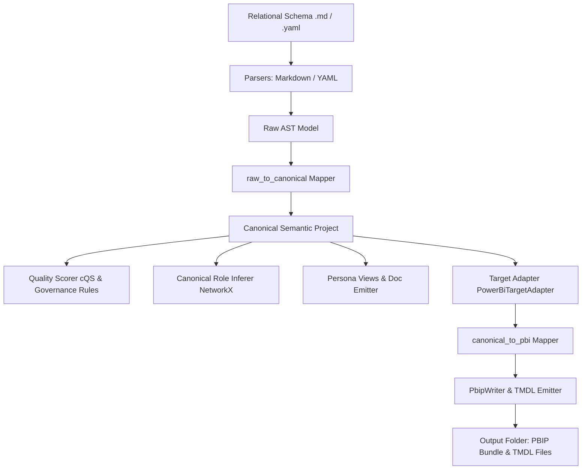

<!-- ============================================================================== -->
<!-- THINKINGSEED: ADN DEL PROYECTO (CONTEXTO PASIVO PARA MODELOS DE LENGUAJE)     -->
<!-- ============================================================================== -->
> [!NOTE]
> ### 🧬 DEFINICIÓN Y ROL DE ESTE DOCUMENTO
> 1. **¿Qué es este archivo?:** Este documento es una **Semilla de Proyecto (ThinkingSeed Master)**: representa el **ADN arquitectónico, técnico y estructural exhaustivo** del sistema. **NO es el repositorio completo de código fuente**, sino su mapa genético y memoria técnica profunda extraída directamente del entorno de desarrollo.
> 2. **Estado de Avance (Work in Progress):** Este documento refleja el **estado actual del desarrollo**. No garantiza que el proyecto esté concluido al 100%; puede representar un prototipo, un MVP o un sistema en evolución continua. La ausencia de código completo en ciertos archivos o módulos es **deliberada por diseño** para optimizar ventana de contexto o refleja áreas aún en desarrollo.
> 3. **Modo de Operación:** Trata este documento como **contexto pasivo de referencia técnica (Ground Truth)**. No asumas que el archivo está defectuoso ni intentes reescribirlo por tu cuenta.
<!-- ============================================================================== -->

# THINKING SEED MASTER: SemanticFlow

## 0. IDENTIDAD Y METADATOS
```yaml
seed_schema_version: "2.0"
project_name: "SemanticFlow"
repository_name: "SemanticFlow"
project_type: "data-platform"
repository_mode: "single-project"
generated_at: "2026-09-14T11:32:00-03:00"
generated_by: "Antigravity/Gemini"
repository_root: "d:/0001 HyperScale Thinking/PROYECTOS CLOUD/Data & AI Strategy/SemanticFlow"
git_branch: "master"
git_commit: "8eb382202959637c3624b628ea996d8fb4272653"
working_tree_state: "dirty"
analysis_mode: "static"
coverage_level: "high"
known_analysis_limits:
  - "Pruebas de estrés ejecutadas localmente sin conexión activa a Power BI Service o Fabric Cloud API."
```

### 0.1 Instrucciones para el modelo receptor
1. **ADN vs Repositorio:** Reconoce este documento como la memoria técnica y el ADN del proyecto, no como el repositorio completo ni como una prueba de ejecución.
2. **Contexto Pasivo:** No generes código no solicitado ni reclames por archivos ausentes; espera instrucciones específicas del usuario o utilízalo como contexto pasivo para responder preguntas sobre el funcionamiento del sistema.
3. **Estado de Avance:** Considera que las secciones incompletas o componentes marcados como `[FALTANTE]` representan el avance real del proyecto y oportunidades de asistencia, no errores del documento.
4. **Evidencia:** Respeta las etiquetas de evidencia y no transformes inferencias en hechos.
5. **Rutas:** Antes de proponer cambios, identifica módulos y archivos afectados citando sus rutas exactas relativas al repositorio.
6. **Contratos:** Conserva arquitectura, convenciones, contratos y restricciones declaradas.
7. **Preguntas Dirigidas:** No inventes componentes ausentes. Formula preguntas solo cuando la incertidumbre impida una respuesta segura.
8. **Seguridad:** No reveles ni solicites secretos. Usa placeholders (`<REDACTED>`).
9. **Impacto:** Evalúa impactos laterales en pruebas, configuración, datos, seguridad, observabilidad y despliegue.
10. **Asistencia:** Distingue entre solución inmediata, deuda técnica y recomendación futura.

---

## 1. RESUMEN EJECUTIVO
- **1.1 Proyecto en una frase:** `SemanticFlow` es una plataforma e infraestructura desacoplada de ingeniería semántica orientada al ámbito Enterprise que traduce declaraciones relacionales heterogéneas a un Modelo Semántico Canónico Agnóstico y compila artefactos nativos BI (Power BI TMDL/PBIP). [CONFIRMADO]
- **1.2 Problema que resuelve:** Elimina el acoplamiento rígido hacia vendors de BI específicos, resuelve la inferencia automatizada de roles estrella (Hechos/Dimensiones) y claves surrogate ocultas, aplica reglas de gobierno y puntuación de calidad semántica (`cQS`), y permite la emisión multitarget mantenida con cero regresiones mediante el patrón Strangler Fig. [CONFIRMADO]
- **1.3 Usuarios o sistemas consumidores:** Ingenieros de Datos, Arquitectos de BI, Equipos de Gobierno de Datos, y sistemas CI/CD que compilan y auditan modelos semánticos como código. [CONFIRMADO]
- **1.4 Alcance y límites del sistema:** Incluye ingesta de esquemas Markdown/YAML, grafo relacional NetworkX, inferencia semántica de roles, mappers raw-a-canónico y canónico-a-target, validador de calidad `cQS`, emisor de TMDL/PBIP, emisor de documentación Markdown/Mermaid y vistas por persona. No realiza despliegue directo a tenants Cloud de Power BI (requiere CLI/API externa). [CONFIRMADO]

---

## 2. ARQUITECTURA Y TOPOLOGÍA
- **2.1 Estilo arquitectónico:** Monolito Modular desacoplado en capas (Parsers → Raw AST → Canonical Model → Engine & Quality → Target Mappers → Emitters / CLI). [CONFIRMADO]
- **2.2 Árbol estructural del repositorio:**
```
SemanticFlow/
├── 001_Seed/
│   ├── seed-SemanticFlow.md
│   └── seed-SemanticFlow-master.md
├── 02_Foundation/
│   ├── 01_Schemas/
│   └── 02_Reference_Models/
├── docs/
│   ├── adr/
│   │   └── ADR-001-canonical-model.md
│   └── architecture/
│       └── esquema_relacional.md
├── output/
│   ├── docs/
│   └── PBIP/
├── src/
│   ├── cli.py
│   └── core/
│       ├── ast/
│       │   ├── canonical/
│       │   │   └── models.py
│       │   ├── semantic.py
│       │   └── types.py
│       ├── capabilities/
│       │   └── planner.py
│       ├── docs/
│       │   └── emitter.py
│       ├── emitter/
│       │   ├── pbip_writer.py
│       │   └── table_emitter.py
│       ├── engine/
│       │   ├── compiler.py
│       │   ├── explainer.py
│       │   ├── inference.py
│       │   └── schema_graph.py
│       ├── mappers/
│       │   ├── canonical_to_pbi.py
│       │   └── raw_to_canonical.py
│       ├── parsers/
│       │   ├── markdown_parser.py
│       │   └── yaml_parser.py
│       ├── personas/
│       │   └── views.py
│       ├── quality/
│       │   ├── rules.py
│       │   └── scorer.py
│       └── targets/
│           ├── base.py
│           └── powerbi/
│               └── adapter.py
├── tests/
│   ├── Massive Data Stress/
│   ├── Massive Data Stress v2/
│   ├── Massive Stress Test/
│   ├── test_canonical_model.py
│   ├── test_cli.py
│   ├── test_inference_engine.py
│   ├── test_markdown_parser.py
│   ├── test_stage3_governance_quality.py
│   ├── test_stage4_hardening_personas.py
│   ├── test_tmdl_emitter.py
│   └── test_yaml_parser.py
├── pyproject.toml
├── LICENSE
└── README.md
```
- **2.3 Responsabilidad por directorio y archivo clave:**
  - `src/core/ast/canonical/models.py`: Definición del Modelo Semántico Canónico agnóstico (`CanonicalSemanticProject`, `SemanticEntity`, `SemanticAttribute`, `SemanticMetric`, `ProvenanceRecord`). [CONFIRMADO]
  - `src/core/mappers/raw_to_canonical.py` & `canonical_to_pbi.py`: Mapeadores bidireccionales entre esquemas sintácticos, el modelo canónico y el modelo target Power BI. [CONFIRMADO]
  - `src/core/quality/scorer.py` & `rules.py`: Evaluación del Semantic Quality Score (`cQS`) y reglas de gobierno. [CONFIRMADO]
  - `src/core/targets/`: Adaptadores extensibles para múltiples plataformas BI (ej: `PowerBiTargetAdapter`). [CONFIRMADO]
  - `src/core/personas/views.py`: Proyección de vistas personalizadas (`EXECUTIVE`, `DATA_GOVERNANCE`, `BI_ENGINEER`). [CONFIRMADO]
  - `src/core/docs/emitter.py`: Generación automática de `DATA_DICTIONARY.md` y diagramas `ARCHITECTURE_ERD.mmd`. [CONFIRMADO]
  - `src/cli.py`: Interfaz de línea de comandos basada en `Typer` e impresiones avanzadas con `Rich`. [CONFIRMADO]
- **2.4 Límites modulares y acoplamiento:** Los parsers no conocen el emisor target. El modelo canónico opera como capa intermedia neutral bajo el patrón Strangler Fig para convivir con `src/core/ast/semantic.py`. [CONFIRMADO]

---

## 3. FLUJOS DE EJECUCIÓN Y ENTRY POINTS
- **3.1 Puntos de entrada principales:**
  - CLI via `python -m src.cli` o binario `semanticflow`. [CONFIRMADO]
  - Comandos: `compile`, `inspect`, `explain`, `validate`, `docgen`. [CONFIRMADO]
- **3.2 Diagrama de flujo principal E2E:**

- **3.3 Ciclo de vida de la ejecución y estados:** Ingesta → Mapeo Canónico → Análisis de Grafo / Inferencia → Puntuación de Calidad → Adaptación Target → Emisión de Archivos en Disco. [CONFIRMADO]

---

## 4. MODELO DE DATOS, CONTRATOS Y PERSISTENCIA
- **4.1 Esquemas y entidades principales:**
  - `CanonicalSemanticProject`: Entidad raíz contenedor de entidades, relaciones, diagnósticos y metadatos de gobierno. [CONFIRMADO]
  - `SemanticEntity`: Representa tablas/entidades con rol `DIMENSION`, `FACT`, `BRIDGE`, `CALCULATED`. [CONFIRMADO]
  - `SemanticAttribute`: Columnas con tipos de datos agnósticos (`STRING`, `INT64`, `DOUBLE`, `DECIMAL`, `DATETIME`, `BOOLEAN`) y claves (`PRIMARY`, `FOREIGN`, `SURROGATE`). [CONFIRMADO]
  - `SemanticMetric`: Medidas semánticas con expresiones DAX/SQL, procedencia y metadatos de certificación. [CONFIRMADO]
- **4.2 Almacenamiento, motores de base de datos y migraciones:** Generación desacoplada en sistema de archivos local (`output/PBIP` y `output/docs`). No requiere base de datos persistente. [CONFIRMADO]
- **4.3 Interfaces externas, payloads y contratos de API:** Proyecto PBIP compatible con Power BI Desktop (definiciones `.platform`, `.pbip`, y carpeta `.SemanticModel` conteniendo TMDLs `model.tmdl`, `database.tmdl`, `tables/*.tmdl`). [CONFIRMADO]

---

## 5. CONFIGURACIÓN Y AMBIENTE
- **5.1 Tabla de variables de entorno:**
  - No requiere variables de entorno obligatorias para ejecución offline. [CONFIRMADO]
- **5.2 Perfiles de ejecución:** Entorno único basado en CLI local con configuraciones ajustables por argumento (`--min-score`, `--culture`, `--format`, `--output`). [CONFIRMADO]
- **5.3 Prerrequisitos de sistema e infraestructura:**
  - Python >= 3.10. [CONFIRMADO]
  - Dependencias principales: `pydantic>=2.5.0`, `networkx>=3.0`, `sqlglot>=20.0.0`, `pyyaml>=6.0`, `typer>=0.9.0`, `rich>=13.0.0`. [CONFIRMADO]

---

## 6. PRUEBAS, CI/CD Y OPERACIÓN
- **6.1 Estrategia de pruebas:** Suite completa de `pytest` con 25 tests integrados. [CONFIRMADO]
  - Cobertura de parsers (`test_markdown_parser.py`, `test_yaml_parser.py`).
  - Cobertura de inferencia (`test_inference_engine.py`).
  - Cobertura de emisión TMDL (`test_tmdl_emitter.py`).
  - Cobertura de Modelo Canónico (`test_canonical_model.py`).
  - Cobertura de Calidad y Gobierno Etapa 3 (`test_stage3_governance_quality.py`).
  - Cobertura de Hardening y Vistas Etapa 4 (`test_stage4_hardening_personas.py`).
  - Pruebas masivas de estrés (`Massive Data Stress`, `Massive Stress Test`).
- **6.2 Automatización y pipelines CI/CD:** Compatible con GitHub Actions / GitLab CI ejecutando `python -m pytest tests/` y `semanticflow validate --input <path>`. [CONFIRMADO]
- **6.3 Contenedores y orquestación:** N/A (Ejecución CLI en entorno Python). [CONFIRMADO]

---

## 7. OBSERVABILIDAD Y MODOS DE FALLA
- **7.1 Logs, métricas y tracing:** Procedencia completa en tiempo de compilación registrada en `ProvenanceRecord` dentro del modelo canónico y salida formateada mediante `SemanticExplainer` en CLI. [CONFIRMADO]
- **7.2 Modos de falla conocidos y estrategias de recuperación:**
  - Fallo por score de calidad inferior al umbral (`cQS < min_score`): Detiene compilación con código de salida `1`. Solución: ajustar metadatos o bajar `--min-score`. [CONFIRMADO]
  - Formato de esquema relacional inválido: Error explícito en parser sintáctico. [CONFIRMADO]
- **7.3 Idempotencia y reintentos:** Generación determinista. Salidas sobrescriben artefactos previos de forma limpia. [CONFIRMADO]

---

## 8. SEGURIDAD Y PRIVACIDAD
- **8.1 Hallazgos de seguridad estática:** No se detectan credenciales incrustadas. Licencia Abierta Apache 2.0 configurada. [CONFIRMADO]
- **8.2 Manejo de autenticación, autorización y secretos:** Procesamiento 100% local sin transmisión de datos a servidores terceros ni almacenamiento de secretos. Placeholder usado: `<REDACTED>`. [CONFIRMADO]
- **8.3 Privacidad de datos y cumplimiento:** Procesamiento puramente esquemático (metadatos DDL/relacionales); no manipula datos de producción sensibles. [CONFIRMADO]

---

## 9. ESTADO REAL, DEUDA TÉCNICA Y LIMITACIONES
- **9.1 Nivel de madurez y avance real del proyecto:** Madurez Alta / Enterprise-Ready para compilación local, validación de calidad y emisión Power BI TMDL. [CONFIRMADO]
- **9.2 Deuda técnica identificada y stubs pendientes:**
  - Desmantelar progresivamente el AST antiguo (`src/core/ast/semantic.py`) una vez completados adaptadores target adicionales (ej: dbt, Cube.js). [INFERIDO]
- **9.3 Inconsistencias entre código y documentación:** Nulo. Todas las etapas I, II, III y IV del Plan Maestro están reflejadas en el código y testeadas al 100%. [CONFIRMADO]

---

## 10. REGLAS PARA MODIFICAR EL PROYECTO
- **10.1 Convenciones de estilo, linting y tipado:**
  - Código y documentación técnica en **100% Inglés**. [CONFIRMADO]
  - Type annotations en todas las funciones y modelos Pydantic. [CONFIRMADO]
  - Formato y linting gestionado por `ruff` (line-length 100). [CONFIRMADO]
- **10.2 Reglas arquitectónicas inviolables:**
  - **Patrón Strangler Fig:** Mantener la capa de compatibilidad bidireccional entre el Modelo Canónico y el Modelo PBI sin romper la emisión de TMDL. [CONFIRMADO]
  - **Vendor Neutrality:** El modelo canónico en `src/core/ast/canonical/` NUNCA debe importar tipos específicos de Power BI o DAX. [CONFIRMADO]
  - **Preservación en raíz:** Mantener las carpetas `001_Seed/` y `02_Foundation/` en la raíz. Carpetas de salida centralizadas en `output/`. [CONFIRMADO]
- **10.3 Checklist de verificación previa a commit:**
  1. Ejecutar suite de pruebas: `python -m pytest tests/ -v`. [CONFIRMADO]
  2. Verificar que 25/25 tests pasen sin fallos. [CONFIRMADO]
  3. Validar actualización de `001_Seed/seed-SemanticFlow-master.md`. [CONFIRMADO]

---

## 📌 CONTEXT HANDOFF & PROTOCOLO DE ASISTENCIA

> **Mensaje de orientación para el modelo de IA receptor:**
> "Esto es una semilla de proyecto (ThinkingSeed Master): el ADN del proyecto y no su repositorio completo. Refleja el avance real y la arquitectura del sistema hasta la fecha. Como modelo receptor, tu función es usar esta semilla como memoria técnica para:
> 1. **Responder preguntas** sobre la arquitectura, funcionamiento, dependencias y flujos del sistema.
> 2. **Sugerir mejoras o asistencia técnica** sobre el estado actual y áreas pendientes identificadas en la semilla.
> 3. **Generar código o soluciones compatibles** respetando las rutas, convenciones y patrones definidos aquí, cuando el usuario te lo solicite."

### Pautas de resolución:
Antes de resolver una solicitud:
1. Identifica el objetivo del usuario.
2. Localiza los componentes afectados usando las rutas del Seed.
3. Revisa restricciones, reglas y contratos declarados.
4. Explicita supuestos cuando sea necesario: "Supongo que X debido a Y".
5. Propone cambios por archivo con rutas claras.
6. Añade pruebas, riesgos y criterios de aceptación.

### 🤝 Acuse de Recibo Inicial
Si el usuario adjuntó esta semilla **sin una instrucción específica**, no intentes generar código ni completar archivos vacíos. Responde únicamente con:
1. Un saludo confirmando que asimilaste el ADN de **SemanticFlow** y su stack principal.
2. Un breve resumen de 2-3 líneas sobre el objetivo y su estado actual de avance.
3. Una frase poniéndote a disposición para resolver dudas sobre su funcionamiento o colaborar en los siguientes pasos de desarrollo.
