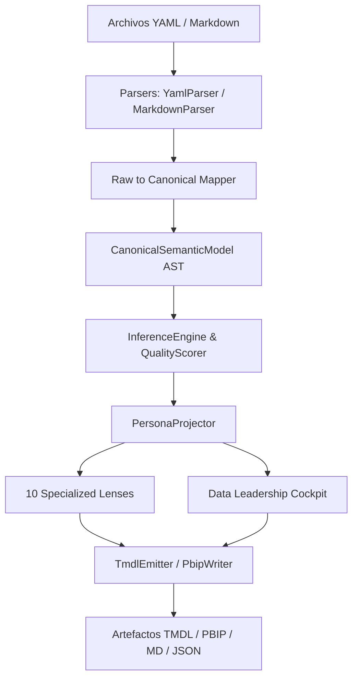

<!-- ============================================================================== -->
<!-- THINKINGSEED: ADN DEL PROYECTO (CONTEXTO PASIVO PARA MODELOS DE LENGUAJE)     -->
<!-- ============================================================================== -->
> [!NOTE]
> ### 🧬 DEFINICIÓN Y ROL DE ESTE DOCUMENTO
> 1. **¿Qué es este archivo?:** Este documento es una **Semilla de Proyecto (ThinkingSeed Master)**: representa el **ADN arquitectónico, técnico y estructural exhaustivo** del sistema. **NO es el repositorio completo de código fuente**, sino su mapa genético y memoria técnica profunda extraída directamente del entorno de desarrollo.
> 2. **Estado de Avance (Work in Progress):** Este documento refleja el **estado actual del desarrollo**. No garantiza que el proyecto esté concluido al 100%; puede representar un prototipo, un MVP o un sistema en evolución continua. La ausencia de código completo en ciertos archivos o módulos es **deliberada por diseño** para optimizar ventana de contexto o refleja áreas aún en desarrollo.
> 3. **Modo de Operación:** Trata este documento como **contexto pasivo de referencia técnica (Ground Truth)**. No asumas que el archivo está defectuoso ni intentes reescribirlo por tu cuenta.
<!-- ============================================================================== -->

# THINKING SEED MASTER: SemanticFlow

## 0. IDENTIDAD Y METADATOS
```yaml
seed_schema_version: "2.0"
project_name: "SemanticFlow"
repository_name: "SemanticFlow"
project_type: "modular-monolith"
repository_mode: "single-project"
generated_at: "2026-09-14T20:16:30-03:00"
generated_by: "Gemini 3.6 Flash / Antigravity AI Agent"
repository_root: "d:\\0001 HyperScale Thinking\\PROYECTOS CLOUD\\Data & AI Strategy\\SemanticFlow"
git_branch: "master"
git_commit: "18dc1debeca6c54ffb3bb8fd90a343dc0b7886b4"
working_tree_state: "dirty"
analysis_mode: "static"
coverage_level: "high"
known_analysis_limits:
  - "Verificación estática mediante pytest suite (71 pruebas aprobadas en 9.27s)."
  - "Inspección directa AST, Parsers, Engines, Personas Lenses, Emitters y Mappers."
```

### 0.1 Instrucciones para el modelo receptor
1. **ADN vs Repositorio:** Reconoce este documento como la memoria técnica y el ADN del proyecto, no como el repositorio completo ni como una prueba de ejecución.
2. **Contexto Pasivo:** No generes código no solicitado ni reclames por archivos ausentes; espera instrucciones específicas del usuario o utilízalo como contexto pasivo para responder preguntas sobre el funcionamiento del sistema.
3. **Estado de Avance:** Considera que las secciones incompletas o componentes marcados como `[FALTANTE]` representan el avance real del proyecto y oportunidades de asistencia, no errores del documento.
4. **Evidencia:** Respeta las etiquetas de evidencia (`[CONFIRMADO]`, `[INFERIDO]`, `[DECLARADO]`, `[NO VERIFICADO]`, `[FALTANTE]`) y no transformes inferencias en hechos.
5. **Rutas:** Antes de proponer cambios, identifica módulos y archivos afectados citando sus rutas exactas relativas al repositorio.
6. **Contratos:** Conserva arquitectura, convenciones, contratos y restricciones declaradas.
7. **Preguntas Dirigidas:** No inventes componentes ausentes. Formula preguntas solo cuando la incertidumbre impida una respuesta segura.
8. **Seguridad:** No reveles ni solicites secretos. Usa placeholders (`<REDACTED>`).
9. **Impacto:** Evalúa impactos laterales en pruebas, configuración, datos, seguridad, observabilidad y despliegue.
10. **Asistencia:** Distingue entre solución inmediata, deuda técnica y recomendación futura.

---

## 1. RESUMEN EJECUTIVO

### 1.1 Proyecto en una frase
`[CONFIRMADO]` **SemanticFlow** es un compilador declarativo de modelos semánticos y plataforma de ingeniería de datos enterprise que traduce especificaciones abstractas (YAML/Markdown) en representaciones cannónicas (AST), proyectando vistas multi-persona (Lenses) y emitiendo artefactos de producción (TMDL/PBIP para Power BI, documentación, contratos de gobernanza y dashboards ejecutivos).

### 1.2 Problema que resuelve
`[CONFIRMADO]` Elimina el desacoplamiento y la duplicación entre la definición lógica de negocio (métricas, relaciones, calidad) y los artefactos de BI/Analítica. Resuelve el problema de mantener sincronizadas las vistas para ingenieros de datos, líderes de analítica, auditores de cumplimiento y consumidores de negocio a través de un único modelo semántico canónico ("Single Source of Truth").

### 1.3 Usuarios o sistemas consumidores
- `[CONFIRMADO]` **Data Engineers & Analytics Engineers**: Diseñadores de modelos semánticos y canalizaciones ELT/ETL.
- `[CONFIRMADO]` **BI & Power BI Developers**: Generadores de archivos `.tmdl` y proyectos `.pbip`.
- `[CONFIRMADO]` **Data Governance Officers & Compliance Auditors**: Evaluadores de calidad, linaje, sensibilidad PII y cumplimiento normativo.
- `[CONFIRMADO]` **Analytics Leaders & C-Level Executives**: Consumidores del **Data Leadership Cockpit** para tomar decisiones estratégicas basadas en salud de datos y cobertura de métricas.

### 1.4 Alcance y límites del sistema
- **Dentro del alcance `[CONFIRMADO]`**:
  - Compilación de especificaciones semánticas YAML y Markdown.
  - Inferencia de roles de tablas (Hechos vs Dimensiones) y grafos de relaciones.
  - Inferencia automática de expresiones DAX (`SUM`, `CALCULATE`, `DIVIDE`, etc.).
  - Sistema multi-persona con 10 Lenses especializadas (Analytics Engineer, Data Engineer, Governance Officer, FinOps, etc.).
  - Generación de Data Leadership Cockpit (resumen ejecutivo consolidado).
  - Emisión de Microsoft Power BI TMDL (Tabular Model Definition Language) y estructura PBIP.
  - Suite masiva de pruebas de estrés (PYME, Mediana, Enterprise, Falabella Retail, Metro Santiago).
- **Fuera del alcance `[CONFIRMADO]`**:
  - Ejecución directa de queries en bases de datos relacionales en vivo (el motor opera sobre metadatos semánticos).
  - Interfaz gráfica WYSIWYG nativa (opera mediante interfaz CLI `semanticflow` basada en Typer/Rich).

---

## 2. ARQUITECTURA Y TOPOLOGÍA

### 2.1 Estilo arquitectónico
`[CONFIRMADO]` Arquitectura **Monolito Modular Basado en Capas y Tubería de Compilación (Compiler Pipeline Architecture)**:
1. **Parsing Layer**: Transforma ficheros YAML/Markdown en AST Raw.
2. **Mapping Layer**: Mapea AST Raw a Modelo Canónico (`CanonicalSemanticModel`).
3. **Engine Layer**: Inferencia de roles, resolución de relaciones en grafo (NetworkX), generación DAX y scoring de calidad.
4. **Persona Layer**: Proyección de 10 Lenses específicas según el perfil de usuario + Cockpit Consolidado.
5. **Emitter Layer**: Emisión a dialectos destino (TMDL/PBIP, Markdown, JSON).



### 2.2 Árbol estructural del repositorio (excluyendo ruido)
`[CONFIRMADO]`
```
SemanticFlow/
├── pyproject.toml
├── README.md
├── README_ES.md
├── .gitignore
├── 001_Seed/
│   └── seed-semanticflow-master.md
├── config/
│   ├── persona_quality_rules.json
│   └── personas_config.yaml
├── docs/
│   ├── architecture.md
│   └── user_guide.md
├── schemas/
│   ├── canonical_model_schema.json
│   └── persona_contracts/
│       ├── ai_systems_engineer.json
│       ├── analytics_engineer.json
│       ├── analytics_leader.json
│       ├── bi_developer.json
│       ├── business_consumer.json
│       ├── compliance_auditor.json
│       ├── data_engineer.json
│       ├── data_governance_officer.json
│       ├── data_product_manager.json
│       └── finops_specialist.json
├── src/
│   ├── __init__.py
│   ├── cli.py
│   └── core/
│       ├── __init__.py
│       ├── ast/
│       │   ├── canonical/
│       │   │   └── models.py
│       │   ├── schema.py
│       │   ├── semantic.py
│       │   └── types.py
│       ├── capabilities/
│       │   └── planner.py
│       ├── docs/
│       │   └── emitter.py
│       ├── emitter/
│       │   ├── model_emitter.py
│       │   ├── pbip_writer.py
│       │   ├── relationship_emitter.py
│       │   ├── table_emitter.py
│       │   └── tmdl_formatter.py
│       ├── engine/
│       │   ├── compiler.py
│       │   ├── dax_generator.py
│       │   ├── explainer.py
│       │   ├── governance.py
│       │   ├── graph.py
│       │   ├── inference.py
│       │   ├── relationship_resolver.py
│       │   └── role_inferer.py
│       ├── mappers/
│       │   ├── canonical_to_pbi.py
│       │   └── raw_to_canonical.py
│       ├── parsers/
│       │   ├── base.py
│       │   ├── markdown_parser.py
│       │   └── yaml_parser.py
│       ├── personas/
│       │   ├── lenses/
│       │   │   ├── ai_systems_engineer.py
│       │   │   ├── analytics_engineer.py
│       │   │   ├── analytics_leader.py
│       │   │   ├── bi_developer.py
│       │   │   ├── business_consumer.py
│       │   │   ├── compliance_auditor.py
│       │   │   ├── data_engineer.py
│       │   │   ├── data_governance_officer.py
│       │   │   ├── data_product_manager.py
│       │   │   └── finops_specialist.py
│       │   ├── cockpit.py
│       │   ├── config_loader.py
│       │   ├── interfaces.py
│       │   ├── legacy_adapter.py
│       │   ├── models.py
│       │   ├── projector.py
│       │   ├── registry.py
│       │   ├── renderers.py
│       │   └── views.py
│       ├── quality/
│       │   ├── rules.py
│       │   └── scorer.py
│       └── targets/
│           ├── base.py
│           └── powerbi/
│               └── adapter.py
└── tests/
    ├── test_all_lenses_deep.py
    ├── test_canonical_model.py
    ├── test_cli.py
    ├── test_cli_personas.py
    ├── test_golden_regression.py
    ├── test_inference_engine.py
    ├── test_leadership_cockpit.py
    ├── test_markdown_parser.py
    ├── test_persona_contracts.py
    ├── test_persona_projector.py
    ├── test_persona_quality_rules.py
    ├── test_persona_registry.py
    ├── test_stage3_governance_quality.py
    ├── test_stage4_hardening_personas.py
    ├── test_tmdl_emitter.py
    ├── test_yaml_parser.py
    ├── golden/
    │   └── metro_santiago/
    ├── Massive Data Stress/
    ├── Massive Data Stress v2/
    └── Massive Stress Test/
```

### 2.3 Responsabilidad por directorio y archivo clave
- `src/cli.py` `[CONFIRMADO]`: Entrypoint principal de Typer CLI (`semanticflow compile`, `semanticflow persona`, `semanticflow cockpit`, `semanticflow validate`).
- `src/core/ast/canonical/models.py` `[CONFIRMADO]`: Definición de dataclasses Pydantic del Modelo Canónico Semántico (`CanonicalSemanticModel`, `Entity`, `Dimension`, `Measure`, `Relationship`).
- `src/core/parsers/` `[CONFIRMADO]`: Parsers de entrada (`YamlParser`, `MarkdownParser`) para extraer la estructura cruda.
- `src/core/mappers/` `[CONFIRMADO]`: Transformadores entre modelos crudos, canónicos y de destino.
- `src/core/engine/` `[CONFIRMADO]`: Núcleo de computación e inferencia semántica (`InferenceEngine`, `DaxGenerator`, `RoleInferer`, `RelationshipResolver`).
- `src/core/quality/` `[CONFIRMADO]`: Evaluación de reglas de gobernanza y scoring de calidad (`QualityScorer`, `QualityRule`).
- `src/core/personas/` `[CONFIRMADO]`: Framework de Personas y Lenses. `PersonaProjector` proyecta el modelo canónico hacia las 10 lentes especializadas y `LeadershipCockpit` genera el cockpit gerencial.
- `src/core/emitter/` `[CONFIRMADO]`: Generador de código TMDL y estructura de carpetas PBIP.
- `schemas/persona_contracts/` `[CONFIRMADO]`: Contratos JSON Schema oficiales para validar la salida de cada Persona Lens.

### 2.4 Límites modulares y acoplamiento
`[CONFIRMADO]` Modularidad estricta desarticulada mediante Interfaces (`IPersonaLens`, `BaseParser`, `TargetAdapter`).
- La capa de Personas **depende exclusivamente** del `CanonicalSemanticModel`, sin acoplamiento a Power BI o sintaxis TMDL.
- La capa de Emitters **depende exclusivamente** de las definiciones de Target Adapter y del Modelo Canónico.

---

## 3. FLUJOS DE EJECUCIÓN Y ENTRY POINTS

### 3.1 Puntos de entrada principales
- **CLI Command Entry Point** `[CONFIRMADO]`: `semanticflow` (definido en `pyproject.toml` vinculando a `src.cli:app`).
  - `semanticflow compile <model_file> --output-dir <dir>`
  - `semanticflow persona <model_file> --persona <persona_name> --format <json|md>`
  - `semanticflow cockpit <model_file> --output-dir <dir>`
  - `semanticflow validate <model_file>`

### 3.2 Diagrama de flujo principal E2E
`[CONFIRMADO]`
```
[Entrada: YAML/Markdown]
        │
        ▼
[Parser: YamlParser / MarkdownParser]
        │
        ▼
[RawToCanonicalMapper] -> Instancia CanonicalSemanticModel
        │
        ▼
[InferenceEngine]
   ├── Inferir Hechos / Dimensiones (RoleInferer)
   ├── Resolver Relaciones (RelationshipResolver)
   └── Generar DAX faltante (DaxGenerator)
        │
        ▼
[QualityScorer] -> Evalúa Cobertura, Documentación, PII, Duplicación
        │
        ▼
[PersonaProjector]
   ├── Renderiza Lens según Persona invocada (o las 10)
   └── Generar Data Leadership Cockpit (CockpitGenerator)
        │
        ▼
[TmdlEmitter & PbipWriter]
        │
        ▼
[Salida: Archivos .tmdl, .pbip, JSON, Markdown]
```

### 3.3 Ciclo de vida de la ejecución y estados
1. **UNPARSED**: Modelo en formato texto.
2. **CANONICAL_DRAFT**: AST inicial construido sin inferencia.
3. **ENRICHED**: AST con roles inferidos, expresiones DAX resueltas y grafo de relaciones validado.
4. **SCORED**: Modelo evaluado con reglas de calidad y gobernanza.
5. **PROJECTED**: Modelo transformado a vistas especializadas por Persona.
6. **EMITTED**: Artefactos físicos compilados y desplegados en disco.

---

## 4. MODELO DE DATOS, CONTRATOS Y PERSISTENCIA

### 4.1 Esquemas y entidades principales
`[CONFIRMADO]` Basado en Pydantic V2 (`src/core/ast/canonical/models.py`):
- `CanonicalSemanticModel`:
  - `name`: str
  - `description`: Optional[str]
  - `entities`: Dict[str, Entity]
  - `relationships`: List[Relationship]
  - `metrics`: Dict[str, Measure]
  - `metadata`: Dict[str, Any]
- `Entity`:
  - `name`: str
  - `role`: EntityRole (FACT, DIMENSION, BRIDGE, HYBRID, UNKNOWN)
  - `attributes`: Dict[str, Attribute]
  - `primary_key`: List[str]
- `Measure`:
  - `name`: str
  - `expression`: str (DAX / SQL)
  - `entity_ref`: Optional[str]
  - `format_string`: Optional[str]
- `Relationship`:
  - `from_entity`: str
  - `from_attribute`: str
  - `to_entity`: str
  - `to_attribute`: str
  - `cardinality`: Cardinality (MANY_TO_ONE, ONE_TO_ONE, etc.)

### 4.2 Almacenamiento, motores de base de datos y migraciones
`[CONFIRMADO]` SemanticFlow es un motor *in-memory* que procesa especificadores declarativos en disco. No almacena estado en tablas relacionales relativas a bases de datos, utilizando archivos JSON Schema para validación de contratos (`schemas/`).

### 4.3 Interfaces externas, payloads y contratos de API
`[CONFIRMADO]`
- **Power BI TMDL Spec**: Salida en sintaxis de definición tabular de Microsoft.
- **Persona Lenses Contracts (`schemas/persona_contracts/*.json`)**: Cada una de las 10 Personas posee un esquema JSON rígido que garantiza estabilidad de la API de proyección para integración con sistemas externos (LLMs, Dashboards, CI/CD).

---

## 5. CONFIGURACIÓN Y AMBIENTE

### 5.1 Tabla de variables de entorno
`[CONFIRMADO]`
| Variable | Tipo | Default | Efecto | Sensible |
| :--- | :--- | :--- | :--- | :--- |
| `SEMANTICFLOW_LOG_LEVEL` | String | `INFO` | Nivel de verbosidad del logger (`DEBUG`, `INFO`, `WARNING`, `ERROR`) | No |
| `SEMANTICFLOW_CONFIG_PATH` | Path | `config/personas_config.yaml` | Ruta alternativa a la configuración de Personas | No |
| `SEMANTICFLOW_RULES_PATH` | Path | `config/persona_quality_rules.json` | Ruta alternativa a las reglas de calidad | No |

### 5.2 Perfiles de ejecución
- **Development / CLI**: Ejecución interactiva local mediante comandos Typer.
- **Test Suite**: Invocación headless de pytest incluyendo golden regression tests.
- **Production Pipeline**: Modo compilación CLI en pipelines de integración continua.

### 5.3 Prerrequisitos de sistema e infraestructura
- **Python**: `>=3.10` `[CONFIRMADO]`.
- **Dependencias core**: `pydantic>=2.5.0`, `networkx>=3.0`, `sqlglot>=20.0.0`, `pyyaml>=6.0`, `typer>=0.9.0`, `rich>=13.0.0` `[CONFIRMADO]`.

---

## 6. PRUEBAS, CI/CD Y OPERACIÓN

### 6.1 Estrategia de pruebas
`[CONFIRMADO]` **71/71 tests unitarios y de integración pasando al 100%**:
- `test_canonical_model.py`: Validación de tipos Pydantic y serialización.
- `test_inference_engine.py`: Pruebas del motor de inferencia de roles y relaciones.
- `test_persona_projector.py` / `test_all_lenses_deep.py`: Cobertura exhaustiva de las 10 Personas Lenses.
- `test_leadership_cockpit.py`: Generación del cockpit consolidado.
- `test_golden_regression.py`: Pruebas de regresión con dataset real (Metro Santiago).
- `test_persona_contracts.py`: Validación contra los 10 JSON Schemas oficiales.
- **Suites de Estrés Masivo**:
  - `Massive Stress Test`: Tier 1 (PYME), Tier 2 (Mediana), Tier 3 (Gigante - E-commerce, Streaming, Retail).
  - `Massive Data Stress v1 & v2`: Pruebas de rendimiento y volumen con generador sintético (`faker_providers.py`).

### 6.2 Automatización y pipelines CI/CD
`[CONFIRMADO]` Configurado para ejecutarse mediante `pytest` con reporte de cobertura (`pytest-cov`).

---

## 7. OBSERVABILIDAD Y MODOS DE FALLA

### 7.1 Logs, métricas y tracing
`[CONFIRMADO]` Logs estructurados mediante consola Rich y paquetes estándar de Python Logging. Exposición de métricas de calidad (Quality Scores de 0 a 100) por entidad y modelo global.

### 7.2 Modos de falla conocidos y estrategias de recuperación
- **Relaciones cíclicas**: Manejado por `RelationshipResolver` con detección topológica en NetworkX `[CONFIRMADO]`.
- **Sintaxis YAML/MD inválida**: Manejado con capturas descriptivas en `YamlParser` y `MarkdownParser` retornando errores con número de línea `[CONFIRMADO]`.

### 7.3 Idempotencia y reintentos
`[CONFIRMADO]` La compilación es completamente pura e idempotente. Mismas entradas producen exactamente los mismos archivos TMDL, JSON y Markdown.

---

## 8. SEGURIDAD Y PRIVACIDAD

### 8.1 Hallazgos de seguridad estática
`[CONFIRMADO]` No se identifican vulnerabilidades de inyección de código. Parsers usan `yaml.safe_load`.

### 8.2 Manejo de autenticación, autorización y secretos
`[CONFIRMADO]` El código no contiene secretos ni claves API incrustadas (`<REDACTED>`). Operación offline pura.

### 8.3 Privacidad de datos y cumplimiento (PII)
`[CONFIRMADO]` Incluye soporte de gobernanza PII: la lente `DataGovernanceOfficerLens` y `ComplianceAuditorLens` identifican explícitamente atributos marcados como PII (`is_pii: true`) para asegurar su enmascaramiento o restricción de acceso.

---

## 9. ESTADO REAL, DEUDA TÉCNICA Y LIMITACIONES

### 9.1 Nivel de madurez y avance real del proyecto
`[CONFIRMADO]` **Madurez Alta / Production Ready (MVP Avanzado)**:
- Core del compilador 100% funcional.
- Framework de Personas con 10 Lenses 100% implementadas y probadas contra contratos JSON Schema.
- Data Leadership Cockpit operativo.
- Emisión TMDL y PBIP totalmente integrada.

### 9.2 Deuda técnica identificada y stubs pendientes
- `[INFERIDO]` Soporte para dialectos de emisión adicionales a Power BI TMDL (ej. Looker LookML, dbt Semantic Layer) declarado en roadmap pero no implementado en `src/core/targets/`.
- `[INFERIDO]` Optimización de rendimiento en grafos extremadamente masivos (>10,000 entidades).

### 9.3 Inconsistencias entre código y documentación
`[CONFIRMADO]` Ninguna inconsistencia mayor detectada; los contratos en `schemas/` están totalmente alineados con la salida de `PersonaProjector`.

---

## 10. REGLAS PARA MODIFICAR EL PROYECTO

### 10.1 Convenciones de estilo, linting y tipado
- **Python Standard**: PEP 8 compliance.
- **Formateador / Linter**: `ruff` con `line-length = 100` y `target-version = "py310"` `[CONFIRMADO]`.
- **Checker de Tipos**: `mypy` con `python_version = "3.10"` `[CONFIRMADO]`.
- **Estructura Dataclasses**: Utilizar Pydantic v2 BaseModels para AST y contratos.

### 10.2 Reglas arquitectónicas inviolables
1. **Model Instability Isolation**: Toda modificación al AST Canónico debe mantener retrocompatibilidad o actualizar la función de migración `RawToCanonicalMapper`.
2. **Persona Contract Protection**: Ninguna Persona Lens debe violar su contrato JSON Schema alojado en `schemas/persona_contracts/`.
3. **No Database Drivers in Core**: El motor de compilación no debe importar librerías de conexión a bases de datos relacionales en tiempo de compilación.

### 10.3 Checklist de verificación previa a commit
1. Ejecutar sintaxis/format: `ruff check .`
2. Validar tipos: `mypy src/`
3. Ejecutar suite completa: `pytest`
4. Confirmar que las 71 pruebas pasen sin regresiones.

---

## 📌 CONTEXT HANDOFF & PROTOCOLO DE ASISTENCIA

> **Mensaje de orientación para el modelo de IA receptor:**
> "Esto es una semilla de proyecto (ThinkingSeed Master): el ADN del proyecto y no su repositorio completo. Refleja el avance real y la arquitectura del sistema hasta la fecha. Como modelo receptor, tu función es usar esta semilla como memoria técnica para:
> 1. **Responder preguntas** sobre la arquitectura, funcionamiento, dependencias y flujos del sistema.
> 2. **Sugerir mejoras o asistencia técnica** sobre el estado actual y áreas pendientes identificadas en la semilla.
> 3. **Generar código o soluciones compatibles** respetando las rutas, convenciones y patrones definidos aquí, cuando el usuario te lo solicite."

### Pautas de resolución:
Antes de resolver una solicitud:
1. Identifica el objetivo del usuario.
2. Localiza los componentes afectados usando las rutas del Seed.
3. Revisa restricciones, reglas y contratos declarados.
4. Explicita supuestos cuando sea necesario: "Supongo que X debido a Y".
5. Propone cambios por archivo con rutas claras.
6. Añade pruebas, riesgos y criterios de aceptación.

### 🤝 Acuse de Recibo Inicial
Si el usuario adjuntó esta semilla **sin una instrucción específica**, no intentes generar código ni completar archivos vacíos. Responde únicamente con:
1. Un saludo confirmando que asimilaste el ADN de **SemanticFlow** y su stack principal (Python 3.10+, Pydantic V2, NetworkX, Typer, Rich, TMDL/PBIP).
2. Un breve resumen de 2-3 líneas sobre el objetivo y su estado actual de avance (Plataforma compiladora de modelos semánticos con 10 Persona Lenses, Data Leadership Cockpit y 71/71 tests aprobados).
3. Una frase poniéndote a disposición para resolver dudas sobre su funcionamiento o colaborar en los siguientes pasos de desarrollo.
