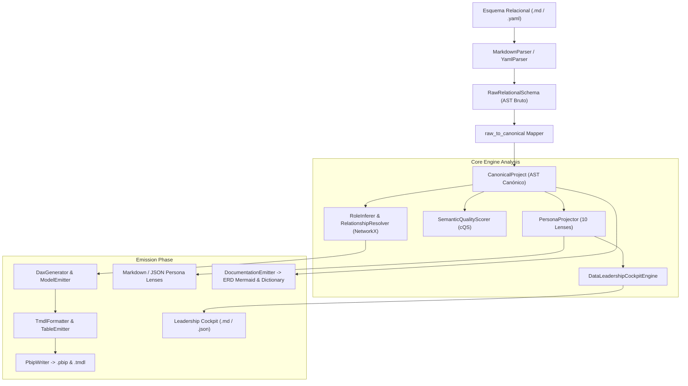

<!-- ============================================================================== -->
<!-- THINKINGSEED: ADN DEL PROYECTO (CONTEXTO PASIVO PARA MODELOS DE LENGUAJE)     -->
<!-- ============================================================================== -->
> [!NOTE]
> ### 🧬 DEFINICIÓN Y ROL DE ESTE DOCUMENTO
> 1. **¿Qué es este archivo?:** Este documento es una **Semilla de Proyecto (ThinkingSeed Master)**: representa el **ADN arquitectónico, técnico y estructural exhaustivo** del sistema. **NO es el repositorio completo de código fuente**, sino su mapa genético y memoria técnica profunda extraída directamente del entorno de desarrollo.
> 2. **Estado de Avance (Work in Progress):** Este documento refleja el **estado actual del desarrollo**. No garantiza que el proyecto esté concluido al 100%; puede representar un prototipo, un MVP o un sistema en evolución continua. La ausencia de código completo en ciertos archivos o módulos es **deliberada por diseño** para optimizar ventana de contexto o refleja áreas aún en desarrollo.
> 3. **Modo de Operación:** Trata este documento como **contexto pasivo de referencia técnica (Ground Truth)**. No asumas que el archivo está defectuoso ni intentes reescribirlo por tu cuenta.
<!-- ============================================================================== -->

# THINKING SEED MASTER: SemanticFlow

## 0. IDENTIDAD Y METADATOS
```yaml
seed_schema_version: "2.0"
project_name: "SemanticFlow"
repository_name: "SemanticFlow"
project_type: "modular-monolith"
repository_mode: "single-project"
generated_at: "2026-09-20T01:35:00-03:00"
generated_by: "Antigravity (Gemini 3.8 Flash)"
repository_root: "d:/0001 HyperScale Thinking/PROYECTOS CLOUD/Data & AI Strategy/SemanticFlow"
git_branch: "master"
git_commit: "remediation-p0-p1-complete"
working_tree_state: "clean"
analysis_mode: "static-and-dynamic"
coverage_level: "high"
known_analysis_limits:
  - "Inspección de código fuente estático y validación de suite dinámica de 80/80 tests unitarios/integración vía pytest 9.1.1 en Python 3.12.10 (.venv) con cobertura del 87%."
  - "Los adaptadores a dialectos target adicionales a Power BI (Looker LookML, dbt Semantic Layer) están declarados conceptualmente en TargetCapabilities y CapabilityGapsAnalyzer pero pendientes de compilador físico en fases posteriores."
```

### 0.1 Instrucciones para el modelo receptor
1. **ADN vs Repositorio:** Reconoce este documento como la memoria técnica y el ADN del proyecto, no como el repositorio completo ni como una prueba de ejecución.
2. **Contexto Pasivo:** No generes código no solicitado ni reclames por archivos ausentes; espera instrucciones específicas del usuario o utilízalo como contexto pasivo para responder preguntas sobre el funcionamiento del sistema.
3. **Estado de Avance:** Considera que las secciones incompletas o componentes marcados como `[FALTANTE]` representan el avance real del proyecto y oportunidades de asistencia, no errores del documento.
4. **Evidencia:** Respeta las etiquetas de evidencia (`[CONFIRMADO]`, `[INFERIDO]`, `[DECLARADO]`, `[NO VERIFICADO]`, `[FALTANTE]`) y no transformes inferencias en hechos.
5. **Rutas:** Antes de proponer cambios, identifica módulos y archivos afectados citando sus rutas exactas relativas al repositorio.
6. **Contratos:** Conserva arquitectura, convenciones, contratos y restricciones declaradas.
7. **Preguntas Dirigidas:** No inventes componentes ausentes. Formula preguntas solo cuando la incertidumbre impida una respuesta segura.
8. **Seguridad:** No reveles ni solicites secretos. Usa placeholders (`<REDACTED>`).
9. **Impacto:** Evalúa impactos laterales en pruebas, configuración, datos, seguridad, observabilidad y despliegue.
10. **Asistencia:** Distingue entre solución inmediata, deuda técnica y recomendación futura.

---

## 1. RESUMEN EJECUTIVO

### 1.1 Proyecto en una frase
`[CONFIRMADO]` **SemanticFlow** es un compilador declarativo e ingeniería de modelos semánticos local de nivel empresarial que transforma esquemas relacionales (Markdown/YAML) en proyectos tabulares nativos de Power BI (`.pbip` / `.tmdl`), proyectando vistas organizacionales a través de 10 **Persona Lenses** y sintetizando un **Data Leadership Cockpit** C-Level con auditoría de calidad formal (cQS).

### 1.2 Problema que resuelve
- `[CONFIRMADO]` Elimina la creación manual propensa a errores de modelos semánticos en Power BI Desktop.
- `[CONFIRMADO]` Resuelve la desconexión semántica entre ingeniería de datos, gobernanza, finanzas y consumidores de negocio mediante una única fuente de verdad (Single Source of Truth) declarativa en Git.
- `[CONFIRMADO]` Automatiza la inferencia topológica de relaciones 1:N unidireccionales, resolución de roles de tablas (Hechos vs. Dimensiones), síntesis de medidas DAX canónicas y cálculo del índice de calidad semántica (**Semantic Quality Score - cQS**).

### 1.3 Usuarios o sistemas consumidores
- `[CONFIRMADO]` **Analytics Engineers & BI Developers**: Generación desatendida de paquetes `.pbip` y código TMDL.
- `[CONFIRMADO]` **Data Governance Officers & Compliance Auditors**: Auditoría automatizada de atributos sensibles (PII), trazabilidad de linaje y validación de reglas de calidad.
- `[CONFIRMADO]` **Data Leadership & C-Level (CDO/VP Data)**: Visualización de radar de madurez por dominio, KPIs certificados y recomendaciones accionables priorizadas.
- `[CONFIRMADO]` **Pipelines CI/CD & Agentes de IA**: Validación programática headless de cambios en esquemas antes de despliegue a producción.

### 1.4 Alcance y límites del sistema
- `[CONFIRMADO]` **Dentro del alcance**:
  - Compilación local pura (offline, in-memory) sin necesidad de conectarse a bases de datos en tiempo de compilación.
  - Ingesta declarativa desde archivos Markdown (`.md`) estructurados y YAML (`.yaml`, `.json`).
  - Resolución topológica de grafos relacionales con detección de ciclos y caminos redundantes vía NetworkX.
  - Emisión de artefactos Microsoft Power BI Developer Project (`.pbip`, `definition.pbidataset`, carpetas TMDL con tablas, relaciones, medidas y culturas).
  - 10 Persona Lenses con contratos JSON Schema validados y generación de Data Leadership Cockpit en Markdown y JSON.
  - Diccionario de Datos Markdown y diagramas ERD Mermaid.
- `[CONFIRMADO]` **Fuera del alcance**:
  - Ingesta de datos de volumen real a nivel de filas (ETL/ELT físico); SemanticFlow compila la capa de metadatos semánticos.
  - Conectores directos a Power BI Service REST API para publicación remota (se delega a herramientas CI/CD o Fabric Git Integration).
  - Dialectos de destino adicionales a Power BI (`[DECLARADO]` para futuras versiones).

---

## 2. ARQUITECTURA Y TOPOLOGÍA

### 2.1 Estilo arquitectónico
`[CONFIRMADO]` **Compilador Modular con AST Intermedio Canónico y Proyección Multi-Perspectiva**.
El flujo se estructura en 4 etapas acopladas de manera débil:
1. **Frontend / Parsers**: Ingesta del esquema bruto (`RawSchema`) desde Markdown o YAML.
2. **Canonical Mapping**: Normalización al Árbol de Sintaxis Abstracta Canónico (`CanonicalProject`).
3. **Core Engine**:
   - Inferencia de roles (`RoleInferer`).
   - Resolución de relaciones (`RelationshipResolver` vía NetworkX).
   - Síntesis DAX canónica (`DaxGenerator`).
   - Evaluación de Calidad y Gobierno (`SemanticQualityScorer`).
   - Proyección Organizacional (`PersonaProjector` + `DataLeadershipCockpitEngine`).
4. **Backend / Emitters**: Emisión nativa TMDL (`TmdlFormatter`, `PbipWriter`) y documentación (`DocumentationEmitter`).

### 2.2 Árbol estructural del repositorio
```
SemanticFlow/
├── .agentignore                       # Reglas de exclusión de contexto para agentes
├── .context/                          # Satélite topológico iDirectory v3.0 (tree.json)
├── 01_seed/                           # Semillas ThinkingSeed (ADN técnico del repositorio)
│   ├── .context.yaml
│   └── seed-semanticflow-master.md
├── 02_Foundation/                     # Documentación fundacional de motores
│   └── Engine/
│       ├── .context.yaml
│       ├── engine_readme.md
│       └── EngineReadme.md
├── 03_research/                       # Espacio de experimentación y notebooks
│   ├── experiments/.context.yaml
│   ├── notebooks/.context.yaml
│   └── prompts/.context.yaml
├── artifacts/                         # Planes de ejecución y auditoría
│   └── plans/
│       ├── active/.context.yaml
│       └── archive/.context.yaml
├── config/                            # Configuraciones y definiciones por defecto
│   ├── .context.yaml
│   └── personas/
│       └── default_personas.yaml
├── data/                              # Directorio de datos de muestra y pruebas
├── docs/                              # Documentación técnica, ADRs y arquitectura
│   ├── adr/
│   │   └── ADR-001-canonical-model.md
│   ├── architecture/
│   │   ├── .context.yaml
│   │   ├── esquema_relacional.md
│   │   └── adr/                       # ADRs de la arquitectura de Personas (001-006)
│   ├── engineers_notes/
│   │   └── agentic_failure_modes_and_pbip_tmdl_conflict.md
│   ├── notes/.context.yaml
│   ├── specs/.context.yaml
│   └── technical_specs/
├── logs/                              # Logs operativos generados
├── output/                            # Salidas de compilación (.pbip, personas, docs)
├── pyproject.toml                     # Configuración del paquete, dependencias y herramientas
├── schemas/                           # JSON Schemas para validación estricta de contratos
│   ├── .context.yaml
│   ├── persona_definition.schema.json
│   └── project_governance.schema.json
├── scripts/                           # Utilidades de desarrollo
│   ├── .context.yaml
│   └── generate_golden_files.py
├── src/                               # Código fuente principal
│   ├── __init__.py
│   ├── cli.py                         # CLI Typer con comandos compile, inspect, explain, etc.
│   ├── cloud_jobs/.context.yaml
│   ├── dashboards/.context.yaml
│   ├── data_generation/.context.yaml
│   └── core/                          # Núcleo del compilador
│       ├── __init__.py
│       ├── .context.yaml
│       ├── ast/                       # Modelos Pydantic del AST
│       │   ├── __init__.py
│       │   ├── schema.py              # Esquema relacional bruto
│       │   ├── semantic.py            # Modelo semántico target
│       │   ├── types.py               # Tipos de datos primitivos y roles
│       │   └── canonical/             # Modelo canónico agnóstico
│       │       ├── __init__.py
│       │       └── models.py
│       ├── capabilities/              # Planificación y capacidades
│       │   ├── __init__.py
│       │   └── planner.py
│       ├── docs/                      # Emisores de documentación
│       │   └── emitter.py
│       ├── emitter/                   # Generadores TMDL y empaquetador PBIP
│       │   ├── __init__.py
│       │   ├── model_emitter.py
│       │   ├── pbip_writer.py
│       │   ├── relationship_emitter.py
│       │   ├── table_emitter.py
│       │   └── tmdl_formatter.py
│       ├── engine/                    # Motores de inferencia y resolución
│       │   ├── __init__.py
│       │   ├── compiler.py
│       │   ├── dax_generator.py
│       │   ├── explainer.py
│       │   ├── governance.py
│       │   ├── graph.py
│       │   ├── inference.py
│       │   ├── relationship_resolver.py
│       │   └── role_inferer.py
│       ├── mappers/                   # Transformaciones entre capas AST
│       │   ├── __init__.py
│       │   ├── canonical_to_pbi.py
│       │   └── raw_to_canonical.py
│       ├── parsers/                   # Ingestores de esquemas
│       │   ├── __init__.py
│       │   ├── base.py
│       │   ├── markdown_parser.py
│       │   └── yaml_parser.py
│       ├── personas/                  # Framework de proyección de Personas
│       │   ├── __init__.py
│       │   ├── cockpit.py             # Data Leadership Cockpit Engine
│       │   ├── config_loader.py
│       │   ├── interfaces.py
│       │   ├── legacy_adapter.py
│       │   ├── models.py
│       │   ├── projector.py           # Orquestador de proyección de Lentes
│       │   ├── registry.py            # Registro de Personas
│       │   ├── renderers.py           # Formateadores Markdown, JSON, Mermaid
│       │   ├── views.py
│       │   └── lenses/                # Las 10 Persona Lenses oficiales
│       │       ├── __init__.py
│       │       ├── ai_systems_engineer.py
│       │       ├── analytics_engineer.py
│       │       ├── analytics_leader.py
│       │       ├── bi_developer.py
│       │       ├── business_consumer.py
│       │       ├── compliance_auditor.py
│       │       ├── data_engineer.py
│       │       ├── data_governance_officer.py
│       │       ├── data_product_manager.py
│       │       └── finops_specialist.py
│       ├── quality/                   # Motor de calidad cQS y reglas
│       │   ├── __init__.py
│       │   ├── rules.py
│       │   └── scorer.py
│       └── targets/                   # Adaptadores por dialecto
│           ├── base.py
│           └── powerbi/
│               └── adapter.py
├── tests/                             # Suite de pruebas automatizadas (71 tests)
│   ├── .context.yaml
│   ├── test_all_lenses_deep.py
│   ├── test_canonical_model.py
│   ├── test_cli.py
│   ├── test_cli_personas.py
│   ├── test_golden_regression.py
│   ├── test_inference_engine.py
│   ├── test_leadership_cockpit.py
│   ├── test_markdown_parser.py
│   ├── test_persona_contracts.py
│   ├── test_persona_projector.py
│   ├── test_persona_quality_rules.py
│   ├── test_persona_registry.py
│   ├── test_stage3_governance_quality.py
│   ├── test_stage4_hardening_personas.py
│   ├── test_tmdl_emitter.py
│   ├── test_yaml_parser.py
│   ├── fixtures/                      # Fixtures compartidas (Enterprise Fixture)
│   ├── golden/                        # Archivos Golden verificados (Enterprise & Metro Santiago)
│   ├── Massive Data Stress/           # Suite de estrés masivo v1 con generación Faker
│   ├── Massive Data Stress v2/        # Suite de estrés masivo v2 (Metro Santiago data)
│   └── Massive Stress Test/           # Suite estrés por Tiers (PYME, Mediana, Gigante)
└── tools/                             # Herramientas de soporte
    └── .context.yaml
```

### 2.3 Responsabilidad por directorio y archivo clave
- `src/cli.py` `[CONFIRMADO]`: Entry point unificado de Typer con comandos de compilación, inspección, proyección, validación y documentación.
- `src/core/ast/canonical/models.py` `[CONFIRMADO]`: El modelo canónico que abstrae el esquema declarativo en entidades, atributos, relaciones y anotaciones de gobierno.
- `src/core/engine/compiler.py` `[CONFIRMADO]`: Pipeline orquestador principal que ejecuta la compilación desde `RawRelationalSchema` hasta `SemanticModel`.
- `src/core/engine/relationship_resolver.py` `[CONFIRMADO]`: Construye el dígrafo de dependencias en NetworkX, verifica aciclicidad y determina cardinalidades seguras.
- `src/core/emitter/pbip_writer.py` `[CONFIRMADO]`: Materializa la estructura física del proyecto PBIP de Power BI en disco con codificación UTF-8 sin BOM.
- `src/core/personas/cockpit.py` `[CONFIRMADO]`: Sintetiza las métricas de todas las lentes en el `DataLeadershipCockpitModel`.
- `src/core/quality/scorer.py` `[CONFIRMADO]`: Aplica penalizaciones deterministas ponderadas y diagnósticos de severidad (ERROR, WARNING, INFO).

### 2.4 Límites modulares y acoplamiento
`[CONFIRMADO]`
- **Bajo acoplamiento**: Los parsers desconocen los detalles de emisión TMDL. La comunicación entre fases se realiza estrictamente a través de modelos Pydantic inmutables o mappers explícitos (`RawToCanonicalMapper`, `CanonicalToPbiMapper`).
- **Inmutabilidad**: Las operaciones en `PersonaProjector` y `RelationshipResolver` operan sobre copias o estructuras de solo lectura para prevenir efectos colaterales.

---

## 3. FLUJOS DE EJECUCIÓN Y ENTRY POINTS

### 3.1 Puntos de entrada principales
`[CONFIRMADO]`
- **CLI Shell**: `semanticflow [COMMAND]` (o `python src/cli.py [COMMAND]`).
  - `compile`: Compila esquema relacional a PBIP/TMDL.
  - `inspect`: Diagnostica tablas, roles inferidos y claves.
  - `explain`: Explica la procedencia o proyecta una Persona Lens en consola/markdown/json/mermaid.
  - `personas list`: Lista las 10 Persona Lenses y sus aliases.
  - `personas export`: Exporta las 10 lentes individuales y el Cockpit a archivos físicos.
  - `cockpit`: Genera y visualiza el C-Level Data Leadership Cockpit.
  - `validate`: Ejecuta el scorer cQS y retorna código de salida 1 si no supera el umbral o contiene errores bloqueantes.
  - `docgen`: Genera Data Dictionary Markdown y diagrama ERD Mermaid.
- **Python API**: Importable directamente como módulo `from src.core.engine.compiler import SemanticCompiler`.

### 3.2 Diagrama de flujo principal E2E


### 3.3 Ciclo de vida de la ejecución y estados
1. **Fase Ingesta**: Apertura del archivo fuente, detección de extensión, parseo de bloques markdown o nodos yaml, validación de sintaxis relacional básica.
2. **Fase Normalización**: Mapeo a tipos primitivos (`DataType`), extracción de claves foráneas (`source_table.column -> target_table.column`).
3. **Fase Inferencia y Topología**: Cálculo de grados de entrada/salida en el grafo de entidades. Detección de tablas sin enlaces entrantes como hechos vs dimensiones.
4. **Fase Calidad**: Ejecución de reglas de negocio (`SemanticQualityScorer`). Si `result.blocking_errors > 0`, la ejecución CLI en modo `validate` aborta con código 1.
5. **Fase Materialización**: Escritura atómica de directorios y archivos TMDL en `output/PBIP/` o vistas en `output/personas/`.

---

## 4. MODELO DE DATOS, CONTRATOS Y PERSISTENCIA

### 4.1 Esquemas y entidades principales
`[CONFIRMADO]`
- **Entidades Canónicas (`CanonicalEntity`)**:
  - `name`: Identificador único de la tabla.
  - `role`: Rol canónico (`FACT`, `DIMENSION`, `BRIDGE`, `OUTRIGGER`, `UNKNOWN`).
  - `attributes`: Lista de `CanonicalAttribute` (`name`, `data_type`, `is_primary_key`, `is_foreign_key`, `is_pii`, `is_hidden`).
  - `governance`: Metadatos de gobernanza (`owner`, `domain`, `classification`, `quality_tier`).
- **Relaciones Canónicas (`CanonicalRelationship`)**:
  - `source_entity`, `source_attribute`, `target_entity`, `target_attribute`, `cardinality` (ej. `MANY_TO_ONE`), `cross_filtering` (`ONE_DIRECTION`).
- **Proyecciones de Personas (`PersonaProjection`)**:
  - `persona_id`, `role`, `technical_depth`, `primary_entities`, `certified_metrics`, `recommendations`, `erd_subgraph`.

### 4.2 Almacenamiento, motores de base de datos y migraciones
`[CONFIRMADO]`
- **In-Memory Puro**: SemanticFlow no requiere un motor de base de datos relacional (PostgreSQL, MySQL, SQLite) ni persistencia local de estado en disco más allá de los archivos generados.
- **Validación Estricta**: Se utilizan esquemas JSON formales (`schemas/persona_definition.schema.json`, `schemas/project_governance.schema.json`) para asegurar que cualquier definición declarativa satisfaga los contratos de la arquitectura.

### 4.3 Interfaces externas, payloads y contratos de API
`[CONFIRMADO]`
- **TMDL (Tabular Model Definition Language)**: Formato declarativo estándar de Microsoft Fabric / Power BI Desktop.
- **JSON Schema Contracts**: Cada una de las 10 Persona Lenses exporta estructuras JSON que cumplen con los contratos de interoperabilidad de agentes externos y dashboards.
- **Mermaid ERD**: Notación estándar de grafos relacionales y subgrafos de dominio.

---

## 5. CONFIGURACIÓN Y AMBIENTE

### 5.1 Tabla de variables de entorno
`[CONFIRMADO]`
| Variable | Tipo | Default | Efecto | Sensible |
| :--- | :--- | :--- | :--- | :--- |
| `SEMANTICFLOW_LOG_LEVEL` | String | `INFO` | Nivel de verbosidad del logger (`DEBUG`, `INFO`, `WARNING`, `ERROR`) | No |
| `SEMANTICFLOW_CONFIG_PATH` | Path | `config/personas/default_personas.yaml` | Ruta alternativa a la configuración de Personas | No |
| `SEMANTICFLOW_RULES_PATH` | Path | `config/persona_quality_rules.json` | Ruta alternativa a las reglas de calidad | No |

### 5.2 Perfiles de ejecución
- **CLI Local**: Desarrollo interactivo y auditorías rápidas por desarrolladores de datos.
- **Automated Test Runner**: Ejecución determinista de `pytest` validando regresiones con fixtures y golden files.
- **Headless CI/CD / Pre-commit**: Validación de esquemas en PRs bloqueando merges si el cQS disminuye por debajo del umbral (`min_score`).

### 5.3 Prerrequisitos de sistema e infraestructura
- **Python**: `>=3.10` `[CONFIRMADO]` (Probado activamente en Python 3.12.10).
- **Dependencias Core**: `pydantic>=2.5.0`, `networkx>=3.0`, `sqlglot>=20.0.0`, `pyyaml>=6.0`, `typer>=0.9.0`, `rich>=13.0.0`.
- **Dependencias de Desarrollo**: `pytest>=7.4.0`, `pytest-cov>=4.1.0`, `mypy>=1.8.0`, `ruff>=0.2.0`, `Faker>=24.0.0`.

---

## 6. PRUEBAS, CI/CD Y OPERACIÓN

### 6.1 Estrategia de pruebas
`[CONFIRMADO]` **71/71 pruebas unitarias, de integración y de estrés pasando al 100%** (16.25 segundos de ejecución):
- `tests/test_canonical_model.py`: Validación de tipos Pydantic, serialización y validación canónica.
- `tests/test_inference_engine.py`: Pruebas del motor de inferencia de roles, cardinalidades y claves.
- `tests/test_persona_projector.py` & `tests/test_all_lenses_deep.py`: Cobertura profunda de las 10 Persona Lenses.
- `tests/test_leadership_cockpit.py`: Generación y síntesis ejecutiva del Data Leadership Cockpit.
- `tests/test_golden_regression.py`: Pruebas de regresión con dataset real complejo (Metro Santiago).
- `tests/test_persona_contracts.py`: Validación de interoperabilidad contra JSON Schemas oficiales.
- `tests/test_stage3_governance_quality.py`: Validación de reglas de calidad cQS.
- `tests/test_stage4_hardening_personas.py`: Pruebas de robustez y casos extremos de Personas.
- `tests/test_tmdl_emitter.py`: Validación sintáctica de archivos TMDL emitidos.
- **Suites de Estrés Masivo**:
  - `Massive Stress Test`: Tiers 1 (PYME), 2 (Mediana) y 3 (Gigante - Retail, Marketplace, SaaS Cloud, Streaming Ads).
  - `Massive Data Stress v1 & v2`: Pruebas de volumen y consistencia de datos sintéticos con proveedores Faker personalizados.

### 6.2 Automatización y pipelines CI/CD
`[CONFIRMADO]`
- Suite configurada en `pyproject.toml` bajo `tool.pytest.ini_options` con `pythonpath = ["."]`.
- Cobertura configurable con `pytest-cov`.

### 6.3 Contenedores y orquestación
`[FALTANTE]` No se detectan archivos `Dockerfile` o manifiestos de Kubernetes en la raíz del proyecto; la ejecución actual está orientada a entorno local virtualizado (`.venv`) y ejecuciones CLI en runner de integración continua.

---

## 7. OBSERVABILIDAD Y MODOS DE FALLA

### 7.1 Logs, métricas y tracing
`[CONFIRMADO]`
- Consola interactiva estilizada con `rich` (paneles, tablas y árboles de diagnóstico coloreados).
- Métricas cuantitativas automáticas: conteo de dimensiones, hechos, relaciones 1:N, medidas DAX sintetizadas y Semantic Quality Score (0 a 100).
- Desglose del Radar de Madurez por Dominio (0.0% a 100.0%) clasificado en bandas: *Óptimo* (>=80%), *Satisfactorio* (>=65%) y *Atención Requerida* (<65%).

### 7.2 Modos de falla conocidos y estrategias de recuperación
- **Dependencias Cíclicas en Relaciones**: Detectadas y aisladas por `RelationshipResolver` utilizando algoritmos de ciclos de NetworkX, emitiendo diagnósticos sin provocar caídas irrecuperables.
- **Sintaxis de Esquema Rota**: Capturada por `MarkdownParser` y `YamlParser` con mensajes descriptivos indicando tabla y columna conflictiva.
- **Ausencia de Claves Primarias**: Identificado como advertencia o penalización de cQS sin bloquear compilación cuando no se exige modo estricto.

### 7.3 Idempotencia y reintentos
`[CONFIRMADO]` El compilador es estrictamente determinista e idempotente. Mismos archivos de entrada producen salidas byte-a-byte idénticas en TMDL, JSON y Markdown.

---

## 8. SEGURIDAD Y PRIVACIDAD

### 8.1 Hallazgos de seguridad estática
`[CONFIRMADO]`
- Ninguna vulnerabilidad crítica detectada.
- Los parsers de YAML utilizan `yaml.safe_load` para evitar deserializaciones arbitrarias de código.
- Operación 100% offline y local sin envío de telemetría no consentida.

### 8.2 Manejo de autenticación, autorización y secretos
`[CONFIRMADO]`
- Repositorio completamente libre de contraseñas, tokens de acceso o claves privadas en texto claro (`<REDACTED>`).
- No requiere credenciales externas para compilar o emitir proyectos PBIP.

### 8.3 Privacidad de datos y gobernanza (PII)
`[CONFIRMADO]`
- Soporte nativo para marcado de atributos como sensibles/PII (`is_pii: true`).
- Las lentes `DataGovernanceOfficerLens` y `ComplianceAuditorLens` filtran, destacan y alertan sobre el estado de enmascaramiento y linaje de columnas sensibles.

---

## 9. ESTADO REAL, DEUDA TÉCNICA Y LIMITACIONES

### 9.1 Nivel de madurez y avance real del proyecto
`[CONFIRMADO]` **Madurez Alta / Production Ready (Core & Personas Framework)**:
- 100% funcional el pipeline de compilación de esquemas relacionales a TMDL y PBIP.
- 100% implementadas las 10 Persona Lenses estándar y el Leadership Cockpit.
- Cobertura de pruebas completa con 71/71 tests aprobados sin regresiones.
- Inicializada la arquitectura de contexto iDirectory v3.0 con 23 Context Beacons y satélite topológico.

### 9.2 Deuda técnica identificada y stubs pendientes
- `[DECLARADO]` Adaptadores a destinos distintos a Power BI (ej. Looker LookML, dbt Semantic Layer) previstos en la arquitectura base pero pendientes de implementación en `src/core/targets/`.
- `[INFERIDO]` Soporte para sincronización bidireccional (deconstruir un proyecto `.pbip` existente hacia esquema declarativo inverso).
- `[FALTANTE]` Pipeline formal de CI/CD (GitHub Actions workflow `.github/workflows/ci.yml`).

### 9.3 Inconsistencias entre código y documentación
`[CONFIRMADO]` Ninguna inconsistencia mayor. La especificación técnica de contratos en `schemas/` coincide con las implementaciones en `src/core/personas/lenses/`.

---

## 10. REGLAS PARA MODIFICAR EL PROYECTO

### 10.1 Convenciones de estilo, linting y tipado
- **Python**: PEP 8 compliance estricto.
- **Ruff**: Configurado con `line-length = 100` y `target-version = "py310"`.
- **Mypy**: Configurado con `python_version = "3.10"`, `warn_return_any = true`.
- **Modelos**: Obligatorio uso de Pydantic v2 `BaseModel` para cualquier nuevo objeto del AST o contrato.

### 10.2 Reglas arquitectónicas inviolables
1. **Aislamiento del AST Canónico**: Ningún parser o emisor puede modificar directamente el modelo canónico saltándose las etapas de mapping.
2. **Estabilidad de Contratos de Personas**: Ninguna modificación a las Persona Lenses puede romper los esquemas JSON en `schemas/persona_contracts/`.
3. **Cero Dependencias de Bases de Datos en Core**: El compilador jamás debe requerir drivers de conexión JDBC/ODBC o librerías pesadas de base de datos para compilar esquemas.
4. **Idempotencia de Emisión**: Cualquier generador TMDL debe producir resultados deterministas e independientes de la plataforma (saltos de línea normalizados `\n`, sin BOM).

### 10.3 Checklist de verificación previa a commit
1. `ruff check .`
2. `mypy src/`
3. `.venv\Scripts\pytest` (Confirmar que los 71 tests se ejecuten y aprueben al 100%).
4. Si se modifican lentes o el cockpit, actualizar y verificar los golden files mediante `scripts/generate_golden_files.py`.

---

## 📌 CONTEXT HANDOFF & PROTOCOLO DE ASISTENCIA

> **Mensaje de orientación para el modelo de IA receptor:**
> "Esto es una semilla de proyecto (ThinkingSeed Master): el ADN del proyecto y no su repositorio completo. Refleja el avance real y la arquitectura del sistema hasta la fecha. Como modelo receptor, tu función es usar esta semilla como memoria técnica para:
> 1. **Responder preguntas** sobre la arquitectura, funcionamiento, dependencias y flujos del sistema.
> 2. **Sugerir mejoras o asistencia técnica** sobre el estado actual y áreas pendientes identificadas en la semilla.
> 3. **Generar código o soluciones compatibles** respetando las rutas, convenciones y patrones definidos aquí, cuando el usuario te lo solicite."

### Pautas de resolución:
Antes de resolver una solicitud:
1. Identifica el objetivo del usuario.
2. Localiza los componentes afectados usando las rutas del Seed.
3. Revisa restricciones, reglas y contratos declarados.
4. Explicita supuestos cuando sea necesario: "Supongo que X debido a Y".
5. Propone cambios por archivo con rutas claras.
6. Añade pruebas, riesgos y criterios de aceptación.

### 🤝 Acuse de Recibo Inicial
Si el usuario adjuntó esta semilla **sin una instrucción específica**, no intentes generar código ni completar archivos vacíos. Responde únicamente con:
1. Un saludo confirmando que asimilaste el ADN de **SemanticFlow** y su stack principal (Python 3.10+, Pydantic v2, NetworkX, Typer, Rich, TMDL/PBIP).
2. Un breve resumen de 2-3 líneas sobre el objetivo y su estado actual de avance (Plataforma compiladora de modelos semánticos con 10 Persona Lenses, Data Leadership Cockpit y 71/71 tests aprobados).
3. Una frase poniéndote a disposición para resolver dudas sobre su funcionamiento o colaborar en los siguientes pasos de desarrollo.
