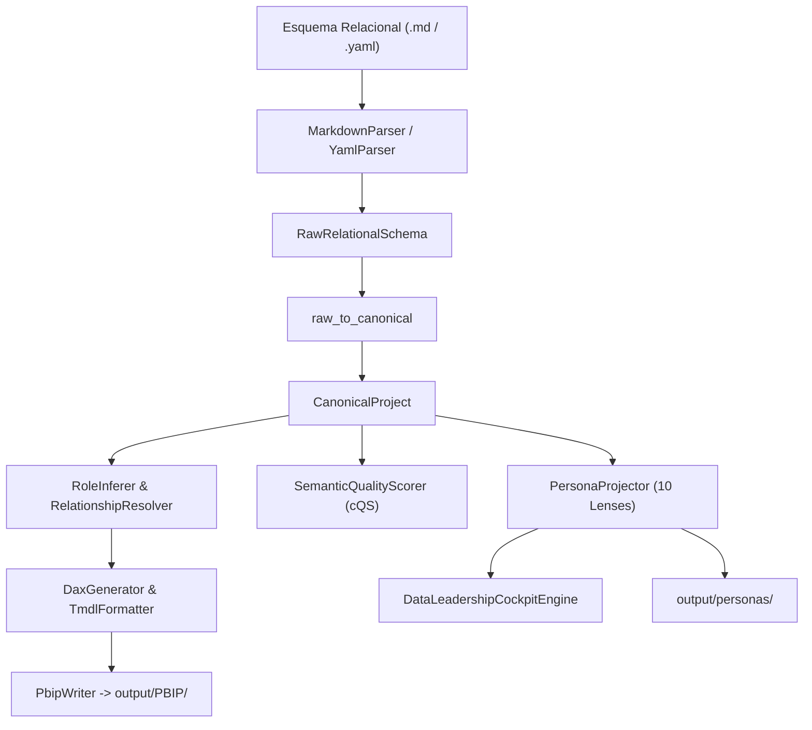

<!-- ============================================================================== -->
<!-- THINKINGSEED: ADN DEL PROYECTO (CONTEXTO PASIVO PARA MODELOS DE LENGUAJE)     -->
<!-- ============================================================================== -->
> [!NOTE]
> ### 🧬 DEFINICIÓN Y ROL DE ESTE DOCUMENTO
> 1. **¿Qué es este archivo?:** Este documento es una **Semilla de Proyecto (ThinkingSeed)**: representa el **ADN arquitectónico, técnico y estructural** del sistema. **NO es el repositorio completo de código fuente**, sino su mapa genético y memoria técnica de alta fidelidad extraída del entorno de desarrollo.
> 2. **Estado de Avance (Work in Progress):** Este documento refleja el **estado actual del desarrollo**. No garantiza que el proyecto esté 100% terminado; puede representar un proyecto en curso, un MVP o una arquitectura en expansión. Que no aparezca el código de todos los archivos es **deliberada por diseño** para optimizar la ventana de contexto.
> 3. **Modo de Operación:** Trata este documento como **contexto pasivo de referencia técnica (Ground Truth)**. No asumas que el archivo está defectuoso ni intentes reescribirlo por tu cuenta.
<!-- ============================================================================== -->

# MASTER HYBRID SEED: SemanticFlow

> **Propósito:** Snapshot técnico, verificable y portable (ADN del proyecto).
> **Instrucción al Agente Generador:** Snapshot generado bajo el estándar ThinkingSeed_MasterHybrid.md respetando las etiquetas de evidencia y la política de seguridad.

## 0. REGLAS DE GENERACIÓN (Epistemología y Seguridad)
*   **Etiquetas de Evidencia:**
    *   `[CONFIRMADO]`: Observado directamente en código/config.
    *   `[INFERIDO]`: Deducción lógica (no declarado explícitamente).
    *   `[FALTANTE]`: Esperado en una plataforma de este tipo pero ausente (refleja el avance real del proyecto).
*   **Política de Seguridad:** **PROHIBIDO** reproducir secretos, passwords, tokens o connection strings. Sustituye siempre por `<REDACTED>`.

---

## 1. CORE MANIFESTO

### 1.1 Objetivo Principal
`[CONFIRMADO]` Desarrollar un compilador semántico declarativo local de nivel empresarial que transforma esquemas relacionales tabulares (Markdown o YAML) en modelos nativos de Power BI (`.pbip` y TMDL), proyectando perspectivas organizacionales a través de 10 Persona Lenses y sintetizando un Data Leadership Cockpit C-Level.

### 1.2 Problema que Resuelve
`[CONFIRMADO]` Erradica la recreación manual propensa a fallos de modelos de datos en interfaces gráficas de BI. Garantiza control de versiones estricto en Git para modelos semánticos, automatiza la inferencia de hechos y dimensiones, genera medidas canónicas en DAX y valida la salud del modelo mediante el Semantic Quality Score ($cQS$).

### 1.3 Patrón Arquitectónico
`[CONFIRMADO]` **Compilador Modular con AST Canónico Intermedio y Proyecciones Multi-Lente**:
- Pipeline lineal desacoplado: Ingesta $\to$ Mapeo Canónico $\to$ Análisis Topológico & Calidad $\to$ Emisión Serializada.
- Aislamiento in-memory sin conexiones activas a motores SQL externos en tiempo de compilación.

### 1.4 Stack Principal
`[CONFIRMADO]`
*   **Runtime:** Python `>=3.10` (validado activamente en Python 3.12.10) `[pyproject.toml]`.
*   **Modelado y Contratos:** `pydantic>=2.5.0` (v2), `pyyaml>=6.0`.
*   **Topología y Grafos:** `networkx>=3.0` (análisis de dígrafos acíclicos y cardinalidades).
*   **Parser SQL:** `sqlglot>=20.0.0`.
*   **CLI y Consola:** `typer>=0.9.0`, `rich>=13.0.0`.
*   **Testing y Cobertura:** `pytest>=7.4.0` (71/71 tests aprobados), `pytest-cov>=4.1.0`, `Faker>=24.0.0`.
*   **Calidad de Código:** `ruff>=0.2.0`, `mypy>=1.8.0`.
*   **Target Output:** Power BI PBIP Developer Project (`.pbip`, `.pbidataset`), TMDL (Tabular Model Definition Language).

---

## 2. REPOSITORY TOPOLOGY

```
SemanticFlow/
├── .agentignore                       # Reglas de exclusión de contexto para agentes
├── .context/                          # Satélite topológico iDirectory v3.0 (tree.json)
├── 01_seed/                           # Snapshots técnicos y ADN ThinkingSeed
│   ├── .context.yaml
│   ├── seed-semanticflow-master.md    # Master exhaustivo
│   └── seed-semanticflow.md           # Snapshot Master Hybrid actual
├── 02_Foundation/                     # Especificaciones base y arquitectura de motores
│   └── Engine/
│       ├── .context.yaml
│       └── engine_readme.md
├── 03_research/                       # Espacio para experimentación y notebooks
│   ├── experiments/.context.yaml
│   ├── notebooks/.context.yaml
│   └── prompts/.context.yaml
├── artifacts/                         # Planes de ejecución y registros
│   └── plans/
├── config/                            # Configuraciones y definiciones por defecto
│   ├── .context.yaml
│   └── personas/
│       └── default_personas.yaml      # Definición declarativa de las 10 Persona Lenses
├── data/                              # Datasets locales y fixtures
├── docs/                              # Documentación, ADRs y especificaciones
│   ├── adr/
│   │   └── ADR-001-canonical-model.md
│   ├── architecture/
│   │   ├── .context.yaml
│   │   ├── esquema_relacional.md      # Esquema de referencia para pruebas y compilación
│   │   └── adr/                       # ADR-001 al ADR-006 (Arquitectura de Personas y Gobernanza)
│   ├── engineers_notes/
│   └── technical_specs/
├── logs/                              # Logs generados en ejecución
├── output/                            # Artefactos compilados (.pbip, personas, docs)
├── pyproject.toml                     # Configuración del paquete y herramientas
├── README.md                          # Documentación maestra internacional (Paper-Grade)
├── README_ES.md                       # Documentación formal en español (Paper-Grade)
├── schemas/                           # JSON Schemas para validación estricta de contratos
│   ├── .context.yaml
│   ├── persona_definition.schema.json
│   └── project_governance.schema.json
├── scripts/                           # Scripts de utilidades de ingeniería
│   ├── .context.yaml
│   └── generate_golden_files.py
├── src/                               # Código fuente principal
│   ├── __init__.py
│   ├── cli.py                         # Entry point Typer CLI
│   └── core/
│       ├── __init__.py
│       ├── ast/                       # Definiciones de AST (Raw, Semantic, Types, Canonical)
│       │   ├── canonical/models.py    # Modelo canónico agnóstico
│       │   ├── schema.py
│       │   ├── semantic.py
│       │   └── types.py
│       ├── capabilities/planner.py    # Planificador de ejecución
│       ├── docs/emitter.py            # Generador de Diccionario y Diagramas ERD
│       ├── emitter/                   # Motores TMDL y ensamblador PBIP
│       │   ├── model_emitter.py
│       │   ├── pbip_writer.py
│       │   ├── relationship_emitter.py
│       │   ├── table_emitter.py
│       │   └── tmdl_formatter.py
│       ├── engine/                    # Motor de inferencia, resolución y compilación
│       │   ├── compiler.py
│       │   ├── dax_generator.py
│       │   ├── explainer.py
│       │   ├── governance.py
│       │   ├── graph.py
│       │   ├── inference.py
│       │   ├── relationship_resolver.py
│       │   └── role_inferer.py
│       ├── mappers/                   # Transformadores entre representaciones AST
│       │   ├── canonical_to_pbi.py
│       │   └── raw_to_canonical.py
│       ├── parsers/                   # Ingestores de esquemas relacionales
│       │   ├── markdown_parser.py
│       │   └── yaml_parser.py
│       ├── personas/                  # Motor de proyección organizacional
│       │   ├── cockpit.py             # DataLeadershipCockpitEngine
│       │   ├── config_loader.py
│       │   ├── interfaces.py
│       │   ├── models.py
│       │   ├── projector.py           # PersonaProjector
│       │   ├── registry.py
│       │   ├── renderers.py           # Renderers MD, JSON, Mermaid
│       │   └── lenses/                # Implementación de las 10 Persona Lenses
│       ├── quality/                   # Motor de Calidad Semántica (cQS)
│       │   ├── rules.py
│       │   └── scorer.py
│       └── targets/powerbi/adapter.py # Adaptador de dialecto Power BI
└── tests/                             # Suite automatizada (71 tests verificados)
    ├── fixtures/enterprise_fixture.py
    ├── golden/                        # Golden files (Enterprise & Metro Santiago)
    ├── Massive Data Stress/           # Suite de estrés con generador sintético
    ├── Massive Data Stress v2/        # Suite de estrés con datos de transporte
    └── Massive Stress Test/           # Suite estrés Tiers (PYME, Mediana, Gigante)
```

### 2.1 Diferenciaciones Clave de Carpetas
`[CONFIRMADO]`
- `src/core/ast/`: Alberga los modelos Pydantic de la estructura de datos en sus tres estados: `schema.py` (bruto de entrada), `canonical/models.py` (agnóstico e intermedio) y `semantic.py` (específico para el destino analítico).
- `src/core/emitter/` vs `src/core/docs/`: `emitter/` produce artefactos de código ejecutable por Power BI (`.pbip`, `.tmdl`); `docs/` produce documentación humana (Diccionario de Datos Markdown y diagramas Mermaid).
- `src/core/personas/lenses/`: Módulos de proyección desacoplados que aplican filtros y métricas por rol sin alterar el AST canónico.

---

## 3. EXECUTION FLOW

### 3.1 Flujo E2E


### 3.2 Entry Points
`[CONFIRMADO]`
- `semanticflow compile -i <schema> -o output/PBIP`: Ingesta, infiere roles/relaciones, genera DAX y emite bundle `.pbip`.
- `semanticflow inspect -i <schema>`: Diagnostica en consola las tablas, roles inferidos y claves.
- `semanticflow explain -i <schema> --persona <role>`: Proyecta la perspectiva de una Persona Lens en consola, JSON, Markdown o Mermaid.
- `semanticflow cockpit -i <schema>`: Sintetiza el C-Level Data Leadership Cockpit con radar de madurez.
- `semanticflow personas list`: Lista las 10 Persona Lenses y sus aliases.
- `semanticflow personas export -i <schema> -o output/personas`: Materializa en disco las 10 Lenses y el Cockpit.
- `semanticflow validate -i <schema> --min-score 70.0`: Evalúa el cQS y retorna código de salida 1 si no supera el umbral.
- `semanticflow docgen -i <schema> -o output/docs`: Emite Diccionario de Datos y Diagrama ERD Mermaid.

### 3.3 Datos: Origen, Transformación y Persistencia
`[CONFIRMADO]`
- **Origen:** Archivos planos de definición de esquemas en formato Markdown (tablas con columnas, tipos, PKs y FKs) o YAML.
- **Transformación:** Normalización a tipos primitivos canónicos, resolución de aciclicidad en grafos dirigidos con NetworkX, asignación de roles dimensionales (Fact vs. Dimension).
- **Persistencia:** Archivos TMDL codificados en UTF-8 sin BOM en carpetas estructuradas y definición de proyecto `.pbip`.

---

## 4. CURRENT STATE & RULES

### 4.1 Foco Actual y Madurez
`[CONFIRMADO]`
- **Estado:** Production-Ready / Alta Madurez.
- Core del compilador 100% operativo.
- 10 Persona Lenses implementadas y validadas contra contratos JSON Schema.
- 71/71 tests automatizados pasando al 100% en 16.25 segundos.
- Documentación formal Paper-Grade (`README.md` y `README_ES.md`) y ThinkingSeed Master generados.

### 4.2 Reglas de Código y Convenciones
`[CONFIRMADO]`
- Tipado estricto con Pydantic v2 `BaseModel`.
- Linter y formateador: `ruff` (`line-length = 100`, `py310`).
- Tipado estático: `mypy` (`python_version = "3.10"`).
- Determinismo e idempotencia: Las salidas generadas deben ser idénticas ante las mismas entradas.

### 4.3 Convenciones de Directorios
`[CONFIRMADO]`
- Estructura gobernada bajo **iDirectory v3.0** con satélite `.context/tree.json` y beacons `.context.yaml`.
- Carpeta `01_seed/` reservada para snapshots ThinkingSeed.

---

## 5. ECOSYSTEM CONTEXT

`[CONFIRMADO]`
- **Consumidores Directos:** Power BI Desktop / Fabric (apertura nativa de `.pbip` y parseo de `.tmdl`).
- **Integraciones:** Sistemas CI/CD (validación headless pre-merge con `semanticflow validate`).
- **Ecosistema Local:** Gobernado por herramientas iContext / iDirectory.

---

## 6. CONFIGURATION REFERENCE

`[CONFIRMADO]`
| Variable | Tipo | Default | Efecto | Sensible |
| :--- | :--- | :--- | :--- | :--- |
| `SEMANTICFLOW_LOG_LEVEL` | String | `INFO` | Nivel de detalle del log (`DEBUG`, `INFO`, `WARNING`, `ERROR`) | No |
| `SEMANTICFLOW_CONFIG_PATH` | Path | `config/personas/default_personas.yaml` | Ruta alternativa a la configuración de Personas | No |
| `SEMANTICFLOW_RULES_PATH` | Path | `config/persona_quality_rules.json` | Ruta alternativa al archivo de reglas de calidad | No |

---

## 7. SEGURIDAD, RIESGOS Y FAILURE MODES

### 7.1 Security Findings
`[CONFIRMADO]`
- Operación 100% offline y local.
- Uso de `yaml.safe_load` para evitar ejecución arbitraria de código.
- Cero claves API o credenciales en texto plano (`<REDACTED>`).
- Clasificación de columnas sensibles y soporte PII (`is_pii: true`) auditado por las Lenses de Gobernanza y Cumplimiento.

### 7.2 Failure Modes
`[CONFIRMADO]`
- **Ciclos en Relaciones:** Detectados en `RelationshipResolver`; el compilador aísla las aristas redundantes y emite diagnósticos sin provocar caídas irrecuperables.
- **Sintaxis de Entrada Inválida:** Capturada por los parsers con indicación de fila y columna problemática.
- **Fallo en Umbral de Calidad:** Si el $cQS$ es inferior al umbral mínimo exigido, el comando `validate` retorna código de salida 1 para bloquear pipelines de integración continua.

### 7.3 Riesgos Técnicos y Deuda Técnica
- `[DECLARADO]` Adaptadores a dialectos analíticos adicionales (Looker LookML, dbt Semantic Layer) previstos conceptualmente pero pendientes de implementación.
- `[FALTANTE]` Pipeline automatizado de GitHub Actions (`.github/workflows/ci.yml`).

---

## 8. TESTING STRATEGY

`[CONFIRMADO]`
- **Pruebas Unitarias e Integración:** 71 tests ejecutados con `pytest` que validan AST Canónico, mappers, parsers, emisores TMDL, contratos JSON Schema de las 10 Personas y el Leadership Cockpit.
- **Golden Regression Tests:** Verificación de estabilidad byte-a-byte contra modelos de referencia (Metro Santiago y Enterprise).
- **Suites de Estrés:** Tiers 1 (PYME), 2 (Mediana) y 3 (Gigante), además de generadores sintéticos con `Faker`.

---

## 9. CONTEXT HANDOFF & PROTOCOLO DE ASISTENCIA (Para el Modelo Receptor)

> **Orientación para el modelo de IA lector:**
> "Este documento es una semilla técnica: el ADN del proyecto y no su repositorio completo. Refleja la arquitectura y el avance real hasta la fecha. Como modelo receptor, utiliza esta semilla como memoria de trabajo para:
> 1. **Responder preguntas** sobre la arquitectura, funcionamiento, dependencias y flujos del sistema.
> 2. **Sugerir mejoras o asistencia técnica** basadas en el estado actual y áreas pendientes identificadas.
> 3. **Generar código o soluciones compatibles** respetando las rutas, convenciones y patrones definidos aquí, cuando el usuario te lo solicite."

### Directrices de interacción para la IA receptora:
1. **Entender:** Identificar el objetivo y los componentes afectados antes de proponer código.
2. **Validar:** Si falta información crítica, preguntar puntualmente en vez de alucinar.
3. **Citar Rutas:** Usar las rutas de archivo declaradas en la topología al sugerir modificaciones.
4. **Respetar:** Mantener el stack, contratos y restricciones de seguridad.
5. **Acuse de Recibo Inicial:** Si el usuario adjuntó esta semilla sin una pregunta concreta, responde en máximo 3 líneas resumiendo el nombre del proyecto, stack y objetivo, confirmando que has asimilado el ADN del proyecto y quedando a la espera de sus consultas o tareas.
