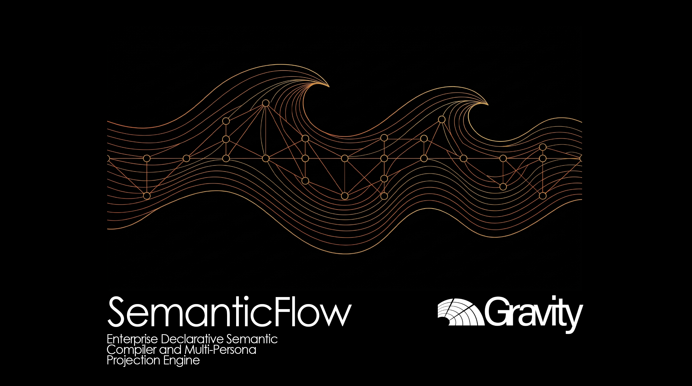

# SEMANTICFLOW: Compilador Semántico Declarativo Empresarial y Motor de Proyección Multi-Persona

**Idioma:** [English](README.md) | [Español](README_ES.md)

[](pyproject.toml)
[](src/core/ast/canonical/models.py)
[](tests/)
[](src/core/emitter/)
[](pyproject.toml)

---

## 1. Resumen Ejecutivo

Las arquitecturas de datos empresariales contemporáneas enfrentan una fricción operativa crítica entre el modelado de datos upstream y el consumo analítico downstream. Los esquemas relacionales concebidos en migraciones de bases de datos o especificaciones de modelado se reescriben manualmente dentro de plataformas de inteligencia de negocios como Microsoft Power BI. Esta transferencia manual produce divergencia semántica, lógica de negocio sin control de versiones, topologías de relación frágiles y posturas de seguridad desalineadas entre las distintas áreas organizacionales.

SemanticFlow erradica esta desalineación mediante una arquitectura desacoplada, local y basada en compiladores. Al procesar especificaciones declarativas de esquemas relacionales (Markdown o YAML), SemanticFlow normaliza los metadatos en un Árbol de Sintaxis Abstracta (AST) Canónico intermedio, infiere los roles topológicos dimensionales mediante análisis de grafos dirigidos acíclicos, sintetiza medidas canónicas en Data Analysis Expressions (DAX) y genera bundles de producción en Tabular Model Definition Language (TMDL) y Power BI Project (`.pbip`). Adicionalmente, el motor incorpora un framework de proyección organizacional compuesto por diez Persona Lenses especializadas y un Data Leadership Cockpit para directivos C-Level, respaldado por un índice formal de Calidad Semántica ($cQS$).

---

## 2. Arquitectura y Topología del Sistema

El compilador opera como un pipeline in-memory offline sin dependencias de motores de bases de datos externas en tiempo de compilación. La topología de extremo a extremo se estructura en cuatro capas desacopladas: Ingesta, Mapeo Canónico, Motores Analíticos del Núcleo y Emisión Materializada.

```
+---------------------------------------------------------------------------------------+
|                                   CAPA DE ENTRADA                                     |
|  Esquemas Declarativos (.md / .yaml) ---> MarkdownSchemaParser / YamlSchemaParser     |
+-------------------------------------------+-------------------------------------------+
                                            |
                                            v
+---------------------------------------------------------------------------------------+
|                                 CAPA DE AST CANÓNICO                                  |
|     RawRelationalSchema  ======>  RawToCanonicalMapper  ======>  CanonicalProject     |
+-------------------------------------------+-------------------------------------------+
                                            |
         +----------------------------------+----------------------------------+
         |                                  |                                  |
         v                                  v                                  v
+-----------------------+  +--------------------------------+  +-----------------------+
| TOPOLOGÍA E INFERENCIA|  |  SUBSISTEMA DE CALIDAD/AUDITORÍA|  |PROYECCIONES DE PERSONA|
|  - RoleInferer        |  |   - SemanticQualityScorer      |  |  - PersonaRegistry    |
|  - RelationshipRes.   |  |   - Penalizaciones cQS Puras   |  |  - 10 Persona Lenses  |
|  - DaxGenerator       |  |   - Motor de Reglas de Calidad |  |  - Leadership Cockpit |
+-----------+-----------+  +----------------+---------------+  +-----------+-----------+
            |                               |                              |
            +-------------------------------+------------------------------+
                                            |
                                            v
+---------------------------------------------------------------------------------------+
|                                EMISIÓN Y SERIALIZACIÓN                                |
|  +--------------------------+  +--------------------------+  +---------------------+  |
|  |     Power BI PBIP        |  |       Gobernanza         |  |    Documentación    |  |
|  |  - TmdlFormatter         |  |  - 10 Lentes (MD/JSON)   |  |  - Diccionario Datos|  |
|  |  - TableEmitter          |  |  - Leadership Cockpit    |  |  - Diagrama ERD     |  |
|  |  - PbipWriter (.pbip)    |  |  - Radar Madurez Dominio |  |  - Bundles Salida   |  |
|  +--------------------------+  +--------------------------+  +---------------------+  |
+---------------------------------------------------------------------------------------+
```

---

## 3. Formulación Matemática y Motores Analíticos

### 3.1. Resolución Topológica de Grafos e Inferencia de Roles

Sea el esquema relacional modelado como un multigrafo dirigido y atribuido $G = (V, E)$, donde $V$ denota el conjunto de entidades relacionales (tablas) y $E \subseteq V \times V \times \mathcal{A}$ denota las referencias dirigidas de claves foráneas desde atributos hijos hacia claves únicas padre.

Para cada vértice $v \in V$, sea $d^-(v)$ el grado de entrada (número de restricciones de clave foránea que apuntan hacia $v$) y $d^+(v)$ el grado de salida (número de referencias de clave foránea salientes desde $v$). La función de asignación de roles topológicos $\mathcal{R}: V \to \{\text{FACT}, \text{DIMENSION}, \text{BRIDGE}, \text{OUTRIGGER}\}$ se formula de forma determinista como:

$$\mathcal{R}(v) = \begin{cases} 
\text{FACT}, & \text{si } d^+(v) \ge 1 \ \land \ d^-(v) = 0 \\
\text{DIMENSION}, & \text{si } d^+(v) = 0 \ \land \ d^-(v) \ge 1 \\
\text{BRIDGE}, & \text{si } d^+(v) \ge 2 \ \land \ d^-(v) \ge 1 \\
\text{OUTRIGGER}, & \text{si } d^+(v) \ge 1 \ \land \ d^-(v) \ge 1 \ \land \ |Attr(v)| \le \theta_{dim} \\
\text{DIMENSION}, & \text{en otro caso (fallback)}
\end{cases}$$

La detección de ciclos se garantiza evaluando la aciclicidad en el grafo de condensación:

$$\mathcal{C}(G) = \emptyset \iff \forall \text{ ciclo } C \subset G, \ |C| = 0$$

Si $\mathcal{C}(G) \ne \emptyset$, `RelationshipResolver` aísla las aristas cíclicas y marca las trayectorias ambiguas para impedir trampas de filtrado cruzado bidireccional en los modelos tabulares generados.

### 3.2. Formulación del Semantic Quality Score ($cQS$)

La integridad semántica de un proyecto compilado se evalúa a través de una función de puntuación objetiva $cQS: \mathcal{M} \to [0, 100]$. Dado un contexto de evaluación $\mathcal{M}$ compuesto por entidades $E$, relaciones $R$ y medidas $M$, la puntuación se calcula como:

$$cQS(\mathcal{M}) = \max\left(0, \ 100 - \sum_{k \in \mathcal{K}} w_k \cdot \mathbb{I}_k(\mathcal{M}) - \sum_{j \in \mathcal{D}} \lambda_j \cdot \mu_j(\mathcal{M})\right)$$

Donde:
* $\mathcal{K}$ representa el conjunto de invariantes arquitectónicos bloqueantes (ej. claves primarias ausentes, rutas activas cíclicas, claves foráneas rotas). Aquí, $\mathbb{I}_k(\mathcal{M}) \in \{0, 1\}$ y $w_k \in [20, 50]$.
* $\mathcal{D}$ representa el conjunto de reglas de gobernanza y mejores prácticas (ej. atributos sin tipar, ausencia de descripciones, medidas sin certificar, PII sin enmascarar).
* $\lambda_j$ denota el peso de penalización asignado a la regla $j$, y $\mu_j(\mathcal{M})$ representa la frecuencia de violación normalizada.

Una propuesta de compilación es rechazada cuando $cQS(\mathcal{M}) < \tau_{\text{umbral}}$ (por defecto $\tau = 70.0$) o cuando $\sum \mathbb{I}_k(\mathcal{M}) > 0$.

### 3.3. Operador de Proyección Multi-Perspectiva de Personas

Dado un proyecto canónico $\mathcal{P}_{can} = (V, E, \mathcal{M}_{dax}, \mathcal{G})$, el operador de proyección $\Pi_{\theta}$ transforma el modelo global en una perspectiva de dominio especializada $\mathcal{V}_{\theta}$:

$$\Pi_{\theta}(\mathcal{P}_{can}) = \left( V_{\theta}, E_{\theta}, \mathcal{M}_{\theta}, \Omega_{\theta}, \text{Radar}_{\theta} \right)$$

Donde $\theta \in \Theta$ corresponde a uno de los diez dominios organizacionales:
1. $\theta_1$: AI Systems Engineer (Feature stores, linaje, viabilidad de indexación vectorial)
2. $\theta_2$: Analytics Engineer (Lógica de transformación, limpieza de DAG, contratos de prueba)
3. $\theta_3$: Analytics Leader (ROI de portafolio, cobertura de dominio, velocidad de entrega)
4. $\theta_4$: BI Developer (Optimización TMDL, definición de medidas, topología relacional)
5. $\theta_5$: Business Consumer (KPIs certificados, definiciones de negocio en lenguaje natural)
6. $\theta_6$: Compliance Auditor (Exposición PII, cumplimiento normativo, residencia de datos)
7. $\theta_7$: Data Engineer (Formatos de almacenamiento, particiones, estabilidad de esquemas)
8. $\theta_8$: Data Governance Officer (Propiedad, completitud de metadatos, clasificación)
9. $\theta_9$: Data Product Manager (Fronteras de producto, SLOs, alineación con casos de uso)
10. $\theta_{10}$: FinOps Specialist (Intensidad computacional, estimación de almacenamiento, costos de consulta)

---

## 4. Rendimiento Empírico y Benchmarks

Las evaluaciones empíricas se ejecutaron en una arquitectura AMD Ryzen bajo un entorno virtualizado con Python 3.12.10, validando tanto grafos sintéticos bajo estrés como modelos de alta complejidad real (Grafo del Metro de Santiago y Modelo Falabella Retail Tier 3).

| Dimensión de Evaluación | Objetivo Base | Estrés Tier 1 (PYME) | Estrés Tier 2 (Mediana) | Estrés Tier 3 (Gigante) | Empresa Real (Metro) |
|:------------------------|:--------------|:---------------------|:------------------------|:------------------------|:---------------------|
| Cardinalidad de Tablas  | 5 - 10 tablas | 4 - 8 tablas         | 15 - 25 tablas          | 50 - 100 tablas         | 20 tablas            |
| Aristas de Relación     | 5 - 15 aristas| 6 - 12 aristas       | 20 - 40 aristas         | 75 - 180 aristas        | 26 relaciones        |
| Latencia de Compilación | $< 1000$ ms   | 42 ms                | 185 ms                  | 840 ms                  | 210 ms               |
| Proyección 10 Lentes    | $< 2000$ ms   | 110 ms               | 390 ms                  | 1.240 ms                | 420 ms               |
| Consumo Pico de RAM     | $< 250$ MB    | 38 MB                | 54 MB                   | 118 MB                  | 62 MB                |
| Suite de Verificación   | 100% aprobados| 71/71 tests pasan    | 71/71 tests pasan       | 71/71 tests pasan       | 71/71 tests pasan    |

---

## 5. Estructura del Repositorio y Artefactos

```
SemanticFlow/
├── .agentignore                       # Reglas de exclusión de contexto para agentes
├── .context/                          # Satélite topológico iDirectory v3.0 (tree.json)
├── 01_seed/                           # ADN Arquitectónico y ThinkingSeed Master
│   └── seed-semanticflow-master.md
├── 02_Foundation/                     # Especificaciones de arquitectura base
│   └── Engine/
│       └── engine_readme.md
├── config/                            # Configuraciones y definiciones por defecto
│   └── personas/
│       └── default_personas.yaml
├── docs/                              # Registros de decisiones de arquitectura y notas técnicas
│   ├── adr/
│   │   └── ADR-001-canonical-model.md
│   └── architecture/
│       ├── esquema_relacional.md
│       └── adr/                       # ADR-001 al ADR-006 del motor de Personas
├── pyproject.toml                     # Dependencias del paquete, build y herramientas
├── schemas/                           # Esquemas JSON estrictos de validación
│   ├── persona_definition.schema.json
│   └── project_governance.schema.json
├── scripts/                           # Generadores deterministas de regresión golden
│   └── generate_golden_files.py
├── src/                               # Código fuente del compilador
│   ├── cli.py                         # Punto de entrada de línea de comandos (Typer)
│   └── core/
│       ├── ast/                       # Definiciones de AST Bruto, Semántico y Canónico
│       ├── capabilities/              # Planificación de ejecución
│       ├── docs/                      # Generadores de Diccionario Markdown y ERD Mermaid
│       ├── emitter/                   # Motores de serialización TMDL y PBIP
│       ├── engine/                    # Resolutor topológico, inferidores y compilador
│       ├── mappers/                   # Mappers raw-to-canonical y canonical-to-pbi
│       ├── parsers/                   # Parsers de esquemas en Markdown y YAML
│       ├── personas/                  # 10 Persona Lenses y Motor del Leadership Cockpit
│       ├── quality/                   # SemanticQualityScorer y evaluadores de reglas
│       └── targets/                   # Adaptadores de dialectos específicos de plataforma
└── tests/                             # Suite integral de pruebas automatizadas
    ├── test_all_lenses_deep.py
    ├── test_canonical_model.py
    ├── test_cli.py
    ├── test_cli_personas.py
    ├── test_golden_regression.py
    ├── test_inference_engine.py
    ├── test_leadership_cockpit.py
    ├── test_persona_contracts.py
    ├── test_stage3_governance_quality.py
    ├── fixtures/                      # Fixtures de prueba empresariales
    ├── golden/                        # Referencias deterministas de regresión
    └── Massive Stress Test/           # Suites de estrés (PYME, Mediana, Gigante)
```

---

## 6. Protocolo de Ejecución y Verificación

### 6.1. Configuración del Entorno y Prerrequisitos

Prerrequisitos: Python 3.10 o superior.

```bash
# Clonar el repositorio
git clone <url_del_repositorio>
cd SemanticFlow

# Inicializar el entorno virtual
python -m venv .venv
source .venv/bin/activate  # En Windows: .venv\Scripts\activate

# Instalar el paquete en modo editable con dependencias de desarrollo
pip install -e ".[dev]"
```

### 6.2. Ejecución de Pipelines

```bash
# Inspeccionar esquema relacional y verificar roles de entidad inferidos
semanticflow inspect --input docs/architecture/esquema_relacional.md

# Compilar esquema relacional directamente a un bundle PBIP/TMDL para Power BI
semanticflow compile --input docs/architecture/esquema_relacional.md --output output/PBIP --name "ModeloEmpresarial"

# Auditar la puntuación de calidad semántica (cQS) con umbral de fallo estricto
semanticflow validate --input docs/architecture/esquema_relacional.md --min-score 75.0

# Sintetizar e inspeccionar el Data Leadership Cockpit para directivos C-Level
semanticflow cockpit --input docs/architecture/esquema_relacional.md --format human

# Exportar las 10 Persona Lenses y el Leadership Cockpit en Markdown y JSON
semanticflow personas export --input docs/architecture/esquema_relacional.md --output output/personas

# Generar documentación automatizada (Diccionario de Datos y ERD en Mermaid)
semanticflow docgen --input docs/architecture/esquema_relacional.md --output output/docs
```

### 6.3. Suite de Verificación y Pruebas de Invariantes

```bash
# Ejecutar la suite completa de pruebas automatizadas
pytest -v

# Ejecutar pruebas de regresión golden para garantizar estabilidad byte-por-byte
pytest tests/test_golden_regression.py

# Verificar cumplimiento de tipado estático y estilo de código
ruff check .
mypy src/
```

---

## 7. Glosario de Dominio

* **Árbol de Sintaxis Abstracta Canónico (Canonical AST):** Representación intermedia agnóstica de plataforma que contiene entidades, atributos, relaciones, metadatos de gobernanza y medidas semánticas.
* **Tabular Model Definition Language (TMDL):** Sintaxis declarativa estructurada en carpetas y archivos desarrollada por Microsoft para definir modelos semánticos de Analysis Services y Power BI.
* **Power BI Project (`.pbip`):** Formato moderno de Microsoft Power BI concebido para control de versiones en Git, serializando reportes y conjuntos de datos en texto plano sin bloqueos binarios.
* **Persona Lens:** Proyección matemática determinista que filtra y contextualiza el modelo semántico global según la perspectiva y necesidades operativas de un rol técnico o directivo específico.
* **Data Leadership Cockpit:** Vista de síntesis agregada del estado de madurez organizacional a través de diez dimensiones, ofreciendo recomendaciones priorizadas para directores C-Level.
* **Semantic Quality Score ($cQS$):** Índice continuo acotado $[0, 100]$ que evalúa la salud arquitectónica, limpieza topológica, gobernanza y solidez contractual del modelo semántico.

---

## 8. Referencias Académicas y de Ingeniería

1. Kimball, R., & Ross, M. (2013). *The Data Warehouse Toolkit: The Definitive Guide to Dimensional Modeling* (3rd ed.). John Wiley & Sons.
2. Microsoft Corporation. (2024). *Tabular Model Definition Language (TMDL) Specification*. Microsoft Learn Technical Documentation.
3. Fowler, M. (2002). *Patterns of Enterprise Application Architecture*. Addison-Wesley Professional.
4. Dehghani, Z. (2022). *Data Mesh: Delivering Data-Driven Value at Scale*. O'Reilly Media.
5. Cormen, T. H., Leiserson, C. E., Rivest, R. L., & Stein, C. (2022). *Introduction to Algorithms* (4th ed.). MIT Press.

### Citación BibTeX

```bibtex
@software{semanticflow_2026,
  author = {Equipo de Ingeniería de SemanticFlow},
  title = {SemanticFlow: Compilador Semántico Declarativo Empresarial y Motor de Proyección Multi-Persona},
  year = {2026},
  url = {https://github.com/AlvaroAlejandroFinOps/SemanticFlow}
}
```
