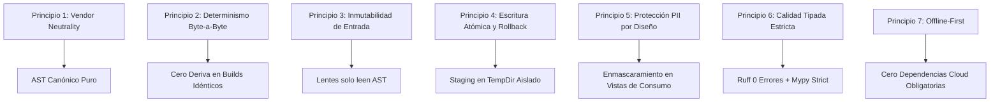
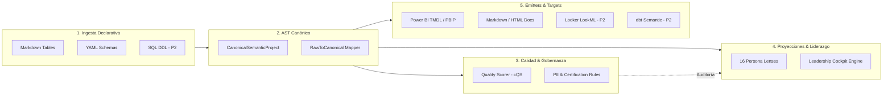
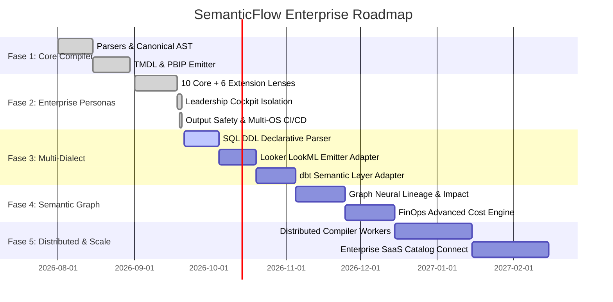

# SEMANTICFLOW: PLAN MAESTRO DEFINITIVO Y ROADMAP DE EVOLUCIÓN ENTERPRISE

**Documento:** Plan Maestro Definitivo (Single Source of Truth)  
**Versión del Plan:** `2.0-ENTERPRISE-UNIFIED`  
**Fecha de Emisión:** 2026-09-20  
**Estado:** **ACTIVO Y EN EJECUCIÓN** (Fases 1 y 2 / Bloques P0 y P1 Completados al 100%)  
**Repositorio:** `SemanticFlow` (`d:/0001 HyperScale Thinking/PROYECTOS CLOUD/Data & AI Strategy/SemanticFlow`)  
**Pipeline Status:** [](https://github.com/AlvaroAlejandroFinOps/SemanticFlow/actions) `80/80 Tests PASS` | `Coverage: 87.0%` | `Ruff: 0 errors` | `Mypy: 0 errors`

---

## 1. PROPÓSITO Y ALCANCE DEL PLAN MAESTRO

Este documento constituye la **única fuente de verdad (Single Source of Truth)** para la arquitectura, gobernanza, desarrollo y evolución de **SemanticFlow**. 

Consolida y unifica formalmente:
1. El **Plan Maestro Enterprise de Compilación** (Ingesta declarativa -> AST Canónico -> Reglas de Gobernanza -> Planificador de Capacidades -> Emitters).
2. La especificación completa del **Persona Lens Framework** (10 Core Canonical Personas + 6 Specialized Extensions).
3. La arquitectura física desacoplada del **Data Leadership Cockpit** (`src/core/leadership/`).
4. Los resultados de la **Auditoría Global de Estado** y la remediación verificada de los bloques de alta prioridad (**P0 y P1**).
5. La secuencia de trabajo para las siguientes fases (**P2 y P3**).

---

## 2. PRINCIPIOS ARQUITECTÓNICOS E INVARIANTES INVIOLABLES

Cualquier contribución o evolución del código fuente debe respetar estrictamente los siguientes 7 principios inviolables:



1. **Neutralidad de Proveedor (Vendor Neutrality)**: El AST Semántico Canónico (`src/core/ast/canonical/`) no debe contener lógica propietaria de ningún motor analítico específico (sin DAX, LookML ni SQLX incrustado en el núcleo).
2. **Determinismo Estricto (Byte-for-Byte Reproducibility)**: Dos compilaciones sobre el mismo esquema de entrada deben generar artefactos idénticos bit a bit. Se prohíben timestamps dinámicos en los golden tests sin normalización.
3. **Inmutabilidad y No-Mutación de Estado**: Los lentes de persona y el Leadership Cockpit son proyecciones puras de solo lectura sobre `CanonicalSemanticProject`.
4. **Escritura Atómica y Protección de Raíz**: Ningún generador o emitter puede escribir directamente sobre el destino final sin pasar por staging temporal (`tempfile.TemporaryDirectory`). Se prohíbe la escritura en directorios raíz del sistema (`/`, `C:\`, `D:\`).
5. **Privacidad y Protección PII**: Los atributos clasificados como `is_pii: true` o con tags de privacidad se enmascaran automáticamente en lentes analíticos y de consumo operativo.
6. **Cero Tolerancia a Deuda Técnica**: Todo código debe pasar `ruff check .` con 0 errores y `mypy src/` con 0 errores antes de fusionarse.
7. **Filosofía Offline-First**: El compilador debe operar 100% de forma local en entornos aislados o air-gapped sin depender de conexión a servicios SaaS o nube.

---

## 3. ARQUITECTURA DEL COMPILADOR EN 5 CAPAS

El pipeline de ejecución desacoplado de SemanticFlow opera a través de 5 capas secuenciales y puras:



---

## 4. CATÁLOGO COMPLETO DE 16 PERSONA LENSES

SemanticFlow cuenta con 16 lentes de persona especializados (10 Core Canónicos obligatorios + 6 Extensiones registrables) implementados y testeados al 100%:

| # | Persona Role | Identificador | Profundidad Técnica | Foco Principal | RACI Designación | Estado |
|---|---|---|---|---|---|---|
| **1** | `DATA_ANALYST` | `data_analyst` | `SUMMARY` | Consumo Self-Service, KPIs de Dominio | `RESPONSIBLE` | ✅ **Completado** |
| **2** | `ANALYTICS_ENGINEER` | `analytics_engineer` | `TECHNICAL` | Modelado Dimensional, Star Schemas, Grano | `RESPONSIBLE` | ✅ **Completado** |
| **3** | `DATA_ENGINEER` | `data_engineer` | `TECHNICAL` | Pipeline Health, Integridad de Ingesta, Particiones | `RESPONSIBLE` | ✅ **Completado** |
| **4** | `DATA_SCIENTIST` | `data_scientist` | `TECHNICAL` | Features Analíticas, Distribuciones, Entrenamiento ML | `RESPONSIBLE` | ✅ **Completado** |
| **5** | `BI_DEVELOPER` | `bi_developer` | `TECHNICAL` | Métricas TMDL/DAX, Folders, Relaciones Visuales | `RESPONSIBLE` | ✅ **Completado** |
| **6** | `DATA_ARCHITECT` | `data_architect` | `EXHAUSTIVE` | Topología de Entidades, Conformidad de Dominio | `ACCOUNTABLE` | ✅ **Completado** |
| **7** | `DATA_GOVERNANCE_OFFICER` | `data_governance_officer` | `SUMMARY` | Propiedad de Activos, PII, Certificación | `ACCOUNTABLE` | ✅ **Completado** |
| **8** | `PLATFORM_ENGINEER` | `platform_engineer` | `TECHNICAL` | Capacidad de Cómputo, Storage VertiPaq / DirectLake | `RESPONSIBLE` | ✅ **Completado** |
| **9** | `DOMAIN_OWNER` | `domain_owner` | `SUMMARY` | Productos de Datos, Alineación Estratégica | `ACCOUNTABLE` | ✅ **Completado** |
| **10** | `AUDIT_RISK` | `audit_risk` | `EXHAUSTIVE` | Trazabilidad Regulatoria, Auditoría SOX/GDPR | `ACCOUNTABLE` | ✅ **Completado** |
| **11** | `AI_SYSTEMS_ENGINEER` | `ai_systems_engineer` | `TECHNICAL` | Feature Store Lineage, Embeddings, AI Latency | `RESPONSIBLE` | ✅ **Completado** |
| **12** | `ANALYTICS_LEADER` | `analytics_leader` | `EXECUTIVE` | Portafolio Ejecutivo, Madurez por Dominio | `ACCOUNTABLE` | ✅ **Completado** |
| **13** | `BUSINESS_CONSUMER` | `business_consumer` | `EXECUTIVE` | Glosario de Términos, Navegación Intuitiva | `INFORMED` | ✅ **Completado** |
| **14** | `DATA_PRODUCT_MANAGER` | `data_product_manager` | `SUMMARY` | Contratos de Adopción, SLAs de Producto | `ACCOUNTABLE` | ✅ **Completado** |
| **15** | `COMPLIANCE_AUDITOR` | `compliance_auditor` | `EXHAUSTIVE` | Registro de Acceso, Auditoría Legal, PII | `ACCOUNTABLE` | ✅ **Completado** |
| **16** | `FINOPS_SPECIALIST` | `finops_specialist` | `SUMMARY` | Eficiencia de Consultas, Costos de Nube | `RESPONSIBLE` | ✅ **Completado** |

---

## 5. DATA LEADERSHIP COCKPIT (ARQUITECTURA FÍSICA DESACOPLADA)

El paquete `src/core/leadership/` sintetiza los 8 vectores críticos de telemetría sin acoplamiento a los lentes:

1. **`portfolio.py`**: Inventario de entidades, estado de certificación (Draft/Certified/Deprecated) y criticidad del producto de datos.
2. **`health.py`**: Métricas de salud estructural del grafo semántico, cobertura de descripciones y conectividad relacional.
3. **`ownership.py`**: Distribución de responsabilidad por dominio (Accountable/Responsible) y cobertura de administradores de datos (Stewards).
4. **`capability_gaps.py`**: Análisis de compatibilidad frente a perfiles de destino (`powerbi`, `looker`, `qlik`, `dbt_semantic_layer`).
5. **`team_dependencies.py`**: Matriz de handoffs y acuerdos de nivel de servicio (SLAs) entre personas.
6. **`delivery_flow.py`**: Identificación de cuellos de botella en la entrega de modelos y métricas.
7. **`value_indicators.py`**: Índice de adopción y KPIs de negocio monetizables.
8. **`risk.py`**: Detección de atributos PII desprotegidos, rotura de claves y violaciones de linaje.
9. **`engine.py`**: Orquestador principal que exporta a formato Markdown ejecutivo (`data_leadership_cockpit.md`) y JSON estructurado (`data_leadership_cockpit.json`).

---

## 6. ROADMAP DE EVOLUCIÓN EN 5 FASES



### ✅ Fase 1: Núcleo del Compilador y Backend Power BI (COMPLETADO)
- Ingesta de Markdown y YAML a AST relacional.
- Inferencia de roles (Hechos vs. Dimensiones) y relaciones 1:N.
- Generador de medidas DAX básicas y conector TMDL / PBIP.
- Suite de Massive Stress Testing con esquemas de hasta 100+ entidades.

### ✅ Fase 2: Persona Lenses, Leadership Cockpit y Endurecimiento CI/CD (COMPLETADO)
- Implementación y pruebas profundas de las 16 Persona Lenses.
- Extracción modular y desacople físico de `src/core/leadership/`.
- Protección contra Path Traversal, escrituras atómicas en staging y enmascaramiento de PII.
- Pipeline GitHub Actions CI/CD multi-OS (Linux, Windows, macOS) y multi-Python (3.10-3.12).
- Suite de Gobernanza Open Source (Apache 2.0, Contributing, Security, Code of Conduct, Changelog).
- 80/80 pruebas unitarias/integración en verde con 87% de cobertura.

### ⏳ Fase 3: Ingesta SQL DDL Declarativa y Adaptadores Multi-Dialect (SIGUIENTE PASO - P2)
1. **`SqlDdlParser`**: Ingesta directa de scripts `CREATE TABLE` / `ALTER TABLE` estándar (PostgreSQL, Snowflake, BigQuery, T-SQL).
2. **Looker LookML Emitter**: Adaptador de compilación para generar vistas `.view.lkml` y modelos `.model.lkml` desde el AST canónico.
3. **dbt Semantic Layer Emitter**: Adaptador para generar `semantic_models.yml` y `metrics.yml` conformes con MetricFlow.

### ⏳ Fase 4: Motor de Grafo Semántico, Linaje DAG y Telemetría FinOps Avanzada (P2)
1. **Motor de Linaje a Nivel de Atributo**: Trazabilidad DAG desde columna fuente física hasta métrica de negocio compilada.
2. **Optimizador de Consultas FinOps**: Estimación estática de costos de escaneo de almacenamiento y recomendaciones de compresión VertiPaq.
3. **Generador de Vistas Mermaid Interactivas**: Visualización HTML/SVG del grafo relacional navegable por persona.

### ⏳ Fase 5: Compilación Distribuida y Conectores Enterprise (P3)
1. **Compilación en Paralelo de Proyectos Multi-Modelo**: Ejecución concurrente para repositorios con decenas de data products.
2. **Conectores de Catálogos Corporativos**: Extracción automatizada de metadatos desde Microsoft Purview, Alation y Google Dataplex.
3. **CLI Plugin Marketplace**: Arquitectura de plugins dinámicos para emitters de terceros.

---

## 7. BACKLOG DE REMEDIACIÓN Y EVOLUCIÓN DETALLADO

| Código | Prioridad | Módulo / Tarea | Archivos Clave | Estado |
|---|---|---|---|---|
| **P0-01** | **P0** | Suite de Seguridad de Salida y Path Traversal | `tests/test_output_safety.py` | ✅ **COMPLETADO** |
| **P0-02** | **P0** | Pipeline Automatizado GitHub Actions CI/CD | `.github/workflows/ci.yml` | ✅ **COMPLETADO** |
| **P0-03** | **P0** | Escritura Atómica y Staging Temporal en PBIP | `src/core/emitter/pbip_writer.py` | ✅ **COMPLETADO** |
| **P1-01** | **P1** | Aislamiento Físico de `src/core/leadership/` | `src/core/leadership/*.py` | ✅ **COMPLETADO** |
| **P1-02** | **P1** | 10 Core Canonical Personas + 6 Extensiones | `src/core/personas/lenses/*.py` | ✅ **COMPLETADO** |
| **P1-03** | **P1** | Eliminación de Código Muerto | `src/core/engine/inference.py` | ✅ **COMPLETADO** |
| **P1-04** | **P1** | Tooling en `.venv` (Ruff 0 err / Mypy 0 err) | `.venv`, `pyproject.toml` | ✅ **COMPLETADO** |
| **P1-05** | **P1** | Gobernanza Open Source (Apache 2.0, Docs) | `LICENSE`, `CONTRIBUTING.md`, etc. | ✅ **COMPLETADO** |
| **P2-01** | **P2** | Ingesta Declarativa de SQL DDL | `src/core/parsers/sql_parser.py` | ⏳ **PENDIENTE** |
| **P2-02** | **P2** | Adaptador de Emisión Looker LookML | `src/core/targets/looker/` | ⏳ **PENDIENTE** |
| **P2-03** | **P2** | Adaptador dbt Semantic Layer (MetricFlow) | `src/core/targets/dbt/` | ⏳ **PENDIENTE** |
| **P2-04** | **P2** | Motor de Linaje DAG de Atributos | `src/core/engine/lineage.py` | ⏳ **PENDIENTE** |
| **P3-01** | **P3** | Compilación Concurrente Multi-Modelo | `src/core/engine/parallel.py` | ⏳ **BACKLOG** |
| **P3-02** | **P3** | Integración con Microsoft Purview / Alation | `src/integrations/` | ⏳ **BACKLOG** |

---

## 8. PROTOCOLO DE VALIDACIÓN Y COMANDOS DE EJECUCIÓN

Para verificar la integridad absoluta de la plataforma en cualquier momento:

```bash
# 1. Verificación de estilo y formateo
.venv/Scripts/ruff check .

# 2. Verificación estricta de tipos estáticos
.venv/Scripts/mypy src/

# 3. Suite completa de 80 pruebas y reporte de cobertura branch
.venv/Scripts/pytest -v --cov=src --cov-branch --cov-report=term-missing

# 4. Verificación de determinismo de Golden Files (Zero Drift)
.venv/Scripts/pytest -v tests/test_golden_regression.py

# 5. Generación de exportación CLI de todas las personas y cockpit
.venv/Scripts/python -m src.cli personas export -i docs/architecture/esquema_relacional.md -o output/verified_cockpit
```

---

## 9. HISTÓRICO Y TRAZABILIDAD DOCUMENTAL

Los planes históricos y documentos preliminares se encuentran archivados en:
- `artifacts/plans/archive/` (Planes exploratorios preliminares)
- `artifacts/plans/active/semanticflow-global-audit/` (Informe de auditoría de 13 entregables con matriz de evidencia y checklist de 50 ítems).
