# SemanticFlow: Persona Lens Framework & Data Leadership Cockpit — Implementation Plan

## Source Document
[SemanticFlow_Persona_Lens_Leadership_Cockpit_Master_Plan.txt](file:///d:/0001%20HyperScale%20Thinking/PROYECTOS%20CLOUD/Data%20&%20AI%20Strategy/SemanticFlow/output/Planes/Vigentes/SemanticFlow_Persona_Lens_Leadership_Cockpit_Master_Plan.txt)

---

## 1. Repository State Observed

### Baseline Test Suite — 25/25 PASS ✅
```
tests/test_canonical_model.py ........................... 3 tests
tests/test_cli.py ...................................... 2 tests
tests/test_inference_engine.py ......................... 1 test
tests/test_markdown_parser.py .......................... 1 test
tests/test_stage3_governance_quality.py ................ 3 tests
tests/test_stage4_hardening_personas.py ................ 3 tests
tests/test_tmdl_emitter.py ............................. 1 test
tests/test_yaml_parser.py .............................. 1 test
tests/Massive Data Stress/ ............................. 2 tests
tests/Massive Data Stress v2/ .......................... 1 test
tests/Massive Stress Test/ ............................. 6 tests
```

### Current Architecture Map

```
src/
├── __init__.py
├── cli.py                          # Typer CLI: compile, inspect, explain, validate, docgen
└── core/
    ├── __init__.py
    ├── ast/
    │   ├── canonical/models.py     # CanonicalSemanticProject, SemanticEntity, SemanticMetric, etc.
    │   ├── schema.py               # Raw schema types (TableRaw, ColumnRaw, RelationalSchemaRaw)
    │   ├── semantic.py             # PBI semantic types (SemanticColumn, TableRole, etc.)
    │   └── types.py                # PbiDataType enum
    ├── capabilities/
    │   └── planner.py              # TargetCapabilityPlanner, CompatibilityStatus
    ├── docs/
    │   └── emitter.py              # DocumentationEmitter (markdown dict, mermaid ERD)
    ├── emitter/
    │   ├── pbip_writer.py          # PBIP bundle generation
    │   ├── table_emitter.py        # TMDL table emission
    │   ├── relationship_emitter.py # TMDL relationship emission
    │   ├── model_emitter.py        # TMDL model emission
    │   └── tmdl_formatter.py       # TMDL formatting utilities
    ├── engine/
    │   ├── compiler.py             # SemanticCompiler
    │   ├── dax_generator.py        # DAX expression generation
    │   ├── explainer.py            # SemanticExplainer (provenance)
    │   ├── governance.py           # AttributeGovernance (column hiding, summarize_by)
    │   ├── graph.py                # RelationalGraph (NetworkX)
    │   ├── inference.py            # CanonicalRoleInferer
    │   ├── relationship_resolver.py
    │   └── role_inferer.py
    ├── mappers/
    │   ├── raw_to_canonical.py     # Raw → CanonicalSemanticProject
    │   └── canonical_to_pbi.py     # Canonical → Power BI semantic model
    ├── parsers/
    │   ├── markdown_parser.py
    │   └── yaml_parser.py
    ├── personas/
    │   └── views.py                # Current: PersonaType(3), PersonaView, PersonaViewGenerator
    ├── quality/
    │   ├── rules.py                # 4 validation rules (grain, descriptions, cert, ratio)
    │   └── scorer.py               # SemanticQualityScorer (cQS)
    └── targets/
        ├── base.py                 # TargetAdapter abstract
        └── powerbi/adapter.py      # PowerBiTargetAdapter
```

### Core Stack
- **Python**: 3.12.10 (requires ≥3.10)
- **Pydantic**: v2 contracts
- **NetworkX**: graph topology
- **Typer + Rich**: CLI
- **YAML/Markdown**: parser inputs
- **Pytest**: test framework (25 tests green)

---

## 2. Current Persona Implementation Inventory

### Current State ([views.py](file:///d:/0001%20HyperScale%20Thinking/PROYECTOS%20CLOUD/Data%20&%20AI%20Strategy/SemanticFlow/src/core/personas/views.py))

| Component | Status | Description |
|-----------|--------|-------------|
| `PersonaType` enum | 5 values | `EXECUTIVE`, `DATA_GOVERNANCE`, `BI_ENGINEER`, `ANALYTIC_CONSUMER`, `FINOPS` |
| `PersonaView` model | Flat | `persona`, `title`, `summary`, `primary_entities`, `certified_metrics`, `metadata` |
| `PersonaViewGenerator` | Static | Single `generate_views()` method generating 3 of 5 declared types |

### Critical Gaps vs. Master Plan

| Dimension | Current | Required by Master Plan |
|-----------|---------|------------------------|
| **Persona IDs** | 5 enum values (3 active) | 10 default + 1 aggregate (DATA_LEADERSHIP) |
| **Contracts** | Single `PersonaView` (6 fields) | 6 contracts: `PersonaDefinition`, `PersonaLens`, `PersonaProjection`, `PersonaRecommendation`, `ResponsibilityAssignment`, `TeamInteraction`, `PersonaMaturityAssessment` |
| **Projection model** | Summary strings only | Full projection: visible entities, metrics, relationships, governance, lineage, diagnostics, recommendations, responsibilities, dependencies, evidence |
| **Visibility policy** | None | Per-Lens visibility/hidden field policy |
| **Recommendations** | None | Explainable, evidence-based `PersonaRecommendation` with rule_id, severity, evidence |
| **Responsibility matrix** | None | RACI-style configurable matrix |
| **Team interactions** | None | COLLABORATION, X_AS_A_SERVICE, FACILITATION modes |
| **Maturity assessment** | None | 5-level maturity (VISIBLE → OPTIMIZED) |
| **Registry** | Hardcoded enum | Discoverable, configurable, alias-resolving registry |
| **Configuration** | None | Versioned YAML/JSON org-specific config |
| **Renderers** | None (embedded in view) | Markdown + JSON dedicated renderers |
| **Leadership Cockpit** | None | Isolated package with 8 modules |
| **CLI commands** | 0 persona commands | `personas list/describe/generate/capabilities` + `leadership generate/health/risks` |
| **Tests** | 1 test (basic generation) | Unit, contract, privacy, mutation, golden, cross-lens, architecture boundary, E2E |

---

## 3. Conflicts Identified

> [!WARNING]
> ### C1. PersonaType Enum Breaking Change
> Current `PersonaType` has `EXECUTIVE`, `DATA_GOVERNANCE`, `BI_ENGINEER`, `ANALYTIC_CONSUMER`, `FINOPS`.
> Master plan defines 10 completely different IDs. Migration requires a legacy adapter and alias mapping.

> [!WARNING]
> ### C2. PersonaView Model Incompatible
> Current `PersonaView` (6 flat fields) is fundamentally different from the required `PersonaProjection` (20+ structured fields with evidence, diagnostics, recommendations). Cannot be extended — must be a new contract with backward-compatible wrapper.

> [!IMPORTANT]
> ### C3. CanonicalSemanticProject Missing Fields
> The `CanonicalSemanticProject` model lacks project-level `governance: GovernanceMetadata` field. The current `views.py` uses `getattr(project, 'governance', None)` defensively. We need to add this field properly.

> [!NOTE]
> ### C4. No `__init__.py` in `src/core/personas/`
> The personas directory lacks an `__init__.py` file, meaning imports work by explicit path only.

---

## 4. Architectural Principles Enforced

Every phase will enforce these invariants from the master plan:

| ID | Principle | Enforcement |
|----|-----------|-------------|
| P1 | One Canonical Semantic Truth | All Lenses derive from `CanonicalSemanticProject` only |
| P2 | Read-only Projection | Mutation safety tests on every Lens |
| P3 | No Duplicated Domain Logic | Lenses consume quality/lineage/inference results, never recompute |
| P4 | Vendor Neutrality | General Lenses are target-neutral; BI_DEVELOPER gets explicit extension |
| P5 | Explainability | Every recommendation references evidence and a rule |
| P8 | Determinism | Same input → same projection (golden tests) |
| P10 | Leadership Aggregation | Cockpit aggregates, never recalculates |
| P11 | Evidence before Claims | No Lens marked complete without tests and fixtures |
| P12 | Incremental Migration | Legacy views preserved through adapters |

---

## 5. Implementation Roadmap — 12 Phases with Test Gates

### PHASE 0: Baseline & Discovery *(this document)*

**Status**: ✅ COMPLETE

- [x] Repository inspected
- [x] Current persona implementation inventoried
- [x] All 25 tests passing (baseline recorded)
- [x] Public imports and compatibility obligations documented
- [x] Conflicts with specification identified
- [x] Gap matrix produced

**Gate**: Existing behavior and compatibility obligations documented ✅

---

### PHASE 1: Architecture Decision Records

**Goal**: Establish formal architectural decisions before any code changes.

#### [NEW] `docs/architecture/adr/`

| File | ADR |
|------|-----|
| `ADR-001-persona-vs-job-title.md` | Persona as responsibility profile, not job title |
| `ADR-002-persona-lens-read-only-projection.md` | Lenses as read-only canonical projections |
| `ADR-003-leadership-cockpit-isolation.md` | Leadership Cockpit isolated package |
| `ADR-004-team-orchestration-decision-support.md` | Team orchestration as advisory, not HR system |
| `ADR-005-legacy-view-compatibility.md` | Legacy EXECUTIVE/DATA_GOVERNANCE/BI_ENGINEER compatibility path |
| `ADR-006-organizational-privacy-safety.md` | Privacy by projection, no individual scoring |

**Test Gate**: ADRs reviewed. No code changes. Documentation-only phase.

---

### PHASE 2: Common Contracts *(Critical Foundation)*

**Goal**: Implement the 7 core Pydantic v2 contracts that all Lenses must satisfy.

#### [NEW] `src/core/personas/models.py`
New contracts:
- `PersonaDefinition` — 14 fields (persona_id, display_name, purpose, decision_scope, technical_depth, visible_object_types, etc.)
- `PersonaProjection` — 17 fields (projection_id, project_id, persona_id, build_id, semantic_summary, visible_entities, visible_metrics, diagnostics, recommendations, responsibilities, team_interactions, evidence_refs, target_extensions, etc.)
- `PersonaRecommendation` — 15 fields (recommendation_id, rule_id, category, severity, evidence_refs, blocking, etc.)
- `ResponsibilityAssignment` — 7 fields (subject_asset_id, activity, persona_id, assignment_type, etc.)
- `TeamInteraction` — 9 fields (interaction_id, source/target personas, mode enum, purpose, start/exit conditions, etc.)
- `PersonaMaturityAssessment` — 7 fields (persona_id, capability_id, maturity_level enum, gaps, next_action, etc.)

#### [NEW] `src/core/personas/interfaces.py`
- `PersonaLens` abstract base class — defines the contract every individual Lens must implement:
  - `definition() → PersonaDefinition`
  - `project(canonical: CanonicalSemanticProject, config: PersonaConfig) → PersonaProjection`
  - `visible_object_types() → list[str]`

#### [MODIFY] `src/core/ast/canonical/models.py`
- Add project-level `governance: Optional[GovernanceMetadata] = None` to `CanonicalSemanticProject`

#### Tests (Phase 2):
| Test File | Tests | Description |
|-----------|-------|-------------|
| `tests/test_persona_contracts.py` | ~15 | Serialization roundtrip, field validation, deterministic JSON output, `model_dump()` stability |
| `tests/test_canonical_model.py` | +1 | Verify new governance field is backward-compatible |

**Test Gate**: All contract tests pass. `model_dump_json()` is deterministic. Existing 25 tests remain green.

---

### PHASE 3: Registry & Configuration

**Goal**: Create a discoverable, configurable Persona Registry that resolves aliases and supports org overrides.

#### [NEW] `src/core/personas/registry.py`
- `PersonaRegistry` class:
  - `discover_builtins() → list[PersonaDefinition]`
  - `load_config(path: Path) → None`
  - `resolve_alias(alias: str) → str`
  - `get_persona(persona_id: str) → PersonaDefinition`
  - `list_enabled() → list[PersonaDefinition]`
  - `validate_duplicates() → list[Diagnostic]`
  - Built-in IDs: `DATA_ANALYST`, `ANALYTICS_ENGINEER`, `DATA_ENGINEER`, `DATA_SCIENTIST`, `BI_DEVELOPER`, `DATA_ARCHITECT`, `DATA_GOVERNANCE_OFFICER`, `PLATFORM_ENGINEER`, `DOMAIN_OWNER`, `AUDIT_RISK`, `DATA_LEADERSHIP`

#### [NEW] `src/core/personas/configuration.py`
- YAML/JSON configuration loader
- Org-specific overrides without modifying Python source
- Persona enable/disable, alias definition, display_name overrides

#### [NEW] `config/personas.default.yaml`
- Default persona definitions with all 10+1 IDs
- Legacy alias mappings: `EXECUTIVE → DATA_LEADERSHIP`, `DATA_GOVERNANCE → DATA_GOVERNANCE_OFFICER`, `BI_ENGINEER → BI_DEVELOPER`

#### [NEW] `src/core/personas/legacy_adapter.py`
- Backward compatibility: `PersonaViewGenerator.generate_views()` continues working
- Maps old `PersonaType` enum values to new system via aliases
- Deprecation warnings when using legacy API

#### Tests (Phase 3):
| Test File | Tests | Description |
|-----------|-------|-------------|
| `tests/test_persona_registry.py` | ~12 | Discovery, config loading, alias resolution, duplicate detection, enable/disable |
| `tests/test_persona_configuration.py` | ~8 | YAML parsing, org overrides, invalid config rejection, schema validation |
| `tests/test_persona_legacy_adapter.py` | ~6 | Legacy `generate_views()` still works, alias mapping, deprecation warnings |
| Existing `test_stage4_hardening_personas.py` | 3 | **MUST remain green unchanged** |

**Test Gate**: Registry and configuration tests pass. Existing views still work through legacy adapter. All 25 baseline tests green.

---

### PHASE 4: Projection Engine & Renderers

**Goal**: Build the core projection machinery that converts CanonicalSemanticProject into PersonaProjections.

#### [NEW] `src/core/personas/projector.py`
- `PersonaProjector` class:
  - `project(canonical: CanonicalSemanticProject, lens: PersonaLens, config: PersonaConfig) → PersonaProjection`
  - Enforces read-only projection (deep-copies canonical data)
  - Applies visibility policy
  - Collects evidence references
  - Generates deterministic `projection_id` and `build_id`

#### [NEW] `src/core/personas/visibility.py`
- `VisibilityPolicy` class:
  - Filters entities, metrics, attributes based on Lens definition
  - Hides technical fields for non-technical Personas
  - Privacy-by-projection enforcement

#### [NEW] `src/core/personas/renderers/markdown.py`
- Generic Markdown renderer for `PersonaProjection`
- Configurable sections, table formatting

#### [NEW] `src/core/personas/renderers/json_renderer.py`
- Deterministic JSON renderer for `PersonaProjection`
- Stable key ordering, consistent formatting

#### [NEW] `src/core/personas/__init__.py`
- Public API exports

#### Tests (Phase 4):
| Test File | Tests | Description |
|-----------|-------|-------------|
| `tests/test_persona_projector.py` | ~10 | Projection generation, determinism, build_id stability |
| `tests/test_persona_visibility.py` | ~8 | Field filtering, technical field hiding, privacy enforcement |
| `tests/test_persona_renderers.py` | ~6 | Markdown output format, JSON determinism, roundtrip |
| `tests/test_persona_mutation_safety.py` | ~4 | **CRITICAL**: Prove CanonicalSemanticProject is unchanged after projection |

**Test Gate**: A generic test Lens can be projected deterministically. Mutation safety proven. All baseline tests green.

---

### PHASE 5: First Business-to-Consumption Vertical Slice (4 Lenses)

**Goal**: Prove the business meaning → semantic design → target implementation → analytical consumption flow with 4 Lenses.

Implementation order designed to prove the complete value chain:

#### Iteration 5.1: DOMAIN_OWNER Lens
#### [NEW] `src/core/personas/lenses/domain_owner.py`
- Data product card, official KPIs, consumer map, domain quality, business impact
- Implements `PersonaLens` interface
- Tests: ~10 (functional, fixture, golden, privacy, consistency)

#### Iteration 5.2: ANALYTICS_ENGINEER Lens
#### [NEW] `src/core/personas/lenses/analytics_engineer.py`
- Dimensional model, grain validation, metric dependencies, cycle detection, semantic diff
- Tests: ~12 (grain evidence, cyclic detection, M:M explicit, diff breaking/non-breaking)

#### Iteration 5.3: BI_DEVELOPER Lens
#### [NEW] `src/core/personas/lenses/bi_developer.py`
- Power BI target preview, DAX validation, TMDL status, capability report, golden-file comparison
- Target extension consumption (only Lens with target-specific data)
- Tests: ~10 (target fields isolation, unsupported features, golden output, security properties)

#### Iteration 5.4: DATA_ANALYST Lens
#### [NEW] `src/core/personas/lenses/data_analyst.py`
- Metric catalog, business glossary, certified filter, dimension compatibility, freshness
- Tests: ~10 (technical field exclusion, certified/draft differentiation, dimension compatibility, ownership visibility)

#### [NEW] `src/core/personas/lenses/__init__.py`
- Public registry of all Lenses

#### Fixtures:
#### [NEW] `tests/fixtures/persona_fixture_project.py`
- Rich `CanonicalSemanticProject` fixture covering:
  - Multiple domains, entities with full governance metadata
  - Certified and draft metrics with descriptions
  - Relationships with various cardinalities
  - Quality diagnostics and provenance records

#### Golden Outputs:
#### [NEW] `tests/golden/personas/`
- `domain_owner_projection.json`
- `analytics_engineer_projection.json`
- `bi_developer_projection.json`
- `data_analyst_projection.json`

#### Tests (Phase 5) — Per Lens:
| Test Category | Tests/Lens | Total |
|---------------|------------|-------|
| Functional specification | 4 | 16 |
| Dedicated fixture | 1 | 4 |
| Unit tests | 3 | 12 |
| Golden tests | 1 | 4 |
| Privacy tests | 1 | 4 |
| Cross-lens consistency | 1 | 4 |
| Mutation safety | 1 | 4 |
| **Subtotal** | **12** | **48** |

**Test Gate (per Lens)**: Functional spec implemented, fixture exists, unit + golden + privacy + consistency + mutation tests pass, full regression green.

---

### PHASE 6: Control Lenses (3 Lenses)

**Goal**: Add governance, audit/evidence and architecture views that reconcile with Phase 5.

#### Iteration 6.1: DATA_GOVERNANCE_OFFICER Lens
#### [NEW] `src/core/personas/lenses/governance_officer.py`
- Ownership report, stewardship, classification, policy results, certification workflow, exceptions
- Tests: ~12 (critical policy not hidden by aggregate, exceptions require justification, expired visible, sensitive metadata policy)

#### Iteration 6.2: AUDIT_RISK Lens
#### [NEW] `src/core/personas/lenses/audit_risk.py`
- Audit bundle, control evidence, risk register, exception history, change traceability, reproducibility
- Tests: ~10 (immutable evidence refs, missing evidence explicit, secrets excluded, risk acceptance accountability)

#### Iteration 6.3: DATA_ARCHITECT Lens
#### [NEW] `src/core/personas/lenses/data_architect.py`
- Domain topology, shared entities, cross-domain coupling, portability, architecture risks, impact analysis
- Tests: ~10 (explicit domain metadata, missing metadata reported, target coupling measurable, cycle-safe traversal)

#### Cross-Phase Reconciliation Tests:
#### [NEW] `tests/test_cross_lens_consistency.py`
- Same metric_id = same metric across all Lenses
- Certification status consistent
- Ownership consistent
- Critical diagnostics not hidden where relevant
- ~8 tests

**Test Gate**: Governance, evidence and architecture views reconcile with Phase 5 vertical slice. All prior tests green.

---

### PHASE 7: Engineering & Advanced Analytics Lenses (3 Lenses)

#### Iteration 7.1: DATA_ENGINEER Lens
#### [NEW] `src/core/personas/lenses/data_engineer.py`
- Source mapping, type compatibility, key detection, schema contracts, upstream impact
- Tests: ~8

#### Iteration 7.2: PLATFORM_ENGINEER Lens
#### [NEW] `src/core/personas/lenses/platform_engineer.py`
- Build health, reproducibility, CI gates, consumer teams, platform capabilities
- Tests: ~8

#### Iteration 7.3: DATA_SCIENTIST Lens
#### [NEW] `src/core/personas/lenses/data_scientist.py`
- Feature catalog, observation entities, temporal leakage, sensitive attributes, training-serving consistency
- Tests: ~10

**Test Gate**: All 10 default Lenses satisfy the common contract. Cross-lens consistency passes. All tests green.

---

### PHASE 8: Responsibility & Team Interaction Framework

#### [NEW] `src/core/personas/responsibility_matrix.py`
- Configurable RACI-style matrix by asset type, domain, sensitivity, criticality
- 9 responsibility types: RESPONSIBLE, ACCOUNTABLE, CONSULTED, INFORMED, APPROVER, STEWARD, RISK_OWNER, TECHNICAL_OWNER, BUSINESS_OWNER

#### [NEW] `src/core/personas/team_interactions.py`
- Team topology classifications (STREAM_ALIGNED, PLATFORM, ENABLING, COMPLICATED_SUBSYSTEM)
- Interaction recommendation rules (COLLABORATION, X_AS_A_SERVICE, FACILITATION)
- Start/exit conditions, expected artifacts

#### [NEW] `src/core/personas/maturity.py`
- 5-level maturity assessment: VISIBLE → DESCRIBED → GOVERNED → OPERATIONAL → OPTIMIZED
- Evidence-based (missing evidence = not assessed, never zero)

#### [NEW] `config/responsibilities.default.yaml`
#### [NEW] `config/team_interactions.default.yaml`

#### Tests (Phase 8):
| Test File | Tests | Description |
|-----------|-------|-------------|
| `tests/test_responsibility_matrix.py` | ~8 | Configurable, never hardcoded, correct assignment types |
| `tests/test_team_interactions.py` | ~8 | Correct mode selection, start/exit conditions, no individual scoring |
| `tests/test_maturity_assessment.py` | ~6 | Evidence-based, missing = not assessed, recommended next actions |
| `tests/test_organizational_safety.py` | ~5 | **CRITICAL**: No individual scoring, no performance inference, no personal data exposure |

**Test Gate**: Recommendations explainable, configurable, never based on invented data. Organizational safety verified.

---

### PHASE 9: Leadership Cockpit Foundation

**Goal**: Create isolated `src/core/leadership/` package with core aggregation.

#### [NEW] `src/core/leadership/__init__.py`
#### [NEW] `src/core/leadership/models.py`
- Leadership-specific contracts: `PortfolioSummary`, `HealthSummary`, `OwnershipCoverage`, `LeadershipProjection`

#### [NEW] `src/core/leadership/cockpit.py`
- `LeadershipCockpit` facade
- Consumes registered PersonaProjections and core evidence
- **Never** duplicates quality scoring, lineage, or risk logic

#### [NEW] `src/core/leadership/portfolio.py`
- Semantic project count, domain count, entity/metric counts, certified vs draft, unowned assets

#### [NEW] `src/core/leadership/health.py`
- Quality score distribution, blocking diagnostics, policy violations, tech debt concentration

#### [NEW] `src/core/leadership/ownership.py`
- Business/technical/steward/risk owner coverage, unowned critical assets, concentration analysis

#### [NEW] `src/core/leadership/renderers/markdown.py`
#### [NEW] `src/core/leadership/renderers/json_renderer.py`
#### [NEW] `config/leadership.default.yaml`

#### Tests (Phase 9):
| Test File | Tests | Description |
|-----------|-------|-------------|
| `tests/test_leadership_cockpit.py` | ~10 | Aggregation without recalculation, evidence linking |
| `tests/test_leadership_portfolio.py` | ~6 | Counts, coverage, incomplete metadata handling |
| `tests/test_leadership_health.py` | ~6 | Critical errors not hidden by averaging |
| `tests/test_leadership_ownership.py` | ~6 | Coverage metrics, concentration detection |
| `tests/test_architecture_boundaries.py` | ~8 | **CRITICAL**: Individual Lenses cannot import leadership. Leadership cannot import target-specific modules. Canonical core doesn't import personas or leadership. |

**Test Gate**: Cockpit consumes registered projections only. No duplicated computation. Architecture boundaries enforced.

---

### PHASE 10: Leadership Cockpit Advanced Modules

#### [NEW] `src/core/leadership/capability_gaps.py`
- Maturity by Persona and capability, evidence-based gaps

#### [NEW] `src/core/leadership/team_dependencies.py`
- Persona-to-Persona dependencies, approval bottlenecks, shared asset dependencies

#### [NEW] `src/core/leadership/delivery_flow.py`
- Lead times, rework counts, compilation failures (only when source metadata exists)

#### [NEW] `src/core/leadership/value.py`
- Certified metric reuse, duplicate retired, consumer coverage, self-service adoption

#### [NEW] `src/core/leadership/risk.py`
- 11 risk categories with risk_id, severity, likelihood, impact, evidence, response recommendation

#### [NEW] `src/core/leadership/recommendations.py`
- Cross-team collaboration, platform intervention, governance review recommendations

#### [NEW] Output Structure `output/leadership/`
- `LEADERSHIP_SUMMARY.md`, `PORTFOLIO_HEALTH.json`, `OWNERSHIP_COVERAGE.json`, etc.

#### Tests (Phase 10):
| Test File | Tests | Description |
|-----------|-------|-------------|
| `tests/test_leadership_capability_gaps.py` | ~5 | Evidence-based, missing = not assessed |
| `tests/test_leadership_team_deps.py` | ~5 | Cycle detection, no individual identification without config |
| `tests/test_leadership_delivery_flow.py` | ~5 | No fabricated timestamps, unavailable metrics marked |
| `tests/test_leadership_value.py` | ~4 | Value claims require measurement sources |
| `tests/test_leadership_risk.py` | ~6 | All risk categories, evidence requirement, severity consistency |
| `tests/test_leadership_recommendations.py` | ~5 | Traceable, no blame assignment |

**Test Gate**: All aggregate findings link to evidence. Missing data explicit. No individual scoring. All tests green.

---

### PHASE 11: CLI & SDK Integration

#### [MODIFY] `src/cli.py`
Add new Typer command groups:

```
semanticflow personas list
semanticflow personas describe --persona DATA_ANALYST
semanticflow personas generate --persona DATA_ANALYST --input <path>
semanticflow personas generate-all --input <path>
semanticflow personas capabilities
semanticflow personas responsibilities --input <path>
semanticflow personas interactions --input <path>
semanticflow leadership generate --input <path>
semanticflow leadership health --input <path>
semanticflow leadership risks --input <path>
semanticflow leadership recommendations --input <path>
```

#### Requirements:
- Human-readable Rich output
- `--format json` for automation
- Stable exit codes (0=success, 1=quality fail, 2=error)
- `--dry-run` support
- Output path safety (no overwriting without `--force`)
- Persona/Leadership generation independent from PBIP emission

#### [NEW] `src/core/personas/sdk.py`
- Public SDK entry points:
  - `get_persona_registry()`
  - `project_persona(canonical_project, persona_id, config)`
  - `generate_responsibility_matrix(...)`
  - `recommend_team_interactions(...)`
  - `build_leadership_cockpit(...)`

#### Tests (Phase 11):
| Test File | Tests | Description |
|-----------|-------|-------------|
| `tests/test_cli_personas.py` | ~10 | CLI E2E for all persona commands, JSON output, exit codes |
| `tests/test_cli_leadership.py` | ~8 | CLI E2E for leadership commands, dry-run, format options |
| `tests/test_sdk.py` | ~6 | SDK public API, type correctness, determinism |

**Test Gate**: End-to-end CLI tests pass. SDK entry points documented and tested.

---

### PHASE 12: Documentation & Showcase

#### [NEW] Documentation Files:
| File | Purpose |
|------|---------|
| `docs/architecture/persona-lens-framework.md` | Architecture guide |
| `docs/architecture/data-leadership-cockpit.md` | Cockpit architecture |
| `docs/architecture/team-orchestration.md` | Team orchestration guide |
| `docs/personas/data-analyst.md` | Lens guide |
| `docs/personas/analytics-engineer.md` | Lens guide |
| `docs/personas/data-engineer.md` | Lens guide |
| `docs/personas/data-scientist.md` | Lens guide |
| `docs/personas/bi-developer.md` | Lens guide |
| `docs/personas/data-architect.md` | Lens guide |
| `docs/personas/governance-officer.md` | Lens guide |
| `docs/personas/platform-engineer.md` | Lens guide |
| `docs/personas/domain-owner.md` | Lens guide |
| `docs/personas/audit-risk.md` | Lens guide |
| `docs/leadership/cockpit-metrics.md` | Cockpit metrics guide |
| `docs/leadership/organizational-safety.md` | Safety guarantees |
| `docs/configuration/personas.md` | Configuration guide |
| `docs/configuration/responsibilities.md` | RACI config guide |
| `docs/references/persona-framework-foundations.md` | Academic references (DAMA, SFIA, Team Topologies, etc.) |

#### Each Lens guide includes:
Purpose, target audience, decisions supported, questions answered, inputs, visible/hidden data, functional capabilities, recommendations, interactions, outputs, limitations, tests, examples, source-framework references.

**Test Gate**: A new user can understand the framework, generate a Lens and trace its evidence.

---

## 6. Comprehensive Test Strategy

### Test Taxonomy

```mermaid
graph TD
    A["Test Strategy"] --> B["Unit Tests"]
    A --> C["Contract Tests"]
    A --> D["Privacy Tests"]
    A --> E["Mutation Safety Tests"]
    A --> F["Golden Tests"]
    A --> G["Cross-Lens Consistency"]
    A --> H["Organizational Recommendation"]
    A --> I["Leadership Tests"]
    A --> J["Architecture Boundary"]
    A --> K["E2E Tests"]
    
    B --> B1["Persona definitions"]
    B --> B2["Registry behavior"]
    B --> B3["Visibility rules"]
    B --> B4["Recommendation rules"]
    B --> B5["Maturity assessment"]
    
    C --> C1["Every Lens satisfies PersonaLens"]
    C --> C2["Deterministic PersonaProjection"]
    
    D --> D1["Analyst excludes target internals"]
    D --> D2["Leadership excludes personal info"]
    D --> D3["Audit excludes secrets"]
    D --> D4["Scientist respects sensitivity"]
    
    E --> E1["All Lenses: canonical unchanged"]
    
    F --> F1["Golden per Lens + Leadership"]
    F --> F2["Manual review for updates"]
    
    G --> G1["Same metric_id = same metric"]
    G --> G2["Certification consistent"]
    G --> G3["Ownership consistent"]
    G --> G4["Critical diagnostics visible"]
    
    J --> J1["Lenses ⊬ import leadership"]
    J --> J2["Personas ⊬ import PBI target"]
    J --> J3["Leadership = public contracts only"]
    J --> J4["Core ⊬ import personas/leadership"]
```



### Test Count Projection

| Phase | New Tests | Cumulative |
|-------|-----------|------------|
| Baseline | 0 | 25 |
| Phase 2: Contracts | ~16 | ~41 |
| Phase 3: Registry | ~26 | ~67 |
| Phase 4: Projector | ~28 | ~95 |
| Phase 5: 4 Lenses | ~48 | ~143 |
| Phase 6: 3 Lenses | ~38 | ~181 |
| Phase 7: 3 Lenses | ~26 | ~207 |
| Phase 8: Team/RACI | ~27 | ~234 |
| Phase 9: Cockpit Foundation | ~36 | ~270 |
| Phase 10: Cockpit Advanced | ~30 | ~300 |
| Phase 11: CLI/SDK | ~24 | ~324 |
| **Total** | **~299** | **~324** |

> [!IMPORTANT]
> ### Testing-First Guarantee
> Every phase gate requires:
> 1. All new tests pass
> 2. All baseline tests remain green (zero regression)
> 3. Mutation safety verified (canonical model unchanged)
> 4. Determinism verified (same input → same output)
> 5. Architecture boundaries verified (no illegal imports)

---

## 7. Directory Structure — Target State

```
src/core/
├── ast/canonical/models.py          [MODIFY: add project governance field]
├── personas/
│   ├── __init__.py                  [NEW]
│   ├── models.py                    [NEW: 7 Pydantic contracts]
│   ├── interfaces.py                [NEW: PersonaLens ABC]
│   ├── registry.py                  [NEW: PersonaRegistry]
│   ├── configuration.py             [NEW: YAML/JSON config loader]
│   ├── projector.py                 [NEW: projection engine]
│   ├── visibility.py                [NEW: visibility policies]
│   ├── recommendations.py           [NEW: recommendation rules]
│   ├── responsibility_matrix.py     [NEW: RACI-style matrix]
│   ├── team_interactions.py         [NEW: team topology support]
│   ├── maturity.py                  [NEW: maturity assessment]
│   ├── legacy_adapter.py            [NEW: backward compat for views.py]
│   ├── sdk.py                       [NEW: public SDK entry points]
│   ├── views.py                     [PRESERVE: no breaking changes]
│   ├── lenses/
│   │   ├── __init__.py              [NEW]
│   │   ├── data_analyst.py          [NEW]
│   │   ├── analytics_engineer.py    [NEW]
│   │   ├── data_engineer.py         [NEW]
│   │   ├── data_scientist.py        [NEW]
│   │   ├── bi_developer.py          [NEW]
│   │   ├── data_architect.py        [NEW]
│   │   ├── governance_officer.py    [NEW]
│   │   ├── platform_engineer.py     [NEW]
│   │   ├── domain_owner.py          [NEW]
│   │   └── audit_risk.py            [NEW]
│   └── renderers/
│       ├── __init__.py              [NEW]
│       ├── markdown.py              [NEW]
│       └── json_renderer.py         [NEW]
├── leadership/
│   ├── __init__.py                  [NEW]
│   ├── models.py                    [NEW]
│   ├── cockpit.py                   [NEW]
│   ├── portfolio.py                 [NEW]
│   ├── health.py                    [NEW]
│   ├── ownership.py                 [NEW]
│   ├── capability_gaps.py           [NEW]
│   ├── team_dependencies.py         [NEW]
│   ├── delivery_flow.py             [NEW]
│   ├── value.py                     [NEW]
│   ├── risk.py                      [NEW]
│   ├── recommendations.py           [NEW]
│   └── renderers/
│       ├── __init__.py              [NEW]
│       ├── markdown.py              [NEW]
│       └── json_renderer.py         [NEW]
config/
├── personas.default.yaml            [NEW]
├── responsibilities.default.yaml    [NEW]
├── team_interactions.default.yaml   [NEW]
└── leadership.default.yaml          [NEW]
output/
├── personas/                        [NEW: per-persona output dirs]
└── leadership/                      [NEW: cockpit outputs]
```

---

## 8. Backward Compatibility Plan

| Legacy Symbol | Current Location | Migration Strategy |
|---------------|-----------------|-------------------|
| `PersonaType` enum | `views.py` | Preserved. New system uses string IDs. Legacy adapter maps old → new |
| `PersonaView` model | `views.py` | Preserved. New `PersonaProjection` is richer; legacy adapter wraps projections into `PersonaView` shape |
| `PersonaViewGenerator.generate_views()` | `views.py` | Preserved with deprecation warning. Internally routes to new projector via legacy adapter |
| `test_persona_view_generator` | `test_stage4_hardening_personas.py` | **Must remain green unchanged through all phases** |

---

## 9. Risk Register

| Risk | Impact | Mitigation |
|------|--------|------------|
| Contract model changes break downstream consumers | HIGH | Pydantic v2 field defaults; backward compat adapter |
| Golden test brittleness | MEDIUM | Stable deterministic serialization with sorted keys; manual golden review process |
| Architecture boundary erosion over time | MEDIUM | Automated import-graph tests in CI (Phase 9) |
| Test suite execution time growth | LOW | Fixture caching; parallel test execution with `pytest-xdist` if >60s |
| CanonicalSemanticProject governance field addition | LOW | Optional field with `None` default; zero impact on existing code |
| Leadership Cockpit becoming a second source of truth | HIGH | Strict aggregation-only architecture; no scoring algorithms in leadership package |

---

## 10. Out of Scope (Per Master Plan §18)

- ❌ Looker emitter
- ❌ Qlik emitter
- ❌ Full HR system
- ❌ Employee performance scoring
- ❌ Automated staffing decisions
- ❌ Authentication / enterprise identity
- ❌ Complete workflow server
- ❌ Model training
- ❌ Feature store behavior
- ❌ Cloud tenant deployment
- ❌ Financial value estimates without explicit source data

---

## 11. Iteration Breakdown — First Implementation Iteration

### Phase 1 + Phase 2 Combined (First Iteration)

**Files to create**:
1. `docs/architecture/adr/ADR-001-persona-vs-job-title.md`
2. `docs/architecture/adr/ADR-002-persona-lens-read-only-projection.md`
3. `docs/architecture/adr/ADR-003-leadership-cockpit-isolation.md`
4. `docs/architecture/adr/ADR-004-team-orchestration-decision-support.md`
5. `docs/architecture/adr/ADR-005-legacy-view-compatibility.md`
6. `docs/architecture/adr/ADR-006-organizational-privacy-safety.md`
7. `src/core/personas/__init__.py`
8. `src/core/personas/models.py` (7 Pydantic contracts)
9. `src/core/personas/interfaces.py` (PersonaLens ABC)
10. `tests/test_persona_contracts.py` (~15 tests)

**Files to modify**:
1. `src/core/ast/canonical/models.py` (add governance field to CanonicalSemanticProject)

**Tests to run**: All existing 25 + ~16 new = ~41 tests

**Acceptance**: All 41 tests pass. Contract serialization is deterministic. Existing views.py untouched. No breaking changes.

---

## User Review Required

> [!IMPORTANT]
> ### Decision 1: Phase Execution Approach
> The master plan specifies 12 phases. Each phase has a gate requiring all tests to pass before proceeding. Would you like me to:
> - Execute phases sequentially (safest, one phase per iteration)
> - Batch phases 1+2 together as the first iteration (recommended — ADRs + contracts are tightly coupled)

> [!IMPORTANT]
> ### Decision 2: Legacy Adapter Behavior
> The current `PersonaType` enum includes `ANALYTIC_CONSUMER` and `FINOPS` which are not in the master plan. Should these:
> - Be preserved as custom org-specific Personas in the new registry
> - Be deprecated with warnings
> - Be removed (would break any code referencing them, though currently unused)

> [!IMPORTANT]
> ### Decision 3: Golden Test Management
> Golden outputs serve as regression anchors. Should golden files be:
> - Committed to git (full traceability, larger repo)
> - Generated on-demand and compared in CI (lighter repo, less traceability)

## Open Questions

> [!NOTE]
> ### Q1: CanonicalSemanticProject Governance
> The master plan references project-level governance metadata. The current model has governance at entity/attribute/metric level but NOT at project level. The code in `views.py` already accesses `project.governance` defensively. Should we add a full `GovernanceMetadata` field at project level or a separate `ProjectGovernance` model with additional fields like `domain_id`, `classification`, `data_product_status`?

> [!NOTE]
> ### Q2: Configuration Priority
> When organization overrides conflict with built-in defaults, should:
> - Org config always wins (override-first)
> - Built-in wins for structural fields (display_name overridable, but visible_object_types not)
> - All fields overridable with explicit validation warnings for dangerous overrides

> [!NOTE]
> ### Q3: Fixture Source
> The master plan requires representative fixtures. Should we use:
> - The existing Metro Santiago schema as the primary test fixture (already proven in 25 tests)
> - A new purpose-built fixture with richer governance metadata, multiple domains, certified/draft metrics
> - Both (Metro Santiago for regression, new fixture for persona-specific testing)
