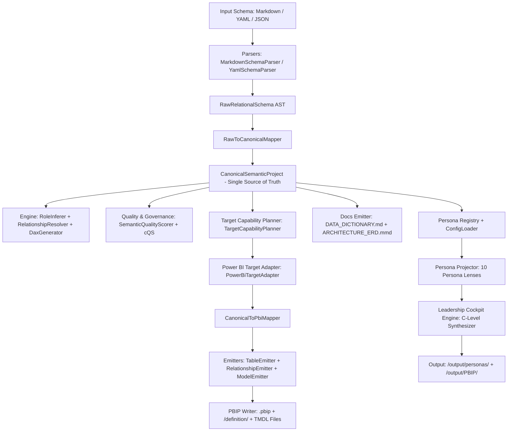

# 03. ANÁLISIS DE BRECHAS ARQUITECTÓNICAS (ARCHITECTURE GAP ANALYSIS)

**Proyecto:** SemanticFlow  
**Fecha de Auditoría:** 2026-09-19  
**Commit:** `59f3c929b3e7a2d52ceb3553b9285388a52eee52`  

---

## 1. EVALUACIÓN DEL FLUJO REAL DEL COMPILADOR

El flujo arquitectónico implementado en `SemanticFlow` se contrasta a continuación frente a la especificación canónica:

### Tabla de Validación de Fronteras Arquitectónicas

| Componente del Pipeline | Implementación Actual | Estado | Brecha Arquitectónica |
|---|---|---|---|
| **Parsers desacoplados de Emitters** | `src/core/parsers/` no importa nada de `src/core/emitter/` | ✅ VERIFIED | Ninguna. Desacople total. |
| **Raw AST separado de Canonical AST** | `src/core/ast/schema.py` separado de `src/core/ast/canonical/models.py` | ✅ VERIFIED | Ninguna. Tipos y modelos diferenciados. |
| **CanonicalProject como Única Verdad** | `CanonicalSemanticProject` contiene todas las entidades, métricas, gobierno y diagnósticos | ✅ VERIFIED | Totalmente neutral; no contiene dependencias a sintaxis DAX obligatoria. |
| **Mappers Explícitos** | `raw_to_canonical.py` y `canonical_to_pbi.py` | ✅ VERIFIED | Mapeo bidireccional limpio y probado. |
| **Capability Planner antes de Emitir** | `TargetCapabilityPlanner` evalúa soporte del dialecto antes de invocar adapters | ✅ VERIFIED | Soporta `SUPPORTED`, `SUPPORTED_WITH_TRANSFORMATION`, `PARTIALLY_SUPPORTED`, `UNSUPPORTED`. |
| **Power BI Adapter en el Pipeline** | `PowerBiTargetAdapter` participa en la transformación de metadatos | ✅ VERIFIED | Aísla conceptos exclusivos de Power BI (como Display Folders y Data Categories). |
| **Aislamiento de Leadership Cockpit** | `src/core/personas/cockpit.py` | ⚠️ PARTIAL | Debe residir en `src/core/leadership/` y ser un paquete desacoplado de `personas`. |
| **Presencia de Archivos Muertos/Duplicados** | `src/core/engine/inference.py` (0% coverage) coexiste con `role_inferer.py` | ⚠️ PARTIAL | `inference.py` es código legacy redundante que debe removerse. |

---

## 2. MATRIZ DE CAPACIDADES DE DESTINO (POWER BI VS FUTUROS)

| Capacidad Semántica | Soporte Power BI (TMDL) | Soporte Looker (LookML) | Soporte Qlik Sense | Soporte dbt Semantic Layer |
|---|---|---|---|---|
| **Tablas de Hechos (Fact)** | `SUPPORTED` | `FUTURE` | `FUTURE` | `FUTURE` |
| **Dimensiones Normalizadas (Snowflake)** | `SUPPORTED` | `FUTURE` | `FUTURE` | `FUTURE` |
| **Dimensiones Conformadas (Star)** | `SUPPORTED` | `FUTURE` | `FUTURE` | `FUTURE` |
| **Relaciones 1:N Unidireccionales** | `SUPPORTED` | `FUTURE` | `FUTURE` | `FUTURE` |
| **Relaciones M:N con Tabla Puente** | `SUPPORTED_WITH_TRANSFORMATION` | `FUTURE` | `FUTURE` | `FUTURE` |
| **Medidas DAX Agregadas (SUM/COUNT/DIVIDE)**| `SUPPORTED` | `FUTURE` | `FUTURE` | `FUTURE` |
| **Ocultamiento de Claves Foráneas (FK)**| `SUPPORTED` | `FUTURE` | `FUTURE` | `FUTURE` |
| **Carpetas de Despliegue (Display Folders)**| `SUPPORTED` | `FUTURE` | `FUTURE` | `FUTURE` |
| **Format Strings Regionales (Cultura)** | `SUPPORTED` | `FUTURE` | `FUTURE` | `FUTURE` |
| **Seguridad a Nivel de Fila (RLS)** | `PARTIALLY_SUPPORTED` | `FUTURE` | `FUTURE` | `FUTURE` |
| **Actualización Incremental de Particiones** | `REQUIRES_MANUAL_REVIEW` | `FUTURE` | `FUTURE` | `FUTURE` |

---

## 3. POLÍTICA DE COMPATIBILIDAD Y RETIRO DE CÓDIGO LEGACY

1. **`src/core/personas/views.py` (Legacy View Generator):**  
   - Mantenido operando mediante `src/core/personas/legacy_adapter.py`.
   - Permite que el método histórico `PersonaViewGenerator.generate_views()` redirija internamente al nuevo motor `PersonaProjector` sin romper pruebas existentes.
   - **Política de Retiro:** Mantener deprecation warning durante 0.1.x y remover formalmente en v1.0.0.

2. **`src/core/engine/inference.py`:**  
   - 0% de cobertura en pytest.
   - Ha sido reemplazado funcionalmente por `src/core/engine/role_inferer.py` y `src/core/engine/relationship_resolver.py`.
   - **Acción:** Deprecar y eliminar para reducir deuda técnica.

---

## 4. INVARIANTES ARQUITECTÓNICOS A PROTEGER

- **I-1:** Ningún Persona Lens ni el Leadership Cockpit puede mutar un `CanonicalSemanticProject`.
- **I-2:** Ningún módulo de `personas` o `leadership` puede recalcular calidad (`cQS`), linaje o resolución topológica; deben consumir los resultados ya calculados en el AST.
- **I-3:** Ningún dialecto de destino adicional puede implementarse de manera superficial o simulada.
