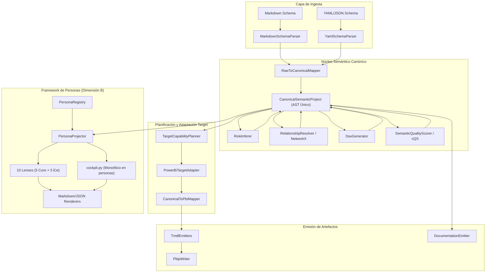
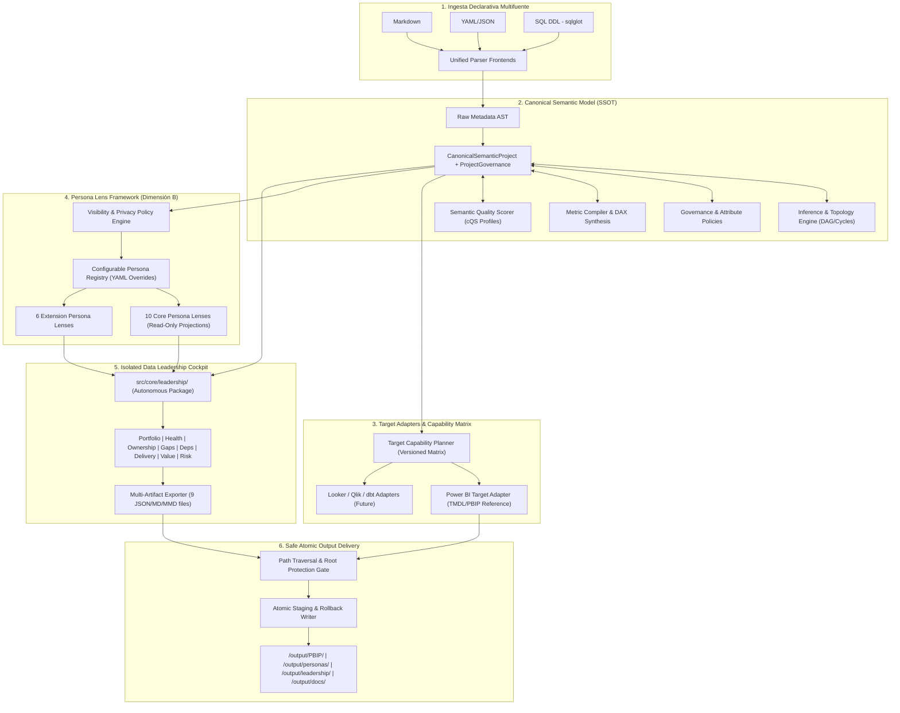

# 12. MAPA DE FUENTES Y DIAGRAMA DE ARQUITECTURA (ARCHITECTURE SOURCE MAP)

**Proyecto:** SemanticFlow  
**Fecha de Auditoría:** 2026-09-19  
**Commit:** `59f3c929b3e7a2d52ceb3553b9285388a52eee52`  

---

## 1. MAPA DE CORRESPONDENCIA FUENTE-ARQUITECTURA

| Capa Arquitectónica | Módulo / Paquete | Archivos Fuente Clave | Rol y Responsabilidad |
|---|---|---|---|
| **Frontend / Ingesta** | `src/core/parsers/` | `markdown_parser.py`, `yaml_parser.py`, `base.py` | Parsea esquemas de entrada a `RelationalSchemaRaw` |
| **AST Canónico (SST)** | `src/core/ast/canonical/` | `models.py` | Modela `CanonicalSemanticProject`, `SemanticEntity`, `SemanticMetric`, `ProjectGovernance` |
| **AST Relacional Crudo** | `src/core/ast/` | `schema.py`, `semantic.py`, `types.py` | Modela tablas, columnas y relaciones crudas |
| **Mappers de Adaptación**| `src/core/mappers/` | `raw_to_canonical.py`, `canonical_to_pbi.py` | Normaliza el AST crudo a canónico y canónico a PBI |
| **Motor de Inferencia** | `src/core/engine/` | `role_inferer.py`, `relationship_resolver.py`, `graph.py` | Infiere hechos/dimensiones y resuelve grafo NetworkX |
| **Generador DAX** | `src/core/engine/` | `dax_generator.py` | Sintetiza expresiones DAX agregadas canónicas |
| **Gobierno y Explicabilidad** | `src/core/engine/` | `governance.py`, `explainer.py` | Oculta claves foráneas y provee trazabilidad de evidencia |
| **Evaluador de Calidad cQS** | `src/core/quality/` | `scorer.py`, `rules.py` | Evalúa reglas de gobernanza, grano y penalizaciones |
| **Planificador de Destino** | `src/core/capabilities/` | `planner.py` | Evalúa soporte del dialecto target (`SUPPORTED`, `UNSUPPORTED`) |
| **Adaptador Power BI** | `src/core/targets/powerbi/`| `adapter.py` | Adapta el modelo canónico al backend Power BI |
| **Emisores TMDL / PBIP** | `src/core/emitter/` | `pbip_writer.py`, `table_emitter.py`, `relationship_emitter.py`, `model_emitter.py`, `tmdl_formatter.py` | Emite carpetas y archivos `.tmdl` y `.pbip` |
| **Documentación** | `src/core/docs/` | `emitter.py` | Genera `DATA_DICTIONARY.md` y `ARCHITECTURE_ERD.mmd` |
| **Framework Persona Lens** | `src/core/personas/` | `models.py`, `registry.py`, `config_loader.py`, `projector.py`, `renderers.py`, `lenses/*.py` | Proyecta perspectivas por rol sin mutar el AST canónico |
| **Leadership Cockpit** | `src/core/personas/` | `cockpit.py` (actual) -> `src/core/leadership/` (destino) | Sintetiza radar de madurez y telemetría C-Level |
| **CLI Typer + Rich** | `src/` | `cli.py` | Comandos `compile`, `inspect`, `explain`, `validate`, `docgen`, `personas`, `cockpit` |

---

## 2. DIAGRAMA DE ARQUITECTURA AS-IS (ESTADO ACTUAL)

---

## 3. DIAGRAMA DE ARQUITECTURA TO-BE (ESTADO OBJETIVO ENTERPRISE)

