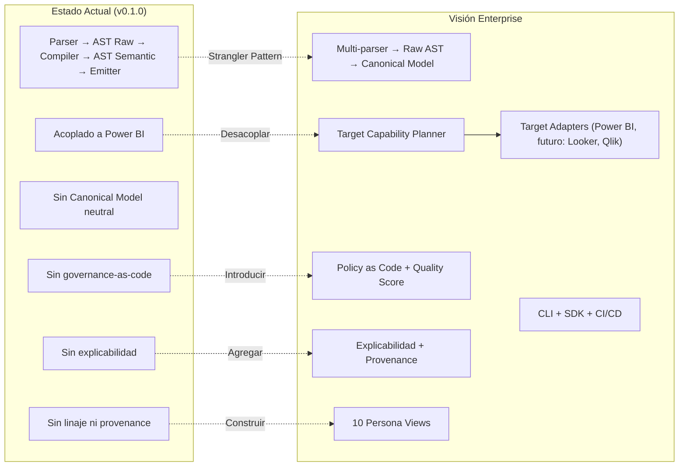

# SemanticFlow Enterprise Evolution — Plan de Implementación

## Análisis Profundo del Plan Maestro

### Evaluación General

El Plan Maestro (`SemanticFlow_Plan_Maestro_Antigravity.txt`, 1594 líneas) es un documento de **calidad arquitectónica excepcional**. Define con rigor la evolución de SemanticFlow desde un compilador local determinista de modelos Power BI hacia una **plataforma enterprise de Semantic Model Engineering**. A continuación, el análisis crítico.

---

### Estado Actual del Codebase (Inventario Real)

| Dimensión | Estado Actual | Evidencia |
|---|---|---|
| **Líneas de código fuente** | ~22 archivos Python, ~35 KB de código | [src/](file:///d:/0001%20HyperScale%20Thinking/PROYECTOS%20CLOUD/Data%20&%20AI%20Strategy/SemanticFlow/src) |
| **Arquitectura** | Pipeline lineal: Parser → AST → Compiler → Emitter → PBIP Writer | [compiler.py](file:///d:/0001%20HyperScale%20Thinking/PROYECTOS%20CLOUD/Data%20&%20AI%20Strategy/SemanticFlow/src/core/engine/compiler.py) |
| **AST Raw** | 4 modelos Pydantic (`RelationalSchemaRaw`, `TableRaw`, `ColumnRaw`, `RelationshipRaw`) | [schema.py](file:///d:/0001%20HyperScale%20Thinking/PROYECTOS%20CLOUD/Data%20&%20AI%20Strategy/SemanticFlow/src/core/ast/schema.py) |
| **AST Semántico** | 7 modelos (`SemanticModel`, `SemanticTable`, `SemanticColumn`, `SemanticMeasure`, `SemanticRelationship`, `TableRole`, `SummarizeBy`) | [semantic.py](file:///d:/0001%20HyperScale%20Thinking/PROYECTOS%20CLOUD/Data%20&%20AI%20Strategy/SemanticFlow/src/core/ast/semantic.py) |
| **Parsers** | Markdown + YAML (2 parsers) | [parsers/](file:///d:/0001%20HyperScale%20Thinking/PROYECTOS%20CLOUD/Data%20&%20AI%20Strategy/SemanticFlow/src/core/parsers) |
| **CLI** | 2 comandos: `compile`, `inspect` | [cli.py](file:///d:/0001%20HyperScale%20Thinking/PROYECTOS%20CLOUD/Data%20&%20AI%20Strategy/SemanticFlow/src/cli.py) |
| **Tests** | 5 test files + 3 stress test suites | [tests/](file:///d:/0001%20HyperScale%20Thinking/PROYECTOS%20CLOUD/Data%20&%20AI%20Strategy/SemanticFlow/tests) |
| **Git** | `.git` existe pero seed reporta "unversioned" | Raíz del proyecto |
| **Versión** | `0.1.0` | [pyproject.toml](file:///d:/0001%20HyperScale%20Thinking/PROYECTOS%20CLOUD/Data%20&%20AI%20Strategy/SemanticFlow/pyproject.toml) |
| **Dependencias** | 6 (pydantic, networkx, sqlglot, pyyaml, typer, rich) | `pyproject.toml` |
| **Directorios vacíos** | `config/`, `data/`, `infrastructure/`, `logs/`, `schemas/`, `scripts/`, `src/cloud_jobs/`, `src/dashboards/`, `src/data_generation/` | Inventario directo |

### Brechas Críticas entre Estado Actual y Visión Enterprise



---

## Análisis Crítico: Fortalezas y Riesgos del Plan

### Fortalezas del Plan

1. **Patrón Strangler**: La estrategia de introducir el Canonical Model en paralelo sin reemplazar el AST actual es exactamente correcta. Evita un "big bang" que destruiría la estabilidad.
2. **Modelo de ejecución de 7 pasos**: El ciclo Inspección → Plan → Implementación → Pruebas → Regresión → Evidencia → Gate es riguroso y profesional.
3. **Dos dimensiones ortogonales**: Separar Capacidades (A1-A9) de Vistas por Persona (B1-B10) evita la trampa de construir motores duplicados.
4. **Principios P1-P10**: Cada uno está bien fundamentado. P7 (Compatibility before emission) es particularmente potente.
5. **16 fases ordenadas**: La secuencia respeta dependencias lógicas. Fase 0 (baseline) antes de cualquier cambio es indispensable.

### Riesgos Identificados

| # | Riesgo | Severidad | Mitigación |
|---|---|---|---|
| R1 | **Scope creep**: 16 fases, 10 personas, 9 capacidades → la magnitud puede diluir foco | Alta | Agrupar en 4 macro-etapas con checkpoints de decisión |
| R2 | **Directorios vacíos heredados** (`cloud_jobs/`, `dashboards/`, `data_generation/`) contaminan la arquitectura enterprise | Media | Limpieza y reorganización controlada en Fase 0 |
| R3 | **AST semántico actual IS el modelo Power BI** — `semantic.py` tiene `SummarizeBy`, `m_partition_expression`, `compatibility_level` que son 100% Power BI | Alta | El Canonical Model DEBE ser una capa nueva, no una refactorización de `semantic.py` |
| R4 | **Sin golden files ni determinismo verificado** — no hay baseline reproducible | Alta | Fase 0 debe producir hashes de salida antes de todo |
| R5 | **Directorios Thinking** (`02_Foundation/`, `03_Research_AI/`) mezclan gobernanza del workspace con el producto enterprise | Media | Separar claramente producto vs. workspace governance |

---

## Propuesta de Reorganización del Directorio

> [!IMPORTANT]
> El directorio actual mezcla tres preocupaciones: **(1)** el producto SemanticFlow, **(2)** la gobernanza del workspace Thinking, y **(3)** artefactos de salida de compilaciones de demostración. La visión enterprise exige separación nítida.

### Estructura Objetivo (Incremental, NO todo de una vez)

```
SemanticFlow/
├── .github/                          # [NUEVO] CI/CD, templates, workflows
│   ├── workflows/
│   │   ├── ci.yml
│   │   └── release.yml
│   ├── ISSUE_TEMPLATE/
│   └── PULL_REQUEST_TEMPLATE.md
│
├── src/                              # Código fuente del producto
│   ├── __init__.py
│   ├── cli.py                        # [MANTENER] Entry point CLI
│   └── core/
│       ├── ast/
│       │   ├── raw/                  # [RENOMBRAR] desde ast/ actual
│       │   │   ├── schema.py         # RelationalSchemaRaw (sin cambios)
│       │   │   └── types.py          # Mapeo de tipos SQL
│       │   └── canonical/            # [NUEVO] Canonical Semantic Model
│       │       ├── __init__.py
│       │       ├── model.py          # SemanticProject, SemanticEntity, SemanticAttribute
│       │       ├── metrics.py        # SemanticMetric, MetricType, Additivity
│       │       ├── governance.py     # GovernanceMetadata, SecurityMetadata
│       │       ├── provenance.py     # ProvenanceRecord, InferenceEvidence
│       │       └── diagnostics.py    # Diagnostic, DiagnosticCategory, Severity
│       │
│       ├── contracts/                # [NUEVO] Versionado de schemas de entrada
│       │   ├── __init__.py
│       │   └── schema_versions.py
│       │
│       ├── parsers/                  # [MANTENER] + extensión futura SQL DDL
│       │   ├── base.py
│       │   ├── markdown_parser.py
│       │   └── yaml_parser.py
│       │
│       ├── engine/                   # [MANTENER] Compilador + nuevos módulos
│       │   ├── compiler.py           # Orquestador principal (refactored gradual)
│       │   ├── dax_generator.py
│       │   ├── governance.py
│       │   ├── graph.py
│       │   ├── relationship_resolver.py
│       │   ├── role_inferer.py
│       │   └── inference/            # [NUEVO] Motor de inferencia con explicabilidad
│       │       ├── __init__.py
│       │       ├── provenance.py     # Registro de inferencias
│       │       └── explainer.py      # Comando explain
│       │
│       ├── mappers/                  # [NUEVO] Strangler pattern bridges
│       │   ├── __init__.py
│       │   ├── raw_to_canonical.py   # Raw AST → Canonical Model
│       │   └── canonical_to_pbi.py   # Canonical → representación Power BI
│       │
│       ├── quality/                  # [NUEVO] Semantic Quality Score
│       │   ├── __init__.py
│       │   ├── scorer.py
│       │   └── rules.py
│       │
│       ├── capabilities/             # [NUEVO] Target Capability Planner
│       │   ├── __init__.py
│       │   ├── planner.py
│       │   └── registry.py
│       │
│       └── targets/                  # [NUEVO] Refactored emitters
│           ├── __init__.py
│           ├── base.py               # TargetAdapter interface
│           └── powerbi/              # [MOVER] desde emitter/ actual
│               ├── __init__.py
│               ├── adapter.py        # PowerBIAdapter (implements TargetAdapter)
│               ├── emitter/          # Los emitters actuales
│               │   ├── model_emitter.py
│               │   ├── pbip_writer.py
│               │   ├── relationship_emitter.py
│               │   ├── table_emitter.py
│               │   └── tmdl_formatter.py
│               ├── capabilities.py   # PowerBI capabilities declaration
│               └── validation.py     # TMDL/PBIP validation
│
├── tests/                            # [REORGANIZAR] Progresivamente
│   ├── unit/                         # [NUEVO] Tests unitarios migrados
│   ├── integration/                  # [NUEVO] Pipeline completo
│   ├── e2e/                          # [NUEVO] CLI end-to-end
│   ├── golden/                       # [NUEVO] Golden files baseline
│   ├── fixtures/                     # [NUEVO] Fixtures tipificados
│   ├── performance/                  # [MOVER] desde Massive Stress Test/
│   └── stress/                       # [MOVER] desde Massive Data Stress*/
│
├── docs/                             # [EXPANDIR]
│   ├── architecture/
│   │   ├── current-state.md          # [NUEVO]
│   │   ├── target-state.md           # [NUEVO]
│   │   ├── principles.md             # [NUEVO]
│   │   ├── canonical-model.md        # [NUEVO]
│   │   └── target-adapters.md        # [NUEVO]
│   ├── governance/
│   │   └── policies.md
│   ├── testing/
│   │   └── strategy.md
│   ├── compatibility/
│   │   ├── power-bi.md
│   │   └── future-targets.md
│   ├── adr/                          # [NUEVO] Architecture Decision Records
│   │   ├── ADR-001-canonical-model.md
│   │   └── ADR-002-power-bi-reference.md
│   └── roadmap.md
│
├── examples/                         # [NUEVO] Escenarios de referencia
│   ├── small/                        # Modelo estrella simple
│   ├── enterprise/                   # Dominio enterprise
│   └── hyperscale/                   # Metadatos masivos
│
├── workspace/                        # [MOVER] Gobernanza Thinking
│   ├── 001_Seed/                     # ThinkingSeed del proyecto
│   ├── 02_Foundation/                # Engine governance
│   └── 03_Research_AI/               # Research y prompts
│
├── output/                           # [RENOMBRAR] desde Artefactos/
│   ├── demos/                        # Compilaciones de demostración
│   │   ├── data/                     # Con datos CSV (antes SemanticFlow_Data)
│   │   └── empty/                    # Sin datos (antes SemanticFlow_Empty)
│   └── plans/                        # Planes históricos
│
├── .gitignore
├── pyproject.toml
├── LICENSE                           # [NUEVO]
├── CONTRIBUTING.md                   # [NUEVO]
├── CODE_OF_CONDUCT.md                # [NUEVO]
├── SECURITY.md                       # [NUEVO]
├── CHANGELOG.md                      # [NUEVO]
└── README.md                         # [REESCRIBIR] Propuesta de valor enterprise
```

### Elementos a Eliminar (Directorios Vacíos sin Propósito Enterprise)

| Directorio | Estado | Decisión |
|---|---|---|
| `src/cloud_jobs/` | Vacío | **Eliminar** — fuera del scope enterprise-local |
| `src/dashboards/` | Vacío | **Eliminar** — no es responsabilidad del compilador |
| `src/data_generation/` | Vacío | **Eliminar** — los generadores viven en tests/ |
| `config/` | Vacío | **Mantener** — se usará para perfiles de gobernanza |
| `data/` | Vacío | **Eliminar** — SemanticFlow no almacena datos |
| `infrastructure/` | Vacío | **Eliminar** — el producto es local-first |
| `logs/` | Vacío | **Mantener** — se usará para build logs |
| `schemas/` | Vacío | **Mantener** → mover a `src/core/contracts/` |
| `scripts/` | Vacío | **Mantener** — scripts operativos |
| `Tools/` | Vacío | **Eliminar** — consolidar en scripts/ |

---

## Plan de Implementación: 4 Macro-Etapas

> [!IMPORTANT]
> Se propone consolidar las 16 fases del plan maestro en **4 macro-etapas** con **gates de decisión** entre ellas. Cada macro-etapa produce valor verificable y demostrable.

### Macro-Etapa I: Baseline, Profesionalización y Protección (Fases 0-2)
**Duración estimada: 2-3 sesiones de trabajo**
**Objetivo: Congelar baseline, profesionalizar repo, preparar para cambios**

#### Fase 0: Baseline e Inventario
- [ ] 0.1 — Inventariar módulos, contratos, CLI y emitters actuales
- [ ] 0.2 — Ejecutar suite completa de tests y documentar resultados
- [ ] 0.3 — Registrar tiempos basales (Tier 1, 2, 3)
- [ ] 0.4 — Crear fixtures representativos (small, medium, large)
- [ ] 0.5 — Crear golden files para salida TMDL/PBIP actual
- [ ] 0.6 — Verificar determinismo (compilaciones repetidas + hashes SHA256)
- [ ] 0.7 — Documentar APIs públicas Python y CLI
- [ ] 0.8 — Reporte de deuda técnica
- [ ] 0.9 — Crear `docs/architecture/current-state.md`
- [ ] 0.10 — Crear `docs/architecture/target-state.md`
- [ ] 0.11 — Crear `docs/architecture/principles.md`

#### Fase 1: Profesionalización del Repositorio
- [ ] 1.1 — Verificar/inicializar Git con branch strategy
- [ ] 1.2 — Agregar `LICENSE` (proponer MIT o Apache 2.0)
- [ ] 1.3 — Agregar `CONTRIBUTING.md`, `CODE_OF_CONDUCT.md`, `SECURITY.md`, `SUPPORT.md`
- [ ] 1.4 — Agregar `CHANGELOG.md` con versionado semántico
- [ ] 1.5 — Templates de issues y pull requests
- [ ] 1.6 — Configurar linting (`ruff`), formatting (`ruff format`), type checking (`mypy`)
- [ ] 1.7 — Configurar cobertura (`pytest-cov`)
- [ ] 1.8 — Crear GitHub Actions CI básico
- [ ] 1.9 — Limpieza de directorios vacíos sin propósito

#### Fase 2: Versionado de Contratos
- [ ] 2.1 — Identificar modelos Pydantic públicos y agregarles `schema_version`
- [ ] 2.2 — Introducir versión del compiler en manifiestos de salida
- [ ] 2.3 — Crear política de deprecación documentada
- [ ] 2.4 — Crear adaptadores de compatibilidad legacy
- [ ] 2.5 — Tests de compatibilidad hacia atrás

> **Gate I**: Suite verde, golden files creadas, determinismo verificado, repo profesionalizado.

---

### Macro-Etapa II: Canonical Semantic Model + Explicabilidad (Fases 3-4)
**Duración estimada: 3-4 sesiones de trabajo**
**Objetivo: Introducir la abstracción neutral vendor-agnostic**

#### Fase 3: Canonical Semantic Model Mínimo (Strangler Pattern)

> [!WARNING]
> **Decisión arquitectónica crítica**: El AST semántico actual (`semantic.py`) ES el modelo Power BI. No se puede "neutralizar" — se debe crear una capa nueva (`canonical/`) que coexista con `semantic.py` hasta que la equivalencia esté probada.

- [ ] 3.1 — Escribir `ADR-001: Canonical Semantic Model Neutral`
- [ ] 3.2 — Diseñar contratos Pydantic del canónico (`SemanticProject`, `SemanticEntity`, `SemanticAttribute`, `SemanticRelationship`, `SemanticMetric`, `GovernanceMetadata`, `ProvenanceRecord`)
- [ ] 3.3 — Implementar modelos en `src/core/ast/canonical/`
- [ ] 3.4 — Implementar mapper `Raw AST → Canonical Model` en `src/core/mappers/raw_to_canonical.py`
- [ ] 3.5 — Implementar mapper `Canonical → Power BI` en `src/core/mappers/canonical_to_pbi.py`
- [ ] 3.6 — Mantener pipeline antiguo disponible (flag `--legacy-pipeline`)
- [ ] 3.7 — Crear comparación de equivalencia: salida pipeline legacy vs. pipeline canónico
- [ ] 3.8 — Serialización JSON determinista del canónico para inspección

#### Fase 4: Explicabilidad y Provenance
- [ ] 4.1 — Definir `ProvenanceRecord` con `rule_id`, evidencia, resultado, confianza
- [ ] 4.2 — Instrumentar `RoleInferer` para registrar provenance
- [ ] 4.3 — Instrumentar `RelationshipResolver` para registrar provenance
- [ ] 4.4 — Instrumentar `AttributeGovernance` para registrar provenance
- [ ] 4.5 — Implementar comando CLI `semanticflow explain`
- [ ] 4.6 — Salida humana (Rich) y JSON del explain
- [ ] 4.7 — Permitir overrides declarativos con trazabilidad

> **Gate II**: Pipeline canónico produce salida equivalente al legacy. Todas las inferencias tienen provenance.

---

### Macro-Etapa III: Governance Enterprise + Quality (Fases 5-9)
**Duración estimada: 4-6 sesiones de trabajo**
**Objetivo: Capacidades de gobierno, calidad, optimización y validación**

#### Fase 5: Modelado Dimensional Enterprise
- [ ] Grano explícito, dimensiones conformadas, role-playing, SCD, M:N
- [ ] Jerarquías, calendarios, copo de nieve controlado

#### Fase 6: Métricas como Objetos de Primera Clase
- [ ] `SemanticMetric` neutral (base, derivada, ratio, KPI)
- [ ] Separación significado vs. expresión DAX
- [ ] Detección de ciclos, certificación, ownership

#### Fase 7: Gobierno y Policy as Code
- [ ] Taxonomía, PII, RLS/OLS neutral
- [ ] Perfiles: strict, standard, exploratory
- [ ] Excepciones auditables

#### Fase 8: Semantic Quality Score
- [ ] Scoring transparente por dimensión
- [ ] Comando `semanticflow validate`
- [ ] Umbrales configurables para CI gates

#### Fase 9: Target Capability Planner
- [ ] Interfaz `TargetAdapter` + `TargetCapabilities`
- [ ] Capacidades Power BI declaradas
- [ ] Plan de compilación con estados de compatibilidad

> **Gate III**: Gobierno configurable, quality score funcional, planner operativo.

---

### Macro-Etapa IV: Hardening, Personas y Release (Fases 10-16)
**Duración estimada: 5-8 sesiones de trabajo**
**Objetivo: Producción enterprise-ready, publicación open source**

#### Fase 10: Power BI Enterprise Hardening
- [ ] Jerarquías, calculation groups, perspectivas, display folders
- [ ] RLS, particiones, storage modes, incremental refresh
- [ ] Golden tests por feature

#### Fase 11: Documentación, Catálogo y Linaje
- [ ] Emitter Markdown, diccionario de datos, catálogo de métricas
- [ ] Diagramas Mermaid, grafo de linaje, análisis de impacto

#### Fase 12: CLI y SDK Estables
- [ ] Comandos: compile, inspect, validate, explain, diff, graph, docs, capabilities, benchmark
- [ ] Exit codes, dry run, perfiles, SDK Python documentado

#### Fase 13: Rendimiento y Compilación Incremental
- [ ] Instrumentación por fase, logs estructurados
- [ ] Cache determinista, compilación incremental
- [ ] Benchmarks reproducibles

#### Fase 14: Observabilidad
- [ ] Build ID, hashes, manifiestos, telemetría opcional

#### Fase 15: Vistas por Persona
- [ ] 10 vistas (Data Analyst → Auditor) desde el mismo canónico

#### Fase 16: Release Open Source y Showcase Enterprise
- [ ] README de propuesta de valor, quickstart, 3 escenarios
- [ ] Paquete instalable, demo offline, presentación técnica

> **Gate IV**: Producto publicable en GitHub, demostrable en empresas.

---

## Open Questions — Decisiones del Usuario

> [!IMPORTANT]
> Las siguientes decisiones impactan directamente la implementación y deben resolverse antes de comenzar.

### Q1: Licencia
El plan menciona "LICENSE compatible con la estrategia del autor" pero no especifica cuál. Las opciones enterprise-friendly son:
- **MIT** — Máxima adopción, mínima fricción
- **Apache 2.0** — Protección de patentes, preferida por enterprise
- **BSL (Business Source License)** — Dual licensing para monetización futura

### Q2: Directorios Thinking (`001_Seed/`, `02_Foundation/`, `03_Research_AI/`)
¿Se mueven a un subdirectorio `workspace/` para separar producto de gobernanza del workspace, o se mantienen en raíz como están?

### Q3: Renombrar `Artefactos/` → `output/`
El plan sugiere profesionalizar el repositorio. `Artefactos/` con mayúscula y en español puede causar fricciones en un contexto enterprise internacional. ¿Proceder con el rename?

### Q4: Velocidad de ejecución
¿Comenzamos estrictamente por Fase 0 (baseline puro sin cambios de código) como indica el plan, o combinamos Fase 0 + reorganización de directorio en la primera iteración dado que la reorganización no afecta la funcionalidad?

### Q5: Nombres del Canonical Model en inglés o español
El plan usa nombres en inglés (`SemanticProject`, `SemanticEntity`). El código actual tiene docstrings en español. ¿El producto enterprise se estandariza 100% en inglés (código + docs técnicos)?

---

## Verificación

### Automated Tests
```bash
# Ejecutar suite actual como baseline
cd "d:\0001 HyperScale Thinking\PROYECTOS CLOUD\Data & AI Strategy\SemanticFlow"
python -m pytest tests/ -v --tb=short
python -m pytest tests/ -v --tb=short --cov=src --cov-report=term-missing
```

### Manual Verification
- Compilar un esquema existente y verificar que el PBIP se abre en Power BI Desktop sin errores
- Comparar hashes SHA256 de compilaciones repetidas para confirmar determinismo
- Verificar que la reorganización de directorios no rompe imports
