# METRICSTHINKING™: Auditoría Forense y Madurez del Proyecto

> **Motor Evaluador:** MetricsThinking™ v1.0.0-ENTERPRISE  
> **Proyecto Auditado:** `SemanticFlow`  
> **Ubicación:** `D:\0001 HyperScale Thinking\PROYECTOS CLOUD\Data & AI Strategy\SemanticFlow`  
> **Fecha de Auditoría:** `2026-09-20 00:44:11`  
> **Auditor Responsable:** `MetricsThinking™ Universal Auditor`  
> **Perfil Aplicado:** `default`  
> **Git Commit / Branch:** `e1d77f1` / `master`  
> **Score Consolidado:** **`95.0% / 100.0%`**  
> **Banda de Madurez:** **Producción / Excelencia Operativa (90.0% - 100.0%)**

---

## 1. RESUMEN EJECUTIVO Y GROUND TRUTH

MetricsThinking™ ha completado la auditoría forense estricta basada en evidencias físicas verificables en el repositorio.

- **Nota Global Consolidada ($Score_{Total}$):** **`95.00%`**
- **Criterios Cumplidos:** **`30 / 31`** (96.8%)
- **Cuello de Botella Inmediato:** **`M06: Integración e Interoperabilidad (66.7% completado)`**
- **Archivos Físicos Escaneados:** **`1036`**
- **Memoria Técnica (Seed):** `Presente`
- **Gobernanza iDirectory (.context.yaml):** `Activa`

---

## 2. DASHBOARD EJECUTIVO DE MADUREZ POR MÓDULOS CANÓNICOS

| ID | Nombre del Módulo | Peso ($W_i$) | Criterios Cumplidos | % Cumplimiento | Contribución ($S_i$) | Estado |
|:---|:---|:---:|:---:|:---:|:---:|:---:|
| **M01** | Descubrimiento y Alcance | **5%** | `3 / 3` | **100.0%** | **5.00%** | 🟢 Completo |
| **M02** | Arquitectura y Diseño Técnico | **10%** | `4 / 4` | **100.0%** | **10.00%** | 🟢 Completo |
| **M03** | Gobernanza y Cumplimiento | **5%** | `3 / 3` | **100.0%** | **5.00%** | 🟢 Completo |
| **M04** | Aprovisionamiento y Readiness | **5%** | `3 / 3` | **100.0%** | **5.00%** | 🟢 Completo |
| **M05** | Construcción Núcleo (Core Engine) | **25%** | `4 / 4` | **100.0%** | **25.00%** | 🟢 Completo |
| **M06** | Integración e Interoperabilidad | **15%** | `2 / 3` | **66.7%** | **10.00%** | 🔵 En Progreso |
| **M07** | Aseguramiento de Calidad (QA & Stress) | **10%** | `3 / 3` | **100.0%** | **10.00%** | 🟢 Completo |
| **M08** | Validación y Aceptación Organizacional | **10%** | `3 / 3` | **100.0%** | **10.00%** | 🟢 Completo |
| **M09** | Despliegue y Automatización (CI/CD) | **10%** | `2 / 2` | **100.0%** | **10.00%** | 🟢 Completo |
| **M10** | Cierre, Extensibilidad y Documentación | **5%** | `3 / 3` | **100.0%** | **5.00%** | 🟢 Completo |
| **TOTAL** | **Ciclo de Vida Completo (SDD)** | **100%** | `30 / 31` | — | **`95.00%`** | **OPERATIONAL_EXCELLENCE** |

---

## 3. ROADMAP DE MADUREZ Y ESTADO DE FASES (MERMAID ROADMAP)

El siguiente diagrama ilustra la progresión secuencial del ciclo de vida a través de los 10 módulos canónicos organizados en 4 etapas estratégicas de madurez:

```mermaid
flowchart LR
    %% Subgraph 1: Fundamentos y Gobernanza
    subgraph STAGE_1["Fase I: Fundamentos y Gobernanza"]
        direction TB
        M01["M01: Descubrimiento y Alcance<br/>[100%] (Peso: 5%)"]
        M02["M02: Arquitectura y Diseño Técnico<br/>[100%] (Peso: 10%)"]
        M03["M03: Gobernanza y Cumplimiento<br/>[100%] (Peso: 5%)"]
        M04["M04: Aprovisionamiento y Readiness<br/>[100%] (Peso: 5%)"]
        M01 --> M02 --> M03 --> M04
    end

    %% Subgraph 2: Construcción Nuclear
    subgraph STAGE_2["Fase II: Construcción Nuclear"]
        direction TB
        M05["M05: Construcción Núcleo (Core Engine)<br/>[100%] (Peso: 25%)"]
        M06["M06: Integración e Interoperabilidad<br/>[67%] (Peso: 15%)"]
        M05 --> M06
    end

    %% Subgraph 3: Certificación y Calidad
    subgraph STAGE_3["Fase III: Certificación y Calidad"]
        direction TB
        M07["M07: Aseguramiento de Calidad (QA & Stress)<br/>[100%] (Peso: 10%)"]
        M08["M08: Validación y Aceptación Organizacional<br/>[100%] (Peso: 10%)"]
        M09["M09: Despliegue y Automatización (CI/CD)<br/>[100%] (Peso: 10%)"]
        M07 --> M08 --> M09
    end

    %% Subgraph 4: Entrega y Extensibilidad
    subgraph STAGE_4["Fase IV: Entrega y Extensibilidad"]
        direction TB
        M10["M10: Cierre, Extensibilidad y Documentación<br/>[100%] (Peso: 5%)"]
    end

    %% Enlaces entre etapas del Roadmap
    M04 ==> M05
    M06 ==> M07
    M09 ==> M10

    %% Clases de estilo semántico
    classDef complete fill:#2ECC71,stroke:#27AE60,stroke-width:2px,color:#FFFFFF;
    classDef inprogress fill:#3498DB,stroke:#2980B9,stroke-width:2px,color:#FFFFFF;
    classDef pending fill:#7F8C8D,stroke:#95A5A6,stroke-width:1px,stroke-dasharray: 4 4,color:#FFFFFF;
    classDef blocked fill:#E74C3C,stroke:#C0392B,stroke-width:2px,color:#FFFFFF;

    class M01 complete;
    class M02 complete;
    class M03 complete;
    class M04 complete;
    class M05 complete;
    class M06 inprogress;
    class M07 complete;
    class M08 complete;
    class M09 complete;
    class M10 complete;
```

**Leyenda Semántica:** `🟢 Verde (#2ECC71)` = Completo (100%) | `🔵 Azul (#3498DB)` = En Progreso (1-99%) | `⚪ Gris (#7F8C8D)` = Pendiente (0%) | `🔴 Rojo (#E74C3C)` = Bloqueado

---

## 4. DESGLOSE FORENSE DE EVIDENCIAS POR MÓDULO

### M01: Descubrimiento y Alcance — 🟢 COMPLETO (100.0%)
**Peso Relativo:** 5% | **Contribución Ponderada:** 5.00%

| Criterio | Nombre | Estado | Evidencia Física Detectada |
|:---|:---|:---:|:---|
| `M01-C01` | Problem Statement Formalizado | ✅ `[CUMPLIDO]` | **`01_seed/seed-semanticflow-master.md`** — Problem statement formalizado en '01_seed/seed-semanticflow-master.md'. |
| `M01-C02` | Límites y Scope Declarados | ✅ `[CUMPLIDO]` | **`01_seed/seed-semanticflow-master.md`** — Límites de alcance y fronteras del sistema identificados en '01_seed/seed-semanticflow-master.md'. |
| `M01-C03` | Casos de Uso Formales | ✅ `[CUMPLIDO]` | **`01_seed/seed-semanticflow-master.md`** — Perfiles de uso y casos definidos en '01_seed/seed-semanticflow-master.md'. |

### M02: Arquitectura y Diseño Técnico — 🟢 COMPLETO (100.0%)
**Peso Relativo:** 10% | **Contribución Ponderada:** 10.00%

| Criterio | Nombre | Estado | Evidencia Física Detectada |
|:---|:---|:---:|:---|
| `M02-C01` | AST / Modelos Canónicos Desacoplados | ✅ `[CUMPLIDO]` | **`src/core/ast/schema.py`** — Modelos de dominio canónicos detectados en 7 archivos (e.g. 'src/core/ast/schema.py'). |
| `M02-C02` | ADRs Documentados | ✅ `[CUMPLIDO]` | **`docs/adr/ADR-001-canonical-model.md`** — Decisiones arquitectónicas formales identificadas (8 archivos, e.g. 'docs/adr/ADR-001-canonical-model.md'). |
| `M02-C03` | Contratos JSON Schema Validados | ✅ `[CUMPLIDO]` | **`schemas/.context.yaml`** — Contratos formales de datos / esquemas presentes (16 esquemas, e.g. 'schemas/.context.yaml'). |
| `M02-C04` | Topología y Grafos Formales | ✅ `[CUMPLIDO]` | **`.context/tree.json`** — Mapa topológico satelital y grafo formal del proyecto activo en '.context/tree.json'. |

### M03: Gobernanza y Cumplimiento — 🟢 COMPLETO (100.0%)
**Peso Relativo:** 5% | **Contribución Ponderada:** 5.00%

| Criterio | Nombre | Estado | Evidencia Física Detectada |
|:---|:---|:---:|:---|
| `M03-C01` | Detección y Marcado de PII | ✅ `[CUMPLIDO]` | **`01_seed/seed-semanticflow-master.md`** — Políticas de privacidad y clasificación PII documentadas en '01_seed/seed-semanticflow-master.md'. |
| `M03-C02` | Reglas de Calidad Formales (cQS) | ✅ `[CUMPLIDO]` | **`src/core/quality/rules.py`** — Motor o reglas formales de calidad de datos/código verificados en 'src/core/quality/rules.py'. |
| `M03-C03` | Validación Estricta de Esquemas / Context | ✅ `[CUMPLIDO]` | **`.context/tree.json`** — Gobernanza contextual iDirectory activa con 24 archivos de contexto (.context.yaml). |

### M04: Aprovisionamiento y Readiness — 🟢 COMPLETO (100.0%)
**Peso Relativo:** 5% | **Contribución Ponderada:** 5.00%

| Criterio | Nombre | Estado | Evidencia Física Detectada |
|:---|:---|:---:|:---|
| `M04-C01` | Entorno Reproducible | ✅ `[CUMPLIDO]` | **`pyproject.toml`** — Manifiesto de empaquetado y entorno reproducible verificado en 'pyproject.toml'. |
| `M04-C02` | Dependencias Versionadas | ✅ `[CUMPLIDO]` | **`pyproject.toml`** — Especificación estricta de versiones de dependencias verificada en 'pyproject.toml'. |
| `M04-C03` | Fixture Enterprise Disponible | ✅ `[CUMPLIDO]` | **`data/processed/.context.yaml`** — Fixtures y datos de prueba disponibles (5 archivos, e.g. 'data/processed/.context.yaml'). |

### M05: Construcción Núcleo (Core Engine) — 🟢 COMPLETO (100.0%)
**Peso Relativo:** 25% | **Contribución Ponderada:** 25.00%

| Criterio | Nombre | Estado | Evidencia Física Detectada |
|:---|:---|:---:|:---|
| `M05-C01` | Parsers Funcionales | ✅ `[CUMPLIDO]` | **`src/core/parsers/base.py`** — Módulos de parseo e ingesta identificados en 'src/core/parsers/base.py'. |
| `M05-C02` | Inferencia Operativa de Roles | ✅ `[CUMPLIDO]` | **`src/core/__init__.py`** — Motor nuclear de procesamiento y lógica operativa verificado en 'src/core/__init__.py'. |
| `M05-C03` | Resolución de Relaciones y Ciclos | ✅ `[CUMPLIDO]` | **`src/core/emitter/relationship_emitter.py`** — Resolución de relaciones y dependencias verificado en 'src/core/emitter/relationship_emitter.py'. |
| `M05-C04` | Generador Canónico de Métricas / Lógica | ✅ `[CUMPLIDO]` | **`src/core/engine/dax_generator.py`** — Mecanismo de generación de métricas o síntesis operativa detectado en 'src/core/engine/dax_generator.py'. |

### M06: Integración e Interoperabilidad — 🔵 EN PROGRESO (66.7%)
**Peso Relativo:** 15% | **Contribución Ponderada:** 10.00%

| Criterio | Nombre | Estado | Evidencia Física Detectada |
|:---|:---|:---:|:---|
| `M06-C01` | Emisores de Dialecto Nativo | ✅ `[CUMPLIDO]` | **`src/core/docs/emitter.py`** — Emisores y serializadores de destino verificados en 'src/core/docs/emitter.py'. |
| `M06-C02` | Escritura Atómica y Safe-Encoding | ❌ `[FALTANTE]` | Falta estandarización de escritura atómica y safe-encoding UTF-8. |
| `M06-C03` | Exportación Multi-Formato | ✅ `[CUMPLIDO]` | Soporte de representación multi-formato verificado en el repositorio (.csv, .json, .md, .mmd, .pbip). |

### M07: Aseguramiento de Calidad (QA & Stress) — 🟢 COMPLETO (100.0%)
**Peso Relativo:** 10% | **Contribución Ponderada:** 10.00%

| Criterio | Nombre | Estado | Evidencia Física Detectada |
|:---|:---|:---:|:---|
| `M07-C01` | Cobertura y Tasa de Éxito de Pruebas | ✅ `[CUMPLIDO]` | **`artifacts/plans/active/semanticflow-global-audit/06_TEST_AND_COVERAGE_REPORT.md`** — Suite de pruebas presente (147 archivos de prueba en tests/, e.g. 'artifacts/plans/active/semanticflow-global-audit/06_TEST_AND_COVERAGE_REPORT.md'). |
| `M07-C02` | Golden Regression Tests Validados | ✅ `[CUMPLIDO]` | **`tests/test_golden_regression.py`** — Pruebas de regresión deterministas (Golden files/Snapshots) identificadas en 'tests/test_golden_regression.py'. |
| `M07-C03` | Suites de Estrés / Benchmark Masivo | ✅ `[CUMPLIDO]` | **`tests/Massive Data Stress/test_data_generation_integrity.py`** — Suites de estrés o benchmarks masivos verificados en 'tests/Massive Data Stress/test_data_generation_integrity.py'. |

### M08: Validación y Aceptación Organizacional — 🟢 COMPLETO (100.0%)
**Peso Relativo:** 10% | **Contribución Ponderada:** 10.00%

| Criterio | Nombre | Estado | Evidencia Física Detectada |
|:---|:---|:---:|:---|
| `M08-C01` | Proyecciones por Rol (Persona Lenses) | ✅ `[CUMPLIDO]` | **`src/core/engine/role_inferer.py`** — Proyecciones especializadas por rol (Persona Lenses) presentes en 'src/core/engine/role_inferer.py'. |
| `M08-C02` | Leadership Cockpit / Tableros Ejecutivos | ✅ `[CUMPLIDO]` | **`src/dashboards/.context.yaml`** — Módulos de dashboard / cockpit operativo presentes en 'src/dashboards/.context.yaml'. |
| `M08-C03` | CLI de Diagnóstico y Exploración | ✅ `[CUMPLIDO]` | **`src/cli.py`** — Interfaz CLI de exploración y diagnóstico verificada en 'src/cli.py'. |

### M09: Despliegue y Automatización (CI/CD) — 🟢 COMPLETO (100.0%)
**Peso Relativo:** 10% | **Contribución Ponderada:** 10.00%

| Criterio | Nombre | Estado | Evidencia Física Detectada |
|:---|:---|:---:|:---|
| `M09-C01` | Pipeline CI/CD Automatizado | ✅ `[CUMPLIDO]` | **`.github/workflows/ci.yml`** — Pipeline de integración continua automatizado verificado en '.github/workflows/ci.yml'. |
| `M09-C02` | Empaquetado y Distribución Estandarizada | ✅ `[CUMPLIDO]` | **`pyproject.toml`** — Configuración de empaquetado estándar/entry points verificada en 'pyproject.toml'. |

### M10: Cierre, Extensibilidad y Documentación — 🟢 COMPLETO (100.0%)
**Peso Relativo:** 5% | **Contribución Ponderada:** 5.00%

| Criterio | Nombre | Estado | Evidencia Física Detectada |
|:---|:---|:---:|:---|
| `M10-C01` | Documentación Técnica Exhaustiva (Seed) | ✅ `[CUMPLIDO]` | **`01_seed/.context.yaml`** — Memoria técnica formal (ThinkingSeed) identificada en '01_seed/.context.yaml'. |
| `M10-C02` | CLI Help Documentado | ✅ `[CUMPLIDO]` | **`README_ES.md`** — Instrucciones operativas y ayuda de comandos documentadas en 'README_ES.md'. |
| `M10-C03` | Adaptadores Multicanal / Roadmap | ✅ `[CUMPLIDO]` | **`src/core/parsers/base.py`** — Interfaces de extensibilidad y adaptadores multicanal verificados en 'src/core/parsers/base.py'. |

---

## 5. PLAN DE REMEDIACIÓN TÉCNICA PRIORIZADO (PATH TO 100%)

A continuación se prescriben las acciones técnicas prioritarias para desbloquear el avance del proyecto y alcanzar la máxima calificación:

| Prioridad | Módulo | Criterio | Acción Requerida | Impacto Potencial | Archivos Sugeridos |
|:---:|:---:|:---|:---|:---:|:---|
| **P1** | `M06` | `M06-C02` | Usar atomic write y UTF-8 seguro para serializar artefactos. | **+5.00%** | `src/core/emitter/` |

---

> *Reporte generado automáticamente por **MetricsThinking™ Universal Project Auditor**.*  
> *Disciplina de auditoría: **Ground Truth First** (evidencia física sobre supuestos).*