# Esquema Relacional de la Base de Datos - Metro de Santiago Lakehouse

Este documento detalla de manera exhaustiva el modelo de datos relacional para el Simulador Industrial del Metro de Santiago. El diseño implementa una arquitectura híbrida entre **Star Schema** (Esquema de Estrella) y **Snowflake Schema** (Esquema de Copo de Nieve) optimizada para almacenes de datos analíticos (Lakehouse en Direct Lake / Fabric).

---

## 1. Diagrama de Relaciones (ERD)

A continuación se muestra cómo se relacionan las tablas de dimensiones y hechos en el Lakehouse:

```mermaid
erDiagram
    Dim_Linea ||--o{ Dim_Estacion : "tiene"
    Dim_Linea ||--o{ Dim_Tren_Coche : "tiene"
    Dim_Linea ||--o{ Fact_Sensoraje_Via : "monitorea"
    Dim_Linea ||--o{ Fact_Estado_Resultado : "registra"
    Dim_Linea ||--o{ Fact_Ingresos_NNT : "registra"
    Dim_Linea ||--o{ Fact_Consumo_ESG : "registra"
    Dim_Linea ||--o{ Fact_Cumplimiento_Oferta : "registra"
    Dim_Linea ||--o{ Fact_Seguridad_NPS : "registra"

    Dim_Estacion ||--o{ Dim_Equipamiento : "contiene"
    Dim_Estacion ||--o{ Dim_Espacio_Comercial : "contiene"
    Dim_Estacion ||--o{ Fact_Validacion : "registra"
    Dim_Estacion ||--o{ Fact_Venta_Carga : "registra"
    Dim_Estacion ||--o{ Fact_Simulacion_Flujo : "simula"

    Dim_Tren_Coche ||--o{ Dim_Equipamiento : "contiene"
    Dim_Tren_Coche ||--o{ Fact_Telemetria_Tren : "transmite"

    Dim_Usuario_Bip ||--o{ Fact_Validacion : "realiza"
    Dim_Usuario_Bip ||--o{ Fact_Venta_Carga : "realiza"

    Dim_Unidad_Negocio ||--o{ Fact_Estado_Resultado : "aplica"
    Dim_Unidad_Negocio ||--o{ Fact_Ingresos_NNT : "aplica"

    Dim_Tiempo ||--o{ Fact_Validacion : "registra"
    Dim_Tiempo ||--o{ Fact_Venta_Carga : "registra"
    Dim_Tiempo ||--o{ Fact_Simulacion_Flujo : "registra"
    Dim_Tiempo ||--o{ Fact_Telemetria_Tren : "registra"
    Dim_Tiempo ||--o{ Fact_Sensoraje_Via : "registra"
```

---

## 2. Dimensiones (Dim)

### 2.1. `Dim_Linea`
Representa las líneas de la red del Metro de Santiago.

* **Clave Primaria:** `SK_Linea`

| Campo | Tipo de Dato | Tipo Clave | Descripción |
| :--- | :--- | :--- | :--- |
| **SK_Linea** | `int32` | **PKey** | Surrogate Key de la línea ferroviaria. |
| **Codigo_Linea** | `string` | | Código identificador de la línea (ej: L1, L2, L3, L4, L4A, L5, L6, L7). |
| **Color** | `string` | | Color distintivo de la línea. |
| **Tecnologia** | `string` | | Sistema de control y tecnología de la línea (ej: CBTC, ASFA, CBTC-UTO). |
| **Longitud_Km** | `float32` | | Longitud total de la línea en kilómetros. |

---

### 2.2. `Dim_Estacion`
Representa cada una de las estaciones que componen las distintas líneas de metro.

* **Clave Primaria:** `SK_Estacion`
* **Clave Foránea:** `SK_Linea` referencia a `Dim_Linea(SK_Linea)`

| Campo | Tipo de Dato | Tipo Clave | Descripción |
| :--- | :--- | :--- | :--- |
| **SK_Estacion** | `int32` | **PKey** | Surrogate Key de la estación. |
| **SK_Linea** | `int32` | **FKey** | Relación con la línea a la que pertenece la estación. |
| **Codigo_Estacion** | `string` | | Código técnico estructurado (ej: EST-L1-01). |
| **Nombre_Estacion** | `string` | | Nombre comercial y público de la estación. |
| **Comuna** | `string` | | Comuna de Santiago donde se emplaza la estación. |
| **Tipo_Estacion** | `string` | | Configuración física (Subterránea, Viaducto, Superficie). |
| **Es_Combinacion** | `int8` | | Indicador lógico (1 = Es combinación con otra línea, 0 = No es combinación). |

---

### 2.3. `Dim_Tren_Coche`
Representa la flota de trenes asignados a la red de metro.

* **Clave Primaria:** `SK_Tren`
* **Clave Foránea:** `SK_Linea` referencia a `Dim_Linea(SK_Linea)`

| Campo | Tipo de Dato | Tipo Clave | Descripción |
| :--- | :--- | :--- | :--- |
| **SK_Tren** | `int32` | **PKey** | Surrogate Key única para cada tren (formación). |
| **SK_Linea** | `int32` | **FKey** | Línea asignada de operación para el tren. |
| **ID_Formacion** | `string` | | Identificador único de la formación de trenes (ej: TRN-001). |
| **Modelo** | `string` | | Modelo de material rodante (ej: NS-74, NS-93, AS-02, NS-04, AS-14, NS-16). |
| **Cant_Coches** | `int8` | | Número de vagones o coches que componen la formación (5, 6, 7). |
| **Capacidad_Pax** | `int32` | | Capacidad de pasajeros máxima de la formación. |

---

### 2.4. `Dim_Usuario_Bip`
Registro de tarjetas y usuarios del sistema Bip!

* **Clave Primaria:** `SK_Usuario`

| Campo | Tipo de Dato | Tipo Clave | Descripción |
| :--- | :--- | :--- | :--- |
| **SK_Usuario** | `int64` | **PKey** | Surrogate Key única a nivel BIGINT del usuario. |
| **Numero_Tarjeta_Bip** | `int32` | | Número de la tarjeta Bip! |
| **Tipo_Usuario** | `string` | | Perfil del usuario (Adulto, Estudiante_TNE, Adulto_Mayor). |

---

### 2.5. `Dim_Equipamiento`
Contiene la jerarquía de activos e infraestructura crítica asociada a trenes o estaciones (módulo de mantenimiento/SAP PM).

* **Clave Primaria:** `SK_Equipo`
* **Claves Foráneas:**
  * `SK_Tren` referencia a `Dim_Tren_Coche(SK_Tren)` (Valor `-1` si no aplica).
  * `SK_Estacion` referencia a `Dim_Estacion(SK_Estacion)` (Valor `-1` si no aplica).

| Campo | Tipo de Dato | Tipo Clave | Descripción |
| :--- | :--- | :--- | :--- |
| **SK_Equipo** | `int64` | **PKey** | Surrogate Key del equipo/activo físico. |
| **SK_Tren** | `int32` | **FKey** | Tren asociado al equipo (o -1 si es equipamiento de estación). |
| **SK_Estacion** | `int32` | **FKey** | Estación asociada al equipo (o -1 si es equipamiento de tren). |
| **Sistema** | `string` | | Subsistema específico (Tracción, Frenado, Escaleras Mecánicas, etc.). |
| **Criticidad** | `string` | | Nivel de criticidad para la operación (Alta, Media). |

---

### 2.6. `Dim_Unidad_Negocio`
Estructura organizacional interna para reporte financiero.

* **Clave Primaria:** `SK_Unidad`

| Campo | Tipo de Dato | Tipo Clave | Descripción |
| :--- | :--- | :--- | :--- |
| **SK_Unidad** | `int32` | **PKey** | Clave primaria de la Unidad de Negocio. |
| **Nombre** | `string` | | Nombre de la unidad (Transporte Pasajeros, Negocios No Tarifarios). |

---

### 2.7. `Dim_Espacio_Comercial`
Detalle de locales y publicidad en las estaciones.

* **Clave Primaria:** `SK_Espacio`
* **Clave Foránea:** `SK_Estacion` referencia a `Dim_Estacion(SK_Estacion)`

| Campo | Tipo de Dato | Tipo Clave | Descripción |
| :--- | :--- | :--- | :--- |
| **SK_Espacio** | `int64` | **PKey** | Clave primaria única del espacio comercial. |
| **SK_Estacion** | `int32` | **FKey** | Estación física donde se ubica el espacio. |
| **Tipo** | `string` | | Tipo de espacio (Local Comercial, Cajero Automático, Publicidad Digital, Antena Telecom). |

---

### 2.8. `Dim_Proyecto_Expansion`
Registro de iniciativas de infraestructura y crecimiento de la red.

* **Clave Primaria:** `SK_Proyecto`

| Campo | Tipo de Dato | Tipo Clave | Descripción |
| :--- | :--- | :--- | :--- |
| **SK_Proyecto** | `int32` | **PKey** | Clave única del proyecto de expansión. |
| **Nombre** | `string` | | Nombre del proyecto de expansión. |
| **Presupuesto_USD** | `float64` | | Inversión total estimada en USD. |

---

### 2.9. `Dim_Organizacion_ESG`
Catálogo de iniciativas y compromisos ESG (Ambiental, Social y Gobernanza).

* **Clave Primaria:** `SK_Iniciativa`

| Campo | Tipo de Dato | Tipo Clave | Descripción |
| :--- | :--- | :--- | :--- |
| **SK_Iniciativa** | `int32` | **PKey** | Clave única de la iniciativa ESG. |
| **Categoria** | `string` | | Ámbito de impacto (Emisiones CO2, Energía Renovable, Inclusión, Comunidad). |
| **Meta** | `string` | | Descripción del objetivo / indicador a cumplir. |

---

### 2.10. `Dim_Tiempo`
Dimensión temporal detallada para análisis de tendencias cronológicas.

* **Clave Primaria:** `Fecha_SK`

| Campo | Tipo de Dato | Tipo Clave | Descripción |
| :--- | :--- | :--- | :--- |
| **Fecha_SK** | `int32` | **PKey** | Clave de fecha formateada en formato `YYYYMMDD` (ej: 20260115). |
| **Fecha** | `datetime` | | Timestamp representativo de la fecha. |
| **Dia** | `int8` | | Día del mes (1 - 31). |
| **Mes** | `int8` | | Mes del año (1 - 12). |
| **Año** | `int16` | | Año calendario. |
| **Dia_Semana** | `int8` | | Indexación del día (0 = Lunes, 6 = Domingo). |
| **Es_Fin_Semana** | `int8` | | Lógica binaria (1 = Sábado/Domingo, 0 = Lunes a Viernes). |

---

## 3. Tablas de Hechos (Fact)

### 3.1. `Fact_Validacion` (Operacional/Masivo)
Registra cada uno de los accesos y validaciones de pasajeros en los torniquetes de la red.

* **Clave Primaria:** `ID_Validacion`
* **Claves Foráneas:**
  * `Fecha_SK` referencia a `Dim_Tiempo(Fecha_SK)`
  * `SK_Estacion` referencia a `Dim_Estacion(SK_Estacion)`
  * `SK_Usuario` referencia a `Dim_Usuario_Bip(SK_Usuario)`

| Campo | Tipo de Dato | Tipo Clave | Descripción |
| :--- | :--- | :--- | :--- |
| **ID_Validacion** | `int64` | **PKey** | Clave primaria autoincremental única de validación. |
| **Fecha_SK** | `int32` | **FKey** | Clave de asociación temporal. |
| **Segundo_Dia** | `int32` | | Segundo del día en el que se realizó el viaje (0 a 86399). |
| **SK_Estacion** | `int32` | **FKey** | Estación donde se efectuó el ingreso. |
| **SK_Usuario** | `int64` | **FKey** | Tarjeta de usuario Bip! utilizada. |
| **Tarifa_Cobrada_CLP** | `int16` | | Monto cobrado en pesos chilenos (0, 240, 730, 830). |
| **Canal_Validacion** | `string` | | Medio técnico de validación (Torniquete Físico, Puerta Evasión, QR). |

---

### 3.2. `Fact_Simulacion_Flujo` (Simulación ABM)
Resultados de modelos de simulación basados en agentes en el andén y pasillos de estaciones.

* **Clave Primaria:** `ID_Agente_Flujo`
* **Claves Foráneas:**
  * `Fecha_SK` referencia a `Dim_Tiempo(Fecha_SK)`
  * `SK_Estacion` referencia a `Dim_Estacion(SK_Estacion)`

| Campo | Tipo de Dato | Tipo Clave | Descripción |
| :--- | :--- | :--- | :--- |
| **ID_Agente_Flujo** | `int64` | **PKey** | Identificador del agente simulado. |
| **Fecha_SK** | `int32` | **FKey** | Día de la ejecución de la simulación. |
| **Segundo_Dia** | `int32` | | Estampa temporal en segundos desde inicio del día. |
| **SK_Estacion** | `int32` | **FKey** | Estación física modelada. |
| **Posicion_X** | `float32` | | Coordenada X relativa en el espacio de la estación. |
| **Posicion_Y** | `float32` | | Coordenada Y relativa en el espacio de la estación. |
| **Estado** | `string` | | Estado conductual (Ingresando Andén, Esperando Tren, Transito Pasillo, Saliendo). |

---

### 3.3. `Fact_Venta_Carga` (Comercial)
Registra las transacciones de carga monetaria en tarjetas Bip!

* **Clave Primaria:** `ID_Venta_Carga`
* **Claves Foráneas:**
  * `Fecha_SK` referencia a `Dim_Tiempo(Fecha_SK)`
  * `SK_Estacion` referencia a `Dim_Estacion(SK_Estacion)`
  * `SK_Usuario` referencia a `Dim_Usuario_Bip(SK_Usuario)`

| Campo | Tipo de Dato | Tipo Clave | Descripción |
| :--- | :--- | :--- | :--- |
| **ID_Venta_Carga** | `int64` | **PKey** | Clave única de la venta/recarga. |
| **Fecha_SK** | `int32` | **FKey** | Día en que se realizó la recarga. |
| **SK_Estacion** | `int32` | **FKey** | Estación donde se cargó el saldo. |
| **SK_Usuario** | `int64` | **FKey** | Tarjeta Bip! que recibió la carga. |
| **Monto_Carga_CLP** | `int32` | | Monto monetario de la recarga en CLP. |
| **Metodo_Pago** | `string` | | Medio de pago utilizado (Efectivo, Débito, Crédito, App). |

---

### 3.4. `Fact_Telemetria_Tren` (Industrial / OT)
Muestreo de sensores en tiempo real de cada uno de los trenes en circulación.

* **Clave Primaria:** `ID_Log`
* **Claves Foráneas:**
  * `Fecha_SK` referencia a `Dim_Tiempo(Fecha_SK)`
  * `SK_Tren` referencia a `Dim_Tren_Coche(SK_Tren)`

| Campo | Tipo de Dato | Tipo Clave | Descripción |
| :--- | :--- | :--- | :--- |
| **ID_Log** | `int64` | **PKey** | Identificador único del log de telemetría. |
| **Fecha_SK** | `int32` | **FKey** | Día del registro. |
| **Segundo_Dia** | `int32` | | Segundo del día de la medición (muestreo cada 5s). |
| **SK_Tren** | `int32` | **FKey** | Tren emisor de la telemetría. |
| **Velocidad_KmH** | `float32` | | Velocidad del tren en ese instante (km/h). |
| **Temp_Motor_C** | `float32` | | Temperatura medida en el motor en °C. |
| **Voltaje_Linea_V** | `float32` | | Voltaje captado de la catenaria/tercer riel en Voltios. |
| **Estado_ATP** | `int8` | | Estado del pilotaje automático ATP (1 = Operativo, 0 = Anomalía). |

---

### 3.5. `Fact_Sensoraje_Via` (Industrial / Mantenimiento)
Monitoreo de telemetría sobre el desgaste físico y vibración de las vías férreas de la red.

* **Clave Primaria:** `ID_Sensoraje`
* **Claves Foráneas:**
  * `Fecha_SK` referencia a `Dim_Tiempo(Fecha_SK)`
  * `SK_Linea` referencia a `Dim_Linea(SK_Linea)`

| Campo | Tipo de Dato | Tipo Clave | Descripción |
| :--- | :--- | :--- | :--- |
| **ID_Sensoraje** | `int64` | **PKey** | Clave única del log del sensor de vía. |
| **Fecha_SK** | `int32` | **FKey** | Día del análisis de vía. |
| **SK_Linea** | `int32` | **FKey** | Línea ferroviaria analizada. |
| **Vibracion_RMS_G** | `float32` | | Nivel de vibración RMS en unidades G (gravedad). |
| **Desgaste_Riel_mm** | `float32` | | Desgaste físico medido del riel en milímetros. |
| **Temp_Riel_C** | `float32` | | Temperatura de la vía en °C. |

---

### 3.6. `Fact_Estado_Resultado` (Finanzas Estratégicas - Mensual)
Consolidación financiera mensual por línea y unidad de negocio.

* **Clave Primaria Compuesta:** `(SK_Periodo, SK_Linea, SK_Unidad)`
* **Claves Foráneas:**
  * `SK_Linea` referencia a `Dim_Linea(SK_Linea)`
  * `SK_Unidad` referencia a `Dim_Unidad_Negocio(SK_Unidad)`

| Campo | Tipo de Dato | Tipo Clave | Descripción |
| :--- | :--- | :--- | :--- |
| **SK_Periodo** | `int32` | **FKey / PKey** | Identificador mensual en formato `YYYYMM` (ej: 202512). |
| **SK_Linea** | `int32` | **FKey / PKey** | Línea evaluada financieramente. |
| **SK_Unidad** | `int32` | **FKey / PKey** | Unidad organizacional (ej: 1 = Transporte Pasajeros). |
| **Ingresos_Tarifarios_CLP** | `float64` | | Ingreso total bruto por validaciones de pasaje en CLP. |
| **Ingresos_NNT_CLP** | `float64` | | Ingresos de negocios no tarifarios acumulados. |
| **Costos_Operacionales_CLP** | `float64` | | Gastos operacionales (OPEX) consolidados. |
| **EBITDA_CLP** | `float64` | | Margen EBITDA del periodo en pesos chilenos. |

---

### 3.7. `Fact_Ingresos_NNT` (Finanzas Estratégicas - Mensual)
Detalle analítico mensual de los ingresos de Negocios No Tarifarios (NNT).

* **Clave Primaria Compuesta:** `(SK_Periodo, SK_Linea, SK_Unidad)`
* **Claves Foráneas:**
  * `SK_Linea` referencia a `Dim_Linea(SK_Linea)`
  * `SK_Unidad` referencia a `Dim_Unidad_Negocio(SK_Unidad)`

| Campo | Tipo de Dato | Tipo Clave | Descripción |
| :--- | :--- | :--- | :--- |
| **SK_Periodo** | `int32` | **FKey / PKey** | Periodo contable mensual `YYYYMM`. |
| **SK_Linea** | `int32` | **FKey / PKey** | Línea comercial asociada. |
| **SK_Unidad** | `int32` | **FKey / PKey** | Unidad organizacional (ej: 2 = Negocios No Tarifarios). |
| **Ingreso_Arriendos_Comerciales_CLP** | `float64` | | Ingresos por locales comerciales y cajeros. |
| **Ingreso_Publicidad_CLP** | `float64` | | Ingresos por pauta publicitaria en estaciones/trenes. |
| **Ingreso_Cajeros_Telecom_CLP** | `float64` | | Ingresos por antenas de telecomunicación y cajeros automáticos. |

---

### 3.8. `Fact_Consumo_ESG` (Sostenibilidad y Rentabilidad Social - Mensual)
KPIs ambientales y de rentabilidad social corporativa mensuales por línea.

* **Clave Primaria Compuesta:** `(SK_Periodo, SK_Linea)`
* **Claves Foráneas:**
  * `SK_Linea` referencia a `Dim_Linea(SK_Linea)`

| Campo | Tipo de Dato | Tipo Clave | Descripción |
| :--- | :--- | :--- | :--- |
| **SK_Periodo** | `int32` | **FKey / PKey** | Periodo mensual `YYYYMM`. |
| **SK_Linea** | `int32` | **FKey / PKey** | Línea evaluada en impacto ambiental. |
| **Consumo_Traccion_KWh** | `float64` | | Energía eléctrica consumida por la tracción de trenes (KWh). |
| **Indicador_KWh_CKm** | `float32` | | Consumo específico promedio en KWh por Coche-Kilómetro (CKm). |
| **Ahorro_Emisiones_CO2_Ton** | `float32` | | Toneladas de CO2 no emitidas a la atmósfera por uso de transporte eléctrico. |
| **Horas_Ahorradas_Viajeros** | `float64` | | Tiempo total en horas ahorrado por los usuarios al preferir Metro frente a otros modos (Rentabilidad Social). |

*Nota: Aunque la carpeta de OneLake `Fact_Rentabilidad_Social` está declarada en el entorno, el indicador principal de rentabilidad social se unifica bajo el atributo `Horas_Ahorradas_Viajeros` en `Fact_Consumo_ESG`.*

---

### 3.9. `Fact_Cumplimiento_Oferta` (Operación Estratégica - Mensual)
Consolidación mensual de la oferta y la regularidad del servicio por línea.

* **Clave Primaria Compuesta:** `(SK_Periodo, SK_Linea)`
* **Claves Foráneas:**
  * `SK_Linea` referencia a `Dim_Linea(SK_Linea)`

| Campo | Tipo de Dato | Tipo Clave | Descripción |
| :--- | :--- | :--- | :--- |
| **SK_Periodo** | `int32` | **FKey / PKey** | Periodo contable mensual `YYYYMM`. |
| **SK_Linea** | `int32` | **FKey / PKey** | Línea evaluada. |
| **Cumplimiento_Frecuencia_Pct** | `float32` | | Porcentaje de cumplimiento de frecuencia teórica vs ejecutada. |
| **MKBF_Km** | `float64` | | Kilómetros medios entre fallas de material rodante (Mean Kilometer Between Failures). |
| **Factor_Ocupacion_Pct** | `float32` | | Nivel medio de saturación / ocupación de los trenes en hora punta. |
| **Demanda_Buses_Respaldo** | `int32` | | Cantidad de buses de apoyo externo solicitados ante saturación del servicio. |

---

### 3.10. `Fact_Seguridad_NPS` (Calidad y Seguridad - Mensual)
Indicadores de percepción de usuario y eventos de seguridad reportados por mes.

* **Clave Primaria Compuesta:** `(SK_Periodo, SK_Linea)`
* **Claves Foráneas:**
  * `SK_Linea` referencia a `Dim_Linea(SK_Linea)`

| Campo | Tipo de Dato | Tipo Clave | Descripción |
| :--- | :--- | :--- | :--- |
| **SK_Periodo** | `int32` | **FKey / PKey** | Periodo mensual `YYYYMM`. |
| **SK_Linea** | `int32` | **FKey / PKey** | Línea de metro evaluada. |
| **NPS_Satisfaccion** | `float32` | | Puntaje Net Promoter Score de satisfacción de pasajeros (-100 a 100). |
| **Tasa_Delitos_MillonPax** | `float32` | | Tasa de eventos delictivos reportados por cada millón de pasajeros transportados. |
| **Eventos_Seguridad_Averias** | `int32` | | Conteo absoluto de eventos de averías críticas o seguridad registrados en el periodo. |
