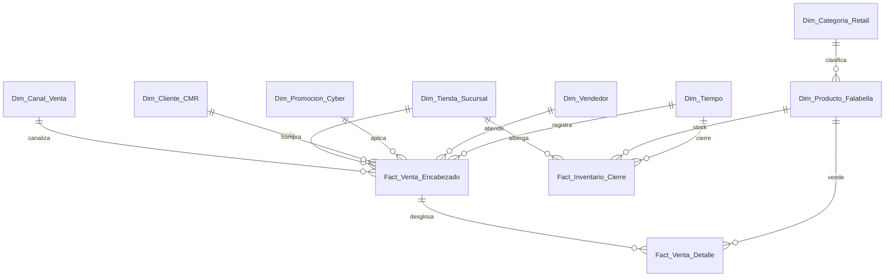

# Esquema Relacional - Falabella Retail Omnicanal Enterprise

Este documento define el modelo analítico dimensional para la operación de retail omnicanal estilo Falabella (tiendas físicas, e-commerce Falabella.com, clientes fidelizados CMR y catálogo multi-departamento).

---

## 1. Diagrama ERD

---

## 2. Dimensiones

### 2.1. `Dim_Tiempo`
Dimensión de calendario continuo para análisis de estacionalidad (180 días).
* **Clave Primaria:** `Fecha_SK`

| Campo | Tipo de Dato | Tipo Clave | Descripción |
| :--- | :--- | :--- | :--- |
| **Fecha_SK** | `int32` | **PKey** | Fecha en formato YYYYMMDD. |
| **Fecha** | `date` | | Fecha calendario ISO. |
| **Dia** | `int8` | | Día del mes (1-31). |
| **Mes** | `int8` | | Mes del año (1-12). |
| **Año** | `int16` | | Año calendario. |
| **Trimestre** | `int8` | | Trimestre del año (1-4). |
| **Dia_Semana** | `int8` | | Índice de día (0 = Lunes, 6 = Domingo). |
| **Es_Fin_Semana** | `int8` | | Indicador fin de semana (1 = Sábado/Domingo, 0 = Lunes-Viernes). |

---

### 2.2. `Dim_Canal_Venta`
Canales de interacción y venta omnicanal.
* **Clave Primaria:** `SK_Canal`

| Campo | Tipo de Dato | Tipo Clave | Descripción |
| :--- | :--- | :--- | :--- |
| **SK_Canal** | `int32` | **PKey** | Identificador de canal. |
| **Codigo_Canal** | `string` | | Código técnico (POS, WEB, APP, CALL). |
| **Nombre_Canal** | `string` | | Nombre descriptivo del canal. |
| **Es_Digital** | `int8` | | Flag binario (1 = Canal Online/Digital, 0 = Tienda Física). |

---

### 2.3. `Dim_Tienda_Sucursal`
Red de sucursales físicas y centros de fulfilment urbano.
* **Clave Primaria:** `SK_Tienda`

| Campo | Tipo de Dato | Tipo Clave | Descripción |
| :--- | :--- | :--- | :--- |
| **SK_Tienda** | `int32` | **PKey** | Identificador único de sucursal. |
| **Codigo_Tienda** | `string` | | Código de tienda (ej: SUC-001). |
| **Nombre_Tienda** | `string` | | Nombre emblemático (Parque Arauco, Costanera Center, Trébol). |
| **Region** | `string` | | Región geográfica (Metropolitana, Biobío, Valparaíso). |
| **Comuna** | `string` | | Comuna de emplazamiento. |
| **Metros_Cuadrados** | `float32` | | Superficie de sala de venta en m2. |

---

### 2.4. `Dim_Categoria_Retail`
Estructura jerárquica de líneas comerciales Falabella.
* **Clave Primaria:** `SK_Categoria`

| Campo | Tipo de Dato | Tipo Clave | Descripción |
| :--- | :--- | :--- | :--- |
| **SK_Categoria** | `int32` | **PKey** | Clave de categoría. |
| **Codigo_Categoria** | `string` | | Código de categoría (CAT-MODA, CAT-TECH). |
| **Nombre_Categoria** | `string` | | Mujer, Hombre, Smart TVs, Telefonía, Decohogar. |
| **Departamento** | `string` | | Gran división (Moda, Tecnología, Hogar, Belleza). |

---

### 2.5. `Dim_Producto_Falabella`
Catálogo de productos, marcas propias y exclusivas.
* **Clave Primaria:** `SK_Producto`
* **Clave Foránea:** `SK_Categoria` referencia a `Dim_Categoria_Retail(SK_Categoria)`

| Campo | Tipo de Dato | Tipo Clave | Descripción |
| :--- | :--- | :--- | :--- |
| **SK_Producto** | `int32` | **PKey** | Identificador único de SKU. |
| **SK_Categoria** | `int32` | **FKey** | Categoría a la que pertenece el producto. |
| **Codigo_SKU** | `string` | | Código de barras / SKU (FAL-XXXX). |
| **Nombre_Producto** | `string` | | Descripción comercial del artículo. |
| **Marca** | `string` | | Marca (Basement, Sybilla, Samsung, Apple, Mango). |
| **Precio_Lista_CLP** | `float64` | | Precio venta sugerido al público. |
| **Costo_Reposicion_CLP** | `float64` | | Costo unitario de adquisición. |

---

### 2.6. `Dim_Cliente_CMR`
Padrón de clientes fidelizados y tarjetahabientes CMR Falabella.
* **Clave Primaria:** `SK_Cliente`

| Campo | Tipo de Dato | Tipo Clave | Descripción |
| :--- | :--- | :--- | :--- |
| **SK_Cliente** | `int32` | **PKey** | Clave única de cliente. |
| **RUT** | `string` | | Documento nacional de identidad. |
| **Nombre_Completo** | `string` | | Nombre y apellidos del cliente. |
| **Segmento_CMR** | `string` | | Nivel CMR (Elite, Premium, Puntos, Sin Tarjeta). |
| **Tiene_CMR** | `int8` | | Indicador de tarjeta activa (1 = Tarjetahabiente, 0 = No tiene). |
| **Email** | `string` | | Correo del cliente. |

---

### 2.7. `Dim_Promocion_Cyber`
Catálogo de eventos comerciales y promociones masivas.
* **Clave Primaria:** `SK_Promocion`

| Campo | Tipo de Dato | Tipo Clave | Descripción |
| :--- | :--- | :--- | :--- |
| **SK_Promocion** | `int32` | **PKey** | Identificador de campaña. |
| **Codigo_Promo** | `string` | | Código de campaña (PROMO-CYBER, PROMO-CMR). |
| **Nombre_Promo** | `string` | | CyberDay Falabella, Oportunidad Única, Sin Promo. |
| **Descuento_Pct** | `float32` | | Porcentaje de rebaja promedio. |
| **Es_Cyber** | `int8` | | Flag evento Cyber (1 = Es CyberDay/BlackFriday, 0 = Normal). |

---

### 2.8. `Dim_Vendedor`
Fuerza de venta consultiva en tiendas departamentales.
* **Clave Primaria:** `SK_Vendedor`

| Campo | Tipo de Dato | Tipo Clave | Descripción |
| :--- | :--- | :--- | :--- |
| **SK_Vendedor** | `int32` | **PKey** | Identificador del vendedor. |
| **Codigo_Vendedor** | `string` | | Código interno de empleado. |
| **Nombre_Vendedor** | `string` | | Nombre del asesor. |
| **Sucursal_Base** | `string` | | Tienda habitual asignada. |

---

## 3. Tablas de Hechos

### 3.1. `Fact_Venta_Encabezado`
Registro a nivel de boleta/orden de compra (transacción consolidada).
* **Clave Primaria:** `ID_Venta`
* **Claves Foráneas:**
  * `Fecha_SK` referencia a `Dim_Tiempo(Fecha_SK)`
  * `SK_Tienda` referencia a `Dim_Tienda_Sucursal(SK_Tienda)`
  * `SK_Canal` referencia a `Dim_Canal_Venta(SK_Canal)`
  * `SK_Cliente` referencia a `Dim_Cliente_CMR(SK_Cliente)`
  * `SK_Promocion` referencia a `Dim_Promocion_Cyber(SK_Promocion)`
  * `SK_Vendedor` referencia a `Dim_Vendedor(SK_Vendedor)`

| Campo | Tipo de Dato | Tipo Clave | Descripción |
| :--- | :--- | :--- | :--- |
| **ID_Venta** | `int64` | **PKey** | Número único de boleta u orden online. |
| **Fecha_SK** | `int32` | **FKey** | Fecha de la transacción. |
| **SK_Tienda** | `int32` | **FKey** | Sucursal donde se emitió o despachó. |
| **SK_Canal** | `int32` | **FKey** | Canal de compra (Físico, Web, App). |
| **SK_Cliente** | `int32` | **FKey** | Cliente comprador. |
| **SK_Promocion** | `int32` | **FKey** | Campaña promocional activa. |
| **SK_Vendedor** | `int32` | **FKey** | Vendedor que acreditó la venta. |
| **Monto_Bruto_CLP** | `float64` | | Valor total antes de descuentos. |
| **Monto_Descuento_CLP** | `float64` | | Rebaja monetaria total en la compra. |
| **Monto_Neto_CLP** | `float64` | | Valor efectivamente recaudado (Venta Neta). |
| **Es_CMR_Pago** | `int8` | | Indicador si pagó con tarjeta CMR (1 = Sí, 0 = No). |

---

### 3.2. `Fact_Venta_Detalle`
Detalle de artículos por línea de boleta con análisis de margen unitario.
* **Clave Primaria:** `ID_Detalle`
* **Claves Foráneas:**
  * `ID_Venta` referencia a `Fact_Venta_Encabezado(ID_Venta)`
  * `SK_Producto` referencia a `Dim_Producto_Falabella(SK_Producto)`

| Campo | Tipo de Dato | Tipo Clave | Descripción |
| :--- | :--- | :--- | :--- |
| **ID_Detalle** | `int64` | **PKey** | Identificador de línea de compra. |
| **ID_Venta** | `int64` | **FKey** | Boleta padre. |
| **SK_Producto** | `int32` | **FKey** | Producto comprado. |
| **Cantidad** | `int32` | | Unidades vendidas del artículo. |
| **Precio_Unitario_CLP** | `float64` | | Precio unitario de venta. |
| **Costo_Unitario_CLP** | `float64` | | Costo unitario de reposición. |
| **Subtotal_Bruto_CLP** | `float64` | | Cantidad * Precio Unitario. |
| **Descuento_Linea_CLP** | `float64` | | Descuento total aplicado en la línea. |
| **Subtotal_Neto_CLP** | `float64` | | Subtotal Bruto menos Descuento. |
| **Costo_Total_CLP** | `float64` | | Cantidad * Costo Unitario. |
| **Margen_Bruto_CLP** | `float64` | | Subtotal Neto menos Costo Total. |

---

### 3.3. `Fact_Inventario_Cierre`
Cierre diario de inventario y valuación de stock por tienda y SKU.
* **Clave Primaria:** `ID_Inventario`
* **Claves Foráneas:**
  * `Fecha_SK` referencia a `Dim_Tiempo(Fecha_SK)`
  * `SK_Tienda` referencia a `Dim_Tienda_Sucursal(SK_Tienda)`
  * `SK_Producto` referencia a `Dim_Producto_Falabella(SK_Producto)`

| Campo | Tipo de Dato | Tipo Clave | Descripción |
| :--- | :--- | :--- | :--- |
| **ID_Inventario** | `int64` | **PKey** | Registro de saldo de inventario. |
| **Fecha_SK** | `int32` | **FKey** | Día del cierre de stock. |
| **SK_Tienda** | `int32` | **FKey** | Sucursal o bodega. |
| **SK_Producto** | `int32` | **FKey** | Producto. |
| **Stock_Unidades** | `int32` | | Cantidad física disponible. |
| **Valor_Inventario_CLP** | `float64` | | Valuación total a costo de reposición. |
