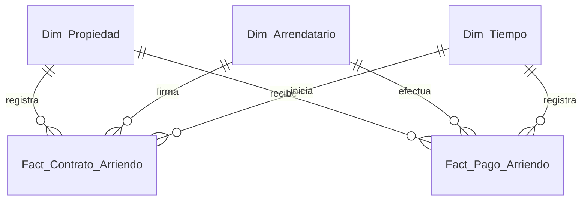

# Esquema Relacional - Pyme Inmobiliaria (Gestión de Propiedades y Arriendos)

## 1. Diagrama ERD

---

## 2. Dimensiones

### 2.1. `Dim_Propiedad`
* **Clave Primaria:** `SK_Propiedad`

| Campo | Tipo de Dato | Tipo Clave | Descripción |
| :--- | :--- | :--- | :--- |
| **SK_Propiedad** | `int32` | **PKey** | Identificador único de la propiedad. |
| **Codigo_Propiedad** | `string` | | Código interno (ej: PROP-001). |
| **Tipo_Propiedad** | `string` | | Tipo de inmueble (Departamento, Casa, Oficina, Bodega). |
| **Direccion** | `string` | | Ubicación física. |
| **Comuna** | `string` | | Comuna donde se ubica. |
| **Valor_Base_UF** | `float32` | | Valor canon de arriendo base en UF. |

---

### 2.2. `Dim_Arrendatario`
* **Clave Primaria:** `SK_Arrendatario`

| Campo | Tipo de Dato | Tipo Clave | Descripción |
| :--- | :--- | :--- | :--- |
| **SK_Arrendatario** | `int32` | **PKey** | Identificador único del cliente/arrendatario. |
| **RUT** | `string` | | RUT o documento de identidad. |
| **Nombre_Completo** | `string` | | Nombre del arrendatario. |
| **Email** | `string` | | Correo electrónico de contacto. |

---

### 2.3. `Dim_Tiempo`
* **Clave Primaria:** `Fecha_SK`

| Campo | Tipo de Dato | Tipo Clave | Descripción |
| :--- | :--- | :--- | :--- |
| **Fecha_SK** | `int32` | **PKey** | Fecha en formato YYYYMMDD. |
| **Fecha** | `date` | | Fecha de calendario. |
| **Mes** | `int8` | | Mes (1-12). |
| **Año** | `int16` | | Año calendario. |

---

## 3. Tablas de Hechos

### 3.1. `Fact_Contrato_Arriendo`
* **Clave Primaria:** `ID_Contrato`
* **Claves Foráneas:**
  * `Fecha_SK` referencia a `Dim_Tiempo(Fecha_SK)`
  * `SK_Propiedad` referencia a `Dim_Propiedad(SK_Propiedad)`
  * `SK_Arrendatario` referencia a `Dim_Arrendatario(SK_Arrendatario)`

| Campo | Tipo de Dato | Tipo Clave | Descripción |
| :--- | :--- | :--- | :--- |
| **ID_Contrato** | `int64` | **PKey** | Clave primaria del contrato. |
| **Fecha_SK** | `int32` | **FKey** | Fecha de inicio del contrato. |
| **SK_Propiedad** | `int32` | **FKey** | Propiedad arrendada. |
| **SK_Arrendatario** | `int32` | **FKey** | Arrendatario que firma. |
| **Monto_Arriendo_CLP** | `float64` | | Valor mensual pactado en CLP. |
| **Comision_Corredor_CLP** | `float64` | | Comisión cobrada por corretaje. |

---

### 3.2. `Fact_Pago_Arriendo`
* **Clave Primaria:** `ID_Pago`
* **Claves Foráneas:**
  * `Fecha_SK` referencia a `Dim_Tiempo(Fecha_SK)`
  * `SK_Propiedad` referencia a `Dim_Propiedad(SK_Propiedad)`
  * `SK_Arrendatario` referencia a `Dim_Arrendatario(SK_Arrendatario)`

| Campo | Tipo de Dato | Tipo Clave | Descripción |
| :--- | :--- | :--- | :--- |
| **ID_Pago** | `int64` | **PKey** | Clave primaria del pago. |
| **Fecha_SK** | `int32` | **FKey** | Fecha de recepción del pago. |
| **SK_Propiedad** | `int32` | **FKey** | Propiedad a la que pertenece el pago. |
| **SK_Arrendatario** | `int32` | **FKey** | Arrendatario pagador. |
| **Monto_Pagado_CLP** | `float64` | | Monto recaudado en pesos. |
| **Dias_Mora** | `int16` | | Días de atraso en el pago respecto al vencimiento. |
