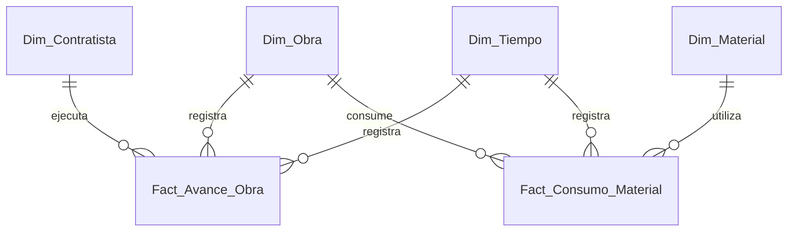

# Esquema Relacional - Pyme Constructora (Control de Obras y Materiales)

## 1. Diagrama ERD

---

## 2. Dimensiones

### 2.1. `Dim_Obra`
* **Clave Primaria:** `SK_Obra`

| Campo | Tipo de Dato | Tipo Clave | Descripción |
| :--- | :--- | :--- | :--- |
| **SK_Obra** | `int32` | **PKey** | Identificador de la obra/proyecto. |
| **Codigo_Obra** | `string` | | Código identificador (ej: OBR-2026-01). |
| **Nombre_Obra** | `string` | | Nombre del proyecto de construcción. |
| **Ubicacion** | `string` | | Ciudad o comuna. |
| **Presupuesto_CLP** | `float64` | | Presupuesto total asignado. |

---

### 2.2. `Dim_Material`
* **Clave Primaria:** `SK_Material`

| Campo | Tipo de Dato | Tipo Clave | Descripción |
| :--- | :--- | :--- | :--- |
| **SK_Material** | `int32` | **PKey** | Identificador del insumo o material. |
| **Codigo_SKU** | `string` | | Código SKU del insumo. |
| **Nombre_Material** | `string` | | Cemento, Fierro, Hormigón, etc. |
| **Unidad_Medida** | `string` | | Kg, m3, Saco, Tira. |

---

### 2.3. `Dim_Contratista`
* **Clave Primaria:** `SK_Contratista`

| Campo | Tipo de Dato | Tipo Clave | Descripción |
| :--- | :--- | :--- | :--- |
| **SK_Contratista** | `int32` | **PKey** | Identificador del subcontratista. |
| **Razon_Social** | `string` | | Empresa contratista. |
| **Especialidad** | `string` | | Encofrado, Electricidad, Enfierradura. |

---

### 2.4. `Dim_Tiempo`
* **Clave Primaria:** `Fecha_SK`

| Campo | Tipo de Dato | Tipo Clave | Descripción |
| :--- | :--- | :--- | :--- |
| **Fecha_SK** | `int32` | **PKey** | Identificador en formato YYYYMMDD. |
| **Fecha** | `date` | | Fecha calendario. |

---

## 3. Tablas de Hechos

### 3.1. `Fact_Avance_Obra`
* **Clave Primaria:** `ID_Avance`
* **Claves Foráneas:**
  * `Fecha_SK` referencia a `Dim_Tiempo(Fecha_SK)`
  * `SK_Obra` referencia a `Dim_Obra(SK_Obra)`
  * `SK_Contratista` referencia a `Dim_Contratista(SK_Contratista)`

| Campo | Tipo de Dato | Tipo Clave | Descripción |
| :--- | :--- | :--- | :--- |
| **ID_Avance** | `int64` | **PKey** | Identificador del reporte de avance. |
| **Fecha_SK** | `int32` | **FKey** | Fecha del reporte. |
| **SK_Obra** | `int32` | **FKey** | Obra física evaluada. |
| **SK_Contratista** | `int32` | **FKey** | Subcontratista a cargo. |
| **Porcentaje_Avance_Pct** | `float32` | | Porcentaje de física ejecutado. |
| **Costo_Labor_CLP** | `float64` | | Costo cobrado por la mano de obra. |

---

### 3.2. `Fact_Consumo_Material`
* **Clave Primaria:** `ID_Consumo`
* **Claves Foráneas:**
  * `Fecha_SK` referencia a `Dim_Tiempo(Fecha_SK)`
  * `SK_Obra` referencia a `Dim_Obra(SK_Obra)`
  * `SK_Material` referencia a `Dim_Material(SK_Material)`

| Campo | Tipo de Dato | Tipo Clave | Descripción |
| :--- | :--- | :--- | :--- |
| **ID_Consumo** | `int64` | **PKey** | Registro de salida de bodega. |
| **Fecha_SK** | `int32` | **FKey** | Fecha del despacho a la obra. |
| **SK_Obra** | `int32` | **FKey** | Obra destino. |
| **SK_Material** | `int32` | **FKey** | Material consumido. |
| **Cantidad_Consumida** | `float32` | | Cantidad de unidades físicas. |
| **Costo_Material_CLP** | `float64` | | Valor total monetario del material. |
