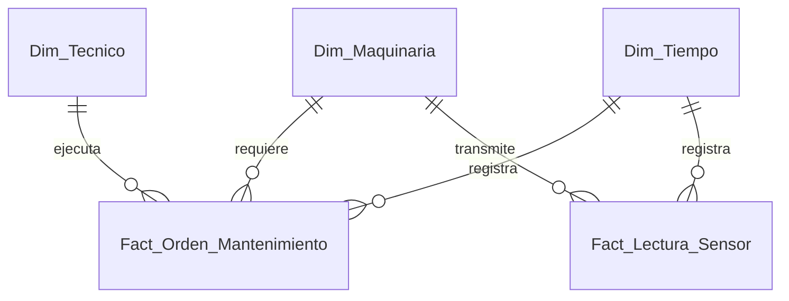

# Esquema Relacional - Pyme Industrial (Taller y Mantenimiento de Maquinaria)

## 1. Diagrama ERD

---

## 2. Dimensiones

### 2.1. `Dim_Maquinaria`
* **Clave Primaria:** `SK_Maquina`

| Campo | Tipo de Dato | Tipo Clave | Descripción |
| :--- | :--- | :--- | :--- |
| **SK_Maquina** | `int32` | **PKey** | Identificador único de la máquina/equipo. |
| **Codigo_Equipo** | `string` | | Código de inventario técnico. |
| **Modelo** | `string` | | Modelo industrial. |
| **Tipo_Maquina** | `string` | | Torno CNC, Cortadora Láser, Inyectora. |

---

### 2.2. `Dim_Tecnico`
* **Clave Primaria:** `SK_Tecnico`

| Campo | Tipo de Dato | Tipo Clave | Descripción |
| :--- | :--- | :--- | :--- |
| **SK_Tecnico** | `int32` | **PKey** | Identificador del mecánico/técnico. |
| **Nombre** | `string` | | Nombre del operador técnico. |
| **Nivel_Certificacion** | `string` | | Junior, Senior, Especialista CNC. |

---

### 2.3. `Dim_Tiempo`
* **Clave Primaria:** `Fecha_SK`

| Campo | Tipo de Dato | Tipo Clave | Descripción |
| :--- | :--- | :--- | :--- |
| **Fecha_SK** | `int32` | **PKey** | Fecha en formato YYYYMMDD. |
| **Fecha** | `date` | | Timestamp / Fecha. |

---

## 3. Tablas de Hechos

### 3.1. `Fact_Orden_Mantenimiento`
* **Clave Primaria:** `ID_Orden`
* **Claves Foráneas:**
  * `Fecha_SK` referencia a `Dim_Tiempo(Fecha_SK)`
  * `SK_Maquina` referencia a `Dim_Maquinaria(SK_Maquina)`
  * `SK_Tecnico` referencia a `Dim_Tecnico(SK_Tecnico)`

| Campo | Tipo de Dato | Tipo Clave | Descripción |
| :--- | :--- | :--- | :--- |
| **ID_Orden** | `int64` | **PKey** | Identificador único de la OT. |
| **Fecha_SK** | `int32` | **FKey** | Fecha de ejecución de la orden. |
| **SK_Maquina** | `int32` | **FKey** | Maquinaria intervenida. |
| **SK_Tecnico** | `int32` | **FKey** | Técnico asignado. |
| **Tipo_Mantenimiento** | `string` | | Preventivo, Correctivo. |
| **Horas_Reparacion** | `float32` | | Tiempo empleado en la intervención. |
| **Costo_Repuestos_CLP** | `float64` | | Gasto monetario en insumos/piezas. |

---

### 3.2. `Fact_Lectura_Sensor`
* **Clave Primaria:** `ID_Lectura`
* **Claves Foráneas:**
  * `Fecha_SK` referencia a `Dim_Tiempo(Fecha_SK)`
  * `SK_Maquina` referencia a `Dim_Maquinaria(SK_Maquina)`

| Campo | Tipo de Dato | Tipo Clave | Descripción |
| :--- | :--- | :--- | :--- |
| **ID_Lectura** | `int64` | **PKey** | Identificador del log del sensor. |
| **Fecha_SK** | `int32` | **FKey** | Día del muestreo. |
| **SK_Maquina** | `int32` | **FKey** | Máquina monitoreada. |
| **Temperatura_C** | `float32` | | Temperatura registrada (°C). |
| **Vibracion_Hz** | `float32` | | Frecuencia de vibración (Hz). |
| **Horas_Uso_Acumuladas** | `float32` | | Horas de motor acumuladas. |
