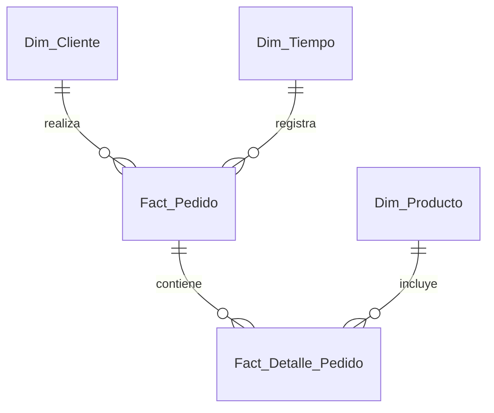

# Esquema Relacional - Pyme E-commerce (Tienda Online Shopify / WooCommerce)

## 1. Diagrama ERD

---

## 2. Dimensiones

### 2.1. `Dim_Cliente`
* **Clave Primaria:** `SK_Cliente`

| Campo | Tipo de Dato | Tipo Clave | Descripción |
| :--- | :--- | :--- | :--- |
| **SK_Cliente** | `int32` | **PKey** | Surrogate key del comprador. |
| **Email** | `string` | | Correo del cliente. |
| **Nombre** | `string` | | Nombre completo. |
| **Ciudad_Envio** | `string` | | Ciudad por defecto. |

---

### 2.2. `Dim_Producto`
* **Clave Primaria:** `SK_Producto`

| Campo | Tipo de Dato | Tipo Clave | Descripción |
| :--- | :--- | :--- | :--- |
| **SK_Producto** | `int32` | **PKey** | Identificador único de producto. |
| **SKU** | `string` | | Código identificador de catálogo. |
| **Nombre_Producto** | `string` | | Título del ítem. |
| **Categoria** | `string` | | Ropa, Accesorios, Calzado. |
| **Precio_Lista_CLP** | `float64` | | Precio unitario base. |

---

### 2.3. `Dim_Tiempo`
* **Clave Primaria:** `Fecha_SK`

| Campo | Tipo de Dato | Tipo Clave | Descripción |
| :--- | :--- | :--- | :--- |
| **Fecha_SK** | `int32` | **PKey** | Formato YYYYMMDD. |
| **Fecha** | `date` | | Día calendario. |

---

## 3. Tablas de Hechos

### 3.1. `Fact_Pedido`
* **Clave Primaria:** `ID_Pedido`
* **Claves Foráneas:**
  * `Fecha_SK` referencia a `Dim_Tiempo(Fecha_SK)`
  * `SK_Cliente` referencia a `Dim_Cliente(SK_Cliente)`

| Campo | Tipo de Dato | Tipo Clave | Descripción |
| :--- | :--- | :--- | :--- |
| **ID_Pedido** | `int64` | **PKey** | Clave única de la orden de compra. |
| **Fecha_SK** | `int32` | **FKey** | Fecha del checkout. |
| **SK_Cliente** | `int32` | **FKey** | Cliente comprador. |
| **Monto_Total_CLP** | `float64` | | Total cobrado en la compra. |
| **Costo_Envio_CLP** | `float64` | | Monto del flete/despacho. |
| **Estado_Pedido** | `string` | | Completado, Entregado, Cancelado. |

---

### 3.2. `Fact_Detalle_Pedido`
* **Clave Primaria:** `ID_Item`
* **Claves Foráneas:**
  * `ID_Pedido` referencia a `Fact_Pedido(ID_Pedido)`
  * `SK_Producto` referencia a `Dim_Producto(SK_Producto)`

| Campo | Tipo de Dato | Tipo Clave | Descripción |
| :--- | :--- | :--- | :--- |
| **ID_Item** | `int64` | **PKey** | Clave primaria de la línea de detalle. |
| **ID_Pedido** | `int64` | **FKey** | Pedido al que pertenece. |
| **SK_Producto** | `int32` | **FKey** | Producto vendido. |
| **Cantidad** | `int16` | | Número de unidades compradas. |
| **Precio_Venta_CLP** | `float64` | | Precio unitario real cobrado. |
| **Descuento_CLP** | `float64` | | Descuento total aplicado en la línea. |
