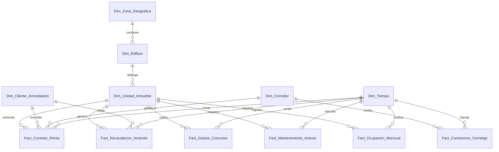

# Esquema Relacional - Mediana Inmobiliaria & Asset Management

## 1. Diagrama ERD

---

## 2. Dimensiones

### 2.1. `Dim_Zona_Geografica`
* **Clave Primaria:** `SK_Zona`

| Campo | Tipo de Dato | Tipo Clave | Descripción |
| :--- | :--- | :--- | :--- |
| **SK_Zona** | `int32` | **PKey** | Clave primaria geográfica. |
| **Region** | `string` | | Región o provincia. |
| **Comuna** | `string` | | Comuna específica. |

---

### 2.2. `Dim_Edificio`
* **Clave Primaria:** `SK_Edificio`
* **Clave Foránea:** `SK_Zona` referencia a `Dim_Zona_Geografica(SK_Zona)`

| Campo | Tipo de Dato | Tipo Clave | Descripción |
| :--- | :--- | :--- | :--- |
| **SK_Edificio** | `int32` | **PKey** | Identificador del edificio/strip center. |
| **SK_Zona** | `int32` | **FKey** | Zona donde se ubica el edificio. |
| **Nombre_Edificio** | `string` | | Nombre comercial del inmueble corporativo. |
| **Superficie_Total_m2** | `float32` | | Superficie construida en m2. |

---

### 2.3. `Dim_Unidad_Inmueble`
* **Clave Primaria:** `SK_Unidad`
* **Clave Foránea:** `SK_Edificio` referencia a `Dim_Edificio(SK_Edificio)`

| Campo | Tipo de Dato | Tipo Clave | Descripción |
| :--- | :--- | :--- | :--- |
| **SK_Unidad** | `int32` | **PKey** | Identificador de la unidad (depto/oficina/local). |
| **SK_Edificio** | `int32` | **FKey** | Edificio al que pertenece la unidad. |
| **Codigo_Unidad** | `string` | | Número u oficina (ej: OF-1002). |
| **Tipo_Uso** | `string` | | Oficina, Local Comercial, Estacionamiento, Bodega. |
| **Superficie_Util_m2** | `float32` | | Superficie arrendable útil. |

---

### 2.4. `Dim_Cliente_Arrendatario`
* **Clave Primaria:** `SK_Arrendatario`

| Campo | Tipo de Dato | Tipo Clave | Descripción |
| :--- | :--- | :--- | :--- |
| **SK_Arrendatario** | `int32` | **PKey** | Clave única del arrendatario. |
| **RUT_Empresa** | `string` | | RUT o Tax ID del cliente corporativo. |
| **Razon_Social** | `string` | | Nombre legal o de fantasía. |
| **Giro_Comercial** | `string` | | Rubro del arrendatario. |

---

### 2.5. `Dim_Corredor`
* **Clave Primaria:** `SK_Corredor`

| Campo | Tipo de Dato | Tipo Clave | Descripción |
| :--- | :--- | :--- | :--- |
| **SK_Corredor** | `int32` | **PKey** | Identificador del agente/corredor. |
| **Nombre_Agente** | `string` | | Nombre del ejecutivo. |
| **Comision_Pct** | `float32` | | Porcentaje de comisión estándar. |

---

### 2.6. `Dim_Tiempo`
* **Clave Primaria:** `Fecha_SK`

| Campo | Tipo de Dato | Tipo Clave | Descripción |
| :--- | :--- | :--- | :--- |
| **Fecha_SK** | `int32` | **PKey** | Clave de fecha YYYYMMDD. |
| **Fecha** | `date` | | Fecha. |
| **Mes** | `int8` | | Mes. |
| **Año** | `int16` | | Año. |

---

## 3. Tablas de Hechos

### 3.1. `Fact_Contrato_Renta`
* **Clave Primaria:** `ID_Contrato`
* **Claves Foráneas:**
  * `Fecha_SK` referencia a `Dim_Tiempo(Fecha_SK)`
  * `SK_Unidad` referencia a `Dim_Unidad_Inmueble(SK_Unidad)`
  * `SK_Arrendatario` referencia a `Dim_Cliente_Arrendatario(SK_Arrendatario)`
  * `SK_Corredor` referencia a `Dim_Corredor(SK_Corredor)`

| Campo | Tipo de Dato | Tipo Clave | Descripción |
| :--- | :--- | :--- | :--- |
| **ID_Contrato** | `int64` | **PKey** | Clave del contrato. |
| **Fecha_SK** | `int32` | **FKey** | Fecha de inicio. |
| **SK_Unidad** | `int32` | **FKey** | Unidad arrendada. |
| **SK_Arrendatario** | `int32` | **FKey** | Cliente firmante. |
| **SK_Corredor** | `int32` | **FKey** | Agente intermediario. |
| **Canon_UF** | `float64` | | Monto mensual en UF. |
| **Garantia_UF** | `float64` | | Depósito en garantía. |

---

### 3.2. `Fact_Recaudacion_Arriendo`
* **Clave Primaria:** `ID_Recaudacion`
* **Claves Foráneas:**
  * `Fecha_SK` referencia a `Dim_Tiempo(Fecha_SK)`
  * `SK_Unidad` referencia a `Dim_Unidad_Inmueble(SK_Unidad)`
  * `SK_Arrendatario` referencia a `Dim_Cliente_Arrendatario(SK_Arrendatario)`

| Campo | Tipo de Dato | Tipo Clave | Descripción |
| :--- | :--- | :--- | :--- |
| **ID_Recaudacion** | `int64` | **PKey** | Clave del pago recaudado. |
| **Fecha_SK** | `int32` | **FKey** | Fecha del cobro. |
| **SK_Unidad** | `int32` | **FKey** | Unidad cobrada. |
| **SK_Arrendatario** | `int32` | **FKey** | Pagador. |
| **Monto_Recaudado_CLP** | `float64` | | Valor efectivamente recaudado. |
| **Multa_Mora_CLP** | `float64` | | Interés o recargo por atraso. |

---

### 3.3. `Fact_Gastos_Comunes`
* **Clave Primaria:** `ID_Gasto_Comun`
* **Claves Foráneas:**
  * `Fecha_SK` referencia a `Dim_Tiempo(Fecha_SK)`
  * `SK_Unidad` referencia a `Dim_Unidad_Inmueble(SK_Unidad)`

| Campo | Tipo de Dato | Tipo Clave | Descripción |
| :--- | :--- | :--- | :--- |
| **ID_Gasto_Comun** | `int64` | **PKey** | Clave de cobro de GC. |
| **Fecha_SK** | `int32` | **FKey** | Periodo de cobro. |
| **SK_Unidad** | `int32` | **FKey** | Unidad asociada. |
| **Monto_GC_CLP** | `float64` | | Cobro total de gastos comunes. |
| **Fondo_Reserva_CLP** | `float64` | | Aporte a fondo de reserva. |

---

### 3.4. `Fact_Mantenimiento_Activos`
* **Clave Primaria:** `ID_Mantenimiento`
* **Claves Foráneas:**
  * `Fecha_SK` referencia a `Dim_Tiempo(Fecha_SK)`
  * `SK_Unidad` referencia a `Dim_Unidad_Inmueble(SK_Unidad)`

| Campo | Tipo de Dato | Tipo Clave | Descripción |
| :--- | :--- | :--- | :--- |
| **ID_Mantenimiento** | `int64` | **PKey** | Clave del servicio técnico. |
| **Fecha_SK** | `int32` | **FKey** | Fecha de intervención. |
| **SK_Unidad** | `int32` | **FKey** | Unidad o espacio intervenido. |
| **Costo_Reparacion_CLP** | `float64` | | Gasto monetario de mantención. |

---

### 3.5. `Fact_Comisiones_Corretaje`
* **Clave Primaria:** `ID_Comision`
* **Claves Foráneas:**
  * `Fecha_SK` referencia a `Dim_Tiempo(Fecha_SK)`
  * `SK_Corredor` referencia a `Dim_Corredor(SK_Corredor)`

| Campo | Tipo de Dato | Tipo Clave | Descripción |
| :--- | :--- | :--- | :--- |
| **ID_Comision** | `int64` | **PKey** | Registro de comisión. |
| **Fecha_SK** | `int32` | **FKey** | Fecha de liquidación. |
| **SK_Corredor** | `int32` | **FKey** | Corredor beneficiario. |
| **Monto_Comision_CLP** | `float64` | | Pago de honorario por contrato. |

---

### 3.6. `Fact_Ocupacion_Mensual`
* **Clave Primaria:** `ID_Ocupacion`
* **Claves Foráneas:**
  * `Fecha_SK` referencia a `Dim_Tiempo(Fecha_SK)`
  * `SK_Unidad` referencia a `Dim_Unidad_Inmueble(SK_Unidad)`

| Campo | Tipo de Dato | Tipo Clave | Descripción |
| :--- | :--- | :--- | :--- |
| **ID_Ocupacion** | `int64` | **PKey** | Log mensual de ocupación. |
| **Fecha_SK** | `int32` | **FKey** | Mes de evaluación. |
| **SK_Unidad** | `int32` | **FKey** | Unidad evaluada. |
| **Es_Ocupada** | `int8` | | Indicador lógico (1 = Arrendada, 0 = Vacante). |
| **Dias_Vacancia** | `int16` | | Días acumulados vacante en el mes. |
