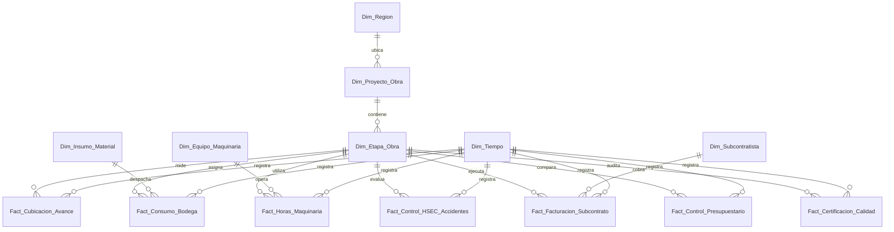

# Esquema Relacional - Mediana Constructora & Control de Faenas

## 1. Diagrama ERD

---

## 2. Dimensiones

### 2.1. `Dim_Region`
* **Clave Primaria:** `SK_Region`

| Campo | Tipo de Dato | Tipo Clave | Descripción |
| :--- | :--- | :--- | :--- |
| **SK_Region** | `int32` | **PKey** | Región geográfica de la faena. |
| **Nombre_Region** | `string` | | Nombre territorial. |

---

### 2.2. `Dim_Proyecto_Obra`
* **Clave Primaria:** `SK_Proyecto`
* **Clave Foránea:** `SK_Region` referencia a `Dim_Region(SK_Region)`

| Campo | Tipo de Dato | Tipo Clave | Descripción |
| :--- | :--- | :--- | :--- |
| **SK_Proyecto** | `int32` | **PKey** | Clave del proyecto. |
| **SK_Region** | `int32` | **FKey** | Región del proyecto. |
| **Nombre_Proyecto** | `string` | | Obra vial, edificación, puente, etc. |

---

### 2.3. `Dim_Etapa_Obra`
* **Clave Primaria:** `SK_Etapa`
* **Clave Foránea:** `SK_Proyecto` referencia a `Dim_Proyecto_Obra(SK_Proyecto)`

| Campo | Tipo de Dato | Tipo Clave | Descripción |
| :--- | :--- | :--- | :--- |
| **SK_Etapa** | `int32` | **PKey** | Sub-etapa de construcción. |
| **SK_Proyecto** | `int32` | **FKey** | Proyecto contenedor. |
| **Nombre_Etapa** | `string` | | Excavación, Fundaciones, Obra Gruesa, Terminaciones. |

---

### 2.4. `Dim_Subcontratista`
* **Clave Primaria:** `SK_Subcontratista`

| Campo | Tipo de Dato | Tipo Clave | Descripción |
| :--- | :--- | :--- | :--- |
| **SK_Subcontratista** | `int32` | **PKey** | Contratista especializado. |
| **Razon_Social** | `string` | | Nombre legal. |

---

### 2.5. `Dim_Insumo_Material`
* **Clave Primaria:** `SK_Insumo`

| Campo | Tipo de Dato | Tipo Clave | Descripción |
| :--- | :--- | :--- | :--- |
| **SK_Insumo** | `int32` | **PKey** | Material de construcción. |
| **Nombre_Insumo** | `string` | | Cemento, Hormigón, Acero, Cerámica. |

---

### 2.6. `Dim_Equipo_Maquinaria`
* **Clave Primaria:** `SK_Equipo`

| Campo | Tipo de Dato | Tipo Clave | Descripción |
| :--- | :--- | :--- | :--- |
| **SK_Equipo** | `int32` | **PKey** | Maquinaria pesada. |
| **Tipo_Equipo** | `string` | | Grúa Torre, Excavadora, Camión Mix. |

---

### 2.7. `Dim_Tiempo`
* **Clave Primaria:** `Fecha_SK`

| Campo | Tipo de Dato | Tipo Clave | Descripción |
| :--- | :--- | :--- | :--- |
| **Fecha_SK** | `int32` | **PKey** | Fecha YYYYMMDD. |
| **Fecha** | `date` | | Fecha. |

---

## 3. Tablas de Hechos

### 3.1. `Fact_Cubicacion_Avance`
* **Clave Primaria:** `ID_Cubicacion`
* **Claves Foráneas:**
  * `Fecha_SK` referencia a `Dim_Tiempo(Fecha_SK)`
  * `SK_Etapa` referencia a `Dim_Etapa_Obra(SK_Etapa)`

| Campo | Tipo de Dato | Tipo Clave | Descripción |
| :--- | :--- | :--- | :--- |
| **ID_Cubicacion** | `int64` | **PKey** | Registro de cubicación. |
| **Fecha_SK** | `int32` | **FKey** | Fecha de medición. |
| **SK_Etapa** | `int32` | **FKey** | Etapa evaluada. |
| **Volumen_Cubicado_m3** | `float64` | | Volumen o metros avanzados. |

---

### 3.2. `Fact_Consumo_Bodega`
* **Clave Primaria:** `ID_Movimiento_Bodega`
* **Claves Foráneas:**
  * `Fecha_SK` referencia a `Dim_Tiempo(Fecha_SK)`
  * `SK_Etapa` referencia a `Dim_Etapa_Obra(SK_Etapa)`
  * `SK_Insumo` referencia a `Dim_Insumo_Material(SK_Insumo)`

| Campo | Tipo de Dato | Tipo Clave | Descripción |
| :--- | :--- | :--- | :--- |
| **ID_Movimiento_Bodega** | `int64` | **PKey** | Vale de salida. |
| **Fecha_SK** | `int32` | **FKey** | Fecha salida. |
| **SK_Etapa** | `int32` | **FKey** | Etapa receptora. |
| **SK_Insumo** | `int32` | **FKey** | Insumo salido. |
| **Cantidad_Despachada** | `float64` | | Cantidad entregada. |

---

### 3.3. `Fact_Horas_Maquinaria`
* **Clave Primaria:** `ID_Horometro`
* **Claves Foráneas:**
  * `Fecha_SK` referencia a `Dim_Tiempo(Fecha_SK)`
  * `SK_Etapa` referencia a `Dim_Etapa_Obra(SK_Etapa)`
  * `SK_Equipo` referencia a `Dim_Equipo_Maquinaria(SK_Equipo)`

| Campo | Tipo de Dato | Tipo Clave | Descripción |
| :--- | :--- | :--- | :--- |
| **ID_Horometro** | `int64` | **PKey** | Registro horómetro. |
| **Fecha_SK** | `int32` | **FKey** | Fecha uso. |
| **SK_Etapa** | `int32` | **FKey** | Etapa servida. |
| **SK_Equipo** | `int32` | **FKey** | Maquinaria operada. |
| **Horas_Operativas** | `float32` | | Horas efectivas. |

---

### 3.4. `Fact_Control_HSEC_Accidentes`
* **Clave Primaria:** `ID_Evento_HSEC`
* **Claves Foráneas:**
  * `Fecha_SK` referencia a `Dim_Tiempo(Fecha_SK)`
  * `SK_Etapa` referencia a `Dim_Etapa_Obra(SK_Etapa)`

| Campo | Tipo de Dato | Tipo Clave | Descripción |
| :--- | :--- | :--- | :--- |
| **ID_Evento_HSEC** | `int64` | **PKey** | Incidente de seguridad. |
| **Fecha_SK** | `int32` | **FKey** | Fecha del evento. |
| **SK_Etapa** | `int32` | **FKey** | Etapa del accidente. |
| **Dias_Perdidos** | `int16` | | Días de licencia/atraso por accidente. |

---

### 3.5. `Fact_Facturacion_Subcontrato`
* **Clave Primaria:** `ID_Factura_Sub`
* **Claves Foráneas:**
  * `Fecha_SK` referencia a `Dim_Tiempo(Fecha_SK)`
  * `SK_Etapa` referencia a `Dim_Etapa_Obra(SK_Etapa)`
  * `SK_Subcontratista` referencia a `Dim_Subcontratista(SK_Subcontratista)`

| Campo | Tipo de Dato | Tipo Clave | Descripción |
| :--- | :--- | :--- | :--- |
| **ID_Factura_Sub** | `int64` | **PKey** | Factura del contratista. |
| **Fecha_SK** | `int32` | **FKey** | Fecha recepción. |
| **SK_Etapa** | `int32` | **FKey** | Etapa involucrada. |
| **SK_Subcontratista** | `int32` | **FKey** | Emisor factura. |
| **Monto_Facturado_CLP** | `float64` | | Cobro total en pesos. |

---

### 3.6. `Fact_Control_Presupuestario`
* **Clave Primaria:** `ID_Presupuesto_Log`
* **Claves Foráneas:**
  * `Fecha_SK` referencia a `Dim_Tiempo(Fecha_SK)`
  * `SK_Etapa` referencia a `Dim_Etapa_Obra(SK_Etapa)`

| Campo | Tipo de Dato | Tipo Clave | Descripción |
| :--- | :--- | :--- | :--- |
| **ID_Presupuesto_Log** | `int64` | **PKey** | Evaluación de costo. |
| **Fecha_SK** | `int32` | **FKey** | Mes evaluado. |
| **SK_Etapa** | `int32` | **FKey** | Etapa presupuestada. |
| **Costo_Real_CLP** | `float64` | | Gasto ejecutado. |
| **Desviacion_CLP** | `float64` | | Sobre-costo o ahorro. |

---

### 3.7. `Fact_Certificacion_Calidad`
* **Clave Primaria:** `ID_Inspeccion`
* **Claves Foráneas:**
  * `Fecha_SK` referencia a `Dim_Tiempo(Fecha_SK)`
  * `SK_Etapa` referencia a `Dim_Etapa_Obra(SK_Etapa)`

| Campo | Tipo de Dato | Tipo Clave | Descripción |
| :--- | :--- | :--- | :--- |
| **ID_Inspeccion** | `int64` | **PKey** | Auditoría de calidad. |
| **Fecha_SK** | `int32` | **FKey** | Fecha inspección. |
| **SK_Etapa** | `int32` | **FKey** | Etapa inspeccionada. |
| **Puntaje_Calidad_Pct** | `float32` | | Score de cumplimiento normativo. |
