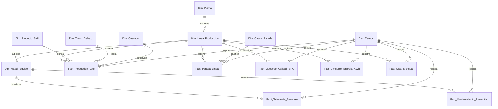

# Esquema Relacional - Mediana Planta Industrial Manufacturera (OEE & SPC)

## 1. Diagrama ERD

---

## 2. Dimensiones

### 2.1. `Dim_Planta`
* **Clave Primaria:** `SK_Planta`

| Campo | Tipo de Dato | Tipo Clave | Descripción |
| :--- | :--- | :--- | :--- |
| **SK_Planta** | `int32` | **PKey** | Identificador de la planta industrial. |
| **Nombre_Planta** | `string` | | Ubicación (ej: Planta Maipú, Planta Concepción). |

---

### 2.2. `Dim_Linea_Produccion`
* **Clave Primaria:** `SK_Linea`
* **Clave Foránea:** `SK_Planta` referencia a `Dim_Planta(SK_Planta)`

| Campo | Tipo de Dato | Tipo Clave | Descripción |
| :--- | :--- | :--- | :--- |
| **SK_Linea** | `int32` | **PKey** | Identificador de línea de montaje/embotellado. |
| **SK_Planta** | `int32` | **FKey** | Planta a la que pertenece. |
| **Nombre_Linea** | `string` | | Línea 1 Embotellado, Línea 2 Empaque. |

---

### 2.3. `Dim_Maqui_Equipo`
* **Clave Primaria:** `SK_Equipo`
* **Clave Foránea:** `SK_Linea` referencia a `Dim_Linea_Produccion(SK_Linea)`

| Campo | Tipo de Dato | Tipo Clave | Descripción |
| :--- | :--- | :--- | :--- |
| **SK_Equipo** | `int32` | **PKey** | Equipo de la línea. |
| **SK_Linea** | `int32` | **FKey** | Línea donde está instalada. |
| **Nombre_Equipo** | `string` | | Extrusora, Etiquetadora, Caldera. |

---

### 2.4. `Dim_Producto_SKU`
* **Clave Primaria:** `SK_Producto`

| Campo | Tipo de Dato | Tipo Clave | Descripción |
| :--- | :--- | :--- | :--- |
| **SK_Producto** | `int32` | **PKey** | Producto fabricado. |
| **SKU** | `string` | | Código del artículo. |
| **Nombre** | `string` | | Descripción comercial. |

---

### 2.5. `Dim_Turno_Trabajo`
* **Clave Primaria:** `SK_Turno`

| Campo | Tipo de Dato | Tipo Clave | Descripción |
| :--- | :--- | :--- | :--- |
| **SK_Turno** | `int32` | **PKey** | Turno operacional. |
| **Nombre_Turno** | `string` | | Mañana, Tarde, Noche. |

---

### 2.6. `Dim_Operador`
* **Clave Primaria:** `SK_Operador`

| Campo | Tipo de Dato | Tipo Clave | Descripción |
| :--- | :--- | :--- | :--- |
| **SK_Operador** | `int32` | **PKey** | Jefe de turno / Operador. |
| **Nombre_Operador** | `string` | | Nombre del supervisor. |

---

### 2.7. `Dim_Causa_Parada`
* **Clave Primaria:** `SK_Causa`

| Campo | Tipo de Dato | Tipo Clave | Descripción |
| :--- | :--- | :--- | :--- |
| **SK_Causa** | `int32` | **PKey** | Clasificación de falla/falla programada. |
| **Categoria_Causa** | `string` | | Mecánica, Eléctrica, Falta Insumo, Cambio Formato. |

---

### 2.8. `Dim_Tiempo`
* **Clave Primaria:** `Fecha_SK`

| Campo | Tipo de Dato | Tipo Clave | Descripción |
| :--- | :--- | :--- | :--- |
| **Fecha_SK** | `int32` | **PKey** | Fecha YYYYMMDD. |
| **Fecha** | `date` | | Fecha. |

---

## 3. Tablas de Hechos

### 3.1. `Fact_Produccion_Lote`
* **Clave Primaria:** `ID_Lote`
* **Claves Foráneas:**
  * `Fecha_SK` referencia a `Dim_Tiempo(Fecha_SK)`
  * `SK_Linea` referencia a `Dim_Linea_Produccion(SK_Linea)`
  * `SK_Producto` referencia a `Dim_Producto_SKU(SK_Producto)`
  * `SK_Turno` referencia a `Dim_Turno_Trabajo(SK_Turno)`
  * `SK_Operador` referencia a `Dim_Operador(SK_Operador)`

| Campo | Tipo de Dato | Tipo Clave | Descripción |
| :--- | :--- | :--- | :--- |
| **ID_Lote** | `int64` | **PKey** | Lote fabricado. |
| **Fecha_SK** | `int32` | **FKey** | Fecha de fabricación. |
| **SK_Linea** | `int32` | **FKey** | Línea usada. |
| **SK_Producto** | `int32` | **FKey** | Producto. |
| **SK_Turno** | `int32` | **FKey** | Turno de trabajo. |
| **SK_Operador** | `int32` | **FKey** | Supervisor a cargo. |
| **Unidades_Buenas** | `float64` | | Conteo de unidades conforme. |
| **Unidades_Scrap** | `float64` | | Unidades merma/defectuosas. |

---

### 3.2. `Fact_Parada_Linea`
* **Clave Primaria:** `ID_Parada`
* **Claves Foráneas:**
  * `Fecha_SK` referencia a `Dim_Tiempo(Fecha_SK)`
  * `SK_Linea` referencia a `Dim_Linea_Produccion(SK_Linea)`
  * `SK_Causa` referencia a `Dim_Causa_Parada(SK_Causa)`

| Campo | Tipo de Dato | Tipo Clave | Descripción |
| :--- | :--- | :--- | :--- |
| **ID_Parada** | `int64` | **PKey** | Evento de detención. |
| **Fecha_SK** | `int32` | **FKey** | Fecha evento. |
| **SK_Linea** | `int32` | **FKey** | Línea detenida. |
| **SK_Causa** | `int32` | **FKey** | Motivo de la parada. |
| **Minutos_Parada** | `float32` | | Tiempo total no operativo en minutos. |

---

### 3.3. `Fact_Telemetria_Sensores`
* **Clave Primaria:** `ID_Log_Sensor`
* **Claves Foráneas:**
  * `Fecha_SK` referencia a `Dim_Tiempo(Fecha_SK)`
  * `SK_Equipo` referencia a `Dim_Maqui_Equipo(SK_Equipo)`

| Campo | Tipo de Dato | Tipo Clave | Descripción |
| :--- | :--- | :--- | :--- |
| **ID_Log_Sensor** | `int64` | **PKey** | Telemetría SCADA/IoT. |
| **Fecha_SK** | `int32` | **FKey** | Fecha muestreo. |
| **SK_Equipo** | `int32` | **FKey** | Equipo emisor. |
| **Temperatura_Motor_C** | `float32` | | Grados C. |
| **Vibracion_RMS_G** | `float32` | | Vibración RMS. |
| **Presion_PSI** | `float32` | | Presión del sistema. |

---

### 3.4. `Fact_Muestreo_Calidad_SPC`
* **Clave Primaria:** `ID_Muestreo`
* **Claves Foráneas:**
  * `Fecha_SK` referencia a `Dim_Tiempo(Fecha_SK)`
  * `SK_Linea` referencia a `Dim_Linea_Produccion(SK_Linea)`

| Campo | Tipo de Dato | Tipo Clave | Descripción |
| :--- | :--- | :--- | :--- |
| **ID_Muestreo** | `int64` | **PKey** | Control estadístico de proceso. |
| **Fecha_SK** | `int32` | **FKey** | Fecha medición. |
| **SK_Linea** | `int32` | **FKey** | Línea medida. |
| **Desviacion_Peso_g** | `float32` | | Desviación respecto a especificación. |

---

### 3.5. `Fact_Consumo_Energia_KWh`
* **Clave Primaria:** `ID_Consumo_Energia`
* **Claves Foráneas:**
  * `Fecha_SK` referencia a `Dim_Tiempo(Fecha_SK)`
  * `SK_Linea` referencia a `Dim_Linea_Produccion(SK_Linea)`

| Campo | Tipo de Dato | Tipo Clave | Descripción |
| :--- | :--- | :--- | :--- |
| **ID_Consumo_Energia** | `int64` | **PKey** | Medidor de energía. |
| **Fecha_SK** | `int32` | **FKey** | Fecha. |
| **SK_Linea** | `int32` | **FKey** | Línea evaluada. |
| **Consumo_KWh** | `float64` | | Kilowatt-hora consumidos. |

---

### 3.6. `Fact_Mantenimiento_Preventivo`
* **Clave Primaria:** `ID_Mant_Prev`
* **Claves Foráneas:**
  * `Fecha_SK` referencia a `Dim_Tiempo(Fecha_SK)`
  * `SK_Equipo` referencia a `Dim_Maqui_Equipo(SK_Equipo)`

| Campo | Tipo de Dato | Tipo Clave | Descripción |
| :--- | :--- | :--- | :--- |
| **ID_Mant_Prev** | `int64` | **PKey** | Mantención programada. |
| **Fecha_SK** | `int32` | **FKey** | Fecha mantención. |
| **SK_Equipo** | `int32` | **FKey** | Equipo intervenido. |
| **Costo_Intervencion_CLP** | `float64` | | Gasto monetario. |

---

### 3.7. `Fact_OEE_Mensual`
* **Clave Primaria:** `ID_OEE`
* **Claves Foráneas:**
  * `Fecha_SK` referencia a `Dim_Tiempo(Fecha_SK)`
  * `SK_Linea` referencia a `Dim_Linea_Produccion(SK_Linea)`

| Campo | Tipo de Dato | Tipo Clave | Descripción |
| :--- | :--- | :--- | :--- |
| **ID_OEE** | `int64` | **PKey** | KPI consolidado mensual. |
| **Fecha_SK** | `int32` | **FKey** | Mes evaluado. |
| **SK_Linea** | `int32` | **FKey** | Línea. |
| **Disponibilidad_Pct** | `float32` | | Factor Disponibilidad. |
| **Rendimiento_Pct** | `float32` | | Factor Performance. |
| **Calidad_Pct** | `float32` | | Factor Calidad. |
| **OEE_Global_Pct** | `float32` | | Score OEE Consolidado. |
