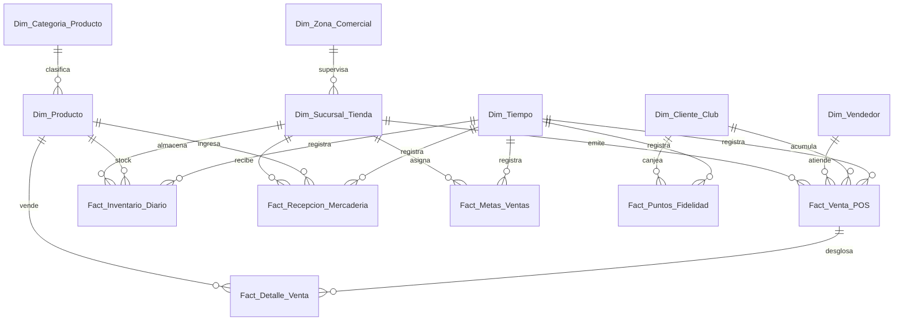

# Esquema Relacional - Mediana Retail Especializado & Cadena de Tiendas

## 1. Diagrama ERD

---

## 2. Dimensiones

### 2.1. `Dim_Zona_Comercial`
* **Clave Primaria:** `SK_Zona`

| Campo | Tipo de Dato | Tipo Clave | Descripción |
| :--- | :--- | :--- | :--- |
| **SK_Zona** | `int32` | **PKey** | Zona o distrito comercial. |
| **Nombre_Zona** | `string` | | Zona Norte, Santiago Centro, etc. |

---

### 2.2. `Dim_Sucursal_Tienda`
* **Clave Primaria:** `SK_Sucursal`
* **Clave Foránea:** `SK_Zona` referencia a `Dim_Zona_Comercial(SK_Zona)`

| Campo | Tipo de Dato | Tipo Clave | Descripción |
| :--- | :--- | :--- | :--- |
| **SK_Sucursal** | `int32` | **PKey** | Tienda física. |
| **SK_Zona** | `int32` | **FKey** | Zona comercial. |
| **Nombre_Tienda** | `string` | | Sucursal Mall Plaza, Costanera, etc. |
| **Metros_Cuadrados** | `float32` | | Superficie de venta. |

---

### 2.3. `Dim_Categoria_Producto`
* **Clave Primaria:** `SK_Categoria`

| Campo | Tipo de Dato | Tipo Clave | Descripción |
| :--- | :--- | :--- | :--- |
| **SK_Categoria** | `int32` | **PKey** | Categoría de producto. |
| **Nombre_Categoria** | `string` | | Electrónica, Calzado, Vestuario. |

---

### 2.4. `Dim_Producto`
* **Clave Primaria:** `SK_Producto`
* **Clave Foránea:** `SK_Categoria` referencia a `Dim_Categoria_Producto(SK_Categoria)`

| Campo | Tipo de Dato | Tipo Clave | Descripción |
| :--- | :--- | :--- | :--- |
| **SK_Producto** | `int32` | **PKey** | Producto. |
| **SK_Categoria** | `int32` | **FKey** | Categoría pertenencia. |
| **SKU** | `string` | | Código de barras / EAN. |
| **Nombre_Producto** | `string` | | Nombre comercial. |
| **Precio_Venta_CLP** | `float64` | | Precio lista. |

---

### 2.5. `Dim_Vendedor`
* **Clave Primaria:** `SK_Vendedor`

| Campo | Tipo de Dato | Tipo Clave | Descripción |
| :--- | :--- | :--- | :--- |
| **SK_Vendedor** | `int32` | **PKey** | Ejecutivo de ventas. |
| **Nombre_Vendedor** | `string` | | Nombre del vendedor. |

---

### 2.6. `Dim_Cliente_Club`
* **Clave Primaria:** `SK_Cliente`

| Campo | Tipo de Dato | Tipo Clave | Descripción |
| :--- | :--- | :--- | :--- |
| **SK_Cliente** | `int32` | **PKey** | Cliente fidelizado. |
| **Rut** | `string` | | RUT. |
| **Nivel_Socio** | `string` | | Plata, Oro, Platinum. |

---

### 2.7. `Dim_Tiempo`
* **Clave Primaria:** `Fecha_SK`

| Campo | Tipo de Dato | Tipo Clave | Descripción |
| :--- | :--- | :--- | :--- |
| **Fecha_SK** | `int32` | **PKey** | YYYYMMDD. |
| **Fecha** | `date` | | Fecha. |

---

## 3. Tablas de Hechos

### 3.1. `Fact_Venta_POS`
* **Clave Primaria:** `ID_Ticket`
* **Claves Foráneas:**
  * `Fecha_SK` referencia a `Dim_Tiempo(Fecha_SK)`
  * `SK_Sucursal` referencia a `Dim_Sucursal_Tienda(SK_Sucursal)`
  * `SK_Vendedor` referencia a `Dim_Vendedor(SK_Vendedor)`
  * `SK_Cliente` referencia a `Dim_Cliente_Club(SK_Cliente)`

| Campo | Tipo de Dato | Tipo Clave | Descripción |
| :--- | :--- | :--- | :--- |
| **ID_Ticket** | `int64` | **PKey** | Encabezado de la transacción POS. |
| **Fecha_SK** | `int32` | **FKey** | Fecha compra. |
| **SK_Sucursal** | `int32` | **FKey** | Tienda emisora. |
| **SK_Vendedor** | `int32` | **FKey** | Vendedor atendedor. |
| **SK_Cliente** | `int32` | **FKey** | Cliente socio club. |
| **Monto_Total_CLP** | `float64` | | Total boleta. |
| **Descuento_Total_CLP** | `float64` | | Rebaja total boleta. |

---

### 3.2. `Fact_Detalle_Venta`
* **Clave Primaria:** `ID_Linea_Ticket`
* **Claves Foráneas:**
  * `ID_Ticket` referencia a `Fact_Venta_POS(ID_Ticket)`
  * `SK_Producto` referencia a `Dim_Producto(SK_Producto)`

| Campo | Tipo de Dato | Tipo Clave | Descripción |
| :--- | :--- | :--- | :--- |
| **ID_Linea_Ticket** | `int64` | **PKey** | Detalle de la boleta. |
| **ID_Ticket** | `int64` | **FKey** | Ticket padre. |
| **SK_Producto** | `int32` | **FKey** | Producto vendido. |
| **Unidades** | `int32` | | Cantidad comprada. |
| **Monto_Linea_CLP** | `float64` | | Subtotal de la línea. |

---

### 3.3. `Fact_Inventario_Diario`
* **Clave Primaria:** `ID_Stock_Log`
* **Claves Foráneas:**
  * `Fecha_SK` referencia a `Dim_Tiempo(Fecha_SK)`
  * `SK_Sucursal` referencia a `Dim_Sucursal_Tienda(SK_Sucursal)`
  * `SK_Producto` referencia a `Dim_Producto(SK_Producto)`

| Campo | Tipo de Dato | Tipo Clave | Descripción |
| :--- | :--- | :--- | :--- |
| **ID_Stock_Log** | `int64` | **PKey** | Cierre de stock diario. |
| **Fecha_SK** | `int32` | **FKey** | Fecha inventario. |
| **SK_Sucursal** | `int32` | **FKey** | Tienda. |
| **SK_Producto** | `int32` | **FKey** | Producto. |
| **Stock_Unidades** | `int32` | | Cantidad disponible en tienda. |

---

### 3.4. `Fact_Recepcion_Mercaderia`
* **Clave Primaria:** `ID_Recepcion`
* **Claves Foráneas:**
  * `Fecha_SK` referencia a `Dim_Tiempo(Fecha_SK)`
  * `SK_Sucursal` referencia a `Dim_Sucursal_Tienda(SK_Sucursal)`
  * `SK_Producto` referencia a `Dim_Producto(SK_Producto)`

| Campo | Tipo de Dato | Tipo Clave | Descripción |
| :--- | :--- | :--- | :--- |
| **ID_Recepcion** | `int64` | **PKey** | Despacho desde CD. |
| **Fecha_SK** | `int32` | **FKey** | Fecha recepción. |
| **SK_Sucursal** | `int32` | **FKey** | Tienda destino. |
| **SK_Producto** | `int32` | **FKey** | Producto ingresado. |
| **Unidades_Recibidas** | `int32` | | Cantidad recibida. |

---

### 3.5. `Fact_Metas_Ventas`
* **Clave Primaria:** `ID_Meta`
* **Claves Foráneas:**
  * `Fecha_SK` referencia a `Dim_Tiempo(Fecha_SK)`
  * `SK_Sucursal` referencia a `Dim_Sucursal_Tienda(SK_Sucursal)`

| Campo | Tipo de Dato | Tipo Clave | Descripción |
| :--- | :--- | :--- | :--- |
| **ID_Meta** | `int64` | **PKey** | Cuota de venta mensual. |
| **Fecha_SK** | `int32` | **FKey** | Mes cuota. |
| **SK_Sucursal** | `int32` | **FKey** | Tienda meta. |
| **Meta_Venta_CLP** | `float64` | | Presupuesto de venta. |

---

### 3.6. `Fact_Puntos_Fidelidad`
* **Clave Primaria:** `ID_Movimiento_Puntos`
* **Claves Foráneas:**
  * `Fecha_SK` referencia a `Dim_Tiempo(Fecha_SK)`
  * `SK_Cliente` referencia a `Dim_Cliente_Club(SK_Cliente)`

| Campo | Tipo de Dato | Tipo Clave | Descripción |
| :--- | :--- | :--- | :--- |
| **ID_Movimiento_Puntos** | `int64` | **PKey** | Acumulación / Canje. |
| **Fecha_SK** | `int32` | **FKey** | Fecha. |
| **SK_Cliente** | `int32` | **FKey** | Cliente. |
| **Puntos_Ganados** | `int32` | | Puntos acumulados. |
| **Puntos_Canjeados** | `int32` | | Puntos usados. |
