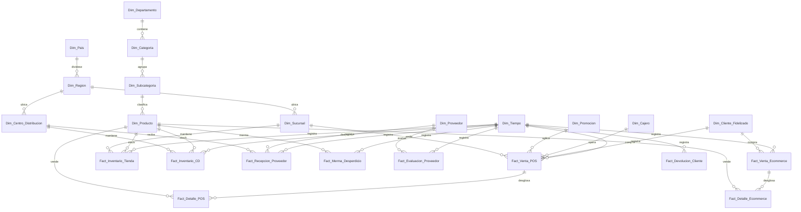

# Esquema Relacional - Enterprise Retail Omnicanal Masivo (Supermercados)

## 1. Diagrama ERD

---

## 2. Dimensiones

### 2.1. `Dim_Pais`
* **Clave Primaria:** `SK_Pais`
| Campo | Tipo de Dato | Tipo Clave | Descripción |
| :--- | :--- | :--- | :--- |
| **SK_Pais** | `int32` | **PKey** | País de operación. |
| **Nombre_Pais** | `string` | | Chile, Perú, Colombia, Argentina. |

### 2.2. `Dim_Region`
* **Clave Primaria:** `SK_Region`
* **Clave Foránea:** `SK_Pais` referencia a `Dim_Pais(SK_Pais)`
| Campo | Tipo de Dato | Tipo Clave | Descripción |
| :--- | :--- | :--- | :--- |
| **SK_Region** | `int32` | **PKey** | Región/Estado. |
| **SK_Pais** | `int32` | **FKey** | País. |
| **Nombre_Region** | `string` | | Región. |

### 2.3. `Dim_Centro_Distribucion`
* **Clave Primaria:** `SK_CD`
* **Clave Foránea:** `SK_Region` referencia a `Dim_Region(SK_Region)`
| Campo | Tipo de Dato | Tipo Clave | Descripción |
| :--- | :--- | :--- | :--- |
| **SK_CD** | `int32` | **PKey** | Centro de Distribución. |
| **SK_Region** | `int32` | **FKey** | Región. |
| **Nombre_CD** | `string` | | CD Pudahuel, CD San Bernardo. |

### 2.4. `Dim_Sucursal`
* **Clave Primaria:** `SK_Sucursal`
* **Clave Foránea:** `SK_Region` referencia a `Dim_Region(SK_Region)`
| Campo | Tipo de Dato | Tipo Clave | Descripción |
| :--- | :--- | :--- | :--- |
| **SK_Sucursal** | `int32` | **PKey** | Tienda/Supermercado. |
| **SK_Region** | `int32` | **FKey** | Región. |
| **Formato_Tienda** | `string` | | Hipermercado, Express, Supermercado. |

### 2.5. `Dim_Departamento`
* **Clave Primaria:** `SK_Departamento`
| Campo | Tipo de Dato | Tipo Clave | Descripción |
| :--- | :--- | :--- | :--- |
| **SK_Departamento** | `int32` | **PKey** | Área comercial. |
| **Nombre_Depto** | `string` | | Abarrotes, Perecibles, Electrónica, Hogar. |

### 2.6. `Dim_Categoria`
* **Clave Primaria:** `SK_Categoria`
* **Clave Foránea:** `SK_Departamento` referencia a `Dim_Departamento(SK_Departamento)`
| Campo | Tipo de Dato | Tipo Clave | Descripción |
| :--- | :--- | :--- | :--- |
| **SK_Categoria** | `int32` | **PKey** | Categoría. |
| **SK_Departamento** | `int32` | **FKey** | Depto. |

### 2.7. `Dim_Subcategoria`
* **Clave Primaria:** `SK_Subcategoria`
* **Clave Foránea:** `SK_Categoria` referencia a `Dim_Categoria(SK_Categoria)`
| Campo | Tipo de Dato | Tipo Clave | Descripción |
| :--- | :--- | :--- | :--- |
| **SK_Subcategoria** | `int32` | **PKey** | Subcategoría. |
| **SK_Categoria** | `int32` | **FKey** | Categoría. |

### 2.8. `Dim_Producto`
* **Clave Primaria:** `SK_Producto`
* **Clave Foránea:** `SK_Subcategoria` referencia a `Dim_Subcategoria(SK_Subcategoria)`
| Campo | Tipo de Dato | Tipo Clave | Descripción |
| :--- | :--- | :--- | :--- |
| **SK_Producto** | `int32` | **PKey** | SKU de producto. |
| **SK_Subcategoria** | `int32` | **FKey** | Subcategoría. |
| **EAN_Barcode** | `string` | | Código EAN. |
| **Marca** | `string` | | Marca propia o comercial. |

### 2.9. `Dim_Proveedor`
* **Clave Primaria:** `SK_Proveedor`
| Campo | Tipo de Dato | Tipo Clave | Descripción |
| :--- | :--- | :--- | :--- |
| **SK_Proveedor** | `int32` | **PKey** | Proveedor de mercadería. |
| **Razon_Social** | `string` | | Empresa proveedora. |

### 2.10. `Dim_Promocion`
* **Clave Primaria:** `SK_Promocion`
| Campo | Tipo de Dato | Tipo Clave | Descripción |
| :--- | :--- | :--- | :--- |
| **SK_Promocion** | `int32` | **PKey** | Campaña o catálogo comercial. |
| **Tipo_Promo** | `string` | | 3x2, Descuento Tarjeta, Cierre de Temporada. |

### 2.11. `Dim_Cajero`
* **Clave Primaria:** `SK_Cajero`
| Campo | Tipo de Dato | Tipo Clave | Descripción |
| :--- | :--- | :--- | :--- |
| **SK_Cajero** | `int32` | **PKey** | Operador de caja POS. |

### 2.12. `Dim_Cliente_Fidelizado`
* **Clave Primaria:** `SK_Cliente`
| Campo | Tipo de Dato | Tipo Clave | Descripción |
| :--- | :--- | :--- | :--- |
| **SK_Cliente** | `int32` | **PKey** | Socio del programa de fidelización. |

### 2.13. `Dim_Canal_Venta`
* **Clave Primaria:** `SK_Canal`
| Campo | Tipo de Dato | Tipo Clave | Descripción |
| :--- | :--- | :--- | :--- |
| **SK_Canal** | `int32` | **PKey** | POS Físico, App Móvil, Web E-commerce, Pickup. |

### 2.14. `Dim_Tiempo`
* **Clave Primaria:** `Fecha_SK`
| Campo | Tipo de Dato | Tipo Clave | Descripción |
| :--- | :--- | :--- | :--- |
| **Fecha_SK** | `int32` | **PKey** | YYYYMMDD. |

---

## 3. Tablas de Hechos

### 3.1. `Fact_Venta_POS`
* **Clave Primaria:** `ID_Venta_POS`
* **Claves Foráneas:**
  * `Fecha_SK` referencia a `Dim_Tiempo(Fecha_SK)`
  * `SK_Sucursal` referencia a `Dim_Sucursal(SK_Sucursal)`
  * `SK_Cajero` referencia a `Dim_Cajero(SK_Cajero)`
  * `SK_Cliente` referencia a `Dim_Cliente_Fidelizado(SK_Cliente)`
  * `SK_Promocion` referencia a `Dim_Promocion(SK_Promocion)`

| Campo | Tipo de Dato | Tipo Clave | Descripción |
| :--- | :--- | :--- | :--- |
| **ID_Venta_POS** | `int64` | **PKey** | Ticket de compra físico. |
| **Fecha_SK** | `int32` | **FKey** | Fecha. |
| **SK_Sucursal** | `int32` | **FKey** | Tienda. |
| **SK_Cajero** | `int32` | **FKey** | Cajero. |
| **SK_Cliente** | `int32` | **FKey** | Cliente socio. |
| **SK_Promocion** | `int32` | **FKey** | Promoción. |
| **Monto_Bruto_CLP** | `float64` | | Valor total sin descuento. |
| **Monto_Descuento_CLP** | `float64` | | Rebaja. |
| **Monto_Neto_CLP** | `float64` | | Total final pagado. |

### 3.2. `Fact_Detalle_POS`
* **Clave Primaria:** `ID_Linea_POS`
* **Claves Foráneas:**
  * `ID_Venta_POS` referencia a `Fact_Venta_POS(ID_Venta_POS)`
  * `SK_Producto` referencia a `Dim_Producto(SK_Producto)`
| Campo | Tipo de Dato | Tipo Clave | Descripción |
| :--- | :--- | :--- | :--- |
| **ID_Linea_POS** | `int64` | **PKey** | Ítem de la boleta. |
| **ID_Venta_POS** | `int64` | **FKey** | Boleta. |
| **SK_Producto** | `int32` | **FKey** | Producto. |
| **Unidades** | `float32` | | Cantidad/Kilos. |
| **Monto_Linea_CLP** | `float64` | | Subtotal. |

### 3.3. `Fact_Venta_Ecommerce`
* **Clave Primaria:** `ID_Orden_Web`
* **Claves Foráneas:**
  * `Fecha_SK` referencia a `Dim_Tiempo(Fecha_SK)`
  * `SK_Cliente` referencia a `Dim_Cliente_Fidelizado(SK_Cliente)`
  * `SK_Canal` referencia a `Dim_Canal_Venta(SK_Canal)`
| Campo | Tipo de Dato | Tipo Clave | Descripción |
| :--- | :--- | :--- | :--- |
| **ID_Orden_Web** | `int64` | **PKey** | Orden digital. |
| **Fecha_SK** | `int32` | **FKey** | Fecha compra online. |
| **SK_Cliente** | `int32` | **FKey** | Comprador. |
| **SK_Canal** | `int32` | **FKey** | Canal digital. |
| **Monto_Total_CLP** | `float64` | | Total cobrado. |

### 3.4. `Fact_Detalle_Ecommerce`
* **Clave Primaria:** `ID_Linea_Web`
* **Claves Foráneas:**
  * `ID_Orden_Web` referencia a `Fact_Venta_Ecommerce(ID_Orden_Web)`
  * `SK_Producto` referencia a `Dim_Producto(SK_Producto)`
| Campo | Tipo de Dato | Tipo Clave | Descripción |
| :--- | :--- | :--- | :--- |
| **ID_Linea_Web** | `int64` | **PKey** | Ítem web. |
| **ID_Orden_Web** | `int64` | **FKey** | Orden. |
| **SK_Producto** | `int32` | **FKey** | Producto. |
| **Unidades** | `int32` | | Cantidad. |

### 3.5. `Fact_Inventario_CD`
* **Clave Primaria:** `ID_Inv_CD`
* **Claves Foráneas:**
  * `Fecha_SK` referencia a `Dim_Tiempo(Fecha_SK)`
  * `SK_CD` referencia a `Dim_Centro_Distribucion(SK_CD)`
  * `SK_Producto` referencia a `Dim_Producto(SK_Producto)`
| Campo | Tipo de Dato | Tipo Clave | Descripción |
| :--- | :--- | :--- | :--- |
| **ID_Inv_CD** | `int64` | **PKey** | Stock en bodega central. |
| **Fecha_SK** | `int32` | **FKey** | Fecha. |
| **SK_CD** | `int32` | **FKey** | CD. |
| **SK_Producto** | `int32` | **FKey** | Producto. |
| **Pallets_Disponibles** | `int32` | | Pallets en rack. |

### 3.6. `Fact_Inventario_Tienda`
* **Clave Primaria:** `ID_Inv_Tienda`
* **Claves Foráneas:**
  * `Fecha_SK` referencia a `Dim_Tiempo(Fecha_SK)`
  * `SK_Sucursal` referencia a `Dim_Sucursal(SK_Sucursal)`
  * `SK_Producto` referencia a `Dim_Producto(SK_Producto)`
| Campo | Tipo de Dato | Tipo Clave | Descripción |
| :--- | :--- | :--- | :--- |
| **ID_Inv_Tienda** | `int64` | **PKey** | Stock sala de ventas y bodega tienda. |
| **Fecha_SK** | `int32` | **FKey** | Fecha. |
| **SK_Sucursal** | `int32` | **FKey** | Sucursal. |
| **SK_Producto** | `int32` | **FKey** | Producto. |
| **Unidades_Stock** | `int32` | | Stock disponible. |

### 3.7. `Fact_Recepcion_Proveedor`
* **Clave Primaria:** `ID_Recepcion`
* **Claves Foráneas:**
  * `Fecha_SK` referencia a `Dim_Tiempo(Fecha_SK)`
  * `SK_CD` referencia a `Dim_Centro_Distribucion(SK_CD)`
  * `SK_Proveedor` referencia a `Dim_Proveedor(SK_Proveedor)`
| Campo | Tipo de Dato | Tipo Clave | Descripción |
| :--- | :--- | :--- | :--- |
| **ID_Recepcion** | `int64` | **PKey** | Recepción OC proveedor. |
| **Fecha_SK** | `int32` | **FKey** | Fecha. |
| **SK_CD** | `int32` | **FKey** | CD emisor. |
| **SK_Proveedor** | `int32` | **FKey** | Proveedor. |
| **Monto_Facturado_CLP** | `float64` | | Costo total. |

### 3.8. `Fact_Merma_Desperdicio`
* **Clave Primaria:** `ID_Merma`
* **Claves Foráneas:**
  * `Fecha_SK` referencia a `Dim_Tiempo(Fecha_SK)`
  * `SK_Sucursal` referencia a `Dim_Sucursal(SK_Sucursal)`
  * `SK_Producto` referencia a `Dim_Producto(SK_Producto)`
| Campo | Tipo de Dato | Tipo Clave | Descripción |
| :--- | :--- | :--- | :--- |
| **ID_Merma** | `int64` | **PKey** | Registro de merma o vencimiento. |
| **Fecha_SK** | `int32` | **FKey** | Fecha. |
| **SK_Sucursal** | `int32` | **FKey** | Tienda. |
| **SK_Producto** | `int32` | **FKey** | Producto merma. |
| **Costo_Merma_CLP** | `float64` | | Pérdida en pesos. |

### 3.9. `Fact_Devolucion_Cliente`
* **Clave Primaria:** `ID_Devolucion`
* **Claves Foráneas:**
  * `Fecha_SK` referencia a `Dim_Tiempo(Fecha_SK)`
  * `SK_Sucursal` referencia a `Dim_Sucursal(SK_Sucursal)`
| Campo | Tipo de Dato | Tipo Clave | Descripción |
| :--- | :--- | :--- | :--- |
| **ID_Devolucion** | `int64` | **PKey** | Devolución de producto. |
| **Fecha_SK** | `int32` | **FKey** | Fecha. |
| **SK_Sucursal** | `int32` | **FKey** | Tienda. |
| **Monto_Devuelto_CLP** | `float64` | | Valor reembolsado. |

### 3.10. `Fact_Evaluacion_Proveedor`
* **Clave Primaria:** `ID_Eval_Proveedor`
* **Claves Foráneas:**
  * `Fecha_SK` referencia a `Dim_Tiempo(Fecha_SK)`
  * `SK_Proveedor` referencia a `Dim_Proveedor(SK_Proveedor)`
| Campo | Tipo de Dato | Tipo Clave | Descripción |
| :--- | :--- | :--- | :--- |
| **ID_Eval_Proveedor** | `int64` | **PKey** | KPI Fill-rate proveedor. |
| **Fecha_SK** | `int32` | **FKey** | Mes evaluado. |
| **SK_Proveedor** | `int32` | **FKey** | Proveedor. |
| **Fill_Rate_Pct** | `float32` | | Porcentaje de cumplimiento de entregas. |
