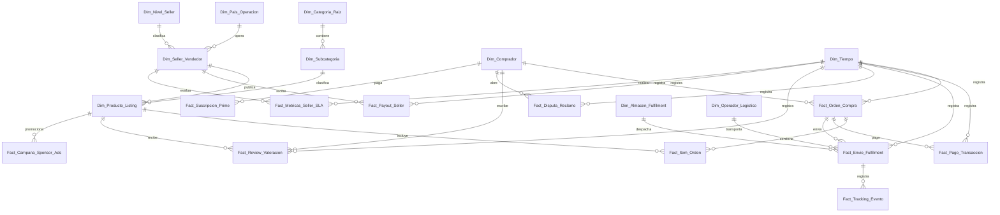

# Esquema Relacional - Marketplace E-commerce Global (Multi-Seller & Fulfilment)

## 1. Diagrama ERD

---

## 2. Dimensiones

### 2.1. `Dim_Pais_Operacion`
* **Clave Primaria:** `SK_Pais`
| Campo | Tipo de Dato | Tipo Clave | Descripción |
| :--- | :--- | :--- | :--- |
| **SK_Pais** | `int32` | **PKey** | País de operación del marketplace. |
| **Nombre_Pais** | `string` | | USA, Mexico, Brazil, Chile, Spain. |

### 2.2. `Dim_Nivel_Seller`
* **Clave Primaria:** `SK_Nivel`
| Campo | Tipo de Dato | Tipo Clave | Descripción |
| :--- | :--- | :--- | :--- |
| **SK_Nivel** | `int32` | **PKey** | Tier de reputación. |
| **Nombre_Nivel** | `string` | | Gold, Platinum, Top Rated. |

### 2.3. `Dim_Seller_Vendedor`
* **Clave Primaria:** `SK_Seller`
* **Claves Foráneas:**
  * `SK_Pais` referencia a `Dim_Pais_Operacion(SK_Pais)`
  * `SK_Nivel` referencia a `Dim_Nivel_Seller(SK_Nivel)`
| Campo | Tipo de Dato | Tipo Clave | Descripción |
| :--- | :--- | :--- | :--- |
| **SK_Seller** | `int32` | **PKey** | Vendedor del marketplace. |
| **SK_Pais** | `int32` | **FKey** | País origen. |
| **SK_Nivel** | `int32` | **FKey** | Tier reputación. |
| **Razon_Social** | `string` | | Nombre legal seller. |

### 2.4. `Dim_Comprador`
* **Clave Primaria:** `SK_Comprador`
| Campo | Tipo de Dato | Tipo Clave | Descripción |
| :--- | :--- | :--- | :--- |
| **SK_Comprador** | `int32` | **PKey** | Usuario comprador. |
| **Email** | `string` | | Email del usuario. |

### 2.5. `Dim_Categoria_Raiz`
* **Clave Primaria:** `SK_Categoria_Raiz`
| Campo | Tipo de Dato | Tipo Clave | Descripción |
| :--- | :--- | :--- | :--- |
| **SK_Categoria_Raiz** | `int32` | **PKey** | Categoría principal. |

### 2.6. `Dim_Subcategoria`
* **Clave Primaria:** `SK_Subcategoria`
* **Clave Foránea:** `SK_Categoria_Raiz` referencia a `Dim_Categoria_Raiz(SK_Categoria_Raiz)`
| Campo | Tipo de Dato | Tipo Clave | Descripción |
| :--- | :--- | :--- | :--- |
| **SK_Subcategoria** | `int32` | **PKey** | Subcategoría. |
| **SK_Categoria_Raiz** | `int32` | **FKey** | Categoría raíz. |

### 2.7. `Dim_Producto_Listing`
* **Clave Primaria:** `SK_Listing`
* **Claves Foráneas:**
  * `SK_Subcategoria` referencia a `Dim_Subcategoria(SK_Subcategoria)`
  * `SK_Seller` referencia a `Dim_Seller_Vendedor(SK_Seller)`
| Campo | Tipo de Dato | Tipo Clave | Descripción |
| :--- | :--- | :--- | :--- |
| **SK_Listing** | `int32` | **PKey** | Publicación/Listing del producto. |
| **SK_Subcategoria** | `int32` | **FKey** | Subcategoría. |
| **SK_Seller** | `int32` | **FKey** | Seller dueño de la publicación. |
| **ASIN_SKU** | `string` | | Código único de listing global. |

### 2.8. `Dim_Metodo_Pago`
* **Clave Primaria:** `SK_Metodo_Pago`
| Campo | Tipo de Dato | Tipo Clave | Descripción |
| :--- | :--- | :--- | :--- |
| **SK_Metodo_Pago** | `int32` | **PKey** | Credit Card, PayPal, Crypto, Debit. |

### 2.9. `Dim_Operador_Logistico`
* **Clave Primaria:** `SK_Carrier`
| Campo | Tipo de Dato | Tipo Clave | Descripción |
| :--- | :--- | :--- | :--- |
| **SK_Carrier** | `int32` | **PKey** | DHL, FedEx, Courier Propio. |

### 2.10. `Dim_Almacen_Fulfilment`
* **Clave Primaria:** `SK_Almacen`
| Campo | Tipo de Dato | Tipo Clave | Descripción |
| :--- | :--- | :--- | :--- |
| **SK_Almacen** | `int32` | **PKey** | Warehouse de fulfilment. |

### 2.11. `Dim_Tiempo`
* **Clave Primaria:** `Fecha_SK`
| Campo | Tipo de Dato | Tipo Clave | Descripción |
| :--- | :--- | :--- | :--- |
| **Fecha_SK** | `int32` | **PKey** | YYYYMMDD. |

---

## 3. Tablas de Hechos

### 3.1. `Fact_Orden_Compra`
* **Clave Primaria:** `ID_Orden`
* **Claves Foráneas:**
  * `Fecha_SK` referencia a `Dim_Tiempo(Fecha_SK)`
  * `SK_Comprador` referencia a `Dim_Comprador(SK_Comprador)`
| Campo | Tipo de Dato | Tipo Clave | Descripción |
| :--- | :--- | :--- | :--- |
| **ID_Orden** | `int64` | **PKey** | Orden de compra del carrito. |
| **Fecha_SK** | `int32` | **FKey** | Fecha compra. |
| **SK_Comprador** | `int32` | **FKey** | Comprador. |
| **GMV_USD** | `float64` | | Gross Merchandise Value en USD. |

### 3.2. `Fact_Item_Orden`
* **Clave Primaria:** `ID_Item_Orden`
* **Claves Foráneas:**
  * `ID_Orden` referencia a `Fact_Orden_Compra(ID_Orden)`
  * `SK_Listing` referencia a `Dim_Producto_Listing(SK_Listing)`
| Campo | Tipo de Dato | Tipo Clave | Descripción |
| :--- | :--- | :--- | :--- |
| **ID_Item_Orden** | `int64` | **PKey** | Ítem de la orden. |
| **ID_Orden** | `int64` | **FKey** | Orden. |
| **SK_Listing** | `int32` | **FKey** | Listing. |
| **Cantidad** | `int32` | | Unidades. |
| **Precio_Unitario_USD** | `float64` | | Precio venta USD. |

### 3.3. `Fact_Pago_Transaccion`
* **Clave Primaria:** `ID_Pago`
* **Claves Foráneas:**
  * `Fecha_SK` referencia a `Dim_Tiempo(Fecha_SK)`
  * `ID_Orden` referencia a `Fact_Orden_Compra(ID_Orden)`
  * `SK_Metodo_Pago` referencia a `Dim_Metodo_Pago(SK_Metodo_Pago)`
| Campo | Tipo de Dato | Tipo Clave | Descripción |
| :--- | :--- | :--- | :--- |
| **ID_Pago** | `int64` | **PKey** | Transacción Gateway. |
| **Fecha_SK** | `int32` | **FKey** | Fecha pago. |
| **ID_Orden** | `int64` | **FKey** | Orden. |
| **SK_Metodo_Pago** | `int32` | **FKey** | Medio de pago. |
| **Monto_Pago_USD** | `float64` | | Monto cobrado gateway. |

### 3.4. `Fact_Envio_Fulfilment`
* **Clave Primaria:** `ID_Envio`
* **Claves Foráneas:**
  * `Fecha_SK` referencia a `Dim_Tiempo(Fecha_SK)`
  * `ID_Orden` referencia a `Fact_Orden_Compra(ID_Orden)`
  * `SK_Carrier` referencia a `Dim_Operador_Logistico(SK_Carrier)`
  * `SK_Almacen` referencia a `Dim_Almacen_Fulfilment(SK_Almacen)`
| Campo | Tipo de Dato | Tipo Clave | Descripción |
| :--- | :--- | :--- | :--- |
| **ID_Envio** | `int64` | **PKey** | Guía de despacho. |
| **Fecha_SK** | `int32` | **FKey** | Fecha despacho. |
| **ID_Orden** | `int64` | **FKey** | Orden. |
| **SK_Carrier** | `int32` | **FKey** | Courier. |
| **SK_Almacen** | `int32` | **FKey** | Almacén Origen. |
| **Costo_Envio_USD** | `float64` | | Flete abonado. |

### 3.5. `Fact_Tracking_Evento`
* **Clave Primaria:** `ID_Tracking`
* **Claves Foráneas:**
  * `ID_Envio` referencia a `Fact_Envio_Fulfilment(ID_Envio)`
| Campo | Tipo de Dato | Tipo Clave | Descripción |
| :--- | :--- | :--- | :--- |
| **ID_Tracking** | `int64` | **PKey** | Evento checkpoint (In Transit, Delivered). |
| **ID_Envio** | `int64` | **FKey** | Envío. |

### 3.6. `Fact_Disputa_Reclamo`
* **Clave Primaria:** `ID_Disputa`
* **Claves Foráneas:**
  * `Fecha_SK` referencia a `Dim_Tiempo(Fecha_SK)`
  * `SK_Comprador` referencia a `Dim_Comprador(SK_Comprador)`
| Campo | Tipo de Dato | Tipo Clave | Descripción |
| :--- | :--- | :--- | :--- |
| **ID_Disputa** | `int64` | **PKey** | Claim de garantía o no entrega. |
| **Fecha_SK** | `int32` | **FKey** | Fecha reclamo. |
| **SK_Comprador** | `int32` | **FKey** | Comprador reclamos. |
| **Monto_Disputado_USD** | `float64` | | Reembolso solicitado. |

### 3.7. `Fact_Review_Valoracion`
* **Clave Primaria:** `ID_Review`
* **Claves Foráneas:**
  * `Fecha_SK` referencia a `Dim_Tiempo(Fecha_SK)`
  * `SK_Listing` referencia a `Dim_Producto_Listing(SK_Listing)`
  * `SK_Comprador` referencia a `Dim_Comprador(SK_Comprador)`
| Campo | Tipo de Dato | Tipo Clave | Descripción |
| :--- | :--- | :--- | :--- |
| **ID_Review** | `int64` | **PKey** | Calificación de producto (1 a 5 estrellas). |
| **Fecha_SK** | `int32` | **FKey** | Fecha review. |
| **SK_Listing** | `int32` | **FKey** | Listing. |
| **SK_Comprador** | `int32` | **FKey** | Autor. |
| **Rating_Estrellas** | `int8` | | Puntaje 1-5. |

### 3.8. `Fact_Payout_Seller`
* **Clave Primaria:** `ID_Payout`
* **Claves Foráneas:**
  * `Fecha_SK` referencia a `Dim_Tiempo(Fecha_SK)`
  * `SK_Seller` referencia a `Dim_Seller_Vendedor(SK_Seller)`
| Campo | Tipo de Dato | Tipo Clave | Descripción |
| :--- | :--- | :--- | :--- |
| **ID_Payout** | `int64` | **PKey** | Liquidación de dinero a Seller. |
| **Fecha_SK** | `int32` | **FKey** | Fecha pago. |
| **SK_Seller** | `int32` | **FKey** | Seller beneficiario. |
| **Monto_Liquidado_USD** | `float64` | | Dinero transferido. |

### 3.9. `Fact_Metricas_Seller_SLA`
* **Clave Primaria:** `ID_SLA_Log`
* **Claves Foráneas:**
  * `Fecha_SK` referencia a `Dim_Tiempo(Fecha_SK)`
  * `SK_Seller` referencia a `Dim_Seller_Vendedor(SK_Seller)`
| Campo | Tipo de Dato | Tipo Clave | Descripción |
| :--- | :--- | :--- | :--- |
| **ID_SLA_Log** | `int64` | **PKey** | Scoreboard mensual de Seller. |
| **Fecha_SK** | `int32` | **FKey** | Mes. |
| **SK_Seller** | `int32` | **FKey** | Seller evaluado. |
| **Tasa_Cancelacion_Pct** | `float32` | | Cancelaciones provocadas por el vendedor. |
| **Tasa_Despacho_A_Tiempo_Pct** | `float32` | | Entregas dentro del SLA. |
