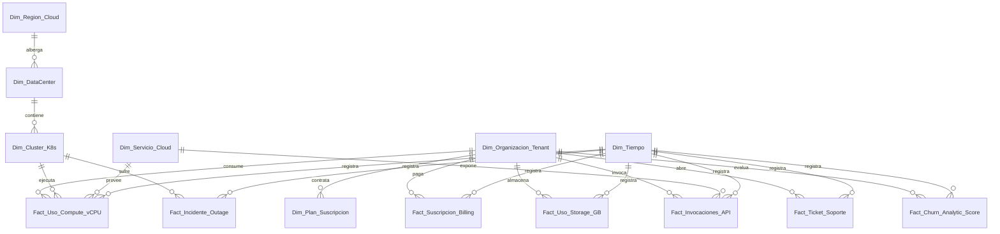

# Esquema Relacional - Big Tech SaaS B2B Cloud Platform (Usage-Based Billing)

## 1. Diagrama ERD

---

## 2. Dimensiones

### 2.1. `Dim_Region_Cloud`
* **Clave Primaria:** `SK_Region`
| Campo | Tipo de Dato | Tipo Clave | Descripción |
| :--- | :--- | :--- | :--- |
| **SK_Region** | `int32` | **PKey** | Región cloud (us-east-1, eu-west-1, sa-east-1). |

### 2.2. `Dim_DataCenter`
* **Clave Primaria:** `SK_DataCenter`
* **Clave Foránea:** `SK_Region` referencia a `Dim_Region_Cloud(SK_Region)`
| Campo | Tipo de Dato | Tipo Clave | Descripción |
| :--- | :--- | :--- | :--- |
| **SK_DataCenter** | `int32` | **PKey** | Zona de disponibilidad / DataCenter. |
| **SK_Region** | `int32` | **FKey** | Región madre. |

### 2.3. `Dim_Cluster_K8s`
* **Clave Primaria:** `SK_Cluster`
* **Clave Foránea:** `SK_DataCenter` referencia a `Dim_DataCenter(SK_DataCenter)`
| Campo | Tipo de Dato | Tipo Clave | Descripción |
| :--- | :--- | :--- | :--- |
| **SK_Cluster** | `int32` | **PKey** | Cluster Kubernetes infraestructura. |
| **SK_DataCenter** | `int32` | **FKey** | DC. |

### 2.4. `Dim_Organizacion_Tenant`
* **Clave Primaria:** `SK_Tenant`
| Campo | Tipo de Dato | Tipo Clave | Descripción |
| :--- | :--- | :--- | :--- |
| **SK_Tenant** | `int32` | **PKey** | Cuenta cliente B2B Enterprise. |
| **Nombre_Empresa** | `string` | | Cliente corporativo. |
| **Dominio_SaaS** | `string` | | Subdominio tenant. |

### 2.5. `Dim_Plan_Suscripcion`
* **Clave Primaria:** `SK_Plan`
| Campo | Tipo de Dato | Tipo Clave | Descripción |
| :--- | :--- | :--- | :--- |
| **SK_Plan** | `int32` | **PKey** | Starter, Growth, Enterprise, Scale. |

### 2.6. `Dim_Servicio_Cloud`
* **Clave Primaria:** `SK_Servicio`
| Campo | Tipo de Dato | Tipo Clave | Descripción |
| :--- | :--- | :--- | :--- |
| **SK_Servicio** | `int32` | **PKey** | Serverless Compute, Database Engine, Storage API. |

### 2.7. `Dim_Tiempo`
* **Clave Primaria:** `Fecha_SK`
| Campo | Tipo de Dato | Tipo Clave | Descripción |
| :--- | :--- | :--- | :--- |
| **Fecha_SK** | `int32` | **PKey** | YYYYMMDD. |

---

## 3. Tablas de Hechos

### 3.1. `Fact_Suscripcion_Billing`
* **Clave Primaria:** `ID_Factura`
* **Claves Foráneas:**
  * `Fecha_SK` referencia a `Dim_Tiempo(Fecha_SK)`
  * `SK_Tenant` referencia a `Dim_Organizacion_Tenant(SK_Tenant)`
  * `SK_Plan` referencia a `Dim_Plan_Suscripcion(SK_Plan)`
| Campo | Tipo de Dato | Tipo Clave | Descripción |
| :--- | :--- | :--- | :--- |
| **ID_Factura** | `int64` | **PKey** | Facturación mensual de la cuenta. |
| **Fecha_SK** | `int32` | **FKey** | Fecha facturación. |
| **SK_Tenant** | `int32` | **FKey** | Cliente tenant. |
| **SK_Plan** | `int32` | **FKey** | Plan contratado. |
| **ARR_USD** | `float64` | | Annual Recurring Revenue contratado. |
| **Monto_Overuse_USD** | `float64` | | Cobro variable por sobreconsumo. |

### 3.2. `Fact_Uso_Compute_vCPU`
* **Clave Primaria:** `ID_Compute_Log`
* **Claves Foráneas:**
  * `Fecha_SK` referencia a `Dim_Tiempo(Fecha_SK)`
  * `SK_Tenant` referencia a `Dim_Organizacion_Tenant(SK_Tenant)`
  * `SK_Cluster` referencia a `Dim_Cluster_K8s(SK_Cluster)`
  * `SK_Servicio` referencia a `Dim_Servicio_Cloud(SK_Servicio)`
| Campo | Tipo de Dato | Tipo Clave | Descripción |
| :--- | :--- | :--- | :--- |
| **ID_Compute_Log** | `int64` | **PKey** | Telemetría de horas vCPU consumidas. |
| **Fecha_SK** | `int32` | **FKey** | Día muestreo. |
| **SK_Tenant** | `int32` | **FKey** | Tenant consumidor. |
| **SK_Cluster** | `int32` | **FKey** | Cluster infraestructura. |
| **SK_Servicio** | `int32` | **FKey** | Servicio cloud. |
| **vCPU_Horas** | `float64` | | Cómputo consumido. |
| **RAM_GB_Horas** | `float64` | | Memoria RAM consumida. |

### 3.3. `Fact_Uso_Storage_GB`
* **Clave Primaria:** `ID_Storage_Log`
* **Claves Foráneas:**
  * `Fecha_SK` referencia a `Dim_Tiempo(Fecha_SK)`
  * `SK_Tenant` referencia a `Dim_Organizacion_Tenant(SK_Tenant)`
| Campo | Tipo de Dato | Tipo Clave | Descripción |
| :--- | :--- | :--- | :--- |
| **ID_Storage_Log** | `int64` | **PKey** | Almacenamiento diario. |
| **Fecha_SK** | `int32` | **FKey** | Fecha. |
| **SK_Tenant** | `int32` | **FKey** | Tenant. |
| **Storage_Gigabytes** | `float64` | | GB almacenados. |

### 3.4. `Fact_Invocaciones_API`
* **Clave Primaria:** `ID_API_Log`
* **Claves Foráneas:**
  * `Fecha_SK` referencia a `Dim_Tiempo(Fecha_SK)`
  * `SK_Tenant` referencia a `Dim_Organizacion_Tenant(SK_Tenant)`
  * `SK_Servicio` referencia a `Dim_Servicio_Cloud(SK_Servicio)`
| Campo | Tipo de Dato | Tipo Clave | Descripción |
| :--- | :--- | :--- | :--- |
| **ID_API_Log** | `int64` | **PKey** | Invocaciones HTTP/gRPC. |
| **Fecha_SK** | `int32` | **FKey** | Fecha. |
| **SK_Tenant** | `int32` | **FKey** | Tenant. |
| **SK_Servicio** | `int32` | **FKey** | Servicio. |
| **Cantidad_Requests** | `int64` | | Conteo total de llamadas API. |
| **Errores_5XX** | `int32` | | Errores de servidor. |

### 3.5. `Fact_Ticket_Soporte`
* **Clave Primaria:** `ID_Ticket`
* **Claves Foráneas:**
  * `Fecha_SK` referencia a `Dim_Tiempo(Fecha_SK)`
  * `SK_Tenant` referencia a `Dim_Organizacion_Tenant(SK_Tenant)`
| Campo | Tipo de Dato | Tipo Clave | Descripción |
| :--- | :--- | :--- | :--- |
| **ID_Ticket** | `int64` | **PKey** | Caso de soporte técnico. |
| **Fecha_SK** | `int32` | **FKey** | Fecha apertura. |
| **SK_Tenant** | `int32` | **FKey** | Tenant. |
| **Horas_Resolucion** | `float32` | | Tiempo hasta cierre ticket. |

### 3.6. `Fact_Incidente_Outage`
* **Clave Primaria:** `ID_Incidente`
* **Claves Foráneas:**
  * `Fecha_SK` referencia a `Dim_Tiempo(Fecha_SK)`
  * `SK_Cluster` referencia a `Dim_Cluster_K8s(SK_Cluster)`
| Campo | Tipo de Dato | Tipo Clave | Descripción |
| :--- | :--- | :--- | :--- |
| **ID_Incidente** | `int64` | **PKey** | Caída de servicio / Outage. |
| **Fecha_SK** | `int32` | **FKey** | Fecha. |
| **SK_Cluster** | `int32` | **FKey** | Cluster afectado. |
| **Downtime_Minutos** | `float32` | | Minutos de interrupción. |

### 3.7. `Fact_Churn_Analytic_Score`
* **Clave Primaria:** `ID_Churn_Log`
* **Claves Foráneas:**
  * `Fecha_SK` referencia a `Dim_Tiempo(Fecha_SK)`
  * `SK_Tenant` referencia a `Dim_Organizacion_Tenant(SK_Tenant)`
| Campo | Tipo de Dato | Tipo Clave | Descripción |
| :--- | :--- | :--- | :--- |
| **ID_Churn_Log** | `int64` | **PKey** | Modelo predictivo de Churn. |
| **Fecha_SK** | `int32` | **FKey** | Mes. |
| **SK_Tenant** | `int32` | **FKey** | Tenant evaluado. |
| **Probabilidad_Churn_Pct** | `float32` | | Score 0-100% de riesgo de cancelación. |
