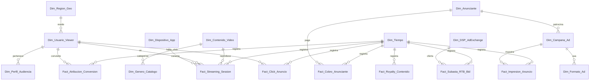

# Esquema Relacional - Big Tech AdTech & Content Streaming

## 1. Diagrama ERD

---

## 2. Dimensiones

### 2.1. `Dim_Region_Geo`
* **Clave Primaria:** `SK_Geo`
| Campo | Tipo de Dato | Tipo Clave | Descripción |
| :--- | :--- | :--- | :--- |
| **SK_Geo** | `int32` | **PKey** | País y ciudad del viewer. |

### 2.2. `Dim_Dispositivo_App`
* **Clave Primaria:** `SK_Dispositivo`
| Campo | Tipo de Dato | Tipo Clave | Descripción |
| :--- | :--- | :--- | :--- |
| **SK_Dispositivo** | `int32` | **PKey** | Smart TV, iOS App, Android, Web Browser. |

### 2.3. `Dim_Perfil_Audiencia`
* **Clave Primaria:** `SK_Audiencia`
| Campo | Tipo de Dato | Tipo Clave | Descripción |
| :--- | :--- | :--- | :--- |
| **SK_Audiencia** | `int32` | **PKey** | Segmento demográfico (Gamer, Tech Enthusiast). |

### 2.4. `Dim_Usuario_Viewer`
* **Clave Primaria:** `SK_Viewer`
* **Claves Foráneas:**
  * `SK_Geo` referencia a `Dim_Region_Geo(SK_Geo)`
  * `SK_Audiencia` referencia a `Dim_Perfil_Audiencia(SK_Audiencia)`
| Campo | Tipo de Dato | Tipo Clave | Descripción |
| :--- | :--- | :--- | :--- |
| **SK_Viewer** | `int32` | **PKey** | Usuario de la plataforma streaming. |
| **SK_Geo** | `int32` | **FKey** | Geo. |
| **SK_Audiencia** | `int32` | **FKey** | Audiencia. |

### 2.5. `Dim_Genero_Catalogo`
* **Clave Primaria:** `SK_Genero`
| Campo | Tipo de Dato | Tipo Clave | Descripción |
| :--- | :--- | :--- | :--- |
| **SK_Genero** | `int32` | **PKey** | Acción, Documental, Sci-Fi, Drama. |

### 2.6. `Dim_Contenido_Video`
* **Clave Primaria:** `SK_Contenido`
* **Clave Foránea:** `SK_Genero` referencia a `Dim_Genero_Catalogo(SK_Genero)`
| Campo | Tipo de Dato | Tipo Clave | Descripción |
| :--- | :--- | :--- | :--- |
| **SK_Contenido** | `int32` | **PKey** | Película / Episodio. |
| **SK_Genero** | `int32` | **FKey** | Género. |
| **Titulo** | `string` | | Nombre de la serie o película. |
| **Duracion_Minutos** | `int16` | | Duración. |

### 2.7. `Dim_Anunciante`
* **Clave Primaria:** `SK_Anunciante`
| Campo | Tipo de Dato | Tipo Clave | Descripción |
| :--- | :--- | :--- | :--- |
| **SK_Anunciante** | `int32` | **PKey** | Empresa anunciante (Brand). |

### 2.8. `Dim_Campana_Ad`
* **Clave Primaria:** `SK_Campana`
* **Clave Foránea:** `SK_Anunciante` referencia a `Dim_Anunciante(SK_Anunciante)`
| Campo | Tipo de Dato | Tipo Clave | Descripción |
| :--- | :--- | :--- | :--- |
| **SK_Campana** | `int32` | **PKey** | Campaña publicitaria. |
| **SK_Anunciante** | `int32` | **FKey** | Anunciante. |

### 2.9. `Dim_Formato_Ad`
* **Clave Primaria:** `SK_Formato`
| Campo | Tipo de Dato | Tipo Clave | Descripción |
| :--- | :--- | :--- | :--- |
| **SK_Formato** | `int32` | **PKey** | Pre-Roll, Mid-Roll, Overlay Banner, 30s Non-Skip. |

### 2.10. `Dim_DSP_AdExchange`
* **Clave Primaria:** `SK_DSP`
| Campo | Tipo de Dato | Tipo Clave | Descripción |
| :--- | :--- | :--- | :--- |
| **SK_DSP** | `int32` | **PKey** | Google DV360, TradeDesk, Amazon DSP. |

### 2.11. `Dim_Tiempo`
* **Clave Primaria:** `Fecha_SK`
| Campo | Tipo de Dato | Tipo Clave | Descripción |
| :--- | :--- | :--- | :--- |
| **Fecha_SK** | `int32` | **PKey** | YYYYMMDD. |

---

## 3. Tablas de Hechos

### 3.1. `Fact_Streaming_Session`
* **Clave Primaria:** `ID_Session`
* **Claves Foráneas:**
  * `Fecha_SK` referencia a `Dim_Tiempo(Fecha_SK)`
  * `SK_Viewer` referencia a `Dim_Usuario_Viewer(SK_Viewer)`
  * `SK_Contenido` referencia a `Dim_Contenido_Video(SK_Contenido)`
  * `SK_Dispositivo` referencia a `Dim_Dispositivo_App(SK_Dispositivo)`
| Campo | Tipo de Dato | Tipo Clave | Descripción |
| :--- | :--- | :--- | :--- |
| **ID_Session** | `int64` | **PKey** | Sesión de playback de video. |
| **Fecha_SK** | `int32` | **FKey** | Fecha. |
| **SK_Viewer** | `int32` | **FKey** | Viewer. |
| **SK_Contenido** | `int32` | **FKey** | Contenido. |
| **SK_Dispositivo** | `int32` | **FKey** | Dispositivo. |
| **Minutos_Reproducidos** | `float32` | | Tiempo reproducido. |
| **Rebuffer_Count** | `int16` | | Pausas por congelamiento de red. |

### 3.2. `Fact_Impresion_Anuncio`
* **Clave Primaria:** `ID_Impresion`
* **Claves Foráneas:**
  * `Fecha_SK` referencia a `Dim_Tiempo(Fecha_SK)`
  * `SK_Campana` referencia a `Dim_Campana_Ad(SK_Campana)`
  * `SK_Viewer` referencia a `Dim_Usuario_Viewer(SK_Viewer)`
| Campo | Tipo de Dato | Tipo Clave | Descripción |
| :--- | :--- | :--- | :--- |
| **ID_Impresion** | `int64` | **PKey** | Impresión de ad en video. |
| **Fecha_SK** | `int32` | **FKey** | Fecha. |
| **SK_Campana** | `int32` | **FKey** | Campaña. |
| **SK_Viewer** | `int32` | **FKey** | Viewer receptor. |
| **CPM_USD** | `float64` | | Costo por mil impresiones abonado. |

### 3.3. `Fact_Click_Anuncio`
* **Clave Primaria:** `ID_Click`
* **Claves Foráneas:**
  * `Fecha_SK` referencia a `Dim_Tiempo(Fecha_SK)`
  * `ID_Impresion` referencia a `Fact_Impresion_Anuncio(ID_Impresion)`
  * `SK_Viewer` referencia a `Dim_Usuario_Viewer(SK_Viewer)`
| Campo | Tipo de Dato | Tipo Clave | Descripción |
| :--- | :--- | :--- | :--- |
| **ID_Click** | `int64` | **PKey** | Click sobre el anuncio. |
| **Fecha_SK** | `int32` | **FKey** | Fecha. |
| **ID_Impresion** | `int64` | **FKey** | Impresión madre. |
| **SK_Viewer** | `int32` | **FKey** | Viewer cliqueador. |
| **CPC_USD** | `float64` | | Costo por click generado. |

### 3.4. `Fact_Subasta_RTB_Bid`
* **Clave Primaria:** `ID_Subasta`
* **Claves Foráneas:**
  * `Fecha_SK` referencia a `Dim_Tiempo(Fecha_SK)`
  * `SK_DSP` referencia a `Dim_DSP_AdExchange(SK_DSP)`
| Campo | Tipo de Dato | Tipo Clave | Descripción |
| :--- | :--- | :--- | :--- |
| **ID_Subasta** | `int64` | **PKey** | Subasta programática Real-Time Bidding. |
| **Fecha_SK** | `int32` | **FKey** | Fecha. |
| **SK_DSP** | `int32` | **FKey** | DSP pujador. |
| **Bid_Price_USD** | `float64` | | Precio ofertado en subasta. |
| **Es_Ganadora** | `int8` | | Indicador (1 = Win, 0 = Lost). |

### 3.5. `Fact_Atribucion_Conversion`
* **Clave Primaria:** `ID_Atribucion`
* **Claves Foráneas:**
  * `Fecha_SK` referencia a `Dim_Tiempo(Fecha_SK)`
  * `SK_Viewer` referencia a `Dim_Usuario_Viewer(SK_Viewer)`
| Campo | Tipo de Dato | Tipo Clave | Descripción |
| :--- | :--- | :--- | :--- |
| **ID_Atribucion** | `int64` | **PKey** | Atribución multi-touch de venta externa. |
| **Fecha_SK** | `int32` | **FKey** | Fecha. |
| **SK_Viewer** | `int32` | **FKey** | Viewer convertidor. |
| **Valor_Conversion_USD** | `float64` | | Retorno sobre la inversión (ROAS). |

### 3.6. `Fact_Cobro_Anunciante`
* **Clave Primaria:** `ID_Cobro_Ad`
* **Claves Foráneas:**
  * `Fecha_SK` referencia a `Dim_Tiempo(Fecha_SK)`
  * `SK_Anunciante` referencia a `Dim_Anunciante(SK_Anunciante)`
| Campo | Tipo de Dato | Tipo Clave | Descripción |
| :--- | :--- | :--- | :--- |
| **ID_Cobro_Ad** | `int64` | **PKey** | Liquidación mensual de pauta ad. |
| **Fecha_SK** | `int32` | **FKey** | Mes. |
| **SK_Anunciante** | `int32` | **FKey** | Anunciante pagador. |
| **Gasto_Pauta_USD** | `float64` | | Facturación total gastada. |

### 3.7. `Fact_Royalty_Contenido`
* **Clave Primaria:** `ID_Royalty`
* **Claves Foráneas:**
  * `Fecha_SK` referencia a `Dim_Tiempo(Fecha_SK)`
  * `SK_Contenido` referencia a `Dim_Contenido_Video(SK_Contenido)`
| Campo | Tipo de Dato | Tipo Clave | Descripción |
| :--- | :--- | :--- | :--- |
| **ID_Royalty** | `int64` | **PKey** | Pago de licencias y derechos de autor. |
| **Fecha_SK** | `int32` | **FKey** | Mes. |
| **SK_Contenido** | `int32` | **FKey** | Contenido. |
| **Monto_Royalty_USD** | `float64` | | Pago a la distribuidora por reproducciones. |
