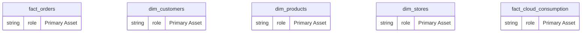
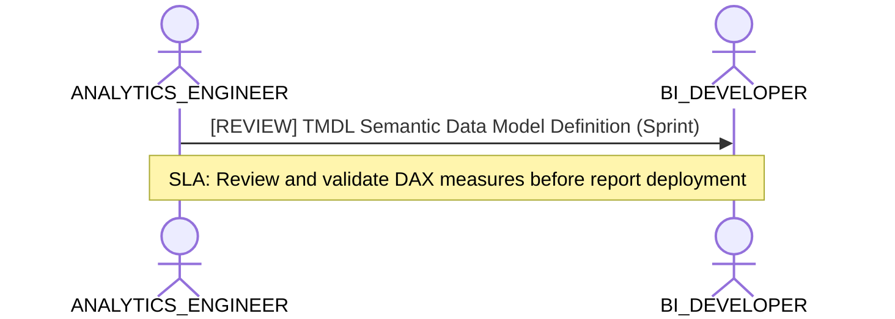

# Analytics Engineering, Dimensional Modeling & Transformation Lens

**Persona Role**: `ANALYTICS_ENGINEER` | **Technical Depth**: `TECHNICAL`
**Generated At**: `2026-09-14T17:00:00Z`

## Executive Summary

> [!NOTE]
> Star-schema topology, semantic metrics, SQL transformations, and grain definitions for EnterpriseRetailPlatform.

### Focus Areas
- **Data Modeling**
- **Modeling Quality**

## Metrics & KPIs Portfolio

### Certified Metrics
| Metric Name | Status | Type |
| :--- | :--- | :--- |
| **Total Revenue** | Certified | KPI / Core Metric |
| **Order Count** | Certified | KPI / Core Metric |
| **Average Order Value** | Certified | KPI / Core Metric |
| **Total Compute Cost USD** | Certified | KPI / Core Metric |

## Entity Scope

- **Primary Entities (5)**: `fact_orders`, `dim_customers`, `dim_products`, `dim_stores`, `fact_cloud_consumption`
- **Active Relationships**: 3

### Entity Topology Diagram

## RACI Responsibility Matrix

| Task / Artifact | RACI Role | Description | Collaborators |
| :--- | :--- | :--- | :--- |
| Dimensional Modeling & Semantic Metrics | **RESPONSIBLE** | Authors clean star schemas, conformed dimensions, metric formulas, and grain invariants. | DATA_ENGINEER, BI_DEVELOPER |

## Cross-Functional Team Interactions

| Target Persona | Interaction Type | Frequency | Artifact / Interface | SLA / Expectation |
| :--- | :--- | :--- | :--- | :--- |
| **BI_DEVELOPER** | review | Sprint | `TMDL Semantic Data Model Definition` | Review and validate DAX measures before report deployment |

### Interaction Flow

## Actionable Recommendations

| ID | Priority | Title | Impact | Effort | Suggested Action |
| :--- | :--- | :--- | :--- | :--- | :--- |
| `AE-TGT-metric.order_count` | **LOW** | Add Native Target Expression for Order Count | Accelerates Power BI compilation and prevents runtime translation fallback | Low | Metric 'Order Count' has generic formula but lacks compiled DAX target expression. |
| `AE-TGT-metric.average_order_value` | **LOW** | Add Native Target Expression for Average Order Value | Accelerates Power BI compilation and prevents runtime translation fallback | Low | Metric 'Average Order Value' has generic formula but lacks compiled DAX target expression. |
| `AE-TGT-metric.total_compute_cost` | **LOW** | Add Native Target Expression for Total Compute Cost USD | Accelerates Power BI compilation and prevents runtime translation fallback | Low | Metric 'Total Compute Cost USD' has generic formula but lacks compiled DAX target expression. |

## Domain Maturity Assessment

**Overall Score**: `91.0/100.0` (Optimizing)

| Maturity Dimension | Score | Level | Findings |
| :--- | :--- | :--- | :--- |
| Star Schema Conformance | 90.0% | Defined | 3 active relationships |
| Metric Formalization | 92.0% | Optimizing | 4 metrics defined |

### Strengths
- Explicit relationships between fact and dimensions
- Multi-dialect metric support

### Areas for Improvement
- Document complex ratio metric calculations in markdown schema

## Diagnostics & Audit Traces

- `[INFO]` **SEM-GOV-001** (GOVERNANCE): PII attributes detected in dim_customers with appropriate restricted classification.
