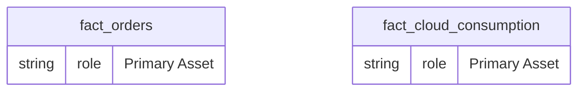
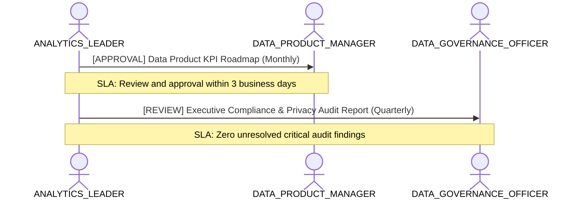

# Executive Strategic Analytics & Leadership Cockpit

**Persona Role**: `ANALYTICS_LEADER` | **Technical Depth**: `EXECUTIVE`
**Generated At**: `2026-09-14T17:00:00Z`

## Executive Summary

> [!NOTE]
> Executive portfolio perspective for EnterpriseRetailPlatform highlighting strategic KPIs and domain maturity.

### Focus Areas
- **Strategic Alignment**
- **Business Value**
- **Product Metrics**

## Metrics & KPIs Portfolio

### Certified Metrics
| Metric Name | Status | Type |
| :--- | :--- | :--- |
| **Total Revenue** | Certified | KPI / Core Metric |
| **Order Count** | Certified | KPI / Core Metric |
| **Average Order Value** | Certified | KPI / Core Metric |
| **Total Compute Cost USD** | Certified | KPI / Core Metric |

## Entity Scope

- **Primary Entities (2)**: `fact_orders`, `fact_cloud_consumption`
- **Secondary Entities (3)**: `dim_customers`, `dim_products`, `dim_stores`
- **Active Relationships**: 3

### Entity Topology Diagram

## RACI Responsibility Matrix

| Task / Artifact | RACI Role | Description | Collaborators |
| :--- | :--- | :--- | :--- |
| Enterprise Data & AI Strategy | **ACCOUNTABLE** | Sets data monetization, governance principles, and enterprise KPI taxonomy. | DATA_PRODUCT_MANAGER, DATA_GOVERNANCE_OFFICER |

## Cross-Functional Team Interactions

| Target Persona | Interaction Type | Frequency | Artifact / Interface | SLA / Expectation |
| :--- | :--- | :--- | :--- | :--- |
| **DATA_PRODUCT_MANAGER** | approval | Monthly | `Data Product KPI Roadmap` | Review and approval within 3 business days |
| **DATA_GOVERNANCE_OFFICER** | review | Quarterly | `Executive Compliance & Privacy Audit Report` | Zero unresolved critical audit findings |

### Interaction Flow

## Actionable Recommendations

| ID | Priority | Title | Impact | Effort | Suggested Action |
| :--- | :--- | :--- | :--- | :--- | :--- |
| `EXEC-01` | **HIGH** | Expand Certified Metric Coverage | Ensures single source of truth for C-level dashboards | Low | Review and certify unverified metrics in domain entities. |

## Domain Maturity Assessment

**Overall Score**: `94.0/100.0` (Optimizing)

| Maturity Dimension | Score | Level | Findings |
| :--- | :--- | :--- | :--- |
| Strategic KPI Governance | 90.0% | Defined | 4 certified KPIs |
| Domain Ownership | 85.0% | Managed | Project-level governance active |

### Strengths
- Established strategic focus
- Clear executive ownership

### Areas for Improvement
- Continuous metric certification monitoring
