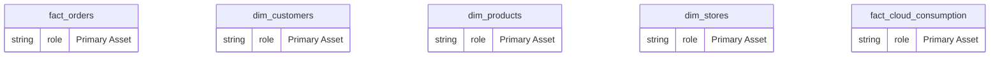
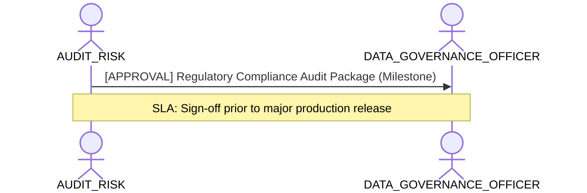

# Regulatory Compliance, Audit Provenance & Risk Lens

**Persona Role**: `AUDIT_RISK` | **Technical Depth**: `EXHAUSTIVE`
**Generated At**: `2026-09-14T17:00:00Z`

## Executive Summary

> [!NOTE]
> Regulatory compliance (GDPR/SOX), provenance audit trail, and risk exceptions for EnterpriseRetailPlatform.

### Focus Areas
- **Audit Traceability**
- **Governance Compliance**

## Metrics & KPIs Portfolio

### Certified Metrics
| Metric Name | Status | Type |
| :--- | :--- | :--- |
| **Total Revenue** | Certified | KPI / Core Metric |
| **Order Count** | Certified | KPI / Core Metric |
| **Average Order Value** | Certified | KPI / Core Metric |
| **Total Compute Cost USD** | Certified | KPI / Core Metric |

## Entity Scope

- **Primary Entities (5)**: `fact_orders`, `dim_customers`, `dim_products`, `dim_stores`, `fact_cloud_consumption`
- **Active Relationships**: 3

### Entity Topology Diagram

## RACI Responsibility Matrix

| Task / Artifact | RACI Role | Description | Collaborators |
| :--- | :--- | :--- | :--- |
| Regulatory Audit Traceability & Risk Exception Governance | **ACCOUNTABLE** | Governs regulatory compliance (GDPR, SOX), provenance logs, and risk exceptions. | DATA_GOVERNANCE_OFFICER, DATA_ARCHITECT |

## Cross-Functional Team Interactions

| Target Persona | Interaction Type | Frequency | Artifact / Interface | SLA / Expectation |
| :--- | :--- | :--- | :--- | :--- |
| **DATA_GOVERNANCE_OFFICER** | approval | Milestone | `Regulatory Compliance Audit Package` | Sign-off prior to major production release |

### Interaction Flow

## Actionable Recommendations

| ID | Priority | Title | Impact | Effort | Suggested Action |
| :--- | :--- | :--- | :--- | :--- | :--- |
| `REC-RISK-001` | **HIGH** | Verify Complete End-to-End Transformation Provenance | Guarantees full audit defense and regulatory compliance for financial metrics. | Medium | Ensure all calculated metrics retain provenance records to source columns. |

## Domain Maturity Assessment

**Overall Score**: `94.0/100.0` (Optimizing)

| Maturity Dimension | Score | Level | Findings |
| :--- | :--- | :--- | :--- |
| Audit Traceability | 94.0% | Optimizing | Full provenance log maintained |

### Strengths
- Complete rule provenance records
- Strict PII boundary enforcement

### Areas for Improvement
- Automated compliance change logging

## Diagnostics & Audit Traces

- `[INFO]` **SEM-GOV-001** (GOVERNANCE): PII attributes detected in dim_customers with appropriate restricted classification.
