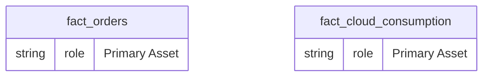
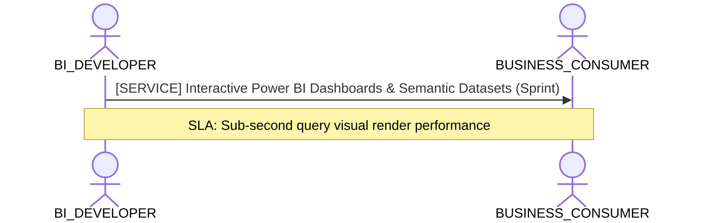

# BI Developer, TMDL & Semantic Model Consumption Lens

**Persona Role**: `BI_DEVELOPER` | **Technical Depth**: `TECHNICAL`
**Generated At**: `2026-09-14T17:00:00Z`

## Executive Summary

> [!NOTE]
> Power BI / TMDL semantic measures, relationships, DAX formulas, and display folders for EnterpriseRetailPlatform.

### Focus Areas
- **Visualization Efficiency**
- **Data Modeling**

## Metrics & KPIs Portfolio

### Certified Metrics
| Metric Name | Status | Type |
| :--- | :--- | :--- |
| **Total Revenue** | Certified | KPI / Core Metric |
| **Order Count** | Certified | KPI / Core Metric |
| **Average Order Value** | Certified | KPI / Core Metric |
| **Total Compute Cost USD** | Certified | KPI / Core Metric |

## Entity Scope

- **Primary Entities (2)**: `fact_orders`, `fact_cloud_consumption`
- **Secondary Entities (3)**: `dim_customers`, `dim_products`, `dim_stores`
- **Active Relationships**: 3

### Entity Topology Diagram

## RACI Responsibility Matrix

| Task / Artifact | RACI Role | Description | Collaborators |
| :--- | :--- | :--- | :--- |
| TMDL Semantic Model & Report Canvases | **RESPONSIBLE** | Generates PBIP/TMDL models, optimizes DAX measures, formats numbers, and maintains visual dashboards. | ANALYTICS_ENGINEER, BUSINESS_CONSUMER |

## Cross-Functional Team Interactions

| Target Persona | Interaction Type | Frequency | Artifact / Interface | SLA / Expectation |
| :--- | :--- | :--- | :--- | :--- |
| **BUSINESS_CONSUMER** | service | Sprint | `Interactive Power BI Dashboards & Semantic Datasets` | Sub-second query visual render performance |

### Interaction Flow

## Actionable Recommendations

| ID | Priority | Title | Impact | Effort | Suggested Action |
| :--- | :--- | :--- | :--- | :--- | :--- |
| `BI-FMT-metric.order_count` | **MEDIUM** | Specify Format String for Measure Order Count | Ensures uniform formatting in Power BI visual canvases | Low | Measure 'Order Count' lacks a format_string (e.g. '$#,##0.00' or '0.0%'). |

## Domain Maturity Assessment

**Overall Score**: `90.0/100.0` (Optimizing)

| Maturity Dimension | Score | Level | Findings |
| :--- | :--- | :--- | :--- |
| TMDL/PowerBI Compatibility | 95.0% | Optimizing | Native PBIP target emitter supported |
| Measure Definition Quality | 85.0% | Defined | 4 measures in model |

### Strengths
- Clean separation of measures and dimensions
- Deterministic TMDL emission

### Areas for Improvement
- Add automated DAX query performance tests

## Diagnostics & Audit Traces

- `[INFO]` **SEM-GOV-001** (GOVERNANCE): PII attributes detected in dim_customers with appropriate restricted classification.
