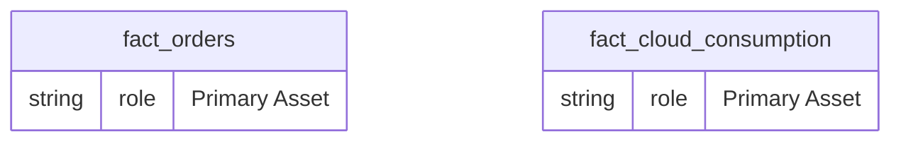
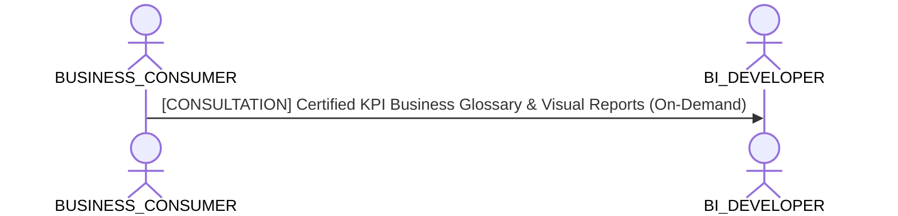

# Business Consumer & Self-Service Analytics Lens

**Persona Role**: `BUSINESS_CONSUMER` | **Technical Depth**: `EXECUTIVE`
**Generated At**: `2026-09-14T17:00:00Z`

## Executive Summary

> [!NOTE]
> Certified business terms, plain-language metric glossary, and intuitive report navigation for EnterpriseRetailPlatform.

### Focus Areas
- **Consumption Simplicity**
- **Business Value**

## Metrics & KPIs Portfolio

### Certified Metrics
| Metric Name | Status | Type |
| :--- | :--- | :--- |
| **Total Revenue** | Certified | KPI / Core Metric |
| **Order Count** | Certified | KPI / Core Metric |
| **Average Order Value** | Certified | KPI / Core Metric |
| **Total Compute Cost USD** | Certified | KPI / Core Metric |

## Entity Scope

- **Primary Entities (2)**: `fact_orders`, `fact_cloud_consumption`
- **Secondary Entities (3)**: `dim_customers`, `dim_products`, `dim_stores`
- **Active Relationships**: 3

### Entity Topology Diagram

## RACI Responsibility Matrix

| Task / Artifact | RACI Role | Description | Collaborators |
| :--- | :--- | :--- | :--- |
| Self-Service Business Exploration | **INFORMED** | Uses certified datasets and dashboards to drive data-informed operational decisions. | BI_DEVELOPER, DATA_PRODUCT_MANAGER |

## Cross-Functional Team Interactions

| Target Persona | Interaction Type | Frequency | Artifact / Interface | SLA / Expectation |
| :--- | :--- | :--- | :--- | :--- |
| **BI_DEVELOPER** | consultation | On-Demand | `Certified KPI Business Glossary & Visual Reports` | - |

### Interaction Flow

## Domain Maturity Assessment

**Overall Score**: `88.0/100.0` (Defined)

| Maturity Dimension | Score | Level | Findings |
| :--- | :--- | :--- | :--- |
| Business Taxonomy Clarity | 88.0% | Defined | 4 certified terms available |
| Self-Service Ease | 90.0% | Optimizing | Simplified executive-level view |

### Strengths
- Clean non-technical abstraction
- Direct KPI visibility

### Areas for Improvement
- Interactive natural language search over business definitions
