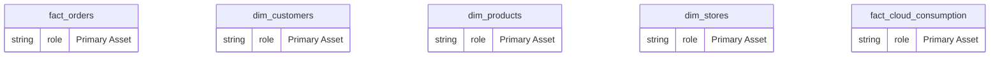
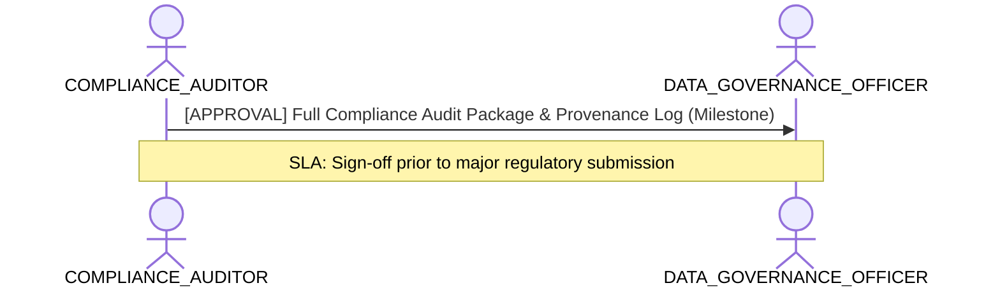

# Regulatory Compliance, Privacy & Audit Traceability Lens

**Persona Role**: `COMPLIANCE_AUDITOR` | **Technical Depth**: `EXHAUSTIVE`
**Generated At**: `2026-09-14T17:00:00Z`

## Executive Summary

> [!NOTE]
> Full regulatory audit trace, GDPR/SOX compliance verification, PII lineage, and access boundaries for EnterpriseRetailPlatform.

### Focus Areas
- **Audit Traceability**
- **Governance Compliance**

## Metrics & KPIs Portfolio

_No certified metrics assigned to this primary scope._

## Entity Scope

- **Primary Entities (5)**: `fact_orders`, `dim_customers`, `dim_products`, `dim_stores`, `fact_cloud_consumption`
- **Active Relationships**: 3

### Entity Topology Diagram

## RACI Responsibility Matrix

| Task / Artifact | RACI Role | Description | Collaborators |
| :--- | :--- | :--- | :--- |
| Regulatory Audit Trace & Provenance Verification | **CONSULTED** | Validates compliance with GDPR, SOX, CCPA, and verifies end-to-end data transformation provenance. | DATA_GOVERNANCE_OFFICER |

## Cross-Functional Team Interactions

| Target Persona | Interaction Type | Frequency | Artifact / Interface | SLA / Expectation |
| :--- | :--- | :--- | :--- | :--- |
| **DATA_GOVERNANCE_OFFICER** | approval | Milestone | `Full Compliance Audit Package & Provenance Log` | Sign-off prior to major regulatory submission |

### Interaction Flow

## Actionable Recommendations

| ID | Priority | Title | Impact | Effort | Suggested Action |
| :--- | :--- | :--- | :--- | :--- | :--- |
| `AUD-01` | **HIGH** | Conduct Quarterly SOX/GDPR Re-Certification | Required to maintain regulatory certifications | Medium | Export compliance verification bundle with golden file checksums. |

## Domain Maturity Assessment

**Overall Score**: `94.0/100.0` (Optimizing)

| Maturity Dimension | Score | Level | Findings |
| :--- | :--- | :--- | :--- |
| Regulatory Traceability | 96.0% | Optimizing | 4 compliance frameworks registered |
| Diagnostic Coverage | 92.0% | Optimizing | 1 diagnostic rules evaluated |

### Strengths
- Complete immutable provenance logs
- Exhaustive AST inspection

### Areas for Improvement
- Continuous automated regulatory change detection

## Diagnostics & Audit Traces

- `[INFO]` **SEM-GOV-001** (GOVERNANCE): PII attributes detected in dim_customers with appropriate restricted classification.
