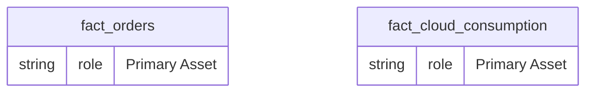
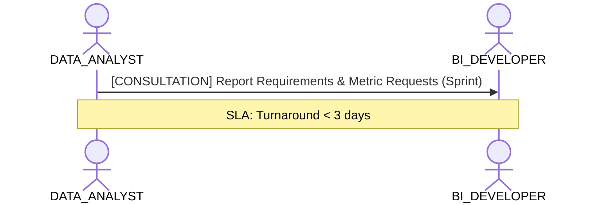

# Data Analyst & Self-Service Consumption Lens

**Persona Role**: `DATA_ANALYST` | **Technical Depth**: `SUMMARY`
**Generated At**: `2026-09-14T17:00:00Z`

## Executive Summary

> [!NOTE]
> Certified KPIs, domain dimensions, and self-service exploration catalog for EnterpriseRetailPlatform.

### Focus Areas
- **Consumption Simplicity**
- **Business Value**

## Metrics & KPIs Portfolio

### Certified Metrics
| Metric Name | Status | Type |
| :--- | :--- | :--- |
| **Total Revenue** | Certified | KPI / Core Metric |
| **Order Count** | Certified | KPI / Core Metric |
| **Average Order Value** | Certified | KPI / Core Metric |
| **Total Compute Cost USD** | Certified | KPI / Core Metric |

## Entity Scope

- **Primary Entities (2)**: `fact_orders`, `fact_cloud_consumption`
- **Secondary Entities (3)**: `dim_customers`, `dim_products`, `dim_stores`
- **Active Relationships**: 3

### Entity Topology Diagram

## RACI Responsibility Matrix

| Task / Artifact | RACI Role | Description | Collaborators |
| :--- | :--- | :--- | :--- |
| Self-Service KPI Consumption & Reporting | **RESPONSIBLE** | Consumes certified dimensions and KPIs to build operational reports. | BI_DEVELOPER, DOMAIN_OWNER |

## Cross-Functional Team Interactions

| Target Persona | Interaction Type | Frequency | Artifact / Interface | SLA / Expectation |
| :--- | :--- | :--- | :--- | :--- |
| **BI_DEVELOPER** | consultation | Sprint | `Report Requirements & Metric Requests` | Turnaround < 3 days |

### Interaction Flow

## Actionable Recommendations

| ID | Priority | Title | Impact | Effort | Suggested Action |
| :--- | :--- | :--- | :--- | :--- | :--- |
| `REC-DA-001` | **MEDIUM** | Review Business Descriptions for Self-Service Exploration | Ensures business consumers understand metric definitions. | Low | Verify all certified KPIs have business definitions. |

## Domain Maturity Assessment

**Overall Score**: `88.0/100.0` (Defined)

| Maturity Dimension | Score | Level | Findings |
| :--- | :--- | :--- | :--- |
| Consumption Simplicity | 88.0% | Defined | Certified metrics ready |

### Strengths
- Standardized metric definitions
- Clear dimension conformances

### Areas for Improvement
- Automated glossary integration
