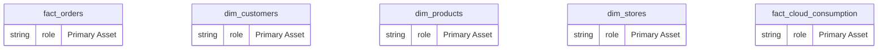
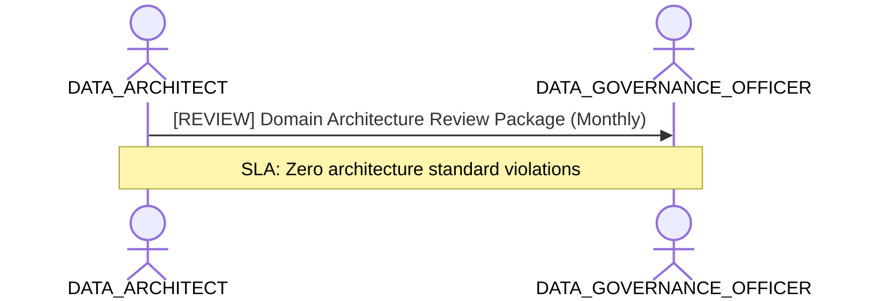

# Enterprise Data Architecture & Domain Modeling Lens

**Persona Role**: `DATA_ARCHITECT` | **Technical Depth**: `EXHAUSTIVE`
**Generated At**: `2026-09-14T17:00:00Z`

## Executive Summary

> [!NOTE]
> Relational graph topology, domain conformances, entity lifecycle, and architectural standards for EnterpriseRetailPlatform.

### Focus Areas
- **Data Modeling**
- **Modeling Quality**
- **Strategic Alignment**

## Metrics & KPIs Portfolio

### Certified Metrics
| Metric Name | Status | Type |
| :--- | :--- | :--- |
| **Total Revenue** | Certified | KPI / Core Metric |
| **Order Count** | Certified | KPI / Core Metric |
| **Average Order Value** | Certified | KPI / Core Metric |
| **Total Compute Cost USD** | Certified | KPI / Core Metric |

## Entity Scope

- **Primary Entities (5)**: `fact_orders`, `dim_customers`, `dim_products`, `dim_stores`, `fact_cloud_consumption`
- **Active Relationships**: 3

### Entity Topology Diagram

## RACI Responsibility Matrix

| Task / Artifact | RACI Role | Description | Collaborators |
| :--- | :--- | :--- | :--- |
| Enterprise Semantic Blueprint & Domain Conformity | **ACCOUNTABLE** | Governs semantic entities, relationships DAG, and cross-domain conformance. | ANALYTICS_ENGINEER, DATA_GOVERNANCE_OFFICER |

## Cross-Functional Team Interactions

| Target Persona | Interaction Type | Frequency | Artifact / Interface | SLA / Expectation |
| :--- | :--- | :--- | :--- | :--- |
| **DATA_GOVERNANCE_OFFICER** | review | Monthly | `Domain Architecture Review Package` | Zero architecture standard violations |

### Interaction Flow

## Actionable Recommendations

| ID | Priority | Title | Impact | Effort | Suggested Action |
| :--- | :--- | :--- | :--- | :--- | :--- |
| `REC-ARCH-001` | **HIGH** | Maintain Canonical Semantic Model Vendor Neutrality | Ensures semantic model remains portable across Power BI, Looker, and dbt. | Low | Verify no platform-specific DAX logic is embedded into canonical definitions. |

## Domain Maturity Assessment

**Overall Score**: `92.0/100.0` (Optimizing)

| Maturity Dimension | Score | Level | Findings |
| :--- | :--- | :--- | :--- |
| Architecture Coherence | 92.0% | Optimizing | Canonical model decoupled |

### Strengths
- Vendor-neutral AST representation
- Strict DAG relationship validation

### Areas for Improvement
- Cross-workspace semantic federation

## Diagnostics & Audit Traces

- `[INFO]` **SEM-GOV-001** (GOVERNANCE): PII attributes detected in dim_customers with appropriate restricted classification.
