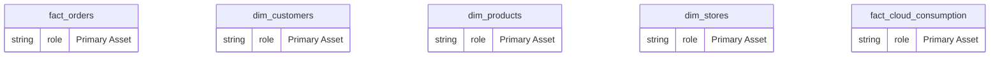
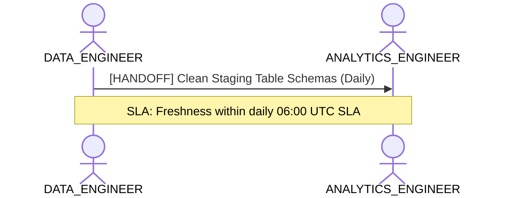

# Data Engineering, Ingestion & Pipeline Health Lens

**Persona Role**: `DATA_ENGINEER` | **Technical Depth**: `TECHNICAL`
**Generated At**: `2026-09-14T17:00:00Z`

## Executive Summary

> [!NOTE]
> Physical schema, partition grain, upstream sources, and pipeline integrity for EnterpriseRetailPlatform.

### Focus Areas
- **Pipeline Health**
- **Data Modeling**

## Metrics & KPIs Portfolio

_No certified metrics assigned to this primary scope._

## Entity Scope

- **Primary Entities (5)**: `fact_orders`, `dim_customers`, `dim_products`, `dim_stores`, `fact_cloud_consumption`
- **Active Relationships**: 3

### Entity Topology Diagram

## RACI Responsibility Matrix

| Task / Artifact | RACI Role | Description | Collaborators |
| :--- | :--- | :--- | :--- |
| Physical Ingestion & Pipeline SLAs | **RESPONSIBLE** | Manages raw data ingestion, table partitioning, change data capture (CDC), and source freshness. | ANALYTICS_ENGINEER |

## Cross-Functional Team Interactions

| Target Persona | Interaction Type | Frequency | Artifact / Interface | SLA / Expectation |
| :--- | :--- | :--- | :--- | :--- |
| **ANALYTICS_ENGINEER** | handoff | Daily | `Clean Staging Table Schemas` | Freshness within daily 06:00 UTC SLA |

### Interaction Flow

## Domain Maturity Assessment

**Overall Score**: `95.0/100.0` (Optimizing)

| Maturity Dimension | Score | Level | Findings |
| :--- | :--- | :--- | :--- |
| Grain Definition Completeness | 100.0% | Defined | 100% entities have explicit grain |
| Physical Type Rigor | 95.0% | Optimizing | Strongly-typed data attributes |

### Strengths
- Explicit data types on all attributes
- Structured entity definitions

### Areas for Improvement
- Verify surrogate key generation in staging layer

## Diagnostics & Audit Traces

- `[INFO]` **SEM-GOV-001** (GOVERNANCE): PII attributes detected in dim_customers with appropriate restricted classification.
