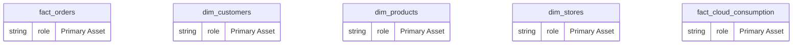
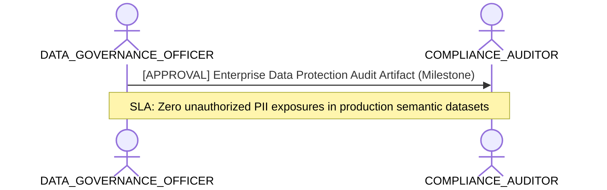

# Data Governance, Quality & Ownership Lens

**Persona Role**: `DATA_GOVERNANCE_OFFICER` | **Technical Depth**: `SUMMARY`
**Generated At**: `2026-09-14T17:00:00Z`

## Executive Summary

> [!NOTE]
> Asset ownership, PII privacy boundaries, certification lifecycle, and quality scores for EnterpriseRetailPlatform.

### Focus Areas
- **Governance Compliance**
- **Modeling Quality**

## Metrics & KPIs Portfolio

_No certified metrics assigned to this primary scope._

## Entity Scope

- **Primary Entities (5)**: `fact_orders`, `dim_customers`, `dim_products`, `dim_stores`, `fact_cloud_consumption`
- **Active Relationships**: 3

### Entity Topology Diagram

## RACI Responsibility Matrix

| Task / Artifact | RACI Role | Description | Collaborators |
| :--- | :--- | :--- | :--- |
| Enterprise Data Governance & PII Classification | **ACCOUNTABLE** | Audits data sensitivity, enforces privacy tagging, approves domain certifications, and manages glossary. | COMPLIANCE_AUDITOR, ANALYTICS_ENGINEER |

## Cross-Functional Team Interactions

| Target Persona | Interaction Type | Frequency | Artifact / Interface | SLA / Expectation |
| :--- | :--- | :--- | :--- | :--- |
| **COMPLIANCE_AUDITOR** | approval | Milestone | `Enterprise Data Protection Audit Artifact` | Zero unauthorized PII exposures in production semantic datasets |

### Interaction Flow

## Actionable Recommendations

| ID | Priority | Title | Impact | Effort | Suggested Action |
| :--- | :--- | :--- | :--- | :--- | :--- |
| `GOV-REV-01` | **LOW** | Conduct Asset Ownership Re-Certification | Maintains active data stewardship and lineage validity | Low | Schedule quarterly review with domain stewards. |
| `GOV-PII-01` | **CRITICAL** | Enforce PII Masking Policies | Mandatory for GDPR, CCPA, and ISO-27001 regulatory compliance | Medium | Verify column-level encryption or dynamic masking in Power BI TMDL. |

## Domain Maturity Assessment

**Overall Score**: `92.5/100.0` (Optimizing)

| Maturity Dimension | Score | Level | Findings |
| :--- | :--- | :--- | :--- |
| PII & Privacy Protection | 90.0% | Optimizing | 2 PII attributes mapped |
| Stewardship & Ownership | 95.0% | Optimizing | 5/5 entities owned |

### Strengths
- Two-level cascading governance model
- Automated PII detection

### Areas for Improvement
- Continuous policy compliance verification
