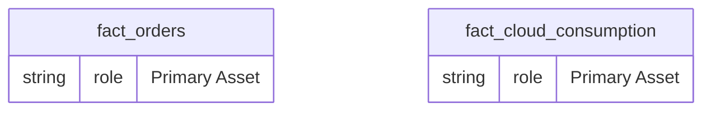
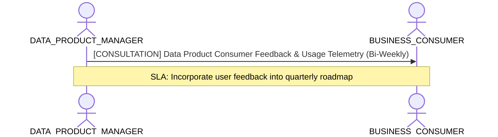

# Data Product Management, Lifecycle & Consumer Value Lens

**Persona Role**: `DATA_PRODUCT_MANAGER` | **Technical Depth**: `SUMMARY`
**Generated At**: `2026-09-14T17:00:00Z`

## Executive Summary

> [!NOTE]
> Data product SLA, consumer adoption contracts, release maturity, and product telemetry for EnterpriseRetailPlatform.

### Focus Areas
- **Product Lifecycle**
- **Product Metrics**
- **Business Value**

## Metrics & KPIs Portfolio

### Certified Metrics
| Metric Name | Status | Type |
| :--- | :--- | :--- |
| **Total Revenue** | Certified | KPI / Core Metric |
| **Order Count** | Certified | KPI / Core Metric |
| **Average Order Value** | Certified | KPI / Core Metric |
| **Total Compute Cost USD** | Certified | KPI / Core Metric |

## Entity Scope

- **Primary Entities (2)**: `fact_orders`, `fact_cloud_consumption`
- **Secondary Entities (3)**: `dim_customers`, `dim_products`, `dim_stores`
- **Active Relationships**: 3

### Entity Topology Diagram

## RACI Responsibility Matrix

| Task / Artifact | RACI Role | Description | Collaborators |
| :--- | :--- | :--- | :--- |
| Data Product Lifecycle & Consumer SLA | **ACCOUNTABLE** | Defines data product boundary, versioning cadence, consumer contracts, and feature enhancements. | ANALYTICS_LEADER, BUSINESS_CONSUMER |

## Cross-Functional Team Interactions

| Target Persona | Interaction Type | Frequency | Artifact / Interface | SLA / Expectation |
| :--- | :--- | :--- | :--- | :--- |
| **BUSINESS_CONSUMER** | consultation | Bi-Weekly | `Data Product Consumer Feedback & Usage Telemetry` | Incorporate user feedback into quarterly roadmap |

### Interaction Flow

## Actionable Recommendations

| ID | Priority | Title | Impact | Effort | Suggested Action |
| :--- | :--- | :--- | :--- | :--- | :--- |
| `DPM-01` | **MEDIUM** | Publish Consumer SLA Contract | Guarantees consumer trust and establishes operational SLOs | Low | Document query latency and freshness SLAs in project governance. |

## Domain Maturity Assessment

**Overall Score**: `95.0/100.0` (Optimizing)

| Maturity Dimension | Score | Level | Findings |
| :--- | :--- | :--- | :--- |
| Product Lifecycle Status | 95.0% | Defined | Status: Certified |
| SLA Commitment | 90.0% | Defined | SLA: 99.95% Daily Refresh by 06:00 UTC |

### Strengths
- Data product concept applied
- Explicit domain attribution

### Areas for Improvement
- Automated usage analytics integration
