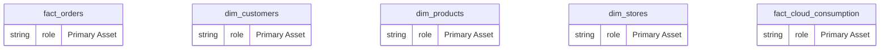
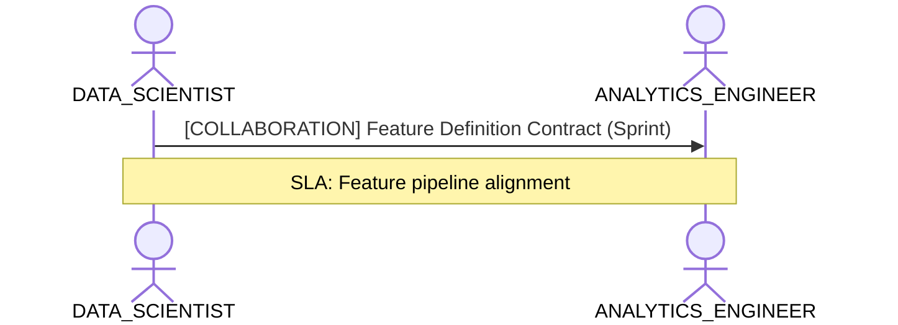

# Data Science, Feature Engineering & Statistical Lens

**Persona Role**: `DATA_SCIENTIST` | **Technical Depth**: `TECHNICAL`
**Generated At**: `2026-09-14T17:00:00Z`

## Executive Summary

> [!NOTE]
> Analytical features, continuous variables, entity grains, and training dimensions for EnterpriseRetailPlatform.

### Focus Areas
- **Ai Readiness**
- **Data Modeling**

## Metrics & KPIs Portfolio

### Certified Metrics
| Metric Name | Status | Type |
| :--- | :--- | :--- |
| **Total Revenue** | Certified | KPI / Core Metric |
| **Order Count** | Certified | KPI / Core Metric |
| **Average Order Value** | Certified | KPI / Core Metric |
| **Total Compute Cost USD** | Certified | KPI / Core Metric |

## Entity Scope

- **Primary Entities (5)**: `fact_orders`, `dim_customers`, `dim_products`, `dim_stores`, `fact_cloud_consumption`
- **Active Relationships**: 3

### Entity Topology Diagram

## RACI Responsibility Matrix

| Task / Artifact | RACI Role | Description | Collaborators |
| :--- | :--- | :--- | :--- |
| Predictive Feature Formulation & Statistical Verification | **RESPONSIBLE** | Formulates analytical features and evaluates statistical distributions from semantic entities. | ANALYTICS_ENGINEER, DATA_ENGINEER |

## Cross-Functional Team Interactions

| Target Persona | Interaction Type | Frequency | Artifact / Interface | SLA / Expectation |
| :--- | :--- | :--- | :--- | :--- |
| **ANALYTICS_ENGINEER** | collaboration | Sprint | `Feature Definition Contract` | Feature pipeline alignment |

### Interaction Flow

## Actionable Recommendations

| ID | Priority | Title | Impact | Effort | Suggested Action |
| :--- | :--- | :--- | :--- | :--- | :--- |
| `REC-DS-001` | **MEDIUM** | Verify Feature Cardinality and Numerical Grain | Improves convergence and feature consistency in ML training pipelines. | Medium | Ensure entity grain definitions match expected feature vector dimensions. |

## Domain Maturity Assessment

**Overall Score**: `85.0/100.0` (Defined)

| Maturity Dimension | Score | Level | Findings |
| :--- | :--- | :--- | :--- |
| Feature Engineering Readiness | 85.0% | Defined | Entities mapped |

### Strengths
- Consistent grain definitions
- Clean categorical dimensions

### Areas for Improvement
- Automated feature store synchronization

## Diagnostics & Audit Traces

- `[INFO]` **SEM-GOV-001** (GOVERNANCE): PII attributes detected in dim_customers with appropriate restricted classification.
