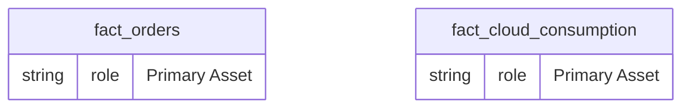
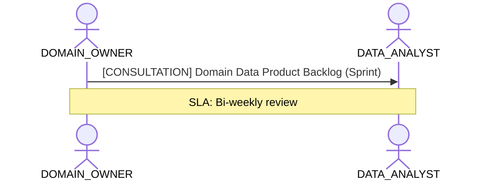

# Business Domain Ownership & Data Product Lifecycle Lens

**Persona Role**: `DOMAIN_OWNER` | **Technical Depth**: `SUMMARY`
**Generated At**: `2026-09-14T17:00:00Z`

## Executive Summary

> [!NOTE]
> Domain data products, certified KPIs, business ownership, and strategic alignment for EnterpriseRetailPlatform.

### Focus Areas
- **Business Value**
- **Product Lifecycle**

## Metrics & KPIs Portfolio

### Certified Metrics
| Metric Name | Status | Type |
| :--- | :--- | :--- |
| **Total Revenue** | Certified | KPI / Core Metric |
| **Order Count** | Certified | KPI / Core Metric |
| **Average Order Value** | Certified | KPI / Core Metric |
| **Total Compute Cost USD** | Certified | KPI / Core Metric |

## Entity Scope

- **Primary Entities (2)**: `fact_orders`, `fact_cloud_consumption`
- **Secondary Entities (3)**: `dim_customers`, `dim_products`, `dim_stores`
- **Active Relationships**: 3

### Entity Topology Diagram

## RACI Responsibility Matrix

| Task / Artifact | RACI Role | Description | Collaborators |
| :--- | :--- | :--- | :--- |
| Domain Data Product Accountability & Business Sign-Off | **ACCOUNTABLE** | Approves semantic data product definitions and certified business KPIs. | DATA_ANALYST, DATA_GOVERNANCE_OFFICER |

## Cross-Functional Team Interactions

| Target Persona | Interaction Type | Frequency | Artifact / Interface | SLA / Expectation |
| :--- | :--- | :--- | :--- | :--- |
| **DATA_ANALYST** | consultation | Sprint | `Domain Data Product Backlog` | Bi-weekly review |

### Interaction Flow

## Actionable Recommendations

| ID | Priority | Title | Impact | Effort | Suggested Action |
| :--- | :--- | :--- | :--- | :--- | :--- |
| `REC-DO-001` | **HIGH** | Promote Certified Domain Metrics to Production Status | Increases data product trust and executive adoption. | Low | Review domain KPIs with data governance officer for formal sign-off. |

## Domain Maturity Assessment

**Overall Score**: `89.0/100.0` (Defined)

| Maturity Dimension | Score | Level | Findings |
| :--- | :--- | :--- | :--- |
| Domain Ownership | 89.0% | Defined | Domain owner assigned |

### Strengths
- Clear business accountability
- Certified core KPIs

### Areas for Improvement
- Continuous consumer feedback telemetry
