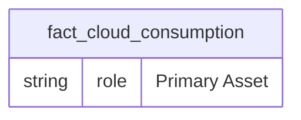
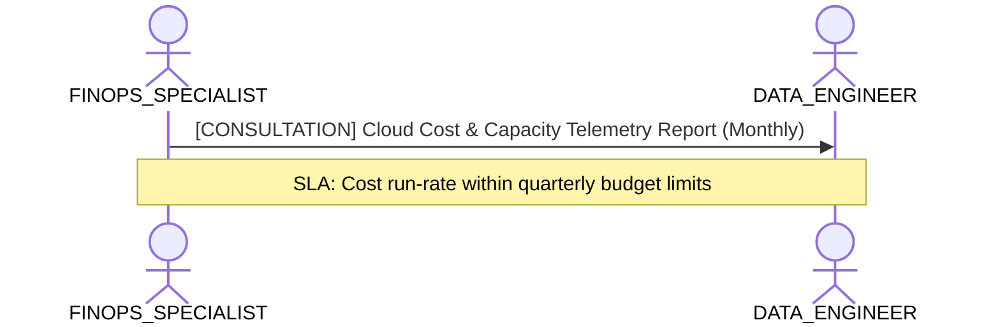

# FinOps, Cloud Cost & Capacity Optimization Lens

**Persona Role**: `FINOPS_SPECIALIST` | **Technical Depth**: `SUMMARY`
**Generated At**: `2026-09-14T17:00:00Z`

## Executive Summary

> [!NOTE]
> Analytical query efficiency, cloud resource consumption, and cost attribution for EnterpriseRetailPlatform.

### Focus Areas
- **Cost Capacity**
- **Business Value**

## Metrics & KPIs Portfolio

### Certified Metrics
| Metric Name | Status | Type |
| :--- | :--- | :--- |
| **Total Compute Cost USD** | Certified | KPI / Core Metric |

## Entity Scope

- **Primary Entities (1)**: `fact_cloud_consumption`
- **Active Relationships**: 3

### Entity Topology Diagram

## RACI Responsibility Matrix

| Task / Artifact | RACI Role | Description | Collaborators |
| :--- | :--- | :--- | :--- |
| Semantic Query Cost & Cloud Attribution | **RESPONSIBLE** | Tracks analytical query costs, identifies expensive Cartesian DAX/SQL queries, and allocates cloud capacity. | DATA_ENGINEER, ANALYTICS_LEADER |

## Cross-Functional Team Interactions

| Target Persona | Interaction Type | Frequency | Artifact / Interface | SLA / Expectation |
| :--- | :--- | :--- | :--- | :--- |
| **DATA_ENGINEER** | consultation | Monthly | `Cloud Cost & Capacity Telemetry Report` | Cost run-rate within quarterly budget limits |

### Interaction Flow

## Actionable Recommendations

| ID | Priority | Title | Impact | Effort | Suggested Action |
| :--- | :--- | :--- | :--- | :--- | :--- |
| `FIN-01` | **MEDIUM** | Establish Cost Attribution Tags | Enables showback/chargeback to consuming business departments | Low | Configure custom_properties with cost_center in project governance. |

## Domain Maturity Assessment

**Overall Score**: `88.0/100.0` (Defined)

| Maturity Dimension | Score | Level | Findings |
| :--- | :--- | :--- | :--- |
| Cost Transparency | 88.0% | Defined | 1 cost telemetry metrics |
| Capacity Governance | 85.0% | Defined | Resource limits established |

### Strengths
- Unit economics metrics present
- Cost center alignment

### Areas for Improvement
- Real-time query cost telemetry pipeline
