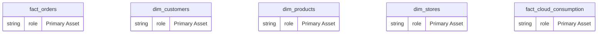
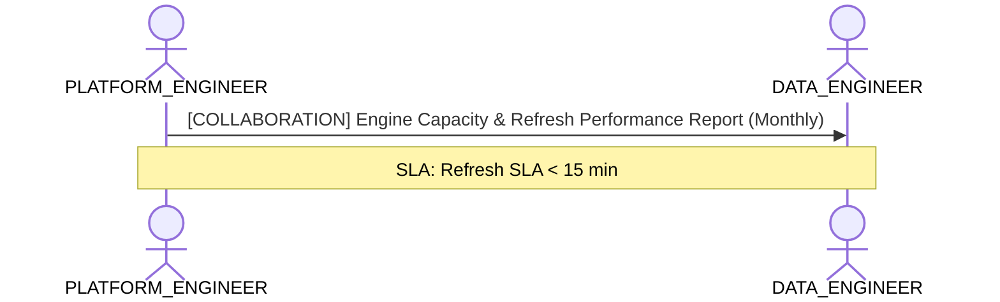

# Data Platform Infrastructure & Storage Capacity Lens

**Persona Role**: `PLATFORM_ENGINEER` | **Technical Depth**: `TECHNICAL`
**Generated At**: `2026-09-14T17:00:00Z`

## Executive Summary

> [!NOTE]
> Engine compute capacity, storage modes (Import/DirectLake), partitions, and refresh SLAs for EnterpriseRetailPlatform.

### Focus Areas
- **Cost Capacity**
- **Pipeline Health**

## Metrics & KPIs Portfolio

### Certified Metrics
| Metric Name | Status | Type |
| :--- | :--- | :--- |
| **Total Revenue** | Certified | KPI / Core Metric |
| **Order Count** | Certified | KPI / Core Metric |
| **Average Order Value** | Certified | KPI / Core Metric |
| **Total Compute Cost USD** | Certified | KPI / Core Metric |

## Entity Scope

- **Primary Entities (5)**: `fact_orders`, `dim_customers`, `dim_products`, `dim_stores`, `fact_cloud_consumption`
- **Active Relationships**: 3

### Entity Topology Diagram

## RACI Responsibility Matrix

| Task / Artifact | RACI Role | Description | Collaborators |
| :--- | :--- | :--- | :--- |
| Semantic Compute Engine Tuning & Storage Allocation | **RESPONSIBLE** | Manages semantic engine memory capacity, autoscaling limits, and storage modes. | DATA_ENGINEER, BI_DEVELOPER |

## Cross-Functional Team Interactions

| Target Persona | Interaction Type | Frequency | Artifact / Interface | SLA / Expectation |
| :--- | :--- | :--- | :--- | :--- |
| **DATA_ENGINEER** | collaboration | Monthly | `Engine Capacity & Refresh Performance Report` | Refresh SLA < 15 min |

### Interaction Flow

## Actionable Recommendations

| ID | Priority | Title | Impact | Effort | Suggested Action |
| :--- | :--- | :--- | :--- | :--- | :--- |
| `REC-PE-001` | **MEDIUM** | Evaluate VertiPaq / Direct Lake Storage Modes for High-Cardinality Entities | Maximizes memory compression and query performance SLAs in Fabric/Power BI. | Medium | Review column cardinalities to optimize VertiPaq memory footprint. |

## Domain Maturity Assessment

**Overall Score**: `87.0/100.0` (Defined)

| Maturity Dimension | Score | Level | Findings |
| :--- | :--- | :--- | :--- |
| Platform Scalability | 87.0% | Defined | Storage modes mapped |

### Strengths
- Predictable VertiPaq compression
- Stable relationship evaluation

### Areas for Improvement
- Automated partition optimization

## Diagnostics & Audit Traces

- `[INFO]` **SEM-GOV-001** (GOVERNANCE): PII attributes detected in dim_customers with appropriate restricted classification.
