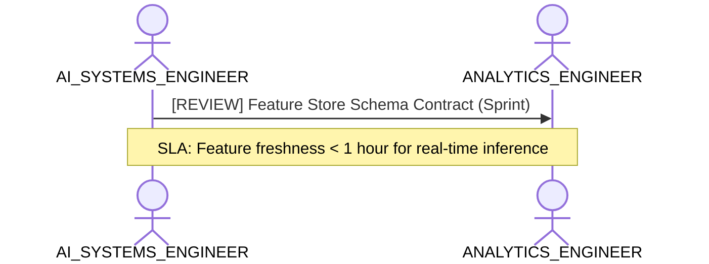

# AI Systems, Feature Engineering & ML Readiness Lens

**Persona Role**: `AI_SYSTEMS_ENGINEER` | **Technical Depth**: `TECHNICAL`
**Generated At**: `2026-09-14T17:00:00Z`

## Executive Summary

> [!NOTE]
> Feature readiness, embeddings/ML attributes, training data provenance, and AI inference latency for esquema_relacional.

### Focus Areas
- **Ai Readiness**
- **Data Modeling**

## Metrics & KPIs Portfolio

_No certified metrics assigned to this primary scope._

## Entity Scope

- **Primary Entities (20)**: `Dim_Linea`, `Dim_Estacion`, `Dim_Tren_Coche`, `Dim_Usuario_Bip`, `Dim_Equipamiento`, `Dim_Unidad_Negocio`, `Dim_Espacio_Comercial`, `Dim_Proyecto_Expansion`, `Dim_Organizacion_ESG`, `Dim_Tiempo`, `Fact_Validacion`, `Fact_Simulacion_Flujo`, `Fact_Venta_Carga`, `Fact_Telemetria_Tren`, `Fact_Sensoraje_Via`, `Fact_Estado_Resultado`, `Fact_Ingresos_NNT`, `Fact_Consumo_ESG`, `Fact_Cumplimiento_Oferta`, `Fact_Seguridad_NPS`
- **Active Relationships**: 24

### Entity Topology Diagram

```mermaid
erDiagram
    Dim_Linea {
        string role "Primary Asset"
    }
    Dim_Estacion {
        string role "Primary Asset"
    }
    Dim_Tren_Coche {
        string role "Primary Asset"
    }
    Dim_Usuario_Bip {
        string role "Primary Asset"
    }
    Dim_Equipamiento {
        string role "Primary Asset"
    }
    Dim_Unidad_Negocio {
        string role "Primary Asset"
    }
    Dim_Espacio_Comercial {
        string role "Primary Asset"
    }
    Dim_Proyecto_Expansion {
        string role "Primary Asset"
    }
    Dim_Organizacion_ESG {
        string role "Primary Asset"
    }
    Dim_Tiempo {
        string role "Primary Asset"
    }
```

## RACI Responsibility Matrix

| Task / Artifact | RACI Role | Description | Collaborators |
| :--- | :--- | :--- | :--- |
| ML Feature Store & Training Data Lineage | **RESPONSIBLE** | Standardizes offline/online feature stores, embedding representations, and AI inference data quality. | ANALYTICS_ENGINEER, DATA_ENGINEER |

## Cross-Functional Team Interactions

| Target Persona | Interaction Type | Frequency | Artifact / Interface | SLA / Expectation |
| :--- | :--- | :--- | :--- | :--- |
| **ANALYTICS_ENGINEER** | review | Sprint | `Feature Store Schema Contract` | Feature freshness < 1 hour for real-time inference |

### Interaction Flow

## Actionable Recommendations

| ID | Priority | Title | Impact | Effort | Suggested Action |
| :--- | :--- | :--- | :--- | :--- | :--- |
| `AI-01` | **MEDIUM** | Register Feature Store Lineage | Ensures reproducibility and compliance with EU AI Act Article 10 requirements | Low | Add provenance records with confidence and source tags to AI feature attributes. |

## Domain Maturity Assessment

**Overall Score**: `75.0/100.0` (Managed)

| Maturity Dimension | Score | Level | Findings |
| :--- | :--- | :--- | :--- |
| Feature Engineering Readiness | 75.0% | Defined | 0 AI/ML features mapped |
| Training Data Lineage | 85.0% | Defined | Provenance tracking available |

### Strengths
- Feature attributes identified in semantic catalog
- Model inference scores defined

### Areas for Improvement
- Real-time vector database / embedding integration
