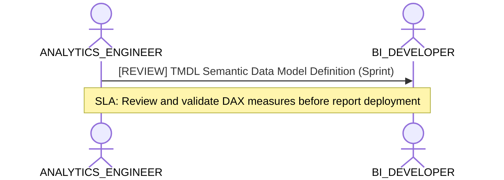

# Analytics Engineering, Dimensional Modeling & Transformation Lens

**Persona Role**: `ANALYTICS_ENGINEER` | **Technical Depth**: `TECHNICAL`
**Generated At**: `2026-09-14T17:00:00Z`

## Executive Summary

> [!NOTE]
> Star-schema topology, semantic metrics, SQL transformations, and grain definitions for esquema_relacional.

### Focus Areas
- **Data Modeling**
- **Modeling Quality**

## Metrics & KPIs Portfolio

_No certified metrics assigned to this primary scope._

## Entity Scope

- **Primary Entities (20)**: `Dim_Linea`, `Dim_Estacion`, `Dim_Tren_Coche`, `Dim_Usuario_Bip`, `Dim_Equipamiento`, `Dim_Unidad_Negocio`, `Dim_Espacio_Comercial`, `Dim_Proyecto_Expansion`, `Dim_Organizacion_ESG`, `Dim_Tiempo`, `Fact_Validacion`, `Fact_Simulacion_Flujo`, `Fact_Venta_Carga`, `Fact_Telemetria_Tren`, `Fact_Sensoraje_Via`, `Fact_Estado_Resultado`, `Fact_Ingresos_NNT`, `Fact_Consumo_ESG`, `Fact_Cumplimiento_Oferta`, `Fact_Seguridad_NPS`
- **Active Relationships**: 24

### Entity Topology Diagram

```mermaid
erDiagram
    Dim_Linea {
        string role "Primary Asset"
    }
    Dim_Estacion {
        string role "Primary Asset"
    }
    Dim_Tren_Coche {
        string role "Primary Asset"
    }
    Dim_Usuario_Bip {
        string role "Primary Asset"
    }
    Dim_Equipamiento {
        string role "Primary Asset"
    }
    Dim_Unidad_Negocio {
        string role "Primary Asset"
    }
    Dim_Espacio_Comercial {
        string role "Primary Asset"
    }
    Dim_Proyecto_Expansion {
        string role "Primary Asset"
    }
    Dim_Organizacion_ESG {
        string role "Primary Asset"
    }
    Dim_Tiempo {
        string role "Primary Asset"
    }
```

## RACI Responsibility Matrix

| Task / Artifact | RACI Role | Description | Collaborators |
| :--- | :--- | :--- | :--- |
| Dimensional Modeling & Semantic Metrics | **RESPONSIBLE** | Authors clean star schemas, conformed dimensions, metric formulas, and grain invariants. | DATA_ENGINEER, BI_DEVELOPER |

## Cross-Functional Team Interactions

| Target Persona | Interaction Type | Frequency | Artifact / Interface | SLA / Expectation |
| :--- | :--- | :--- | :--- | :--- |
| **BI_DEVELOPER** | review | Sprint | `TMDL Semantic Data Model Definition` | Review and validate DAX measures before report deployment |

### Interaction Flow

## Domain Maturity Assessment

**Overall Score**: `80.0/100.0` (Defined)

| Maturity Dimension | Score | Level | Findings |
| :--- | :--- | :--- | :--- |
| Star Schema Conformance | 90.0% | Defined | 24 active relationships |
| Metric Formalization | 70.0% | Optimizing | 0 metrics defined |

### Strengths
- Explicit relationships between fact and dimensions
- Multi-dialect metric support

### Areas for Improvement
- Document complex ratio metric calculations in markdown schema
