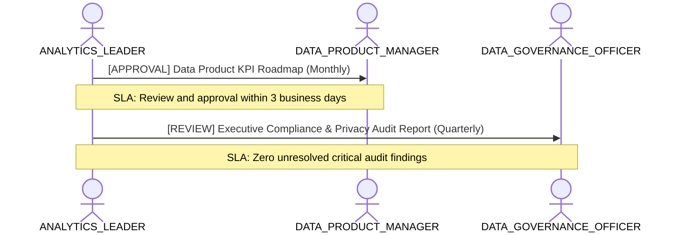

# Executive Strategic Analytics & Leadership Cockpit

**Persona Role**: `ANALYTICS_LEADER` | **Technical Depth**: `EXECUTIVE`
**Generated At**: `2026-09-14T17:00:00Z`

## Executive Summary

> [!NOTE]
> Executive portfolio perspective for esquema_relacional highlighting strategic KPIs and domain maturity.

### Focus Areas
- **Strategic Alignment**
- **Business Value**
- **Product Metrics**

## Metrics & KPIs Portfolio

_No certified metrics assigned to this primary scope._

## Entity Scope

- **Primary Entities (10)**: `Fact_Validacion`, `Fact_Simulacion_Flujo`, `Fact_Venta_Carga`, `Fact_Telemetria_Tren`, `Fact_Sensoraje_Via`, `Fact_Estado_Resultado`, `Fact_Ingresos_NNT`, `Fact_Consumo_ESG`, `Fact_Cumplimiento_Oferta`, `Fact_Seguridad_NPS`
- **Secondary Entities (10)**: `Dim_Linea`, `Dim_Estacion`, `Dim_Tren_Coche`, `Dim_Usuario_Bip`, `Dim_Equipamiento`, `Dim_Unidad_Negocio`, `Dim_Espacio_Comercial`, `Dim_Proyecto_Expansion`, `Dim_Organizacion_ESG`, `Dim_Tiempo`
- **Active Relationships**: 24

### Entity Topology Diagram

```mermaid
erDiagram
    Fact_Validacion {
        string role "Primary Asset"
    }
    Fact_Simulacion_Flujo {
        string role "Primary Asset"
    }
    Fact_Venta_Carga {
        string role "Primary Asset"
    }
    Fact_Telemetria_Tren {
        string role "Primary Asset"
    }
    Fact_Sensoraje_Via {
        string role "Primary Asset"
    }
    Fact_Estado_Resultado {
        string role "Primary Asset"
    }
    Fact_Ingresos_NNT {
        string role "Primary Asset"
    }
    Fact_Consumo_ESG {
        string role "Primary Asset"
    }
    Fact_Cumplimiento_Oferta {
        string role "Primary Asset"
    }
    Fact_Seguridad_NPS {
        string role "Primary Asset"
    }
```

## RACI Responsibility Matrix

| Task / Artifact | RACI Role | Description | Collaborators |
| :--- | :--- | :--- | :--- |
| Enterprise Data & AI Strategy | **ACCOUNTABLE** | Sets data monetization, governance principles, and enterprise KPI taxonomy. | DATA_PRODUCT_MANAGER, DATA_GOVERNANCE_OFFICER |

## Cross-Functional Team Interactions

| Target Persona | Interaction Type | Frequency | Artifact / Interface | SLA / Expectation |
| :--- | :--- | :--- | :--- | :--- |
| **DATA_PRODUCT_MANAGER** | approval | Monthly | `Data Product KPI Roadmap` | Review and approval within 3 business days |
| **DATA_GOVERNANCE_OFFICER** | review | Quarterly | `Executive Compliance & Privacy Audit Report` | Zero unresolved critical audit findings |

### Interaction Flow

## Actionable Recommendations

| ID | Priority | Title | Impact | Effort | Suggested Action |
| :--- | :--- | :--- | :--- | :--- | :--- |
| `EXEC-01` | **HIGH** | Expand Certified Metric Coverage | Ensures single source of truth for C-level dashboards | Low | Review and certify unverified metrics in domain entities. |

## Domain Maturity Assessment

**Overall Score**: `39.0/100.0` (Managed)

| Maturity Dimension | Score | Level | Findings |
| :--- | :--- | :--- | :--- |
| Strategic KPI Governance | 65.0% | Defined | 0 certified KPIs |
| Domain Ownership | 85.0% | Managed | Project-level governance active |

### Strengths
- Established strategic focus
- Clear executive ownership

### Areas for Improvement
- Continuous metric certification monitoring
