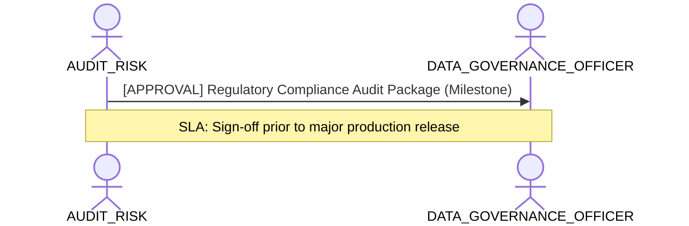

# Regulatory Compliance, Audit Provenance & Risk Lens

**Persona Role**: `AUDIT_RISK` | **Technical Depth**: `EXHAUSTIVE`
**Generated At**: `2026-09-14T17:00:00Z`

## Executive Summary

> [!NOTE]
> Regulatory compliance (GDPR/SOX), provenance audit trail, and risk exceptions for esquema_relacional.

### Focus Areas
- **Audit Traceability**
- **Governance Compliance**

## Metrics & KPIs Portfolio

_No certified metrics assigned to this primary scope._

## Entity Scope

- **Primary Entities (20)**: `Dim_Linea`, `Dim_Estacion`, `Dim_Tren_Coche`, `Dim_Usuario_Bip`, `Dim_Equipamiento`, `Dim_Unidad_Negocio`, `Dim_Espacio_Comercial`, `Dim_Proyecto_Expansion`, `Dim_Organizacion_ESG`, `Dim_Tiempo`, `Fact_Validacion`, `Fact_Simulacion_Flujo`, `Fact_Venta_Carga`, `Fact_Telemetria_Tren`, `Fact_Sensoraje_Via`, `Fact_Estado_Resultado`, `Fact_Ingresos_NNT`, `Fact_Consumo_ESG`, `Fact_Cumplimiento_Oferta`, `Fact_Seguridad_NPS`
- **Active Relationships**: 24

### Entity Topology Diagram

```mermaid
erDiagram
    Dim_Linea {
        string role "Primary Asset"
    }
    Dim_Estacion {
        string role "Primary Asset"
    }
    Dim_Tren_Coche {
        string role "Primary Asset"
    }
    Dim_Usuario_Bip {
        string role "Primary Asset"
    }
    Dim_Equipamiento {
        string role "Primary Asset"
    }
    Dim_Unidad_Negocio {
        string role "Primary Asset"
    }
    Dim_Espacio_Comercial {
        string role "Primary Asset"
    }
    Dim_Proyecto_Expansion {
        string role "Primary Asset"
    }
    Dim_Organizacion_ESG {
        string role "Primary Asset"
    }
    Dim_Tiempo {
        string role "Primary Asset"
    }
```

## RACI Responsibility Matrix

| Task / Artifact | RACI Role | Description | Collaborators |
| :--- | :--- | :--- | :--- |
| Regulatory Audit Traceability & Risk Exception Governance | **ACCOUNTABLE** | Governs regulatory compliance (GDPR, SOX), provenance logs, and risk exceptions. | DATA_GOVERNANCE_OFFICER, DATA_ARCHITECT |

## Cross-Functional Team Interactions

| Target Persona | Interaction Type | Frequency | Artifact / Interface | SLA / Expectation |
| :--- | :--- | :--- | :--- | :--- |
| **DATA_GOVERNANCE_OFFICER** | approval | Milestone | `Regulatory Compliance Audit Package` | Sign-off prior to major production release |

### Interaction Flow

## Actionable Recommendations

| ID | Priority | Title | Impact | Effort | Suggested Action |
| :--- | :--- | :--- | :--- | :--- | :--- |
| `REC-RISK-001` | **HIGH** | Verify Complete End-to-End Transformation Provenance | Guarantees full audit defense and regulatory compliance for financial metrics. | Medium | Ensure all calculated metrics retain provenance records to source columns. |

## Domain Maturity Assessment

**Overall Score**: `94.0/100.0` (Optimizing)

| Maturity Dimension | Score | Level | Findings |
| :--- | :--- | :--- | :--- |
| Audit Traceability | 94.0% | Optimizing | Full provenance log maintained |

### Strengths
- Complete rule provenance records
- Strict PII boundary enforcement

### Areas for Improvement
- Automated compliance change logging
