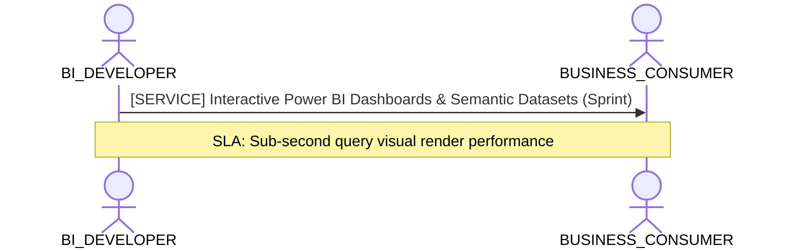

# BI Developer, TMDL & Semantic Model Consumption Lens

**Persona Role**: `BI_DEVELOPER` | **Technical Depth**: `TECHNICAL`
**Generated At**: `2026-09-14T17:00:00Z`

## Executive Summary

> [!NOTE]
> Power BI / TMDL semantic measures, relationships, DAX formulas, and display folders for esquema_relacional.

### Focus Areas
- **Visualization Efficiency**
- **Data Modeling**

## Metrics & KPIs Portfolio

_No certified metrics assigned to this primary scope._

## Entity Scope

- **Primary Entities (10)**: `Fact_Validacion`, `Fact_Simulacion_Flujo`, `Fact_Venta_Carga`, `Fact_Telemetria_Tren`, `Fact_Sensoraje_Via`, `Fact_Estado_Resultado`, `Fact_Ingresos_NNT`, `Fact_Consumo_ESG`, `Fact_Cumplimiento_Oferta`, `Fact_Seguridad_NPS`
- **Secondary Entities (10)**: `Dim_Linea`, `Dim_Estacion`, `Dim_Tren_Coche`, `Dim_Usuario_Bip`, `Dim_Equipamiento`, `Dim_Unidad_Negocio`, `Dim_Espacio_Comercial`, `Dim_Proyecto_Expansion`, `Dim_Organizacion_ESG`, `Dim_Tiempo`
- **Active Relationships**: 24

### Entity Topology Diagram

```mermaid
erDiagram
    Fact_Validacion {
        string role "Primary Asset"
    }
    Fact_Simulacion_Flujo {
        string role "Primary Asset"
    }
    Fact_Venta_Carga {
        string role "Primary Asset"
    }
    Fact_Telemetria_Tren {
        string role "Primary Asset"
    }
    Fact_Sensoraje_Via {
        string role "Primary Asset"
    }
    Fact_Estado_Resultado {
        string role "Primary Asset"
    }
    Fact_Ingresos_NNT {
        string role "Primary Asset"
    }
    Fact_Consumo_ESG {
        string role "Primary Asset"
    }
    Fact_Cumplimiento_Oferta {
        string role "Primary Asset"
    }
    Fact_Seguridad_NPS {
        string role "Primary Asset"
    }
```

## RACI Responsibility Matrix

| Task / Artifact | RACI Role | Description | Collaborators |
| :--- | :--- | :--- | :--- |
| TMDL Semantic Model & Report Canvases | **RESPONSIBLE** | Generates PBIP/TMDL models, optimizes DAX measures, formats numbers, and maintains visual dashboards. | ANALYTICS_ENGINEER, BUSINESS_CONSUMER |

## Cross-Functional Team Interactions

| Target Persona | Interaction Type | Frequency | Artifact / Interface | SLA / Expectation |
| :--- | :--- | :--- | :--- | :--- |
| **BUSINESS_CONSUMER** | service | Sprint | `Interactive Power BI Dashboards & Semantic Datasets` | Sub-second query visual render performance |

### Interaction Flow

## Domain Maturity Assessment

**Overall Score**: `90.0/100.0` (Optimizing)

| Maturity Dimension | Score | Level | Findings |
| :--- | :--- | :--- | :--- |
| TMDL/PowerBI Compatibility | 95.0% | Optimizing | Native PBIP target emitter supported |
| Measure Definition Quality | 85.0% | Defined | 0 measures in model |

### Strengths
- Clean separation of measures and dimensions
- Deterministic TMDL emission

### Areas for Improvement
- Add automated DAX query performance tests
