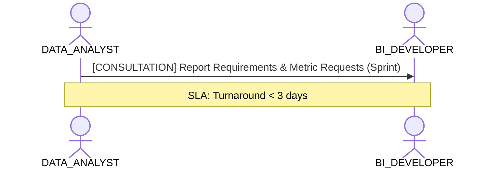

# Data Analyst & Self-Service Consumption Lens

**Persona Role**: `DATA_ANALYST` | **Technical Depth**: `SUMMARY`
**Generated At**: `2026-09-14T17:00:00Z`

## Executive Summary

> [!NOTE]
> Certified KPIs, domain dimensions, and self-service exploration catalog for esquema_relacional.

### Focus Areas
- **Consumption Simplicity**
- **Business Value**

## Metrics & KPIs Portfolio

_No certified metrics assigned to this primary scope._

## Entity Scope

- **Primary Entities (10)**: `Fact_Validacion`, `Fact_Simulacion_Flujo`, `Fact_Venta_Carga`, `Fact_Telemetria_Tren`, `Fact_Sensoraje_Via`, `Fact_Estado_Resultado`, `Fact_Ingresos_NNT`, `Fact_Consumo_ESG`, `Fact_Cumplimiento_Oferta`, `Fact_Seguridad_NPS`
- **Secondary Entities (10)**: `Dim_Linea`, `Dim_Estacion`, `Dim_Tren_Coche`, `Dim_Usuario_Bip`, `Dim_Equipamiento`, `Dim_Unidad_Negocio`, `Dim_Espacio_Comercial`, `Dim_Proyecto_Expansion`, `Dim_Organizacion_ESG`, `Dim_Tiempo`
- **Active Relationships**: 24

### Entity Topology Diagram

```mermaid
erDiagram
    Fact_Validacion {
        string role "Primary Asset"
    }
    Fact_Simulacion_Flujo {
        string role "Primary Asset"
    }
    Fact_Venta_Carga {
        string role "Primary Asset"
    }
    Fact_Telemetria_Tren {
        string role "Primary Asset"
    }
    Fact_Sensoraje_Via {
        string role "Primary Asset"
    }
    Fact_Estado_Resultado {
        string role "Primary Asset"
    }
    Fact_Ingresos_NNT {
        string role "Primary Asset"
    }
    Fact_Consumo_ESG {
        string role "Primary Asset"
    }
    Fact_Cumplimiento_Oferta {
        string role "Primary Asset"
    }
    Fact_Seguridad_NPS {
        string role "Primary Asset"
    }
```

## RACI Responsibility Matrix

| Task / Artifact | RACI Role | Description | Collaborators |
| :--- | :--- | :--- | :--- |
| Self-Service KPI Consumption & Reporting | **RESPONSIBLE** | Consumes certified dimensions and KPIs to build operational reports. | BI_DEVELOPER, DOMAIN_OWNER |

## Cross-Functional Team Interactions

| Target Persona | Interaction Type | Frequency | Artifact / Interface | SLA / Expectation |
| :--- | :--- | :--- | :--- | :--- |
| **BI_DEVELOPER** | consultation | Sprint | `Report Requirements & Metric Requests` | Turnaround < 3 days |

### Interaction Flow

## Actionable Recommendations

| ID | Priority | Title | Impact | Effort | Suggested Action |
| :--- | :--- | :--- | :--- | :--- | :--- |
| `REC-DA-001` | **MEDIUM** | Review Business Descriptions for Self-Service Exploration | Ensures business consumers understand metric definitions. | Low | Verify all certified KPIs have business definitions. |

## Domain Maturity Assessment

**Overall Score**: `88.0/100.0` (Defined)

| Maturity Dimension | Score | Level | Findings |
| :--- | :--- | :--- | :--- |
| Consumption Simplicity | 88.0% | Defined | Certified metrics ready |

### Strengths
- Standardized metric definitions
- Clear dimension conformances

### Areas for Improvement
- Automated glossary integration
