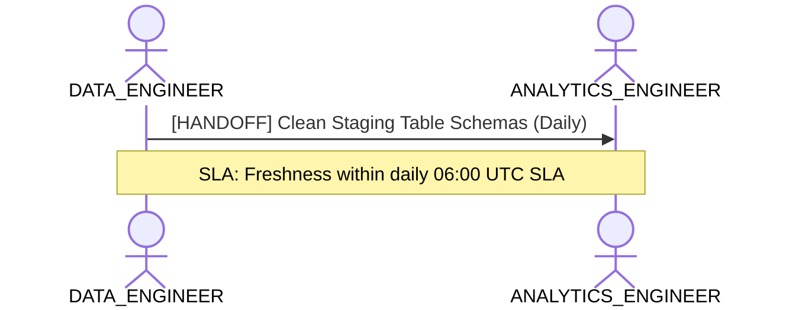

# Data Engineering, Ingestion & Pipeline Health Lens

**Persona Role**: `DATA_ENGINEER` | **Technical Depth**: `TECHNICAL`
**Generated At**: `2026-09-14T17:00:00Z`

## Executive Summary

> [!NOTE]
> Physical schema, partition grain, upstream sources, and pipeline integrity for esquema_relacional.

### Focus Areas
- **Pipeline Health**
- **Data Modeling**

## Metrics & KPIs Portfolio

_No certified metrics assigned to this primary scope._

## Entity Scope

- **Primary Entities (20)**: `Dim_Linea`, `Dim_Estacion`, `Dim_Tren_Coche`, `Dim_Usuario_Bip`, `Dim_Equipamiento`, `Dim_Unidad_Negocio`, `Dim_Espacio_Comercial`, `Dim_Proyecto_Expansion`, `Dim_Organizacion_ESG`, `Dim_Tiempo`, `Fact_Validacion`, `Fact_Simulacion_Flujo`, `Fact_Venta_Carga`, `Fact_Telemetria_Tren`, `Fact_Sensoraje_Via`, `Fact_Estado_Resultado`, `Fact_Ingresos_NNT`, `Fact_Consumo_ESG`, `Fact_Cumplimiento_Oferta`, `Fact_Seguridad_NPS`
- **Active Relationships**: 24

### Entity Topology Diagram

## RACI Responsibility Matrix

| Task / Artifact | RACI Role | Description | Collaborators |
| :--- | :--- | :--- | :--- |
| Physical Ingestion & Pipeline SLAs | **RESPONSIBLE** | Manages raw data ingestion, table partitioning, change data capture (CDC), and source freshness. | ANALYTICS_ENGINEER |

## Cross-Functional Team Interactions

| Target Persona | Interaction Type | Frequency | Artifact / Interface | SLA / Expectation |
| :--- | :--- | :--- | :--- | :--- |
| **ANALYTICS_ENGINEER** | handoff | Daily | `Clean Staging Table Schemas` | Freshness within daily 06:00 UTC SLA |

### Interaction Flow

## Actionable Recommendations

| ID | Priority | Title | Impact | Effort | Suggested Action |
| :--- | :--- | :--- | :--- | :--- | :--- |
| `DE-GRAIN-Dim_Linea` | **MEDIUM** | Define Explicit Grain for Dim_Linea | Prevents Cartesian product joins and pipeline duplication errors | Low | Declare grain columns in Dim_Linea schema definition. |
| `DE-GRAIN-Dim_Estacion` | **MEDIUM** | Define Explicit Grain for Dim_Estacion | Prevents Cartesian product joins and pipeline duplication errors | Low | Declare grain columns in Dim_Estacion schema definition. |
| `DE-GRAIN-Dim_Tren_Coche` | **MEDIUM** | Define Explicit Grain for Dim_Tren_Coche | Prevents Cartesian product joins and pipeline duplication errors | Low | Declare grain columns in Dim_Tren_Coche schema definition. |
| `DE-GRAIN-Dim_Usuario_Bip` | **MEDIUM** | Define Explicit Grain for Dim_Usuario_Bip | Prevents Cartesian product joins and pipeline duplication errors | Low | Declare grain columns in Dim_Usuario_Bip schema definition. |
| `DE-GRAIN-Dim_Equipamiento` | **MEDIUM** | Define Explicit Grain for Dim_Equipamiento | Prevents Cartesian product joins and pipeline duplication errors | Low | Declare grain columns in Dim_Equipamiento schema definition. |
| `DE-GRAIN-Dim_Unidad_Negocio` | **MEDIUM** | Define Explicit Grain for Dim_Unidad_Negocio | Prevents Cartesian product joins and pipeline duplication errors | Low | Declare grain columns in Dim_Unidad_Negocio schema definition. |
| `DE-GRAIN-Dim_Espacio_Comercial` | **MEDIUM** | Define Explicit Grain for Dim_Espacio_Comercial | Prevents Cartesian product joins and pipeline duplication errors | Low | Declare grain columns in Dim_Espacio_Comercial schema definition. |
| `DE-GRAIN-Dim_Proyecto_Expansion` | **MEDIUM** | Define Explicit Grain for Dim_Proyecto_Expansion | Prevents Cartesian product joins and pipeline duplication errors | Low | Declare grain columns in Dim_Proyecto_Expansion schema definition. |
| `DE-GRAIN-Dim_Organizacion_ESG` | **MEDIUM** | Define Explicit Grain for Dim_Organizacion_ESG | Prevents Cartesian product joins and pipeline duplication errors | Low | Declare grain columns in Dim_Organizacion_ESG schema definition. |
| `DE-GRAIN-Dim_Tiempo` | **MEDIUM** | Define Explicit Grain for Dim_Tiempo | Prevents Cartesian product joins and pipeline duplication errors | Low | Declare grain columns in Dim_Tiempo schema definition. |
| `DE-GRAIN-Fact_Validacion` | **MEDIUM** | Define Explicit Grain for Fact_Validacion | Prevents Cartesian product joins and pipeline duplication errors | Low | Declare grain columns in Fact_Validacion schema definition. |
| `DE-GRAIN-Fact_Simulacion_Flujo` | **MEDIUM** | Define Explicit Grain for Fact_Simulacion_Flujo | Prevents Cartesian product joins and pipeline duplication errors | Low | Declare grain columns in Fact_Simulacion_Flujo schema definition. |
| `DE-GRAIN-Fact_Venta_Carga` | **MEDIUM** | Define Explicit Grain for Fact_Venta_Carga | Prevents Cartesian product joins and pipeline duplication errors | Low | Declare grain columns in Fact_Venta_Carga schema definition. |
| `DE-GRAIN-Fact_Telemetria_Tren` | **MEDIUM** | Define Explicit Grain for Fact_Telemetria_Tren | Prevents Cartesian product joins and pipeline duplication errors | Low | Declare grain columns in Fact_Telemetria_Tren schema definition. |
| `DE-GRAIN-Fact_Sensoraje_Via` | **MEDIUM** | Define Explicit Grain for Fact_Sensoraje_Via | Prevents Cartesian product joins and pipeline duplication errors | Low | Declare grain columns in Fact_Sensoraje_Via schema definition. |
| `DE-GRAIN-Fact_Estado_Resultado` | **MEDIUM** | Define Explicit Grain for Fact_Estado_Resultado | Prevents Cartesian product joins and pipeline duplication errors | Low | Declare grain columns in Fact_Estado_Resultado schema definition. |
| `DE-GRAIN-Fact_Ingresos_NNT` | **MEDIUM** | Define Explicit Grain for Fact_Ingresos_NNT | Prevents Cartesian product joins and pipeline duplication errors | Low | Declare grain columns in Fact_Ingresos_NNT schema definition. |
| `DE-GRAIN-Fact_Consumo_ESG` | **MEDIUM** | Define Explicit Grain for Fact_Consumo_ESG | Prevents Cartesian product joins and pipeline duplication errors | Low | Declare grain columns in Fact_Consumo_ESG schema definition. |
| `DE-GRAIN-Fact_Cumplimiento_Oferta` | **MEDIUM** | Define Explicit Grain for Fact_Cumplimiento_Oferta | Prevents Cartesian product joins and pipeline duplication errors | Low | Declare grain columns in Fact_Cumplimiento_Oferta schema definition. |
| `DE-GRAIN-Fact_Seguridad_NPS` | **MEDIUM** | Define Explicit Grain for Fact_Seguridad_NPS | Prevents Cartesian product joins and pipeline duplication errors | Low | Declare grain columns in Fact_Seguridad_NPS schema definition. |

## Domain Maturity Assessment

**Overall Score**: `45.0/100.0` (Defined)

| Maturity Dimension | Score | Level | Findings |
| :--- | :--- | :--- | :--- |
| Grain Definition Completeness | 0.0% | Defined | 0% entities have explicit grain |
| Physical Type Rigor | 95.0% | Optimizing | Strongly-typed data attributes |

### Strengths
- Explicit data types on all attributes
- Structured entity definitions

### Areas for Improvement
- Verify surrogate key generation in staging layer
