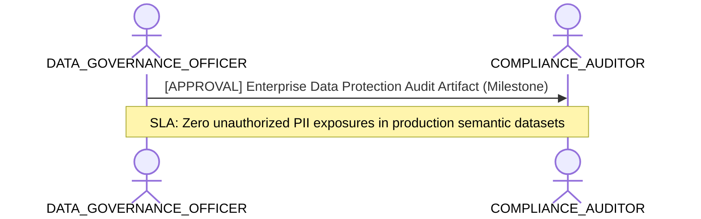

# Data Governance, Quality & Ownership Lens

**Persona Role**: `DATA_GOVERNANCE_OFFICER` | **Technical Depth**: `SUMMARY`
**Generated At**: `2026-09-14T17:00:00Z`

## Executive Summary

> [!NOTE]
> Asset ownership, PII privacy boundaries, certification lifecycle, and quality scores for esquema_relacional.

### Focus Areas
- **Governance Compliance**
- **Modeling Quality**

## Metrics & KPIs Portfolio

_No certified metrics assigned to this primary scope._

## Entity Scope

- **Primary Entities (20)**: `Dim_Linea`, `Dim_Estacion`, `Dim_Tren_Coche`, `Dim_Usuario_Bip`, `Dim_Equipamiento`, `Dim_Unidad_Negocio`, `Dim_Espacio_Comercial`, `Dim_Proyecto_Expansion`, `Dim_Organizacion_ESG`, `Dim_Tiempo`, `Fact_Validacion`, `Fact_Simulacion_Flujo`, `Fact_Venta_Carga`, `Fact_Telemetria_Tren`, `Fact_Sensoraje_Via`, `Fact_Estado_Resultado`, `Fact_Ingresos_NNT`, `Fact_Consumo_ESG`, `Fact_Cumplimiento_Oferta`, `Fact_Seguridad_NPS`
- **Active Relationships**: 24

### Entity Topology Diagram

```mermaid
erDiagram
    Dim_Linea {
        string role "Primary Asset"
    }
    Dim_Estacion {
        string role "Primary Asset"
    }
    Dim_Tren_Coche {
        string role "Primary Asset"
    }
    Dim_Usuario_Bip {
        string role "Primary Asset"
    }
    Dim_Equipamiento {
        string role "Primary Asset"
    }
    Dim_Unidad_Negocio {
        string role "Primary Asset"
    }
    Dim_Espacio_Comercial {
        string role "Primary Asset"
    }
    Dim_Proyecto_Expansion {
        string role "Primary Asset"
    }
    Dim_Organizacion_ESG {
        string role "Primary Asset"
    }
    Dim_Tiempo {
        string role "Primary Asset"
    }
```

## RACI Responsibility Matrix

| Task / Artifact | RACI Role | Description | Collaborators |
| :--- | :--- | :--- | :--- |
| Enterprise Data Governance & PII Classification | **ACCOUNTABLE** | Audits data sensitivity, enforces privacy tagging, approves domain certifications, and manages glossary. | COMPLIANCE_AUDITOR, ANALYTICS_ENGINEER |

## Cross-Functional Team Interactions

| Target Persona | Interaction Type | Frequency | Artifact / Interface | SLA / Expectation |
| :--- | :--- | :--- | :--- | :--- |
| **COMPLIANCE_AUDITOR** | approval | Milestone | `Enterprise Data Protection Audit Artifact` | Zero unauthorized PII exposures in production semantic datasets |

### Interaction Flow

## Actionable Recommendations

| ID | Priority | Title | Impact | Effort | Suggested Action |
| :--- | :--- | :--- | :--- | :--- | :--- |
| `GOV-OWNER-01` | **HIGH** | Assign Explicit Asset Owners | Enables data steward accountability and escalations | Low | Assign business owner email/name in project or entity governance metadata. |

## Domain Maturity Assessment

**Overall Score**: `80.0/100.0` (Defined)

| Maturity Dimension | Score | Level | Findings |
| :--- | :--- | :--- | :--- |
| PII & Privacy Protection | 90.0% | Optimizing | 0 PII attributes mapped |
| Stewardship & Ownership | 70.0% | Defined | 0/20 entities owned |

### Strengths
- Two-level cascading governance model
- Automated PII detection

### Areas for Improvement
- Continuous policy compliance verification
