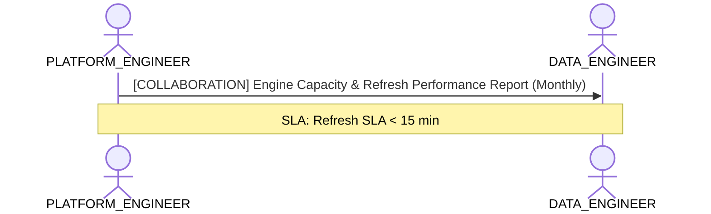

# Data Platform Infrastructure & Storage Capacity Lens

**Persona Role**: `PLATFORM_ENGINEER` | **Technical Depth**: `TECHNICAL`
**Generated At**: `2026-09-14T17:00:00Z`

## Executive Summary

> [!NOTE]
> Engine compute capacity, storage modes (Import/DirectLake), partitions, and refresh SLAs for esquema_relacional.

### Focus Areas
- **Cost Capacity**
- **Pipeline Health**

## Metrics & KPIs Portfolio

_No certified metrics assigned to this primary scope._

## Entity Scope

- **Primary Entities (20)**: `Dim_Linea`, `Dim_Estacion`, `Dim_Tren_Coche`, `Dim_Usuario_Bip`, `Dim_Equipamiento`, `Dim_Unidad_Negocio`, `Dim_Espacio_Comercial`, `Dim_Proyecto_Expansion`, `Dim_Organizacion_ESG`, `Dim_Tiempo`, `Fact_Validacion`, `Fact_Simulacion_Flujo`, `Fact_Venta_Carga`, `Fact_Telemetria_Tren`, `Fact_Sensoraje_Via`, `Fact_Estado_Resultado`, `Fact_Ingresos_NNT`, `Fact_Consumo_ESG`, `Fact_Cumplimiento_Oferta`, `Fact_Seguridad_NPS`
- **Active Relationships**: 24

### Entity Topology Diagram

```mermaid
erDiagram
    Dim_Linea {
        string role "Primary Asset"
    }
    Dim_Estacion {
        string role "Primary Asset"
    }
    Dim_Tren_Coche {
        string role "Primary Asset"
    }
    Dim_Usuario_Bip {
        string role "Primary Asset"
    }
    Dim_Equipamiento {
        string role "Primary Asset"
    }
    Dim_Unidad_Negocio {
        string role "Primary Asset"
    }
    Dim_Espacio_Comercial {
        string role "Primary Asset"
    }
    Dim_Proyecto_Expansion {
        string role "Primary Asset"
    }
    Dim_Organizacion_ESG {
        string role "Primary Asset"
    }
    Dim_Tiempo {
        string role "Primary Asset"
    }
```

## RACI Responsibility Matrix

| Task / Artifact | RACI Role | Description | Collaborators |
| :--- | :--- | :--- | :--- |
| Semantic Compute Engine Tuning & Storage Allocation | **RESPONSIBLE** | Manages semantic engine memory capacity, autoscaling limits, and storage modes. | DATA_ENGINEER, BI_DEVELOPER |

## Cross-Functional Team Interactions

| Target Persona | Interaction Type | Frequency | Artifact / Interface | SLA / Expectation |
| :--- | :--- | :--- | :--- | :--- |
| **DATA_ENGINEER** | collaboration | Monthly | `Engine Capacity & Refresh Performance Report` | Refresh SLA < 15 min |

### Interaction Flow

## Actionable Recommendations

| ID | Priority | Title | Impact | Effort | Suggested Action |
| :--- | :--- | :--- | :--- | :--- | :--- |
| `REC-PE-001` | **MEDIUM** | Evaluate VertiPaq / Direct Lake Storage Modes for High-Cardinality Entities | Maximizes memory compression and query performance SLAs in Fabric/Power BI. | Medium | Review column cardinalities to optimize VertiPaq memory footprint. |

## Domain Maturity Assessment

**Overall Score**: `87.0/100.0` (Defined)

| Maturity Dimension | Score | Level | Findings |
| :--- | :--- | :--- | :--- |
| Platform Scalability | 87.0% | Defined | Storage modes mapped |

### Strengths
- Predictable VertiPaq compression
- Stable relationship evaluation

### Areas for Improvement
- Automated partition optimization
